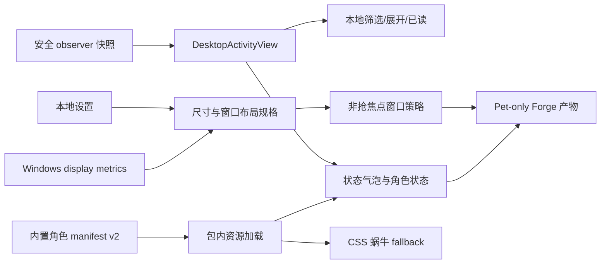
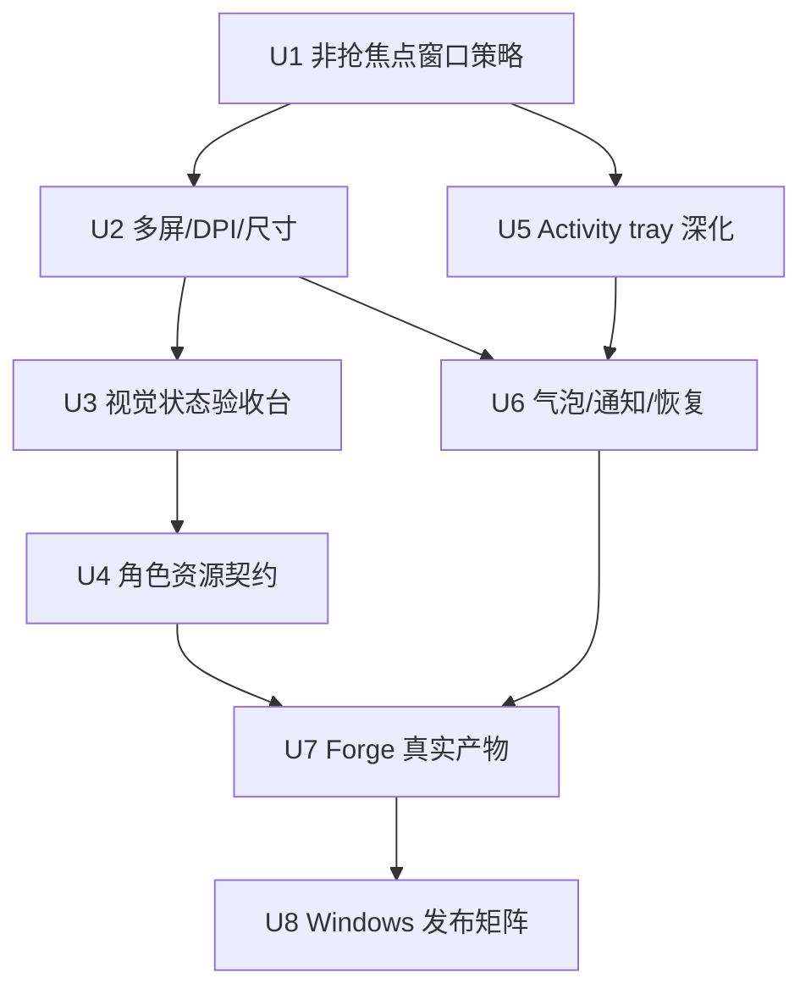

# feat: 桌宠下一阶段稳定性与体验深化实施计划

## Overview

本计划承接提交 `99af428 feat(desktop-pet): refresh companion experience`，按以下顺序推进：

1. **P0 Windows 常驻体验收口**：多屏、DPI、屏幕边缘、恢复、非抢焦点、尺寸与位置恢复。
2. **P1 角色资源契约**：在保留当前 CSS/矢量 fallback 的前提下，建立可验证、可打包的版本化内置角色资源契约。
3. **P2 Activity tray 深化**：筛选、Subagent 展开、明确已读动作、状态气泡生命周期和恢复设置。
4. **P3 发布闭环**：真实 Forge 产物、通知点击、安装/升级/卸载、签名与 Windows 10/11 人工矩阵。

核心策略是先解决“常驻应用不能打扰和丢失”的问题，再增加表现力。任何阶段都不得突破 attach-only、只读观察、隐私有界、loopback-only 和桌宠/`spi` 独立生命周期边界。

---

## Problem Frame

体验重塑已经让桌宠从深色原型卡片升级为透明蜗牛、可信任务摘要和可见设置面板，但目前仍缺少真实 Windows 环境下的可靠性闭环：

- 窗口几何仍以固定像素常量为主，尚未正式覆盖 100%–200% DPI 和显示器拓扑变化。
- `show()` / `focus()` 的用户触发与被动状态更新边界没有形成可测试的激活策略。
- 角色 manifest 目前主要描述状态名称，尚未形成真正可加载、可验证、可演进的动画资源契约。
- Activity tray 已显示阶段、真实计数和 Subagent 摘要，但缺少多任务筛选、展开细节和明确的已读控制。
- 自动化 contract smoke 已完成，但真实 Windows 安装包、系统通知、升级与签名矩阵仍未执行。

计划以 `docs/brainstorms/2026-08-13-desktop-pet-experience-refresh-requirements.md` 为产品来源，并继续遵守 `docs/architecture/decisions/desktop-pet-task-observer.md`。

---

## Requirements Trace

- R1–R4：透明角色、状态差异、安全状态提示、reduced-motion 和低打扰动画。
- R5–R7：Activity tray 信息层级、真实进度/Subagent 和收起语义。
- R8–R9：可发现的本地设置、角色差异与偏好持久化。
- R10：Windows 多屏、DPI、边缘裁切和不抢焦点。
- R11：只读、loopback、deep-link allowlist、renderer 隔离和退出不影响任务。

**Origin actors:** A1 多项目任务用户；A2 桌宠客户端；A3 蜗牛派服务。  
**Origin flows:** F1 环境感知；F2 快速定位任务；F3 个性化与恢复。  
**Origin acceptance examples:** AE1–AE7，重点新增执行覆盖为 AE6（多屏/DPI/不抢焦点）和 AE7（安全边界回归）。

### 本计划新增验收目标

- NAE1. 被动任务状态、SSE 重连和系统通知不得切换虚拟桌面、抢占当前应用焦点或主动显示已隐藏桌宠。
- NAE2. 保存的位置位于已移除显示器或缩放变化后，桌宠下次显示必须落回最近显示器的可见工作区。
- NAE3. 小/中/大尺寸切换时，角色、点击区、徽标、气泡和 Activity tray 锚点一致缩放，不产生裁切。
- NAE4. 内置资源缺失、manifest 非法或图片加载失败时，回退到安全 CSS 蜗牛，不出现空白窗口或任意文件读取。
- NAE5. 多任务同时存在时，用户可筛选“需关注/运行中/已完成”，展开 Subagent 摘要，并单独标记终态为已读。
- NAE6. Forge 产物不包含 Next、pi SDK、node-pty、服务端运行器或 `spi`；安装/退出/卸载桌宠不影响 `~/.pi/agent` 和运行任务。

---

## Scope Boundaries

- 不在桌宠内发送 Prompt、审批、停止/重试任务或执行 Quick Command。
- 不自动启动、停止、重启、监管或保存 `spi` PID。
- 不接入远程实例、多实例聚合或任意 URL/命令扩展。
- 不内嵌完整 WebUI、终端、编辑器、diff 或任务日志。
- 不建设养成、商店、云同步、在线脚本或第三方角色市场。
- 本计划只建立**内置资源契约**；任意本地 ZIP/文件导入和 AI 生成宠物另立需求。
- 不以动画或 UI 猜测普通 LLM 任务完成百分比。
- 不重构现有 observer 协议，除非实现发现无法满足既有安全投影；任何协议扩展必须先更新需求/ADR。

---

## Context & Research

### Relevant Code and Patterns

- `desktop/main/window-manager.ts`：窗口边界、Activity tray 锚点、拖动和安全 `webPreferences`。
- `desktop/main/main.ts`：BrowserWindow、screen、托盘、通知、IPC 和 observer 接线；当前显式用户动作会调用 `focus()`。
- `desktop/main/settings-store.ts`：版本化本地偏好和敏感字段禁止列表。
- `desktop/main/activity-store.ts`：renderer 安全视图、项目/任务优先级和本地已读。
- `desktop/renderer/pet-state.ts`：状态、角色 manifest、真实进度和键盘选择纯函数。
- `desktop/renderer/pet-app.tsx`：透明角色、Activity tray、设置面板和窄 preload bridge。
- `scripts/build-desktop-pet.mjs`：main/preload/renderer 的可重复 esbuild 输出。
- `scripts/smoke-desktop-contract.ts`：窗口、通知、设置、renderer、资源和安全 contract。
- `scripts/smoke-desktop-package.mjs`：pet-only/npm 分离和可选产物扫描。
- `docs/operations/desktop-pet-validation.md`：Windows 人工发布矩阵与未执行项。

### External Product Findings

- Codex 官方桌宠同样使用 Running、Needs input、Ready、Blocked 和多任务优先级；支持 reduced-motion、位置持久化和 Activity tray。
- Codex 社区反馈显示固定尺寸、屏幕边缘裁切和虚拟桌面抢焦点会直接破坏常驻体验，因此本计划将这些问题置于角色生态之前。
- Codex 的 9 状态 spritesheet 对角色表现力有参考价值，但其硬编码动画和自定义交互 API 也存在扩展诉求；蜗牛派只借鉴资源契约，不照搬开放执行能力。

---

## Key Technical Decisions

- **激活意图显式化**：窗口“显示但不激活”和“用户请求显示并聚焦”必须走不同路径；被动状态更新只推送 renderer 状态或系统通知。
- **几何由规格函数生成**：窗口、角色栈、锚点和点击区不再依赖散落常量；尺寸档位和 DPI 变化由同一组布局规格计算。
- **先 CSS fallback，后资源增强**：任何 spritesheet/图片资源都必须可选、可验证、失败可回退，避免美术资源使桌宠不可用。
- **资源路径不可由 renderer 任意拼接**：manifest 只允许已知内置 pet id 和包内相对资源；主进程/构建期负责验证，不开放任意文件 URL。
- **筛选属于 renderer 本地视图**：不改变 observer 快照和服务端任务状态；已读仍只记录 transition id。
- **真实安装产物是发布门禁**：contract smoke 通过不等于发布完成；Windows clean-profile matrix 必须保留明确结果和证据。

---

## High-Level Technical Design

> 此图用于说明预期结构，是评审方向，不是要求逐字实现的代码规范。



---

## Implementation Units

- [x] U1. **建立窗口激活意图与回归契约**

**Completed:** 2026-08-13 — 被动 snapshot/reconnect/通知只推状态；隐藏窗口保持隐藏；托盘/second-instance 才 `show+focus`；启动用 `showInactive`。Windows 虚拟桌面/焦点实机仍未执行。

**Goal:** 区分被动状态更新、非激活显示和用户显式聚焦，消除状态更新/重连导致抢焦点或切换虚拟桌面的风险。

**Requirements:** R4, R10, R11；NAE1。

**Dependencies:** 无；从 `99af428` 后的当前实现开始。

**Files:**
- Modify: `desktop/main/window-manager.ts`
- Modify: `desktop/main/main.ts`
- Modify: `scripts/smoke-desktop-contract.ts`
- Modify: `docs/operations/desktop-pet-validation.md`

**Approach:**
- 为 `PetWindowHandle` 建立显式的 non-activating show 能力和用户激活路径。
- 快照、SSE 重连、通知、设置持久化和被动连接诊断不得调用 `focus()`，也不得把已隐藏窗口自动显示出来。
- 托盘点击、second-instance 和用户点击“显示桌宠”可以显式显示并聚焦。
- 保持通知点击只打开 allowlisted WebUI deep link，不隐式激活桌宠窗口。

**Execution note:** 先扩展纯窗口 host smoke，证明被动路径没有 focus/show，再修改 Electron 接线。

**Patterns to follow:**
- `desktop/main/window-manager.ts` 中现有纯状态 reducer 与 injectable handle。
- `scripts/smoke-desktop-contract.ts` 的 close-to-tray/click-through 回归。

**Test scenarios:**
- Happy path：托盘“显示桌宠”使隐藏窗口可见、取消穿透并聚焦。
- Integration：快照 Running → Ready 只发送 stateChanged/通知，不调用 window focus/show。
- Edge case：服务从 connected → reconnecting → connected 时，隐藏窗口保持隐藏。
- Error path：renderer 崩溃/窗口已销毁时，被动状态推送不抛出并不影响 observer。

**Verification:**
- 纯 smoke 能区分 passive show、user activation 和 hidden retention。
- Windows 人工矩阵记录“当前应用/虚拟桌面未被切换”。

---

- [x] U2. **收口多屏、DPI、尺寸与位置恢复**

**Completed:** 2026-08-13 — `petScale` 小/中/大兼容迁移，统一布局规格驱动 collapsed/tray/pet stack/click/anchor；恢复默认位置；display added/removed/metrics changed 将离屏窗口拉回最近 workArea。Windows 100/150/200% 与主副屏实机仍未执行。

**Goal:** 让桌宠在显示器增加/移除、缩放变化、任务栏工作区变化和尺寸切换后始终可恢复、不卡出屏幕。

**Requirements:** R8–R10；AE5、AE6；NAE2、NAE3。

**Dependencies:** U1。

**Files:**
- Modify: `desktop/main/settings-store.ts`
- Modify: `desktop/main/window-manager.ts`
- Modify: `desktop/main/main.ts`
- Modify: `desktop/main/ipc-contract.ts`
- Modify: `desktop/preload/pet-preload.ts`
- Modify: `desktop/main/activity-store.ts`
- Modify: `desktop/renderer/index.html`
- Modify: `desktop/renderer/pet-app.tsx`
- Modify: `desktop/renderer/pet.css`
- Test: `scripts/smoke-desktop-contract.ts`

**Approach:**
- 增加小/中/大三档 `petScale`（建议 0.85/1/1.2）和“恢复默认位置”；设置升级必须兼容 v1 文件。
- 由布局规格函数统一计算 collapsed/tray 窗口、pet stack、点击区和 anchor，不在 renderer/main 各自维护独立魔数。
- 监听 display added/removed/metrics changed；使用最近显示器 workArea 重算并 clamp。
- 保存逻辑只持久化规范化尺寸和可恢复位置，不保存 device-specific token/路径。

**Execution note:** 设置迁移和几何纯函数 test-first；完成后再接 Electron display 事件。

**Test scenarios:**
- Happy path：小/中/大切换后角色、点击区、徽标和 tray 锚点同比缩放。
- Edge case：保存位置位于已移除副屏，启动后落回主屏可见区域。
- Edge case：150%/200% DPI 或任务栏工作区变化后，展开和收起均不裁切。
- Error path：旧 settings 缺少 `petScale`、值非法或坐标非有限数时回退默认值。
- Integration：设置面板修改尺寸后 main 调整 BrowserWindow，renderer 同步 CSS scale，重启后保持。

**Verification:**
- `scripts/smoke-desktop-contract.ts` 覆盖几何、迁移和 IPC allowlist。
- `docs/operations/desktop-pet-validation.md` 的 DPI/多屏项有实机结果。

---

- [x] U3. **建立桌宠视觉状态验收台与可访问性回归**

**Completed:** 2026-08-13 — 开发态 `desktop:preview` 生成静态状态矩阵；preview 只接受清洗后的 view fixture，不进生产 preload/IPC/package。人工八状态/两角色/三尺寸/tray/settings/reduced-motion 视觉矩阵仍未执行。

**Goal:** 用可重复方式检查八种状态、两种角色、三种尺寸、tray/设置和 reduced-motion，避免依靠单一 idle 截图判断质量。

**Requirements:** R1–R4, R7–R10；AE1、AE2、AE4、AE5。

**Dependencies:** U1、U2。

**Files:**
- Create: `scripts/preview-desktop-pet-states.mjs`
- Create: `docs/operations/desktop-pet-visual-review.md`
- Modify: `scripts/build-desktop-pet.mjs`
- Modify: `package.json`
- Modify: `desktop/renderer/pet-app.tsx`
- Test: `scripts/smoke-desktop-contract.ts`

**Approach:**
- 提供开发态 fixture/preview 注入，仅加载已清洗的静态 view，不连服务、不进入生产包控制面。
- 一次生成或展示状态矩阵：idle/running/retrying/needs-input/ready/blocked/disconnected/service-not-running，以及 tray/settings。
- 明确键盘焦点、非颜色状态提示、reduced-motion、中文文本截断和 100%–200% 视觉检查清单。
- preview 工具不得持有 observer token、读取真实 session/cwd 或开放 renderer 任意数据注入。

**Test scenarios:**
- Happy path：preview 能渲染每个状态和尺寸，并生成明确的截图/人工检查目录。
- Edge case：超长安全标题被截断，不撑破 140px 折叠窗口和 Activity tray。
- Accessibility：reduced-motion 下无循环动作；键盘可打开/收起 tray、进入设置、返回任务列表。
- Security：production build 和 package contract 不包含调试数据、token 或任意脚本入口。

**Verification:**
- 视觉审查文档包含每个组合的通过/失败记录格式。
- contract smoke 保证 preview 不进入生产 preload IPC allowlist。

---

- [x] U4. **建立版本化内置角色资源契约**

**Completed:** 2026-08-13 — 资源契约完成：manifest v2 + allowlist/path/size/state validator，失败回退 CSS 蜗牛。补审已确认内置文档实际进入 renderer bundle，并补齐 spritesheet 起始帧/帧数/时序/静态帧/容量约束、共享构建校验和展开产物资源检查。正式 spritesheet 待美术，当前两只内置角色保持 `renderMode: css`。

**Goal:** 让内置角色可从安全、版本化的包内资源描述动画，同时在资源失败时可靠回退当前 CSS 蜗牛。

**Requirements:** R1–R4, R9, R11；NAE4。

**Dependencies:** U3；正式美术不是 contract 落地的硬依赖。

**Files:**
- Modify: `desktop/assets/pets/snail-default/manifest.json`
- Modify: `desktop/assets/pets/snail-classic/manifest.json`
- Create: `desktop/renderer/pet-assets.ts`
- Modify: `desktop/renderer/pet-state.ts`
- Modify: `desktop/renderer/pet-app.tsx`
- Modify: `desktop/renderer/pet.css`
- Modify: `scripts/build-desktop-pet.mjs`
- Modify: `scripts/smoke-desktop-package.mjs`
- Test: `scripts/smoke-desktop-contract.ts`

**Approach:**
- manifest v2 只允许内置 id、版本、渲染模式、固定状态映射、帧数/时序和包内相对资源。
- 对行列、尺寸、文件大小、状态完整性、帧时序和路径穿越进行构建期/运行期验证。
- 初期可以继续 `renderer: css`；有批准资源时再启用 spritesheet，不让美术阻塞稳定性工作。
- 角色选择仅改变外观和动画，不改变任务状态、通知或执行能力。

**Test scenarios:**
- Happy path：两个合法内置 manifest 能解析全部状态并产生可感知差异。
- Error path：缺文件、非法版本、超长路径、`../`、未知状态、过大帧数均拒绝并回退 CSS。
- Accessibility：reduced-motion 为每个动画状态选择静态帧。
- Packaging：Forge 产物含需要的内置资源，但不包含原始生成流水线、提示词或服务代码。

**Verification:**
- NAE4 全部通过；资源损坏不会产生空白窗口。
- `npm run test:desktop-package` 覆盖资源路径和包体 contract。

---

- [x] U5. **深化 Activity tray 多任务定位与已读交互**

**Completed:** 2026-08-13 — 增加 renderer 本地全部/需关注/运行中/已完成筛选与计数、筛选后安全选择重置、可展开的 Subagent 安全摘要，以及分离的“打开任务”/“标记已读”动作；保留方向键、Enter、Escape、M 和空结果语义。observer 协议与服务端任务状态未修改；真实 Electron 键盘/视觉人工检查未执行。

**Goal:** 在不扩展 observer 协议的情况下，让多项目用户更快定位需关注、运行中和已完成任务。

**Requirements:** R5–R8, R11；AE3、AE4；NAE5。

**Dependencies:** U1；可与 U4 独立实施。

**Files:**
- Modify: `desktop/main/activity-store.ts`
- Modify: `desktop/renderer/pet-state.ts`
- Modify: `desktop/renderer/pet-app.tsx`
- Modify: `desktop/renderer/index.html`
- Modify: `desktop/renderer/pet.css`
- Test: `scripts/smoke-desktop-contract.ts`

**Approach:**
- 增加 renderer 本地筛选：全部、需关注、运行中、已完成；不写回服务端。
- Subagent 摘要可展开，仍只展示 child 安全字段，不请求 transcript/output。
- 将“打开任务”和“标记已读”拆为可发现动作；保持键盘 `M` 快捷能力并补按钮/菜单等可见入口。
- 空筛选结果、stale 状态和 connection banner 保持明确，不把断连误报为完成。

**Test scenarios:**
- Happy path：四类任务并存时，筛选数量和排序正确。
- Edge case：筛选后 selected activity 不存在时选择光标安全重置。
- Interaction：标记终态已读不打开浏览器；打开任务仍校验 deep link 并标记已读。
- Privacy：Subagent 展开仅含 title/state/phase/timestamp，不出现 output/cwd/tool args。
- Keyboard：Tab/方向键/Enter/Escape/M 的焦点和动作可恢复。

**Verification:**
- NAE5 通过；无需新增服务端字段。
- renderer view 继续通过 `assertRendererViewSafe`。

---

- [ ] U6. **优化气泡生命周期、通知文案与恢复设置**

**Goal:** 让状态提示既可见又不过度常驻，并提供尺寸/位置/动画问题的自助恢复入口。

**Requirements:** R3, R4, R8–R10；F1、F3；NAE1。

**Dependencies:** U2、U3、U5。

**Files:**
- Modify: `desktop/renderer/pet-state.ts`
- Modify: `desktop/renderer/pet-app.tsx`
- Modify: `desktop/renderer/index.html`
- Modify: `desktop/renderer/pet.css`
- Modify: `desktop/main/notification-controller.ts`
- Modify: `desktop/main/ipc-contract.ts`
- Modify: `desktop/preload/pet-preload.ts`
- Modify: `desktop/main/main.ts`
- Test: `scripts/smoke-desktop-contract.ts`

**Approach:**
- 气泡策略：Needs input/Blocked 持续至状态改变或查看；Ready 持续至已读；Running/Retrying 只在有意义转换后短暂出现；Idle 默认隐藏。
- 用 transition/revision 驱动气泡，不因 elapsed 计时或相同 snapshot 重放重复闪现。
- 通知文案本地化，点击仍只打开 allowlisted deep link。
- 设置增加“恢复默认位置/尺寸”；鼠标穿透保持系统托盘恢复说明。

**Test scenarios:**
- Happy path：Running 气泡自动消退，Needs input 保持，Ready 已读后消失。
- Edge case：SSE replay/reset 不重启动画、不重复气泡和通知。
- Error path：通知权限拒绝时 Activity tray 和气泡继续工作。
- Recovery：恢复默认位置在离屏/穿透场景下可从托盘执行。

**Verification:**
- 纯状态测试不依赖 wall-clock 不稳定等待，使用注入时间或 reducer。
- 不新增高频 revision 或服务端 timer。

---

- [ ] U7. **打通真实 pet-only Forge 产物与通知激活**

**Goal:** 从“静态 contract 正确”推进到“可安装产物正确”，并验证通知点击、图标和 AppUserModelID。

**Requirements:** R10, R11；AE7；NAE6。

**Dependencies:** U4、U6。

**Files:**
- Modify: `forge.config.ts`
- Modify: `desktop/package.json`
- Modify: `package.json`
- Modify: `desktop/main/main.ts`
- Create/Modify: `desktop/assets/icons/*`
- Modify: `scripts/smoke-desktop-package.mjs`
- Modify: `docs/deployment/README.md`
- Modify: `docs/operations/desktop-pet-validation.md`
- Modify: `docs/operations/troubleshooting.md`

**Approach:**
- 增加明确的 desktop package/make 脚本，构建前自动生成 main/preload/renderer。
- 对真实 `out/` 进行 asar/资源树扫描，而不只扫描顶层文件名。
- 设置正式图标、Squirrel 元数据、AppUserModelID；验证通知点击定位对应任务。
- 签名仍由环境变量/CI secret 提供，仓库不保存证书和密码。

**Execution note:** 先执行一次未修改的 Forge package/make 作为 characterization，记录真实失败，再最小修复。

**Test scenarios:**
- Happy path：clean package/make 生成可启动的 pet-only exe/setup。
- Packaging：产物包含 renderer、preload、main、icons、内置 pet assets。
- Security：产物不包含 `.next`、pi SDK、node-pty、Automation worker、`bin/pi-web.js`。
- Integration：系统通知点击默认浏览器打开 allowlisted 本机 WebUI 路径。
- Data isolation：覆盖安装/卸载不删除 `~/.pi/agent`，不停止 `spi`。

**Verification:**
- `DESKTOP_PACKAGE_OUT` 扫描真实产物通过。
- 未签名产物明确标注仅用于工程 QA；广泛发布前签名门禁仍为必需。

---

- [ ] U8. **执行 Windows 发布矩阵并关闭残余问题**

**Goal:** 在真实 Windows 10/11 环境完成安装、显示、通知、连接、升级和卸载验收，形成可发布或明确阻塞结论。

**Requirements:** 全部；AE1–AE7；NAE1–NAE6。

**Dependencies:** U1–U7。

**Files:**
- Modify: `docs/operations/desktop-pet-validation.md`
- Modify: `desktop/README.md`
- Modify: `README.md`
- Modify: `README.zh-CN.md`
- Modify: `docs/plans/README.md`（仅在全部门禁完成时）

**Approach:**
- 按 Windows 10/11、100/150/200% DPI、主副屏、任务栏位置、虚拟桌面、通知允许/拒绝、服务在线/离线/重启执行矩阵。
- 每项记录版本、步骤、结果、截图/日志路径和残留风险；不得把“自动 smoke 通过”写成“实机通过”。
- 失败项最小修复并回到对应 U 单元补测试；不在 U8 引入新产品能力。

**Test scenarios:**
- Clean install、首次启动、service not running、启动 `spi` 后 Retry。
- 多屏移动、拔掉副屏、缩放切换、展开/收起、尺寸切换。
- 虚拟桌面保持、前台应用不失焦、通知点击回跳。
- click-through 恢复、close-to-tray、Quit pet 时任务继续。
- update-over-install、uninstall、`~/.pi/agent` 保留。
- reduced-motion、浅色/深色、通知权限拒绝。

**Verification:**
- `docs/operations/desktop-pet-validation.md` 不再以笼统“未执行”掩盖发布门禁；每项有明确 Pass/Fail/Blocked。
- 只有全部发布阻塞项通过后，才将本计划标记 completed。

---

## Dependency Graph



允许的并行关系：U4 与 U5 在各自前置完成后可并行，但同一工作区只允许一个 writer；若使用并行 Agent，必须使用独立 worktree，主 Agent 负责合并和最终验证。

---

## System-Wide Impact

- **Interaction graph:** observer snapshot → activity view → renderer/notification；窗口状态 → settings → renderer；display events → layout clamp。
- **Error propagation:** 资源、通知、设置 I/O 和窗口销毁失败必须降级，不得影响服务任务或 observer client。
- **State lifecycle risks:** scale/position/settings migration可能导致离屏或重复写入；气泡 timer/revision 可能造成重复提示；资源失败必须 fallback。
- **API surface parity:** preload/IPC/main 三处必须同步；renderer 不得直接获得 filesystem、token 或任意 URL 能力。
- **Integration coverage:** 纯 reducer/contract smoke 之外，必须执行 Electron 窗口、系统通知和 Forge 安装产物实测。
- **Unchanged invariants:** 一条服务级 SSE、observer payload 隐私预算、transition 去重、桌面本地已读、退出不影响任务、npm `spi` 与桌宠发布分离。

---

## Risks & Mitigations

| Risk | Mitigation |
| --- | --- |
| `show()` 在不同 Windows/Electron 版本仍激活窗口 | 显式 user/passive 路径、injectable host contract、Windows 10/11 虚拟桌面实测 |
| DPI 与 Electron DIP/physical pixel 混用导致跳位 | 所有几何使用 Electron bounds/workArea 的 DIP 语义，renderer 只用统一 scale token |
| 尺寸设置让固定锚点再次漂移 | 单一布局规格函数，所有 window/pet/tray 测试使用同一规格 |
| spritesheet 增加包体或出现坏资源 | manifest 上限、构建验证、CSS fallback、实际产物扫描 |
| renderer 筛选/展开引入敏感内容诉求 | 严格复用当前 DesktopActivityView，不接 transcript/output/cwd |
| 气泡 timer 产生重复提示 | transition/revision reducer + 注入时间测试，不依赖 snapshot 心跳 |
| Forge 产物误带服务端依赖 | build bundle isolation + asar/资源树扫描 + package smoke |
| 当前工作区存在与本计划无关的未提交修改 | 新会话先盘点 `git status`，按文件精确暂存，不 reset/覆盖用户修改 |

---

## Validation Strategy

每个 U 单元至少执行：

```bash
npm run lint
node_modules/.bin/tsc --noEmit
npm run test:desktop-contract
```

涉及 observer/main 接线时执行：

```bash
npm run test:desktop-observer
```

涉及构建/资源时执行：

```bash
npm run desktop:build
npm run test:desktop-package
```

涉及真实产物时执行 Forge package/make，并设置 `DESKTOP_PACKAGE_OUT` 重跑 package smoke。日常开发禁止直接运行 `next build`。

人工验证必须更新 `docs/operations/desktop-pet-validation.md`；无法执行时明确写“已完成静态检查，未执行运行验证”。

---

## Documentation / Operational Notes

- 实现行为变化后同步 `docs/modules/frontend.md`、`docs/modules/library.md`；API/observer 协议不变时不改 `docs/modules/api.md`。
- Windows 操作与故障处理同步 `desktop/README.md`、`docs/operations/desktop-pet-validation.md`、`docs/operations/troubleshooting.md`。
- 不把本根目录计划加入 `AGENTS.md` 导航；计划完成后可按项目归档规则移入 `docs/plans/`，但本轮先遵守用户要求保留根目录文件。
- 当前基线提交：`99af428`。新会话不得 reset、clean 或覆盖基线之后的其他用户修改。

---

## Completion Criteria

只有同时满足以下条件才能将本计划标记为 completed：

- U1–U7 自动测试、构建和真实产物扫描通过。
- U8 Windows 10/11 发布矩阵完成，发布阻塞项为 Pass 或有用户明确接受的 Blocked 结论。
- 多屏/DPI/虚拟桌面不抢焦点、离屏恢复和通知点击有实机证据。
- pet-only/attach-only/隐私和退出隔离边界未退化。
- 文档与实际行为一致，没有把未执行项目描述为已验证。

---

## Sources & References

- Origin: `docs/brainstorms/2026-08-13-desktop-pet-experience-refresh-requirements.md`
- Architecture: `docs/architecture/decisions/desktop-pet-task-observer.md`
- Current validation: `docs/operations/desktop-pet-validation.md`
- Previous implementation plan: `docs/plans/2026-08-12-001-feat-desktop-pet-task-observer-plan.md`
- OpenAI Pets: https://developers.openai.com/codex/pets
- Codex configurable pet animation request: https://github.com/openai/codex/issues/20863
- Codex pet resize request: https://github.com/openai/codex/issues/21864
- Codex Windows clipping report: https://github.com/openai/codex/issues/22232
- Codex virtual desktop focus report: https://github.com/openai/codex/issues/20776
