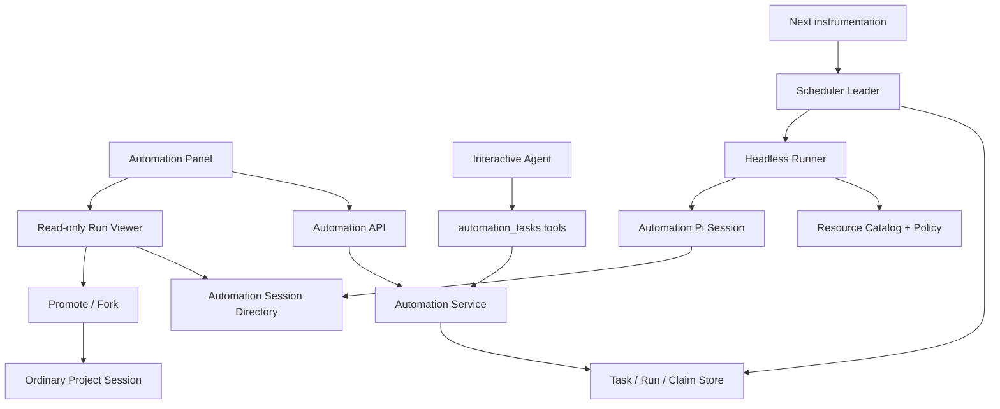
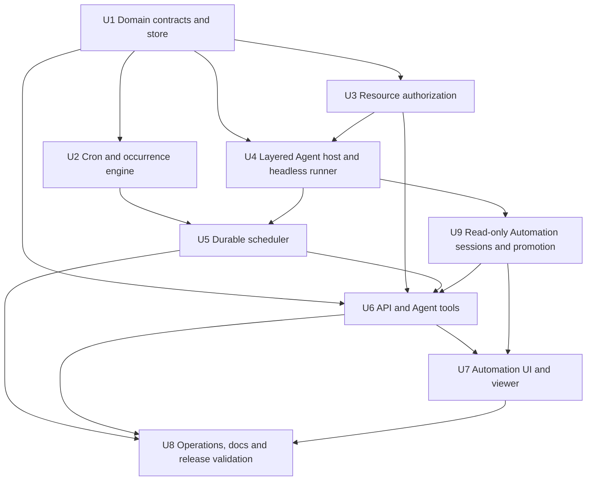
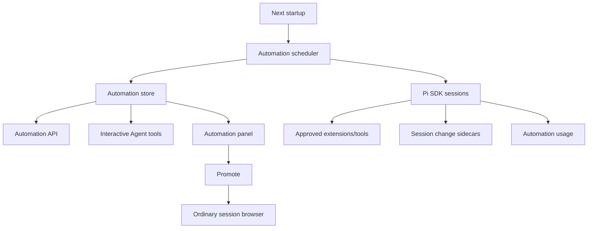

# feat: 增加定时 Agent Automation 能力

## Overview

为 Snail Pi Web 增加一套服务端持有、可持久化、Agent 可操作的定时自动化系统。用户既可以在 UI 中管理 Automation，也可以在普通对话里让当前 Agent 通过内置 tools 创建、查看、暂停、恢复、修改和立即运行任务。

每个 Automation 使用五段 cron 表达式和显式 IANA 时区，绑定一个已有项目或稳定的默认 Automation 工作目录，固定模型、thinking、任务描述和经人工授权的 headless 工具能力。每个被 materialize 的 eligible scheduled/manual occurrence 创建独立 authoritative Run；DST gap/超窗遗漏仅形成 aggregate record。实际 dispatch 后才尝试创建独立 Pi Session，preflight-blocked/skipped run 可无 Session。可用 Session 仍使用标准 Pi JSONL，但存放在普通项目 session 目录之外，只在 Automation 面板展示。用户需要继续讨论时，将该 Run Session promote/fork 为普通项目会话。

第一阶段按当前产品的本地长期运行模式设计：**Snail Pi Web 服务进程运行时负责调度，重启后通过持久状态、有限 misfire 窗口和跨进程 lease 恢复；不承诺 Web 服务完全关闭期间仍准时执行。**

---

## Problem Frame

当前项目已经具备普通 Pi 会话、模型选择、动态工具加载、文件变更 sidecar、后台刷新 scheduler 和 SnFlow run store，但没有通用的定时 Agent 控制面。已有 `pi-subagents` 一次性 scheduled run 是 session 范围的延迟子任务，不能覆盖 recurring cron、全局任务管理、项目选择、独立 Automation Session 和 UI/tool 对等能力。

该功能同时引入长期、无人值守的 Agent 执行权限。主要挑战不只是解析 cron，而是：

- 如何避免 Next.js 热重载、多进程或重启造成重复执行、漏执行；
- 如何让 `web_search`、`web_fetch` 等 extension/custom tools 可用，同时避免历史任务自动获得未来新增能力；
- 如何在无浏览器交互时 fail closed，避免 `ask_user`、绑定式浏览器工具或交互式终端挂起；
- 如何让自动运行可审计、可查看、可继续讨论，又不污染普通项目会话列表；
- 如何处理 cwd、模型、凭据、工具来源或 schema 在任务创建后的漂移。

---

## Requirements Trace

- **R1 — Cron 调度：** 支持标准五段 cron、显式 IANA 时区、下次执行预览和服务重启恢复。
- **R2 — 运行目标：** 可选择已有项目 cwd，或使用稳定的默认 Automation cwd；不得在运行时静默 fallback 到服务进程 cwd。
- **R3 — Agent 配置：** 每个任务保存显式 provider/model、thinking、任务描述和最大运行时间。
- **R4 — 工具授权：** 支持内置、extension 和 custom tools，包括 `web_search`、`web_fetch`；保存冻结的授权快照，运行时与当前策略取交集并 fail closed。
- **R5 — Agent-native parity：** UI 提供的创建、查看、修改、暂停、恢复、删除/归档、立即运行、查看历史和 promote 能力，应有对应 Agent tools；UI 与 tools 调用同一 service。
- **R6 — 受控确认：** 创建并激活、恢复、立即运行以及扩大 prompt/cwd/model/tool 权限时必须经过可信 UI-mediated confirmation，不能信任模型提交的 `confirmed: true`；它证明显式 UI 交互，不冒充已认证的人类身份。
- **R7 — 独立运行记录：** 每个 materialized eligible scheduled occurrence 和每个 manual occurrence 创建独立 authoritative Run record/provenance；DST gap 与超窗历史遗漏使用 aggregate omission record，不属于 Run。只有实际 dispatch 的 run 尝试创建独立 Pi JSONL Session，preflight-blocked/skipped run 可无 session。
- **R8 — 会话隔离：** Automation Session 默认不进入普通 `/api/sessions` 和项目侧栏；完成后只读，可显式 promote/fork 为普通会话。
- **R9 — 调度可靠性：** 跨进程 leader lease、原子 occurrence claim、单任务禁止重叠、全局并发限制、有限 misfire 补跑和崩溃 reconciliation。
- **R10 — 非交互安全：** Headless runner 禁止等待 UI；缺少交互、cwd、模型、凭据或授权工具时产生可见 blocked/failed run。
- **R11 — 可观测性：** 保存状态、计划时间、实际时间、错误类别、模型/工具快照、session 引用、使用量和文件变更投影。
- **R12 — 跨平台与运维：** Windows/Linux 下使用同一持久化与锁语义，支持 dev hot reload、`npm run start` 和现有 PM2/自托管模式。
- **R13 — 长期权限与容量：** approval 有到期复核，任务有 run/token/cost/runtime ceilings、连续失败暂停、全局 kill switch、容量 guard 和有界 retention。
- **R14 — 网络与部署安全：** 首版 local-only、reviewed immutable extensions、无 unrestricted subprocess，Web fetch 执行 SSRF/redirect/DNS 防护，凭据最小注入并脱敏。

---

## Scope Boundaries

### Included in first release

- 五段 cron，不支持秒级调度；使用成熟 parser，不手写 DST 算法。
- IANA timezone；持久化 UTC occurrence 时间和用于展示的本地 wall time/offset。
- 已有项目 cwd 和稳定默认目录 `~/pi-automation-cwd`。
- 显式模型、thinking、prompt、max runtime。
- 内置、reviewed extension、first-party custom 工具的授权快照；按 headless compatibility、文件副作用、网络 egress、凭据使用和交互需求分维度展示。
- `web_search`、`web_fetch` 仅在精确 executable digest/source/schema/config 获批并满足 SSRF policy 后用于 headless 任务；不能仅凭工具名视为安全。
- 每个 materialized eligible/manual occurrence 独立 Run record；DST gap/超窗历史遗漏仅使用 aggregate omission record；每次 dispatch 独立 Run Session；sealed session 可 promote。
- 任务 CRUD、draft/active/paused/blocked/archived 状态、run-now、取消请求、运行历史。
- 单机文件型持久化、跨进程文件 lease、原子 claim 和 bounded reconciliation。
- UI 与 Agent tools 对等。

### Deferred to follow-up work

- Web 服务关闭后仍由 OS daemon/system service 保证执行。
- Serverless、Kubernetes、多主机共享调度和 PostgreSQL/Redis 队列。
- 秒级 cron、一次性日历任务、任务 DAG、依赖和批量 backfill。
- 通用自动重试；第一阶段只允许明确的“尚未开始副作用”重试。
- 通用 OS 用户、容器或 VM 级工具沙箱；因此首版禁止 Automation 使用 unrestricted `bash` 和未 reviewed extension，不能把 cwd 宣称为 subprocess 安全边界。
- 完整的多用户身份、RBAC 和远程部署认证体系。
- 高级 retention policy、归档压缩和外部对象存储；首版仍实现固定期限清理、容量 guard、导出和显式删除。
- 在普通 Usage 面板中默认合并 Automation 成本；第一阶段在 Automation 面板单独统计，后续增加 scope 开关。

### Explicit non-goals

- 不复用 `.pi/snflows/` 或 SnFlow task/run schema。
- 不把 Automation Session 伪装成普通项目 session 再依赖名称前缀过滤。
- 不把 scheduler 放在浏览器 timer、某个普通 AgentSession extension timer 或长期 API request 中。
- 不承诺 Agent 对任意外部副作用实现 exactly-once。
- 不允许 scheduled Agent 自行创建、修改或触发其他 Automation。

---

## Context & Research

### Relevant code and patterns

- `lib/rpc-manager.ts`：Web AgentSession 创建、资源加载、模型/工具激活、全局 registry；现有 prompt 是 fire-and-forget，不能直接作为 headless runner。
- `lib/pi-session-lifecycle.ts`：在 SDK dispose 前等待 `session_shutdown`，Automation runner 必须复用。
- `lib/pi-runtime-resolver.ts`：准备确定性的 Pi CLI/runtime 环境；使用 extension/subagent 工具时必须复用。
- `lib/workflow-store.ts`、`lib/workflow-types.ts`：版本化 schema、revision、严格解析、临时文件 + rename、状态机模式。
- `lib/workflow-run-manager.ts`：隐藏 print-mode Agent host 和重启 reconciliation 的参考，但不能复用 SnFlow 业务状态。
- `lib/chatgpt-usage-refresh-scheduler.ts`：`globalThis`、文件锁、heartbeat、stale lock 和运维 status/repair API 参考。
- `lib/openai-codex-warmup-scheduler.ts`：分钟 tick 和 scheduled key 的简单先例，但不具备通用 cron/DST/claim 语义。
- `lib/session-file-changes.ts`：edit/write 的非 Git sidecar；独立 runner 必须接入同一事件观察器。
- `lib/session-reader.ts`、`lib/normalize.ts`：JSONL 读取和工具调用标准化；需要抽取“按受控已知路径读取 session”的共享能力。
- `lib/allowed-roots.ts`、`lib/file-access.ts`：两套 cwd/file root 授权入口，稳定默认 Automation cwd 必须同时纳入，不能新增第三套规则。
- `app/api/pi/resources/route.ts`：工具来源诊断参考，但当前临时 session 与真实 Web custom tools 面不完全一致，不能直接作为授权真值。
- `components/AppShell.tsx`：顶层 panel/tab 导航入口。
- `components/WorkflowPanel.tsx`、`components/ChatGptWarmupDialog.tsx`：状态化任务面板、scheduled history 和轮询交互参考。

### Institutional learnings

仓库不存在 `docs/solutions/`。可复用知识来自：

- `docs/architecture/overview.md`：后台 scheduler 属于服务端；session 生命周期必须通过 `session_shutdown` 清理；普通 Web tools 默认动态 `all`。
- `docs/modules/library.md`：原子 store、scheduler、session artifacts 和 sidecar 边界。
- `docs/deployment/README.md`：本地长期运行 Node/Next、PM2 重启和 build 包装约束。
- `docs/operations/troubleshooting.md`：生产运行和 Windows 路径问题。

### External references shaping the plan

- Next.js instrumentation：每个 server instance 执行一次，不是集群单例，因此只能作为启动入口，不能替代 leader lease。
- Node timers：不保证精准触发、不能跨重启持久化，长时间 timeout 也有上限，因此 timer 只负责唤醒扫描。
- Temporal/Kubernetes CronJob：misfire/catch-up 与 overlap/concurrency 应是显式持久策略。
- OWASP Authorization：默认拒绝，每次运行重新计算有效权限。
- Pi SDK 0.82.1：print/json mode 无 UI；扩展 factory 不应启动长期资源；AgentSession 必须显式 abort/dispose。

---

## Key Technical Decisions

| Decision | Choice | Rationale |
|---|---|---|
| Product domain | 全局 `Automation`，独立于 SnFlow | 定时自动化跨项目且不是开发工作流状态机 |
| Session storage | 标准 Pi JSONL + 独立 `automations/.../sessions` 目录 | 保留 Pi transcript 能力，同时天然不进入普通 session 扫描 |
| Run continuity | 每次 dispatch 创建 fresh session；skipped/preflight-blocked run 允许无 session | 避免上下文无限增长、旧结果污染、并发和审计混淆，并符合 Pi lazy persistence |
| Continue discussion | promote/fork 为普通 session | 保持 Automation run immutable/read-only，又允许人工追问 |
| Scheduler authority | 持久 task/run/claim store；timer 只唤醒 | 抵抗重启、休眠、HMR 和多进程 |
| Startup | 根 `instrumentation.ts` 的 Node runtime 注册 + leader lease | 适配 dev/start，避免依赖浏览器访问 API；未来可抽成独立 worker |
| Cron calculation | 引入 `cron-parser`，产品层限制五段 grammar | 需要 IANA timezone 和 next occurrence，不把调度生命周期交给内存库 |
| Persistence | 文件型版本化 store + 独立 mutation lock + transaction journal + 原子 rename | rename 只保证单文件完整；跨进程 CAS 和多文件恢复必须由锁、fencing 与 reconciliation 明确实现 |
| Tool permission | 授权快照 ∩ 当前 live policy | 历史任务不会因安装新扩展而自动扩权，撤权立即生效 |
| Extension tools | 工具授权同时表示对其 extension source/runtime 的授权 | 仅禁用 tool 不会阻止 extension hooks；scheduled loader 必须在 import/factory 执行前筛选来源 |
| Agent host layering | target-cwd services、interactive adapter、automation adapter 三层 | 共享 SDK services/observer/dispose，但不共享 browser、RPC UI 或默认 custom tool 集合 |
| Headless mode | 独立 awaited runner，extensions 绑定 print mode | 现有 RPC wrapper 依赖 SSE/UI 且 prompt fire-and-forget |
| Delivery semantics | occurrence 唯一、默认禁止 overlap、有限 run-once misfire、无通用自动重试 | 避免执行风暴和副作用重复；无法判定时进入 `ambiguous` |
| Confirmation | draft/pending revision → trusted UI-mediated authority review → active | 创建 active cron 相当于授予长期未来执行权限，但不冒充身份认证 |
| Default cwd | 首次初始化时解析并持久化 canonical absolute path，UI 显示为 `~/pi-automation-cwd` | 避免 PM2/Windows service 的 HOME/USERPROFILE 或运行账户变化时静默切换工作区 |

### Resolved first-release policy defaults

这些值进入 `schedulePolicyVersion=1` / `authorityPolicyVersion=1`，后续默认值变化不得重新解释已有任务：

- DST gap：`skip`，生成聚合 skipped 记录；DST fold：只 materialize 第一个 UTC instant。
- Misfire：`fire-once-now`，宽限 5 分钟；超窗遗漏计算为一个 aggregate skipped range（count、first、last），不逐条枚举。
- Cron 最小间隔：5 分钟；不允许用户降低。
- 默认 max runtime：30 分钟；允许 1–120 分钟。
- 全局并发：1；同 task overlap：`skip`。
- Default cwd：首次初始化保存 canonical absolute root；环境解析结果变化时 block 并要求迁移，绝不创建第二个“默认”目录。
- Unknown extension：首版禁止。只允许 exact content digest、manifest/dependency lock、hook inventory 和 normalized security config 命中 reviewed registry 的 extension/custom tools。
- `bash`：首版默认不可用于 Automation；只有未来提供独立低权限 OS identity/container profile 时才能授权。`write`/`edit` 仅在实现能证明 canonical target 始终位于 task cwd 且 Automation control/audit root 不可达时开放。
- Approval：默认 90 天到期，提前 7 天提醒；到期进入 `blocked(reason=approval_expired)`。每 task 必须有 runs/day、tokens/run、月度 cost 或 provider usage ceiling；连续失败阈值默认 3 次后暂停。
- Retention：Run transcript/changes 默认 90 天，terminal metadata/audit 默认 365 天；UI 提供导出和显式删除。达到 free-space guard 时停止新 claim 并进入 `blocked(reason=capacity)`。

### First-release security gates

- **Local-only enforcement：** 所有 `/api/automations/**` read/mutation routes 必须通过统一 middleware 验证 direct loopback deployment 和 same-origin/control-session。反向代理/非 loopback 模式首版拒绝启用 Automation；不能把部署文档警告当作控制。
- **Network egress：** 可用于新闻任务的 fetch/search 实现必须执行 HTTP(S)-only、DNS 和 connect 后 IP 校验、loopback/private/link-local/cloud-metadata deny、每次 redirect 重验、DNS-rebinding 防护以及响应大小/时间限制；不满足者不得进入 reviewed registry。
- **Secrets：** 任务快照只存 credential identifier/scope，不存值。Reviewed tool 按调用注入最小凭据；禁用 general runner env 继承；prompt、arguments、results、errors、summary 和 audit 使用 canary-tested redaction。
- **Storage：** Automation root 以当前 OS 支持的最严格 owner-only ACL 创建。Runner capability 不得修改 control/audit storage；audit 采用 bounded per-run projection + integrity chain，而不是宣称同用户 write-once 文件天然防篡改。
- **Global kill switch：** scheduler status 面提供立即停止新 claim 的全局 disable；现有 run 走显式 cancel/ambiguous 语义。
- **Authority summary：** 确认 dialog 由规范化数据生成，不直接信任 Agent 文案；展示 cwd、schedule/timezone、expiry、budgets、model、extension digest、network/credential/filesystem 权限和服务在线要求。

### Cross-process lock and recovery protocol

- `store.lock` 与 `scheduler.lock` 均使用 exclusive create、owner UUID、pid/hostname、monotonic epoch、acquiredAt、heartbeatAt；epoch 由锁内持久 counter 分配。
- acquisition 有有界 timeout；空/损坏锁不被静默删除，进入 repair-required；stale takeover 先写带更高 epoch 的 replacement，再由 owner/fencing 校验决定写权限。
- 每个 task/run/claim mutation 在 `store.lock` 内重新读取，并验证当前 scheduler epoch 与 run fencing token；owner-checked release 不能 unlink 他人锁。
- authoritative journal postconditions：`prepared` 只有 claim；`run_created` 必有 run projection；`task_advanced` 要求 task 保存 `lastMaterializedOccurrenceKey`；`execution_may_have_started` 在任何 runner/model/tool 调用前持久化；其后的 stale run 一律 `ambiguous`，绝不自动 redispatch。
- Reconciliation 对 journal stage × tasks.json × run projection 的每种组合使用固定 truth table；每步 replay 以 occurrence key 幂等。旧 owner takeover 后恢复并尝试任一 mutation 必须被 fencing 拒绝。
- shutdown deadline 到期而 runner 未确认停止时，不主动释放 authority；run 标记 ambiguous，lease 仅随进程死亡/expiry 失效，所有 late finalize 必须被 fencing 拒绝。

### Why not ordinary project sessions

将 Automation JSONL 写进普通 `sessions/` 再过滤，需要同步修改 session index、最近列表、archive、Usage、删除、路径缓存等多个消费者，遗漏任一处都会重新泄漏到普通侧栏。独立 session directory 让隔离成为存储结构属性，而不是 UI 约定。

### Why not reuse one session per task

同一个 cron task 持续追加会导致上下文、成本和失败耦合不断增长，并使一次 occurrence 的权限/模型/prompt 快照无法独立审计。跨次状态应通过项目文件、显式 task state 或受控 previous-run summary 实现，而不是继承完整 transcript。

---

## Data and Storage Design

> 这是方向性设计，用于约束实现边界，不是要求实现者逐字段照抄。

```text
~/.pi/agent/automations/
├── tasks.json                       # 版本化 task 集合和 store revision
├── store.lock                       # UI/API/tool/scheduler mutation lock
├── scheduler.lock                   # leader lease/heartbeat
├── claims/                          # occurrence transaction journal
│   └── <occurrence-key>.json        # prepared → run_created → task_advanced → execution_may_have_started
├── runs/
│   └── <run-id>.json                # execution snapshot，terminal 后冻结
├── promotions/
│   └── <run-id>.json                # 独立 continuation projection/claim
├── audit/
│   └── <run-id>.json                # 有界生命周期/安全事件 projection + integrity chain
└── sessions/
    └── <task-id>/
        └── <run-id>/
            └── <pi-session>.jsonl   # 标准 Pi Session v3

~/pi-automation-cwd/                  # 未选择项目时的稳定默认 cwd
```

### AutomationTask

- identity：`id`、`schemaVersion`、store `revision`、`approvedRevision`、nullable `pendingRevision`、`name`、`description`；active task 的 approved/pending 配置分别保存并独立 CAS；
- lifecycle：`draft | active | paused | blocked | archived`；权威 `blockedReason` 枚举为 `reauthorization_required | interaction_required | capacity | approval_expired | cwd_unavailable | model_unavailable | credential_unavailable | tool_unavailable | scheduler_unavailable | policy_violation`，不是额外 task state；
- schedule：五段 cron、timezone、DST policy、misfire policy、catch-up window、nextRunAt UTC；
- target：canonical cwd、`project | default` 来源；
- agent policy：provider/model、thinking、self-contained prompt、maxRuntimeMs；
- resource policy：tool snapshots、approved extension sources、policy version/hash；
- concurrency：默认 `skip` overlap，全局并发由 scheduler 配置；
- provenance：createdBySessionId、approvedAt、approval hash、created/updated timestamps。

### AutomationRun

- identity：run id、task id/revision、trigger `scheduled | manual`；
- occurrence：scheduledFor UTC、local wall time、offset、timezone、occurrence key；
- lifecycle：`queued | claimed | running | succeeded | failed | timed_out | cancel_requested | cancelled | skipped | blocked | ambiguous`；
- lease：owner、epoch/fencing token、lease expiry、heartbeat；
- snapshots：prompt hash、requested/actual model/thinking、effective tools/extensions；
- session：nullable session id/file、`sessionAvailability: pending | available | unavailable` 和 reason；promote 关联存放在独立 projection，不回写 terminal execution snapshot；
- outcome：started/completed、last assistant summary、usage、error category/message；
- safety：是否已开始模型/工具副作用，用于判断能否自动重试。

### State transitions

```mermaid
stateDiagram-v2
    [*] --> draft
    draft --> active: human approval
    active --> paused: pause
    paused --> active: re-approve/resume
    active --> blocked: cwd/model/tool/auth/budget drift
    blocked --> active: repair + re-approve
    draft --> archived
    active --> archived: stop future claims; current run unchanged
    paused --> archived
    blocked --> archived

    [*] --> queued
    queued --> claimed
    queued --> cancelled: cancel before claim
    queued --> skipped: misfire/overlap policy
    claimed --> running
    claimed --> blocked
    claimed --> cancel_requested
    running --> succeeded
    running --> failed
    running --> timed_out
    running --> cancel_requested
    cancel_requested --> cancelled: abort confirmed
    cancel_requested --> succeeded: completion committed first
    cancel_requested --> failed: failure committed first
    cancel_requested --> ambiguous: termination uncertain
    running --> ambiguous: crash after dispatch barrier
```



---

## High-Level Technical Design

> *This illustrates the intended approach and is directional guidance for review, not implementation specification. The implementing agent should treat it as context, not code to reproduce.*



### Scheduled occurrence sequence

```mermaid
sequenceDiagram
    participant S as Scheduler
    participant T as Store
    participant P as Live Policy
    participant R as Headless Runner
    participant J as Pi Session

    S->>T: scan due tasks under leader lease
    S->>T: exclusive claim + create claimed run + advance nextRunAt
    S->>P: static preflight cwd/model/digests/credential handles (no extension import)
    alt policy valid
        S->>T: persist execution_may_have_started barrier
        S->>R: start run; load approved extensions with frozen snapshot
        R->>J: create custom-session-dir AgentSession
        R->>J: await prompt with deadline
        J-->>R: terminal result and transcript
        R->>T: finalize run and audit
    else policy drift or unavailable
        S->>T: persist blocked run and block task if required
    end
```

---

## API and Agent Tool Parity

| Capability | UI/API | Agent tool action | Confirmation |
|---|---|---|---|
| List/get tasks | GET `/api/automations/tasks` | `list`, `get` | No |
| Create draft | POST `/api/automations/tasks` | `create` | Draft no；activate yes |
| Edit task | PUT `/api/automations/tasks/[taskId]` | `update` | Security-sensitive changes yes |
| Activate/resume | POST task action route | `activate` / `resume` | Yes |
| Pause | POST task action route | `pause` | No；does not abort current run |
| Archive | DELETE/action route | `archive` | Yes |
| Run now | POST `/api/automations/tasks/[taskId]/runs` | `run_now` | Yes |
| List/get runs | GET runs routes | `list_runs`, `get_run` | No |
| Cancel nonterminal run | POST run cancel route | `cancel_run` | Yes；best effort |
| Read/export run session | GET session/export routes | `get_run_session`, `export_run` | Export yes |
| Delete retained run artifacts | DELETE artifacts route | `delete_run_artifacts` | Yes；保留 tombstone/audit |
| Promote to normal session | POST promote route | `promote_run` | Yes |
| Scheduler status/repair | status/repair routes | `scheduler_status`, `repair_scheduler_lock` | Repair yes |

第一阶段优先使用单一 `automation_tasks` 多 action tool，避免向模型注入大量管理工具 schema。其 `promptSnippet` 和 `promptGuidelines` 必须明确：只在用户显式要求时创建/修改 Automation；scheduled-origin session 不加载该 tool。

---

## Implementation Unit Dependency Graph



---

## Implementation Units

- [ ] U1. **定义 Automation 领域模型与原子持久化**

**Goal:** 建立 task/run/audit/claim/promotion 的版本化类型、状态机、路径布局、跨进程 mutation lock 和可恢复 transaction journal，使 UI、tools、scheduler 和 runner 共享一个 source of truth。

**Requirements:** R2, R5, R7, R9, R11, R12, R13

**Dependencies:** None

**Files:**
- Create: `lib/automation-types.ts`
- Create: `lib/automation-store.ts`
- Create: `lib/automation-lock.ts`
- Create: `lib/automation-paths.ts`
- Create: `lib/automation-default-cwd.ts`
- Create: `scripts/smoke-automation-store.ts`
- Create: `scripts/fault-inject-automation-store.ts`
- Modify: `lib/allowed-roots.ts`
- Modify: `lib/file-access.ts`
- Modify: `package.json`

**Approach:**
- 采用 `getAgentDir()/automations/`，不写 `pi-web.json`，不写 `.pi/snflows/`。
- 参考 `lib/workflow-store.ts` 的严格解析、schema version 和同目录 temp + rename，但不把 rename 误当跨进程 CAS。
- 增加与 scheduler leader lease 分离的 `store.lock`；所有 UI/API/tool/scheduler mutation 必须在锁内重新读取 revision，并校验 owner/fencing token 后写入。
- occurrence claim 是多文件更新的 authoritative transaction journal，记录 `prepared → run_created → task_advanced → execution_may_have_started` 阶段；task 保存 `lastMaterializedOccurrenceKey`，run projection 与 `nextRunAt` 按固定 truth table 幂等重建。
- task 集合使用 versioned `tasks.json`；active task 同时保存 immutable approved revision 与 nullable pending draft revision。编辑只 CAS pending；审批以 policy hash 校验后原子替换 approved，崩溃恢复不能让半批准配置参与调度。
- run 使用独立 execution snapshot；terminal snapshot 不再重写，promote link 使用独立 revision-checked projection。
- audit 首版使用锁内原子替换的有界 per-run projection（含单调 sequence 与 integrity chain），避免跨进程 append 和文件爆炸；敏感信息先脱敏。只有合规/并发测试证明需要时再拆分事件文件。
- 明确 durability 目标为进程崩溃/服务重启恢复；除非实现并验证 fsync，不宣称断电级事务持久性。
- `ensureAutomationDefaultCwd()` 只在首次初始化解析/创建 `~/pi-automation-cwd` 并持久化 canonical absolute root；后续重启使用已存 root 并重新接入 `allowed-roots.ts` 与 `file-access.ts`。HOME/账户漂移只触发迁移提示，不创建替代目录，不新增第三套 root policy。
- archive task 为软归档，不立即级联删除 runs/sessions；统一 retention worker 仍按已确认期限清理，显式导出/删除走独立审计动作。

**Patterns to follow:**
- `lib/workflow-store.ts`
- `lib/pi-subagent-settings.ts`
- `lib/browser-pairing.ts`

**Test scenarios:**
- Happy path：创建 draft task、更新 revision、写入 run、重读后字段和状态完全一致。
- Edge case：两个写入者使用相同旧 revision，只有一个成功，另一个得到 conflict。
- Error path：tasks JSON 损坏、run schema 不合法或 temp rename 失败时，不覆盖最后一个有效版本。
- Security：task/run id 包含 traversal、绝对路径或 Windows 分隔符时被拒绝。
- Concurrency：两个进程使用同一旧 revision 写入，只有锁内重新校验通过者成功；同一 occurrence 只有一个 claim。
- Fault injection：在 claim、run create、task advance、execution barrier，以及 `prompt()` 调用前后强杀子进程；barrier 前可安全收敛，barrier 后只能 ambiguous，不能双派发。
- Default cwd：首次创建、空目录、重启、路径已是文件、权限失败、symlink/canonical path 和目录被删除均有确定结果。
- Lifecycle：active task 可持续运行 approved revision，同时编辑/保存 pending revision；审批替换、冲突、取消 pending 和崩溃恢复均保持唯一 approved policy。
- Lifecycle：terminal run 再次被写入运行快照时被拒绝；promotion 和 audit 写入各自独立 projection/event。

**Verification:**
- store 在 Windows/Linux 路径规则下可重启恢复；并发冲突不会产生两个相同 occurrence；损坏文件不会静默重置。

---

- [ ] U2. **实现 Cron、时区和 occurrence 计算契约**

**Goal:** 提供统一的 cron 校验、下次运行预览、DST/misfire/overlap 判定和 occurrence materialization。

**Requirements:** R1, R9, R12

**Dependencies:** U1

**Files:**
- Create: `lib/automation-schedule.ts`
- Create: `scripts/smoke-automation-schedule.ts`
- Modify: `package.json`
- Modify: `package-lock.json`

**Approach:**
- 引入 `cron-parser`，产品层只接受五段表达式；明确拒绝秒字段和未支持扩展语法。
- 保存 IANA timezone；持久化 fire time 使用 UTC，并记录本地 wall time/offset 供展示和审计。
- 固定 `schedulePolicyVersion=1`：DST gap=`skip`；fold 只 materialize 第一个 UTC instant，occurrence key 包含选定 UTC instant、timezone 和 policy version。
- overlap policy=`skip`；第一阶段不允许平行执行同一 task。
- misfire=`fire-once-now`，catch-up window=5 分钟；只补最近 eligible occurrence，更旧 occurrence 汇总为单个 skipped range，不逐个创建 run/audit。
- next occurrence 从上一个计划时间计算，而不是从完成时间计算，避免漂移。
- cron 最小间隔固定 5 分钟；max runtime 默认 30 分钟、允许 1–120 分钟。

**Patterns to follow:**
- `lib/openai-codex-warmup-scheduler.ts` 的 scheduled run key 思路
- `lib/openai-codex-warmup-history.ts` 的 duplicate key 防护

**Test scenarios:**
- Happy path：`0 8 * * *` + `Asia/Shanghai` 得到正确 UTC nextRunAt 和 UI 预览。
- Validation：四段、六段、非法值、非法 IANA timezone、低于最小间隔的表达式被拒绝。
- DST gap：不存在的本地时间 skipped 并留下明确原因；DST fold 在 uninterrupted 和两次 UTC instant 中间重启时都只 materialize 第一个。
- Misfire：5 分钟内恢复只生成最近一次 run；超窗计算一个 aggregate skipped range 并推进 nextRunAt，数月离线也不枚举历史每个 instant。
- Overlap：前一 run 仍 active 时，新 occurrence 被标记 skipped，不进入 runner。

**Verification:**
- 相同输入在重启前后产生稳定 occurrence；跨 DST 和系统休眠不会无限 catch-up 或重复触发。

---

- [ ] U3. **建立 Headless 工具目录、风险分类和授权快照**

**Goal:** 允许 `web_search`、`web_fetch` 等 extension/custom tools 在明确网络与凭据风险后进入 Automation，同时冻结来源、配置与 schema，并在 extension import/factory 执行前 fail closed。

**Requirements:** R3, R4, R6, R10, R14

**Dependencies:** U1

**Files:**
- Create: `lib/automation-resource-catalog.ts`
- Create: `lib/automation-tool-policy.ts`
- Create: `lib/automation-network-policy.ts`
- Create: `lib/automation-secret-policy.ts`
- Create: `scripts/smoke-automation-tool-policy.ts`
- Create: `scripts/smoke-automation-network-policy.ts`
- Modify: `app/api/pi/resources/route.ts`
- Modify: `lib/rpc-manager.ts`
- Modify: `lib/pi-types.ts`

**Approach:**
- 抽取一个与真实 session services 共用的资源目录描述器，避免 `/api/pi/resources` 与实际 runner customTools 不一致，同时避免 catalog ↔ runner 循环依赖。
- 每个工具分别展示 name、description、builtin/extension/custom、sourceInfo、headless compatibility、local mutation、network egress、credential use、interaction requirement、来源指纹和 schema hash。
- 本地只读内置工具可进入默认候选；`web_search`、`web_fetch` 只有在“规范化 extension source identity + tool name + schema hash”精确命中认可记录时才标为 headless-compatible，仍显示网络和凭据风险。
- `bash` 和任意 subprocess tool 首版 blocked；`write`/`edit` 只有通过 canonical cwd confinement 测试且无法触达 Automation control/audit root 时才作为高风险可授权；交互式工具、临时 browser binding、Automation mutation tools 默认禁止。
- 授权 extension tool 同时表示授权其 extension source/runtime。首版只允许 reviewed registry；snapshot 绑定 executable content digest、manifest/dependency lock、hook inventory、tool schema 和 normalized security config，runner 从验证后的 immutable artifact 加载，避免 check/load race。
- scheduled runner 使用独立 loader，在 `resourceLoader.reload()`、模块 import 和 factory 执行之前只选择获批来源；不能先加载全部 extension 再通过 active tools 过滤。
- 网络工具必须走 `automation-network-policy.ts` 的 SSRF/redirect/DNS/size/time enforcement；第三方实现若无法证明相同控制则不获准。
- 运行有效权限为 immutable snapshot 与当前 live policy 的交集；缺失、同名覆盖、来源/schema/config/content digest 漂移进入 `blocked(reason=reauthorization_required)`，绝不回退到 `all`。
- 凭据值不进入快照；执行时实时解析，但凭据需求/作用域作为风险元数据进入授权摘要。

**Patterns to follow:**
- `app/api/pi/resources/route.ts`
- `lib/browser-tools.ts`
- `lib/rpc-manager.ts` 的 `setActiveToolsByName()`
- Pi extension `sourceInfo` 和 `getAllTools()` 契约

**Test scenarios:**
- Happy path：选中 `web_search`/`web_fetch` 后快照记录真实 extension source、network/credential 风险和 schema，执行前比对通过。
- High risk：`bash` 在首版不可选且解释 isolation 前置条件；选择符合 confinement 的 `write`/`edit` 时授权摘要明确标红并要求可信 UI confirmation。
- Drift：工具同名但 source path、package version、schema hash 或影响 hooks 的安全配置改变时 blocked。
- Missing：工具/扩展卸载或凭据缺失时产生明确 blocked run，不静默移除工具后继续执行。
- Preload boundary：未授权 sentinel extension 的 factory 即使会写标志文件，也不得被 scheduled loader import/执行；验证后修改 mutable source 也必须因 digest/check-load 检测而 block。
- Network boundary：拒绝 loopback、RFC1918/link-local、IPv6 local、cloud metadata、encoded host、redirect-to-private 和 DNS rebinding；限制 response size/time。
- Extension boundary：只批准某 extension 的工具时，未批准 extension 不被 scheduled resource loader 加载。
- Recursion：`automation_tasks`、认证修改、session-bound browser tool 即使出现在资源目录中也不能进入 effective tools。
- Empty policy：无工具任务保持真正 no-tools，不恢复 Web 默认 `all`。

**Verification:**
- 用户可以授权 Web 搜索工具；历史任务不会因新安装扩展或同名覆盖自动扩权；权限撤销立即生效。

---

- [ ] U4. **分层 Agent Host 并实现独立 Headless Runner**

**Goal:** 将可共享的 target-cwd Pi services 与 interactive/automation host policy 分离，在指定 cwd 中安全运行 awaited、短生命周期 AgentSession。

**Requirements:** R2, R3, R7, R10, R11, R14

**Dependencies:** U1, U3

**Files:**
- Create: `lib/agent-session-services.ts`
- Create: `lib/agent-session-observer.ts`
- Create: `lib/automation-runner.ts`
- Create: `scripts/smoke-automation-runner.ts`
- Modify: `lib/rpc-manager.ts`
- Modify: `lib/session-file-changes.ts`
- Modify: `app/api/agent/new/route.ts`

**Approach:**
- 优先封装 Pi SDK 的 `createAgentSessionServices` / `createAgentSessionFromServices`，形成三层：target-cwd runtime/services、interactive adapter、automation adapter。
- 只共享 runtime resolver、SettingsManager/model registry、事件 observer 和 dispose lifecycle；interactive adapter 独有 SnFlow lifecycle、browser/Automation tools 和 RPC UI，automation adapter 独有加载前 extension allowlist 与 headless UI。
- scheduled 路径使用 `SessionManager.create(cwd, automationSessionDir)`、print-mode extension binding 和 awaited `session.prompt()`；不复用 Web RPC wrapper。Prompt 必须非空。
- Pi Session 是 lazy-persisted：preflight/model/auth failure 可能没有 JSONL。Runner 先记录 `sessionAvailability=pending`，发现持久文件后改为 `available`，无文件 terminal run 改为 `unavailable` 并保存 reason。
- 纯静态 preflight 不 import/执行 extension。随后在启动 Automation Runner、extension import/factory、AgentSession/services 创建，以及任何 model/tool 调用之前持久化 `execution_may_have_started` barrier；barrier 后崩溃一律 ambiguous。
- `AgentSession.prompt()` 不接受 AbortSignal。Runner 由外层 deadline 触发 `session.abort()`，等待有界 drain 后通过 `disposeAgentSession()` 触发 `session_shutdown`。
- Headless UI methods 不等待浏览器；需要 confirm/select/input/editor 的工具立即失败并标记 `blocked(reason=interaction_required)`。
- Scheduled prompt 注入 task/run identity、scheduled time、非交互约束、工具/预算信息，但不继承 creator conversation。
- 每次 run 设置可读 session name；run store 保存 session id/path，不修改 Pi header schema。
- 抽取事件 observer，让 interactive adapter 与 runner 共用 edit/write file-change sidecar。

**Patterns to follow:**
- `lib/rpc-manager.ts`
- `lib/workflow-run-manager.ts` 的 print-mode host
- `lib/pi-session-lifecycle.ts`
- Pi SDK `createAgentSessionServices` / `createAgentSessionFromServices`
- Pi `SessionManager.create(..., sessionDir)`

**Test scenarios:**
- Happy path：fake AgentSession 完成后生成独立 JSONL、run summary、实际模型/thinking 和 terminal 状态。
- Policy isolation：interactive browser/Automation tools 和未批准 extension 不进入 automation adapter。
- Timeout：模型或工具长时间不结束时外层 deadline 调用 abort，run 进入 timed_out，session_shutdown/dispose 只执行一次。
- Interaction：扩展请求 confirm/select 时立即产生 headless 错误，不等待 120 秒。
- Tool event：edit/write 事件仍生成 `session-changes/<session-id>.json`；bash 变更盲区在结果中保留提示。
- Failure：cwd 消失、模型缺失、凭据失败、resource loader 失败或空 prompt 均创建可查看的 failed/blocked run；preflight failure 的 session file 可为空且不可 promote。
- Dispatch barrier：在 barrier 和 `prompt()` 前后 fault injection，只有 barrier 前允许 redispatch。
- Secret environment：runner/approved tools 只能看到 allowlisted provider/tool credential handles；canary secret 不得进入 prompt/transcript/error/audit。
- Cleanup：正常、异常、abort 和 process-shutdown 路径都不会遗留活跃 extension resources。

**Verification:**
- Interactive 与 Automation 共享底层 services 而不共享默认能力；Runner 可独立等待完成、按加载前 allowlist 执行并可靠清理。

---

- [ ] U9. **实现只读 Automation Session、Changes 和幂等 Promote**

**Goal:** 通过受控 run path 读取 Automation JSONL/changed-file sidecar，并将完成 run 幂等 promote 为普通项目 session，且不修改 terminal execution snapshot。

**Requirements:** R7, R8, R11

**Dependencies:** U1, U4

**Files:**
- Create: `lib/automation-session.ts`
- Create: `lib/automation-promotion.ts`
- Create: `scripts/smoke-automation-session.ts`
- Create: `scripts/fault-inject-automation-promotion.ts`
- Modify: `lib/session-reader.ts`
- Modify: `lib/usage-stats.ts`

**Approach:**
- Automation session 只通过 run store 中已验证的 canonical path 读取；不扩大普通 `resolveSessionPath()` 搜索范围。
- transcript、usage 和 changes 读取使用普通 parser/normalize 共享逻辑，但入口以 run id 授权。
- 仅允许无 active lease 且 terminal 的 run promote；`session_shutdown`/dispose 完成后持久化 `session_sealed`（最终 size/hash/entry count）。blocked/no-session/unsealed run 不可 promote；failed/timed_out/cancelled/ambiguous 只要有 sealed partial transcript 仍可 promote。
- promotion 使用独立 `promotions/<run-id>.json` claim/projection 和 per-run cross-process lock；首版只允许 promote 到 run 的 canonical cwd。
- SDK `forkFrom()` 不是原子 copy。先 fork 到 staging directory，校验完整 entry sequence 与 source seal，再原子 rename 一个验证后的目标文件到普通 session directory；只有 commit 后才刷新 index/path cache 和写 projection。
- Recovery 区分 staging、partial destination 和 validated destination；不能只凭 session id/header 判定成功。原 Automation session 和 terminal run snapshot 保持不变。
- promoted session 的隐藏 parent 不在普通索引时，侧栏允许降级为普通根节点；内容不依赖 parent metadata。

**Patterns to follow:**
- `lib/session-reader.ts`、`lib/normalize.ts`
- `lib/session-file-changes.ts`
- Pi `SessionManager.forkFrom(...)`

**Test scenarios:**
- Isolation：Automation JSONL 不被 `/api/sessions`、普通 session index 或普通 archive 扫描发现。
- Read-only：run id 可读 transcript/usage/changes；普通 session id/path resolver 不能绕过边界。
- Promote：创建普通项目 session、普通侧栏可发现，Automation transcript/snapshot 不被修改。
- Concurrency：两个 promote 请求通过稳定 key 收敛到同一普通 session。
- Fault injection：staging copy 中断、rename 前后、destination commit 后 projection 写失败，重启后验证内容并且不会生成第二个 session。
- Seal：terminal 状态先写但 JSONL 尚未 drain 时 promote 被拒绝；sealed hash/size 不匹配时进入 repair-required。
- Eligibility：每个 terminal status、partial transcript、no-session 和 existing-promotion 都有明确行为；已有 promotion 直接打开目标。
- Missing：session/sidecar 丢失或 cwd 不再授权时返回明确状态，不扩大路径搜索。

**Verification:**
- Automation Session 隐藏于普通会话系统，但可完整查看、统计、展示 changes 并幂等 promote。

---

- [ ] U5. **实现持久 Scheduler、Leader Lease 和崩溃恢复**

**Goal:** 在服务启动时恢复调度，跨进程只由一个 leader 扫描并通过原子 claim 派发 Run，处理 overlap、misfire、取消和 ambiguous 状态。

**Requirements:** R1, R9, R10, R11, R12, R13

**Dependencies:** U1, U2, U4

**Files:**
- Create: `lib/automation-scheduler.ts`
- Create: `lib/automation-run-registry.ts`
- Create: `lib/automation-process-lifecycle.ts`
- Create: `instrumentation.ts`
- Create: `scripts/smoke-automation-scheduler.ts`
- Modify: `bin/pi-web.js`

**Approach:**
- `instrumentation.ts` 仅在 `NEXT_RUNTIME=nodejs` 动态加载 scheduler，完成有限启动检查后返回；初始化错误写入 status 并使 Automation fail closed，但不拖垮普通 WebUI。
- `globalThis` 只防同进程 HMR 重复；scheduler.lock 提供 owner、pid、hostname、epoch、heartbeat 和 stale 检测。
- timer 以短周期或 next-due 上限唤醒，每次从 store 重新读取，不把内存 timer 当 source of truth。
- scheduler 在 `store.lock` 内推进 occurrence journal；exclusive claim 是唯一 commit point，run 与 `nextRunAt` 由 journal stage + reconciliation 收敛；leader epoch 防旧 leader 回写。
- 默认全局并发 1；单 task overlap skip。
- cancel 为 best effort：revision/fencing CAS 先持久化 cancel_requested，再通知 owner abort；completion 已先 commit 则 completion 胜出，确认 abort 才 cancelled，无法确认则 ambiguous，已发生副作用不回滚。
- 启动 reconciliation：只有 `execution_may_have_started` barrier 之前的 stale claim 可安全重排；barrier 后一律 ambiguous，不自动重试。
- Misfire 直接计算最新 eligible occurrence；超窗遗漏写一个 aggregate skipped range 并限制每 tick reconciliation work，不枚举历史每个 cron instant。
- Next 子进程幂等安装 SIGINT/SIGTERM handler：停止新 claim → 有界 drain/abort；只有全部 runner 确认停止才 owner-checked release。deadline 超时则持有 lease 至进程死亡/expiry 并标记 run ambiguous；`spi` 父进程转发信号并等待子进程退出。
- 提供 status、ensure、run-now enqueue、stale lock repair 和最近 scheduler error 投影。

**Patterns to follow:**
- `lib/chatgpt-usage-refresh-scheduler.ts`
- `lib/openai-codex-warmup-scheduler.ts`
- `lib/workflow-run-manager.ts`

**Test scenarios:**
- Startup：无浏览器请求时 scheduler 也由 Node instrumentation 启动。
- HMR：同进程重复 register 不创建第二 timer。
- Multiprocess：两个 scheduler 同时启动只有一个 leader；同 occurrence 只有一个 run。
- Stale leader：heartbeat 过期后新 leader 获得更高 epoch；旧 leader 不能 finalize 新 claim。
- Restart：宽限窗口内最近 misfire 只补一次；超窗 occurrence skipped。
- Overlap：前一 run running 时下一次 skipped，task.nextRunAt 继续推进。
- Cancel：同进程和跨进程 cancel_requested 都能被 owner 观察；测试 cancel-before-completion 与 completion-before-cancel 两种 CAS 顺序，无法确认终止时 ambiguous。
- Crash：在 occurrence journal、execution barrier 和 prompt 边界强杀进程；barrier 前可安全重新派发，barrier 后进入 ambiguous。
- Misfire storm：模拟数月离线，只产生一个 aggregate skipped range，启动/tick 工作量有上限。
- Shutdown：父进程信号正确转发；abort-ignoring extension 下子进程不提前释放 lease，late finalize 被 fencing 拒绝。
- Init failure：scheduler 无法初始化时普通 WebUI 仍启动，Automation status 明确不可用。
- Disabled/paused：暂停立即阻止新 claim，但不暗中取消当前 run。

**Verification:**
- dev/start/多进程竞争和重启场景不会产生重复 occurrence；所有漏执行、跳过和不确定状态均有持久记录。

---

- [ ] U6. **增加 Automation API 与对话 Agent Tools**

**Goal:** 为 UI 和当前对话提供同一套受验证的管理能力、revision 语义和可信 UI-mediated confirmation。

**Requirements:** R2, R3, R4, R5, R6, R10, R11, R13, R14

**Dependencies:** U1, U3, U5, U9

**Files:**
- Create: `lib/automation-service.ts`
- Create: `lib/automation-tools.ts`
- Create: `lib/automation-api.ts`
- Create: `lib/automation-local-access.ts`
- Create: `lib/automation-approval.ts`
- Create: `app/api/automations/approvals/route.ts`
- Create: `app/api/automations/tasks/route.ts`
- Create: `app/api/automations/tasks/[taskId]/route.ts`
- Create: `app/api/automations/tasks/[taskId]/actions/route.ts`
- Create: `app/api/automations/tasks/[taskId]/runs/route.ts`
- Create: `app/api/automations/runs/[runId]/route.ts`
- Create: `app/api/automations/runs/[runId]/session/route.ts`
- Create: `app/api/automations/runs/[runId]/export/route.ts`
- Create: `app/api/automations/runs/[runId]/artifacts/route.ts`
- Create: `app/api/automations/runs/[runId]/changes/route.ts`
- Create: `app/api/automations/runs/[runId]/changes/file/route.ts`
- Create: `app/api/automations/runs/[runId]/cancel/route.ts`
- Create: `app/api/automations/runs/[runId]/promote/route.ts`
- Create: `app/api/automations/scheduler/status/route.ts`
- Create: `app/api/automations/scheduler/repair-lock/route.ts`
- Create: `scripts/smoke-automation-api.ts`
- Create: `scripts/smoke-automation-approval.ts`
- Create: `scripts/smoke-automation-tools.ts`
- Modify: `lib/rpc-manager.ts`
- Modify: `app/api/pi/resources/route.ts`
- Modify: `docs/modules/api.md`

**Approach:**
- U6 是交付主题，不作为单个不可拆 PR：U6a service + read APIs，U6b approval + mutation APIs，U6c session/changes/promotion APIs，U6d Agent tool adapter/parity，U6e scheduler status/repair；每个 checkpoint 单独通过 contract smoke 后再继续。
- 所有 Automation route 先经过统一 local-only middleware；非 direct-loopback 或代理暴露场景拒绝启用。Route 再负责 browser control session/same-origin/allowed-root 验证和错误映射；业务校验都在 `automation-service.ts`。
- Agent tool 直接调用 service，不通过内部 HTTP。
- Tool 从 `ctx.cwd` 和 `ctx.sessionManager.getSessionId()` 注入 creator context，但长期执行 cwd 必须由用户在授权摘要中显式选择并确认。不得因参数缺省自动激活到当前 worktree；项目无关模板默认建议持久 Automation workspace。模型不能指定内部 creator session id。
- 创建默认为 draft。UI 敏感 mutation 先由服务端创建一次性 approval challenge，绑定 action、task id/revision、规范化 policy hash、canonical cwd、browser control session 和 expiry；浏览器确认后原子消费，同一 challenge 不可 replay。
- Automation-specific browser control session 使用 HttpOnly、SameSite=Strict cookie 隔离普通 localhost HTTP 调用；它证明受控浏览器流程而不是用户身份。首版拒绝公网/代理模式，而不是把外部认证留给部署者自觉。
- Agent tool 的敏感 mutation 通过可信 `ctx.ui.confirm` 完成，将确认结果以内存中的非序列化 approval context 直接交给 service；不接受模型字段或普通 HTTP 伪造 proof。
- 激活、恢复、run-now、promote、archive 和安全敏感更新都展示规范化授权摘要；无 Web listener/无 UI 时 tool 路径拒绝激活。
- 安全敏感字段包括 cron/timezone、cwd、prompt、model/thinking、tools/extensions、runtime/authority budget；编辑 active task 产生 pending draft revision，当前 approved revision 继续运行。新 revision 审批后原子替换；若 live policy 漂移则 task 进入 `blocked(reason=reauthorization_required)`。
- `automation_tasks` tool 仅注入 interactive Web session；scheduled runner 不注册它。
- transcript/changes/export/artifact-delete routes 只接受 run id，并通过 Automation run path 投影读取；不扩展普通 session path resolver。`get_run_session` tool 提供与 UI 等价的 paginated normalized transcript/changes（受输出大小限制）。Export 与删除要求确认；删除保留最小 tombstone/audit，不删除 active、unsealed、promotion-in-flight artifacts。
- 统一错误码：validation、revision_conflict、approval_required、approval_expired、approval_replayed、blocked（附权威 `blockedReason`）、already_running、archived、not_found；API/tool/UI 不再发明平行 state 名称。

**Patterns to follow:**
- `lib/browser-tools.ts`
- `app/api/workflows/**`
- `lib/workflow-store.ts` 的 revision/error projection
- `lib/extension-web-ui.ts` 的 Web confirm bridge

**Test scenarios:**
- UI/API 和 Agent tool 创建相同输入时得到同一规范化 task projection。
- Agent create 不显式指定 cwd 时只能保存 unresolved draft；激活前必须确认 canonical project path 或持久 Automation workspace，并对临时 worktree 给出警告。
- 模型伪造 `confirmed: true`、直接调用 localhost API 或复用旧 challenge 不能跳过可信 UI confirmation；dialog 无默认自动确认，键盘 Enter 不得误触高风险动作。
- Approval challenge 过期、revision/policy/cwd 不匹配、并发双消费和 browser control session 不匹配均失败。
- 无 UI listener 的 Agent-tool 激活/恢复/run-now 请求失败且 draft 保留。
- 只读 list/get 不要求确认，并按当前 cwd/global scope 正确过滤。
- 旧 revision 更新返回 conflict，不覆盖新配置。
- 修改工具来源、prompt、cwd 或 model 后 task 不继续 active，必须重新授权。
- Scheduled session 即使通过 prompt 请求，也看不到/不能调用 `automation_tasks`。
- 未授权 cwd、已归档 task、缺失 run 和重复 promote 返回稳定错误码。
- 所有 read/mutation routes 在非 loopback、伪造 forwarded headers、缺少 control session 和 cross-origin 请求下按统一策略拒绝。
- Run transcript/changes API 与 `get_run_session` tool 返回等价分页内容；普通 `/api/sessions/[id]/changes` 仍拒绝隐藏 session。
- Export 和 artifact deletion 在 UI/tool 下共享确认、retention lock、tombstone 与审计语义；active/unsealed/in-flight promotion 不可删。

**Verification:**
- 每个 UI mutation 都有等价 tool action；两者共享验证、revision、确认和审计语义，没有双份业务逻辑。

---

- [ ] U7. **实现 Automation 管理面板、Run Viewer 和普通会话 Promote**

**Goal:** 提供独立于普通会话和 SnFlow 的 Automation UX，展示任务、授权、next run、运行历史、错误和只读 transcript。

**Requirements:** R1, R2, R3, R4, R5, R6, R7, R8, R11, R13

**Dependencies:** U6, U9

**Files:**
- Create: `components/AutomationPanel.tsx`
- Create: `components/AutomationInboxBadge.tsx`
- Create: `components/AutomationTaskEditor.tsx`
- Create: `components/AutomationToolPicker.tsx`
- Create: `components/AutomationRunList.tsx`
- Create: `components/AutomationRunViewer.tsx`
- Create: `hooks/useAutomations.ts`
- Create: `lib/automation-ui-state.ts`
- Create: `lib/i18n/messages/automation.ts`
- Create: `scripts/smoke-automation-ui-state.ts`
- Modify: `components/AppShell.tsx`
- Modify: `components/MessageView.tsx`
- Modify: `lib/i18n/messages/index.ts`
- Modify: `docs/modules/frontend.md`

**Approach:**
- 在 AppShell 增加明确的全局 Automation drawer：桌面从右侧覆盖、不改变当前 chat；移动端使用 full-screen stack。默认落点是 task list；Task Detail 含 Overview / Configuration / Runs，Run Viewer 使用 breadcrumb/back；关闭再打开恢复最近 selection。
- 增加 Automation inbox/badge，聚合未读 succeeded、blocked、ambiguous 和 missed runs；新闻类结果在 inbox 直接展示可信 summary，不要求用户主动翻 transcript。
- 编辑器分区：基本信息、cron/timezone + next runs、cwd、model/thinking、prompt、tools/extensions、runtime/authority budget、授权摘要。创建流程使用显式 `Save draft` 与 `Review & activate`，不 autosave active authority。
- 编辑 active task 时创建 pending revision；当前 approved revision 在用户确认新 revision 前继续运行。离开 dirty editor 必须提示；approval cancel/expiry/conflict 不影响已批准 revision。
- Tool Picker 独立展示 headless compatibility、local mutation、network egress、credential use、interactive/blocked 和 unknown extension；不能把“只读”与“无安全风险”合并。
- task list 显示 active/paused/blocked、nextRunAt、last result、cwd 和最近错误。
- Run list 按 task/时间分页，展示 scheduled/manual、scheduled vs actual time、状态、模型、工具、usage 和 session 可用性。
- Run Viewer 使用受控 run session API 和共享 MessageView，以只读模式展示 transcript/tool results；不建立 `/api/agent/[id]/events` 或 RPC wrapper。
- “基于本次结果继续对话”调用 promote，随后打开普通项目 session tab；Automation run 保持只读并显示 promoted link。
- UI 创建和扩大授权时使用应用级确认 dialog，内容与 Agent tool confirmation 使用同一 summary builder；激活时必须明确确认“仅 Snail Pi Web 服务在线时执行”，并显示当前 scheduler heartbeat/可用性。确认成功后回到 Task Overview 并用 aria-live 宣告状态。
- UI 只消费 AutomationTask 中权威 `blockedReason` 枚举并为每个 reason 提供不同恢复动作；running/ambiguous 属于 Run lifecycle，不引入平行 task state。
- 组件状态矩阵覆盖 initial loading、empty/filter-empty、stale refresh、partial catalog、pagination/end/error、running transcript、no-session、sidecar unavailable、approval/action in-flight、revision conflict 和 scheduler-unavailable read-only degradation。
- Run now 返回 queued position/reason 或 started run link并导航到 viewer。取消显示 requested/confirmed/ambiguous；同 task overlap 解释为 skipped。
- Promote eligibility：running/queued/claimed/unsealed/no-session 不可；任何 terminal status 有 sealed transcript 均可；已有 promotion 直接打开目标。
- Run Detail 提供 Export 与 Delete retained artifacts；删除 dialog 展示 transcript/changes/usage 影响并保留 tombstone，进行中/未 sealed/promotion-in-flight 禁用。

**Patterns to follow:**
- `components/WorkflowPanel.tsx`
- `components/ChatGptWarmupDialog.tsx`
- `components/AppDialogProvider.tsx`
- `components/MessageView.tsx`
- `hooks/useSessionBrowser.ts` 的 abort/cwd isolation

**Test scenarios:**
- Happy path：创建每日 8 点新闻任务，选择 `web_search`/`web_fetch`，确认后显示正确 next run。
- Project/default：已有项目与稳定默认 cwd 切换后，模型和资源目录按目标 cwd 重新加载，旧请求结果不能覆盖新选择。
- Tool risk：未知/高风险工具显示来源和确认；blocked/interactive 工具不可勾选。
- State：paused、blocked(reason)、queued/claimed/running/cancel_requested、ambiguous 对应不同文案、时间和可用动作。
- Read-only：打开有 sealed session 的 terminal run 可查看消息/tool call，但没有输入框、模型切换或 branch 操作；preflight/no-session run 展示 reason。
- Promote：点击继续后打开普通 session；返回 Automation tab 时仍可看到原 run 和目标 session link。
- Responsive：>=1024px 使用有最大宽度的 right drawer；<1024px 使用 full-screen stack/single-column，长 cron/metadata/tool output 可水平滚动；sticky actions 不遮挡内容。
- Accessibility：task/run/tool picker 键盘可达，44×44 touch target，dialog focus trap/Escape/focus restore，状态/风险不只依赖颜色，风险 badges 有 accessible description，状态/save/approval/cancel/error 使用 aria-live，并尊重 reduced-motion。
- Error path：API revision conflict、session_missing、tool drift、approval expiry 和 scheduler unavailable 都保留当前编辑内容并给出可恢复提示。
- Inbox：成功、blocked、ambiguous、missed 的 unread badge/summary 可标记已读并深链到对应 run。

**Verification:**
- 用户不需要进入普通项目 session 列表即可完成 Automation 全生命周期管理；新闻 run 可查看并一键转成普通讨论会话。

---

- [ ] U8. **补齐运维、用量、文档和发布验证**

**Goal:** 使 scheduler、锁、存储、成本和失败状态可诊断，并同步项目导航、部署和 SDK 集成文档。

**Requirements:** R9, R11, R12, R13, R14

**Dependencies:** U5, U6, U7

**Files:**
- Create: `lib/automation-retention.ts`
- Create: `scripts/smoke-automation-retention.ts`
- Create: `docs/architecture/decisions/automation-scheduler.md`
- Modify: `AGENTS.md`
- Modify: `README.md`
- Modify: `README.zh-CN.md`
- Modify: `docs/architecture/overview.md`
- Modify: `docs/modules/api.md`
- Modify: `docs/modules/library.md`
- Modify: `docs/modules/frontend.md`
- Modify: `docs/deployment/README.md`
- Modify: `docs/integrations/README.md`
- Modify: `docs/operations/troubleshooting.md`
- Modify: `docs/standards/code-style.md`
- Modify: `package.json`

**Approach:**
- Automation 面板提供 scheduler owner、next wake、nonterminal runs、lock age、last error、storage size/free-space、global disable 和 repair guidance。
- `automation-retention.ts` 在 store lock 外扫描、锁内 claim 删除，按 90/365 天 policy 清理；运行中/sealed promotion source/导出中的 artifacts 不删除。空间低于 guard 时停止新 dispatch，但保留读取、导出和清理能力。
- Usage 第一阶段在 Automation run/task 投影中统计，不改变普通 Usage 默认含义；文档明确其 scope。Budget/approval expiry/连续失败触发 block 或 pause。
- 为 stale lock repair、blocked tool、cwd missing、auth/model failure、ambiguous run、session missing 和 DST skip 写 runbook。
- 文档明确仅在 Snail Pi Web 服务运行时调度；浏览器可关闭；服务完全停止期间按 misfire policy 恢复。
- 记录并实现首版 local-only invariant：非 direct-loopback/反向代理部署拒绝启用；未来远程模式必须先接入统一 authentication/authorization middleware。
- 增加 `test:automation` 聚合 smoke scripts；最低验证仍包括 lint 和 TypeScript；发布验证使用 `npm run build`，不直接运行 `next build`。
- 将 packaging 校验拆为 pre-build source smoke 与 post-build artifact smoke；后者只能检查刚完成 build 的 `.next/server/instrumentation.js`、dependency tracing 和 Automation server modules，并拒绝 stale `.next`。
- 在 package metadata/docs 中统一 Node 最低要求为 pi SDK 实际要求 `>=22.19.0`。

**Patterns to follow:**
- `docs/architecture/decisions/README.md`
- `docs/operations/troubleshooting.md`
- `scripts/smoke-runtime-packaging.ts`
- `scripts/build-next.js`

**Test scenarios:**
- Packaging：clean build 后 post-build 检查包含 `.next/server/instrumentation.js`、dependency tracing、automation lib 和必要 UI/build artifacts。
- Cross-platform：Windows 与 Linux 都运行双进程 claim、stale takeover/fencing、journal fault injection、process-tree shutdown、真实 cron tick（dev/start）和 restart/misfire，而不只用 run-now。
- Operations：制造 stale/corrupt lock、blocked tool、missing cwd、approval expiry 和 low disk 后，status API/UI 给出一致诊断与安全修复路径。
- Retention：90/365 天边界、active run、promotion source、导出中 artifact、low disk 和 crash-mid-cleanup 均不误删/不阻塞修复。
- Usage：Automation token/cost 在 Automation run 中可见，但普通 Usage 默认统计不发生意外变化。
- Regression：普通新会话、SnFlow、ChatGPT scheduler、session archive 和 browser tools 的既有行为保持不变。
- Release：聚合 smoke、lint、typecheck 和 release build 全部通过。

**Verification:**
- 新能力能在 dev、production start 和发布包中启动；常见故障有可操作诊断；现有产品 invariants 均有回归覆盖。

---

## System-Wide Impact



- **Interaction graph:** 新增 server startup、scheduler、store、Pi resource loader、headless runner、API、Agent tools、AppShell panel/tab 和普通 session promote 边界。
- **Error propagation:** parser/store/policy/runner 错误必须归类为 validation、blocked、failed、timed_out 或 ambiguous，API/tool/UI 使用同一错误码和恢复建议。
- **State lifecycle risks:** task revision、occurrence transaction journal、leader epoch、run terminal freeze、session path 和独立 promotion projection 必须保持一致；任何跨文件部分写入都需 reconciliation。
- **API surface parity:** UI action、Agent tool action、scheduler action必须走同一 service，避免确认、权限和 revision 语义漂移。
- **Integration coverage:** 纯函数 smoke 不能证明真实 resource loader、extension print mode、模型认证和浏览器 UI；需要 fake runner 集成测试加一次受控真实模型端到端验证。
- **Unchanged invariants:** 普通 session JSONL/header、fork tree、archive、SnFlow task store、Web RPC wrapper 和普通 Usage 默认 scope 不因 Automation 改造而改变。
- **Security posture:** Automation 将交互式本地权限转为长期未来权限；所有 mutation、授权扩张和 run-now 都必须审计并经过可信 UI-mediated confirmation。UI 使用 browser-bound one-time challenge，Agent tool 使用可信 `ctx.ui` channel；二者都不能被模型参数替代，也不冒充用户身份认证。

---

## Resolved Planning Decisions

- Automation 是独立全局域，不属于 SnFlow。
- 每个 materialized eligible/manual occurrence 使用独立 Run record；DST gap/超窗遗漏使用 aggregate record；每次实际 dispatch 使用独立 fresh session，preflight-blocked/skipped run 可无 session。
- Automation session 使用标准 Pi JSONL，但存放在普通 sessions 根之外。
- 默认 run session 只读，继续讨论通过 promote/fork 创建普通 session。
- 工具不限于 Pi 内置；首版支持 reviewed Web/extension/custom tools，按 executable digest、来源、schema、config、风险和 headless 能力冻结授权；unknown extension 与 unrestricted bash 后置。
- scheduled session 不加载 Automation 管理工具，也不继承 creator chat transcript。
- 第一阶段采用文件型 store，与当前仓库模式一致；多主机数据库/队列后置。
- 第一阶段 scheduler 随 Snail Pi Web Node 服务运行，通过 instrumentation 启动并使用跨进程 lease。
- 默认单任务禁止 overlap，全局并发 1，有限 run-once misfire，无通用自动重试。
- 默认 cwd 首次初始化解析并持久化一个 canonical absolute root（UI 显示 `~/pi-automation-cwd`），而不是每次按 HOME 或日期重新计算。

---

## Remaining Product Follow-ups

首版 schema、安全和用户可见 defaults 已在前文固定；以下问题不阻塞 U1–U9：

1. **系统级常驻执行：** 是否在 v1.1 增加 run-at-login/独立 daemon，以便 Snail Pi Web 服务关闭时仍保证执行。
2. **外部结果投递：** 首版提供 Automation inbox/badge；邮件、Slack、Webhook 或系统通知的优先级另行验证。
3. **远程部署：** 首版严格 local-only；未来远程模式必须先完成统一 authentication/authorization，不以反向代理“约定”替代应用控制。
4. **未知第三方 extension：** 首版只允许 reviewed immutable registry；未来是否开放高级自授权，取决于 worker isolation 和可验证 artifact 签名。
5. **Usage adapter：** 实现时评估复用 `usage-stats.ts` 或从 run JSONL 独立统计，但必须保持相同 Run projection contract。
6. **Promoted parent 展示：** 隐藏 parent 不在普通索引时，首版接受普通根节点降级；后续可增加只读 provenance badge。

任何实现发现若会改变 persisted policy、权限边界或 occurrence identity，必须先更新本计划/ADR，而不是作为局部实现细节决定。

---

## Phased Delivery

### Phase 0 — Requirements validation and feature gate

- 以“每日新闻摘要”“定期项目健康检查”“周期研究”三个代表性 job 验证 jobs-to-be-done、所需工具、期望结果投递和运行频率；此阶段不依赖尚未实现的 scheduler/UI。
- 定义 feature flag 和 alpha cohort，未完成 Automation 始终隐藏。

**Exit gate:** 至少两个真实 recurring jobs 明确需要 cron、独立 run 和 Web/文件工具；目标用户接受“仅服务在线时执行”的首版定位。

### Phase 1 — Durable domain core

- U1：task/run/claim/audit store。
- U2：cron、timezone、DST、misfire、overlap。
- U3：resource catalog、工具/extension 授权和漂移检测。

**Exit gate:** 不调用真实模型，也能证明 occurrence 唯一、授权 fail closed、重启后 nextRunAt 稳定。

### Phase 2 — Execution and session isolation

- U4：分层 Agent services/host policy 和 headless runner。
- U9：只读 Automation Session、changes、usage 和幂等 promote。
- U5：startup、leader lease、dispatch、cancel、reconciliation。

**Exit gate:** fake runner 下双进程不重复执行；未授权 extension factory 未执行；受控真实模型运行能生成只读 Automation Session 并幂等 promote。

### Phase 3 — Feature-flagged control planes

- U6a–U6c：service、read/mutation/approval、session/promotion APIs。
- U6d–U6e：Agent tools parity 与 scheduler operations。
- U7：Automation UI、授权确认、run viewer 和 promote UX。

**Exit gate:** 用户可从 UI 或对话创建每日新闻任务，使用 reviewed `web_search`/`web_fetch`，并在 inbox 查看结果。随后在 3–5 个本地长期运行 alpha 用户上验证服务在线预期、inbox 打开率和 run-now/真实 cron 完成率，再进入一般发布。

### Phase 4 — Operational hardening

- U8：status/repair、usage、文档、packaging、回归和发布验证。

**Exit gate:** dev/start/package 场景均可恢复 scheduler；常见 failure state 有明确诊断，不破坏普通 session/SnFlow。

---

## Success Metrics

- 每个 scheduled occurrence 最多产生一个 authoritative run record。
- WebUI 重启、HMR 或两个 Node 进程竞争不会造成同一 occurrence 双执行。
- 创建新闻 Automation 时可以显式授权 `web_search`/`web_fetch`，且后续工具来源/schema 变化会阻断而非自动扩权。
- Automation Run Session 不出现在普通项目会话列表，但可在 Automation 面板完整查看并 promote。
- parity 表中定义的 task/run lifecycle UI mutations 均有 Agent tool 对等 action，并共享 revision、确认、权限和审计逻辑；纯展示偏好（如 inbox 已读）不作为 Agent parity 要求。
- timeout、cwd/model/tool/auth drift、overlap、misfire 和 crash ambiguity 均形成持久、可解释状态。
- 普通会话、SnFlow、Usage 默认语义、browser bindings 和现有 schedulers 无回归。

---

## Risks & Mitigations

| Risk | Likelihood | Impact | Mitigation |
|---|---:|---:|---|
| 多进程/重启重复执行 | Medium | High | mutation lock + leader lease/epoch + transaction journal + exclusive occurrence claim |
| 文件多步骤提交部分成功 | Medium | High | claim 作为 authoritative journal；逐阶段 reconciliation 和 fault injection |
| Agent 已产生副作用后崩溃 | Medium | High | 标记 ambiguous，不自动重试；保留 transcript/audit |
| 未来安装 extension 导致历史任务扩权 | High | High | 冻结 tool/source/schema/config snapshot，与 live policy 取交集 |
| 禁用 tool 但 extension hook 仍执行 | Medium | High | reviewed immutable registry；scheduled loader 在 import/factory 前校验 digest 并筛选来源 |
| Web fetch SSRF/metadata access | Medium | Critical | DNS/connect/redirect 全链路 IP 重验、private/metadata deny、size/time cap、回归测试 |
| 凭据进入 prompt/transcript/error | Medium | Critical | credential handles + per-tool injection + sanitized env + canary redaction tests |
| 长期授权失控或成本无限增长 | Medium | High | 90 天 approval expiry、run/token/cost ceiling、连续失败暂停、global disable |
| 第三方工具要求 UI 导致挂起 | Medium | High | print mode + deadline + headless policy；无 UI 立即失败 |
| 同用户 subprocess 绕过 cwd/control store | High | Critical | 首版禁止 `bash`/subprocess；开放前必须有独立低权限 isolation profile |
| 普通 session 系统意外扫描 Automation | Low | Medium | 独立 session root；smoke 验证 `/api/sessions` 不可见 |
| 文件型 store 在多主机不可靠 | Low（当前部署） | High | 明确只支持本地单机；多主机迁移数据库/队列 |
| 未 fsync 时断电丢失最后写入 | Low | Medium | durability 仅承诺进程崩溃/重启；状态页提示，后续评估 fsync/数据库 |
| 用户误以为关闭 Web 服务仍执行 | Medium | Medium | UI/文档明确在线模型，展示 scheduler status/last heartbeat |
| UI approval 被普通 HTTP/Agent 绕过 | Medium | Critical | browser control session + 一次性 challenge + 原子消费；tool 使用可信 UI channel |
| 非 loopback 部署被未授权访问 | Medium | Critical | 统一 middleware 首版拒绝 direct-loopback 之外的 Automation；远程模式需未来统一 authn/authz |
| Run 历史增长耗尽磁盘 | Medium | High | 90/365 天 retention、pre-dispatch free-space guard、`blocked(reason=capacity)`、导出/显式删除 |
| cron/DST 语义与用户预期不一致 | Medium | Medium | next-runs preview、显式 timezone/DST policy、跨时区 smoke |

---

## Validation Strategy

### Automated smoke coverage

- `scripts/smoke-automation-store.ts`
- `scripts/fault-inject-automation-store.ts`
- `scripts/smoke-automation-schedule.ts`
- `scripts/smoke-automation-tool-policy.ts`
- `scripts/smoke-automation-network-policy.ts`
- `scripts/smoke-automation-runner.ts`
- `scripts/smoke-automation-session.ts`
- `scripts/fault-inject-automation-promotion.ts`
- `scripts/smoke-automation-scheduler.ts`
- `scripts/smoke-automation-api.ts`
- `scripts/smoke-automation-approval.ts`
- `scripts/smoke-automation-tools.ts`
- `scripts/smoke-automation-ui-state.ts`
- `scripts/smoke-automation-retention.ts`
- `scripts/smoke-runtime-packaging.ts`

### Required repository validation

- ESLint。
- TypeScript no-emit typecheck。
- Automation smoke suite。
- 现有 browser/runtime smoke suites。
- 发布阶段使用仓库 build wrapper 验证生产产物，不直接调用 `next build`。

### Manual end-to-end scenarios

1. 创建“每天 08:00 查询新闻”任务，timezone=`Asia/Shanghai`，选择稳定默认 cwd、具体模型、`web_search` + `web_fetch`。
2. 通过 UI 和通过普通对话 Agent tool 各创建一个 draft，核对规范化结果和授权摘要一致。
3. 激活后使用 run-now，确认 Automation 面板出现 running → succeeded、完整 transcript、usage 和 session metadata。
4. 确认 run 不出现在普通项目 session 列表；promote 后普通 session 出现且可以继续聊天。
5. 暂停任务，确认当前 run 不被暗中取消、后续 occurrence 不 claim；恢复时再次确认授权。
6. 卸载/修改 Web 搜索 extension，确认下一 run `blocked(reason=reauthorization_required)`，不退回其他工具。
7. 在 run 中制造 timeout、取消、cwd missing、模型凭据失败和进程重启，核对 terminal/ambiguous 状态。
8. 启动两个 Next server instance，确认同一 occurrence 只有一个 owner 和一个 session。

---

## Documentation and Operational Plan

- `AGENTS.md` 增加 Automation 模块入口、数据路径和 lifecycle invariants。
- `docs/architecture/overview.md` 记录 scheduler、store、headless runner、session isolation、promote 和权限快照。
- `docs/architecture/decisions/automation-scheduler.md` 记录文件型 store、独立 session root、在线执行模型和 rejected alternatives。
- `docs/modules/api.md`、`docs/modules/library.md`、`docs/modules/frontend.md` 更新所有新增表面。
- `docs/integrations/README.md` 记录 `cron-parser`、Pi print-mode 和 extension source 授权边界。
- `docs/deployment/README.md` 记录 instrumentation、leader lease、单机限制、Node `>=22.19.0` 和未来独立 worker 迁移点。
- `docs/operations/troubleshooting.md` 增加 stale lock、blocked/ambiguous、DST、tool drift、missing session、capacity 和 repair runbook。
- `README.md`、`README.zh-CN.md` 增加用户入口、新闻任务示例和“服务运行时执行”说明。

---

## Alternative Approaches Considered

### 1. 普通项目 session + 名称前缀/过滤

**Rejected for first release.** 会污染普通 session storage，并要求同步修改 index、archive、Usage、删除和路径 resolver 的多个消费者；隔离依赖所有调用方都记得过滤。

### 2. 每个 task 复用一个长期 session

**Rejected.** 上下文和成本持续增长，run 之间权限/模型/错误耦合，难以审计、并发和恢复。

### 3. 直接复用 `pi-subagents` scheduled runs

**Rejected as product core.** 当前能力是 session-scoped one-shot subagent 调度，不是 recurring 全局 Automation，也不产生本产品所需的独立 run/session 管理面。

### 4. 浏览器 timer 或 extension session timer

**Rejected.** 浏览器关闭或普通 session 10 分钟 idle shutdown 后失效，且 Pi 官方要求长期资源不要在 extension factory 启动。

### 5. 第一阶段直接引入 SQLite/Redis/Temporal

**Deferred.** 可靠性语义更强，但与当前无数据库、本地单机文件存储架构不一致。文件锁 + 原子 claim 足以支撑第一阶段；多主机时再迁移持久队列。

### 6. 独立 scheduler daemon

**Deferred but architecturally supported.** 这是 Web 服务关闭后继续运行的正确方向；第一阶段先通过 `instrumentation.ts` 启动共享 scheduler service，并保持 runner/store 与 Next 解耦，便于后续抽出独立进程。

---

## Sources & References

### Repository

- `AGENTS.md`
- `docs/architecture/overview.md`
- `docs/modules/api.md`
- `docs/modules/frontend.md`
- `docs/modules/library.md`
- `docs/deployment/README.md`
- `docs/integrations/README.md`
- `docs/operations/troubleshooting.md`
- `lib/rpc-manager.ts`
- `lib/workflow-store.ts`
- `lib/workflow-run-manager.ts`
- `lib/chatgpt-usage-refresh-scheduler.ts`
- `lib/openai-codex-warmup-scheduler.ts`
- `lib/session-reader.ts`
- `lib/session-file-changes.ts`
- `app/api/pi/resources/route.ts`
- `node_modules/@earendil-works/pi-coding-agent/docs/sdk.md`
- `node_modules/@earendil-works/pi-coding-agent/docs/extensions.md`
- `node_modules/@earendil-works/pi-coding-agent/docs/session-format.md`

### External

- [Next.js 16 instrumentation guide](https://github.com/vercel/next.js/blob/v16.2.9/docs/01-app/02-guides/instrumentation.mdx)
- [Next.js 16 self-hosting](https://github.com/vercel/next.js/blob/v16.2.9/docs/01-app/02-guides/self-hosting.mdx)
- [Node.js timers](https://nodejs.org/docs/latest-v22.x/api/timers.html)
- [cron-parser](https://github.com/harrisiirak/cron-parser)
- [IANA Time Zone Database](https://www.iana.org/time-zones/repository/tz-link.html)
- [Temporal Schedule semantics](https://docs.temporal.io/schedule)
- [Kubernetes CronJob concurrency and missed schedules](https://kubernetes.io/docs/concepts/workloads/controllers/cron-jobs)
- [OWASP Authorization Cheat Sheet](https://cheatsheetseries.owasp.org/cheatsheets/Authorization_Cheat_Sheet.html)
- [OWASP Logging Cheat Sheet](https://cheatsheetseries.owasp.org/cheatsheets/Logging_Cheat_Sheet.html)
- [Google Cloud Scheduler delivery semantics](https://docs.cloud.google.com/scheduler/docs/overview)
