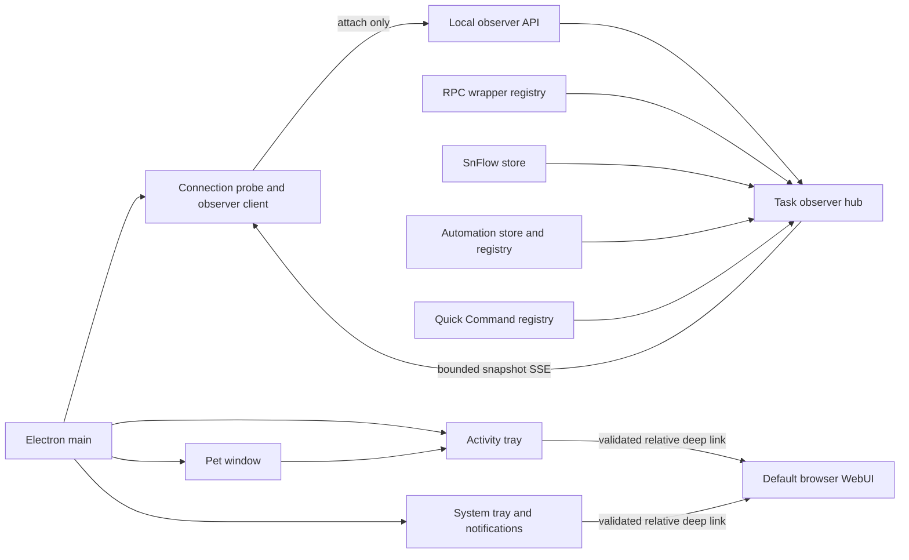
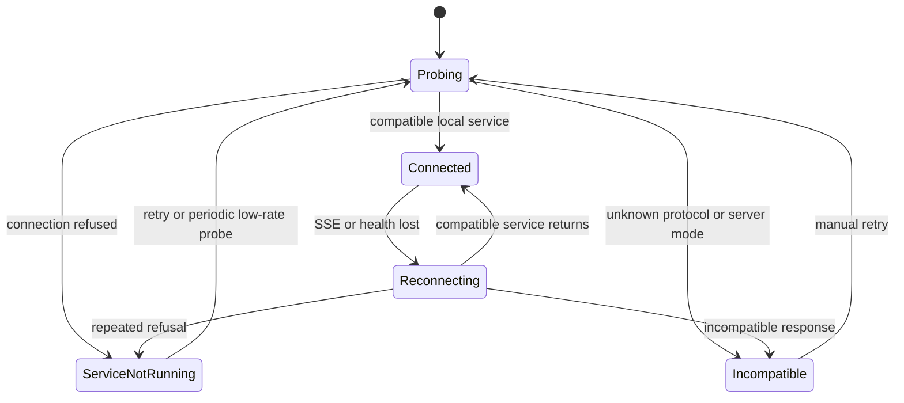

# Windows Desktop Pet Task Observer

- **Status:** Accepted (U1–U8 implemented; Windows clean-profile installer/signing matrix remains manual per validation doc)
- **Date:** 2026-08-12
- **Scope:** Windows-first independent Electron companion and local multi-project task observation
- **Requirements:** `docs/brainstorms/2026-08-12-desktop-pet-task-observer-requirements.md`

## Decision Summary

Add an independently launched Windows Electron companion that stays in the system tray, renders a transparent desktop pet plus a compact Activity tray, and connects to one already-running local Snail Pi Web service. It observes ordinary Agent activities, nested Subagents, SnFlow runs, Automation runs, and project Quick Command runs, then opens the existing WebUI in the default browser for detailed interaction.

The companion borrows the useful interaction model of Codex Pets rather than copying only its animation:

- the pet communicates the highest-priority ambient state;
- the Activity tray lists concrete activities across projects;
- desktop presentation uses `Running`, `Needs input`, `Ready`, and `Blocked`;
- unread/read state is desktop-local and independent of server task outcomes;
- notification priority is `Needs input > Blocked > Ready > Running`.

The first release deliberately does **not** manage the Snail Pi service lifecycle:

1. Probe the configured IPv4 loopback origin, default `http://127.0.0.1:62666`.
2. Attach only when health and observer protocol identify a compatible local-mode Snail Pi instance.
3. When connection is refused, show **Snail Pi service is not running**, a copyable `spi --no-open` command, setup guidance, and Retry.
4. When the port returns an unknown, incompatible, or server-mode service, show a diagnostic and Retry.
5. Never spawn, stop, restart, signal, supervise, or infer ownership of a service process.

Service auto-start/ownership is low-priority follow-up work. It requires a separate decision because packaging Next/pi/native modules and managing Windows process trees are unrelated to the core observer experience.

## Context

Ordinary Web sessions are represented by in-process `AgentSessionWrapper` instances in `lib/rpc-manager.ts`. Browser SSE listeners consume those wrappers but do not own execution. Closing the browser therefore removes a listener without inherently stopping the Agent. SnFlow and Automation persist richer run records; Quick Commands have an independent process-global registry and stable one-shot run lifecycle.

The current `AgentSessionWrapper` idle timer is reset by events and unconditionally destroys the wrapper ten minutes later. A long-running silent tool can therefore be disposed while still active. Reliable browser-independent observation first requires a server-owned prompt-activity projection and an idle policy based on actual settlement rather than listener presence or event silence.

A desktop process that polls every route or reads `~/.pi/agent` would duplicate storage logic, miss process-local ordinary and Quick Command state, and expand its privacy surface. The existing Next process remains authoritative and exports one bounded observer projection.

## Architecture



### Process boundary

- Snail Pi service and desktop pet are independent processes with independent startup/shutdown.
- Running `spi` does not launch the pet; starting the pet does not launch `spi`; opening WebUI launches neither.
- The Next.js process remains the only process that owns chat wrappers, SnFlow lifecycle, Automation scheduling, and Quick Command registries.
- Electron main owns observer networking, notification/read state, desktop lifecycle, native tray, single-instance behavior, and browser deep-link opening.
- Electron does not hold service child handles or PIDs and never sends process signals.
- The renderer owns presentation only. It runs with `nodeIntegration: false`, `contextIsolation: true`, sandbox enabled, blocked navigation, and a narrow preload bridge.
- Observer tokens, cwd and arbitrary URLs never enter the renderer.
- The desktop companion never imports server-side readers, stores, runners, or the pi SDK.

## Observation Domain

### Entity, activity and transition identity

A session or configured task is not the same as one execution. The protocol separates:

```text
Task entity
  taskKey       stable source-qualified entity identity

Task activity
  activityId    stable identity for one execution episode
  transitionId  stable identity for one meaningful state transition
```

| Source | `taskKey` | `activityId` |
| --- | --- | --- |
| Ordinary Agent | `agent:<sessionId>` | `<instanceId>:<sessionId>:<promptEpoch>` |
| SnFlow | `snflow:<projectKey>:<taskId>` | `<runId>` |
| Automation | `automation:<taskId>` | `<runId>` |
| Quick Command | `quick:<projectKey>:<commandId>` | `<runId>` |

`promptEpoch` increments on a new prompt-level lifecycle. Retries, compaction recovery and steer stay inside the current activity. Actual Pi event behavior for queued follow-ups must be characterized in tests.

### Three-axis authoritative state

```text
executionState
  queued | running | retrying | settled

outcome
  succeeded | failed | cancelled | interrupted | ambiguous | null

attention
  none | needs_input | review_ready | blocked
```

Attention may change without ending execution. Connection loss is never written into task state; Electron overlays stale/unknown until a reset snapshot arrives.

### Desktop presentation state

| State | Derivation |
| --- | --- |
| `Needs input` | any activity has `attention=needs_input` |
| `Blocked` | blocked attention or failed/interrupted/ambiguous outcome is unread |
| `Ready` | successful/cancelled terminal transition is unread locally |
| `Running` | queued/running/retrying activity exists |
| `Idle` | no active or unread activity |

Priority:

```text
Service not running / Disconnected
> Needs input
> Blocked
> Ready
> Retrying
> Running
> Idle
```

Opening an activity or marking it read stores the transition identity in desktop settings; it never mutates server records.

### Public snapshot

```text
TaskObserverSnapshot
  protocolVersion
  instanceId
  revision
  generatedAt
  reset
  truncation
  aggregate
    activeProjects
    activeActivities
    needsInput
    blocked
  projects[]
    projectKey
    displayName
    counts
    activities[]
  recentTransitions[]
  diagnostics[]
```

Each activity contains only:

| Field | Meaning |
| --- | --- |
| `taskKey`, `activityId` | Stable entity and execution identities. |
| `source` | `agent`, `snflow`, `automation`, or `quick_command`. |
| `projectKey`, `projectName` | Path-free project grouping and display. |
| `title` | Explicit user/task/command name or content-free `Agent #XXXXXX` fallback; never first Prompt. |
| `executionState`, `outcome`, `attention` | Three-axis state. |
| `phase`, `reasonCode` | Bounded safe codes, not arbitrary model/error text. |
| `progress` | Real counters/steps or indeterminate. |
| `sessionResources` | Optional Agent-only numeric context usage, lifetime billing/Token totals, and weighted TPS; no message content or per-call history. |
| `startedAt`, `updatedAt`, `endedAt` | Lifecycle timestamps where known. |
| `children` | Bounded active Subagent summaries. |
| `deepLink` | Allowlisted relative WebUI path. |
| `lastTransitionId` | Notification/read dedupe identity. |

The payload omits cwd, Prompt/firstMessage, messages/output, tool arguments, file paths/content, Quick Command text/env and raw errors.

### Transition identity and reset

Transition identity remains stable across snapshot rebuilds and persisted-source reloads:

```text
Agent:        agent:<instanceId>:<sessionId>:<promptEpoch>:<stateVersion>
SnFlow:       snflow:<runId>:<state>:<updatedOrEndedAt>
Automation:   automation:<runId>:<state>:<completedOrUpdatedAt>
QuickCommand: quick:<runId>:<state>:<endedOrUpdatedAt>
```

Only meaningful source changes increment revision. Heartbeats and wall-clock elapsed time do not. Numeric resource refreshes may change snapshot revision but retain the activity transition id, so billing/TPS/context updates never create task notifications. Initial connection, explicit reset, and changed `instanceId` establish a notification baseline without emitting notifications from that first snapshot.

## Source Mapping

| Source | Top-level activity | Authority | Notes |
| --- | --- | --- | --- |
| Ordinary Agent | Current prompt activity per live wrapper | New wrapper-owned lifecycle projection | Subagents nested; explicit session name or content-free short identifier; current session resources are cached at lifecycle boundaries. |
| SnFlow | Active/bounded recent terminal run | SnFlow store and terminal reducer | Matching ordinary host suppressed. |
| Automation | Active/bounded recent terminal run | Persistent run record + active registry | Preserve blocked/ambiguous meaning. |
| Quick Command | Active/bounded in-memory recent run | Quick Command registry | Exclude command/output/env/path; no restart recovery. |

### Ordinary Agent lifecycle

`AgentSessionWrapper` gains a bounded observation record and prompt epoch, updated at the raw event boundary before browser throttling:

- prompt dispatch / `agent_start` begins or confirms an activity;
- retry events update execution state;
- tool start/end tracks safe active tool names;
- blocking `extension_ui_request` projects `needs_input` without request text/options;
- urgent Subagent control projects attention;
- `agent_settled` is the normal terminal boundary;
- `prompt_error` becomes a safe classified failure.

Idle teardown starts only after the wrapper is genuinely settled with no active tools, Subagents or pending blocking UI. Observer subscribers do not count as chat SSE listeners and do not extend settled lifetime.

### SnFlow deduplication

Use existing `parentSessionId` and `parentToolCallId`. While a matching SnFlow activity is active, suppress the ordinary host row and attach safe host phase/Subagent details to the SnFlow row.

### Quick Command integration

Add a read-only summary/listener adapter to `lib/quick-command-runner.ts`. The observer receives command name, status and timestamps, never command text, resolved cwd, output, exit text or env.

## Observer Hub

Create one `TaskObserverHub` on `globalThis`.

Responsibilities:

- receive ordinary and Quick Command live invalidations;
- receive best-effort SnFlow/Automation invalidations after successful writes;
- reconcile persisted SnFlow/Automation state on snapshot build/startup;
- produce deterministic size-bounded snapshots and content revisions;
- maintain a bounded stable-transition ring;
- coalesce progress while immediately flushing retry/terminal/attention;
- isolate malformed source records without affecting execution.

Performance policy:

- progress snapshots at most every 500 ms;
- immediate terminal/attention/retry flush;
- initial limits: 50 projects, 200 activities, 20 transitions, 8 children/activity, 256 KiB encoded JSON;
- deterministic truncation metadata;
- elapsed time calculated in Electron;
- no unchanged snapshot emission.

## Local Observer API

| Route | Method | Purpose |
| --- | --- | --- |
| `/api/desktop-observer/protocol` | GET | Local product/protocol/mode compatibility. |
| `/api/desktop-observer/session` | POST | Issue short-lived observer token. |
| `/api/desktop-observer/snapshot` | GET | Current bounded snapshot. |
| `/api/desktop-observer/events` | GET | Full-snapshot SSE and heartbeat. |

### Gate

- Reuse/extract server-derived direct-loopback connection capture used by Automation.
- Require loopback TCP peer, IPv4 loopback Host/origin, and local service mode.
- Reject non-loopback forwarded identity. Server mode is attachable on proven loopback when the pet supplies a valid access key at session mint.
- `session` accepts exact verified origin or no Origin for Electron main.
- Store only token hash, expiry, instance id and loopback binding in memory.
- Read routes require a dedicated header and `Cache-Control: no-store`.
- Electron main uses `fetch` streaming because the token must not reach renderer/EventSource.
- Token expiry closes/denies the stream; remint establishes a reset baseline.
- Root server access authentication never relaxes the observer gate.
- `/api/health` remains task-metadata-free.

## Connection Lifecycle



### Service not running UX

When connection is refused:

- show a distinct `Service not running` pet state;
- show the configured origin and a copy button for `spi --no-open`;
- link to local startup instructions;
- provide Retry;
- optionally perform a low-rate bounded probe while visible/backgrounded;
- never execute the command, open a shell, spawn a service or request elevation.

When an unknown/incompatible response is returned, distinguish:

- port occupied by non-Snail-Pi service;
- observer protocol version mismatch;
- Remote (non-loopback) attach unsupported; server mode on loopback requires access key;
- temporary health/protocol failure.

Quitting or crashing the pet has no effect on the service or tasks.

## Deep Links

The server supplies relative links; Electron validates path/query allowlists before resolving against the verified origin.

| Source | First-release link |
| --- | --- |
| Ordinary Agent | `/?session=<sessionId>` |
| SnFlow | `/?session=<hostSessionId>&inspector=snflow&task=<taskId>` |
| Automation | `/?panel=automation&task=<taskId>&run=<runId>` |
| Quick Command | `/?panel=quick-commands&run=<runId>` while available; otherwise panel unavailable fallback. |

`AppShell` consumes each initial intent once. Reuse `WorkflowPanel.focusedTaskId` and `useAutomations.openRunWithDetails`. Query intent must not reopen a user-closed panel.

## Electron Companion

### Bundle shape

```text
desktop/
  main/
    main.ts
    observer-client.ts
    connection-state.ts
    activity-store.ts
    window-manager.ts
    tray-controller.ts
    notification-controller.ts
    settings-store.ts
    autostart.ts
  preload/pet-preload.ts
  renderer/
    index.html
    pet-app.tsx
    pet-state.ts
    pet.css
  assets/
    pets/<pet-id>/manifest.json
    tray/
forge.config.ts
```

The renderer is a dedicated small bundle. The desktop package contains the pet only; it does not bundle Next.js, pi SDK, Automation workers, node-pty or a Node sidecar.

### Pet and Activity tray

- Transparent, frameless pet surface with bounded expandable Activity tray.
- Click pet toggles tray; activity selection opens deep link and marks transition read locally.
- Group rows by project and sort Needs input, Blocked, Ready, Running, then update time.
- Multiple versioned built-in pet manifests map required states to assets/static fallback.
- Persist pet selection and position.
- Honor reduced motion and provide non-color state cues.
- Tray always offers show, disable click-through, Retry, Open WebUI and Quit.

### Main/preload security

- `nodeIntegration: false`, `contextIsolation: true`, sandbox enabled.
- Deny arbitrary navigation, windows, downloads, permissions and remote content.
- Preload exposes sanitized snapshots, local read actions, validated preferences/window commands, copy-start-command, Retry and validated deep-link requests.
- Main accepts only server-produced allowlisted relative links.
- Copy-start-command copies text only; it never executes or shells it.

### Notifications

- Notify for Needs input, Blocked and Ready according to settings.
- Completion policy: never/background-only/always; attention and blocked independent.
- Initial/reset/new-instance snapshot emits no notifications.
- Persist bounded acknowledged/notified transition LRU.
- Activity tray works when Windows notification permission is denied.

## Configuration and Persistence

Electron `userData` stores:

- window position and Activity tray state;
- selected built-in pet;
- always-on-top/click-through;
- notification settings;
- launch at login;
- configured loopback port;
- acknowledged/notified transition LRU.

Do not store observer tokens, service credentials/PIDs, prompts, output, cwd lists or task transcripts.

## Packaging and Distribution

Use Electron Forge for a **pet-only** Windows package. Release gates:

- Windows 10/11 clean-profile install/launch/uninstall;
- code signing before broad distribution;
- AppUserModelID and notification click activation;
- no Node.js requirement for the pet itself;
- no bundled Snail Pi server/runtime/native modules;
- uninstall preserves `~/.pi/agent` and does not affect installed/running `spi`;
- desktop installer is separate from the npm `spi` package.

Auto-update remains outside v1.

## Failure Semantics

| Failure | Desktop behavior | Server/task behavior |
| --- | --- | --- |
| No listener on configured port | Service not running + copy command/help/Retry | No effect |
| Unknown/incompatible port owner | Diagnostic + Retry | Never signal/replace owner |
| Observer SSE disconnect | Retain stale snapshot, reconnecting, suppress terminal inference | No effect |
| Token expires | Remint and baseline reset | No effect |
| Instance id changes | Reset; prior live-only work unknown/possibly interrupted | Persisted sources reconcile |
| Service exits | Service not running after bounded retries | Service tasks may be interrupted independently |
| Desktop exits/crashes | Desktop disappears | Service/tasks continue unchanged |
| Malformed source record | Omit item and report bounded diagnostic | Sibling tasks continue |
| Renderer crash | Recreate renderer; main observer remains alive | No effect |
| Quick Command link after service restart | Run-unavailable fallback | No reconstructed output/history |

## Testing Strategy

### Pure/domain tests

- entity/activity/transition identities, including two prompts in one session;
- three-axis mapping and desktop priority;
- SnFlow host dedupe;
- serialization proving no cwd/firstMessage/prompt/error/command/env/output;
- stable transition dedupe and local acknowledgement;
- connection-state machine for connected/not-running/incompatible/reconnecting;
- deep-link allowlist and settings validation.

### Server integration smokes

- one snapshot contains Agent, SnFlow, Automation and Quick Command across projects;
- closing browser SSE does not dispose active/silent Agent work;
- observer subscribers do not change chat SSE ownership;
- blocking extension UI becomes safe Needs input;
- source transitions invalidate hub;
- loopback/token/origin gates reject unauthorized access;
- `/api/health` stays metadata-minimal;
- snapshot obeys row/byte budgets and no time-only revision.

### Packaged Windows validation

- connect to separately started compatible `spi`;
- no service shows Service not running and copyable startup command;
- starting `spi` independently then Retry connects;
- unknown/incompatible/server-mode port shows correct diagnostic;
- quitting pet leaves service and tasks running;
- browser close does not stop observation;
- tray, click-through recovery, built-in pets, reduced motion and notifications work;
- clean profile pet install requires no global Node.

## Alternatives Rejected

- **Desktop auto-starts/manages service in v1:** high complexity from Next/pi/native packaging and Windows process ownership, with little impact on the core observation value. Deferred to a separate future feature.
- **Browser notifications/PWA only:** fails when browser/page is closed.
- **Desktop reads storage directly:** misses live state and duplicates sensitive parsers.
- **Per-session SSE:** scales with tasks and duplicates lifecycle wiring.
- **Expose details through public health:** violates the minimal health boundary.
- **Embed complete WebUI:** creates a second full client.
- **Single overloaded task state:** cannot model needs-input recovery and unread Ready.
- **Use cwd in observer payload:** unnecessary with project key and server deep link.

## Consequences

### Positive

- Delivers the useful Codex-style observer experience with substantially lower implementation and release risk.
- Desktop installation stays small and independent of Next/pi/native runtime packaging.
- Quitting or breaking the pet cannot terminate Agent/Automation/Quick Command execution.
- Correct multi-turn identity, unread semantics and minimal privacy surface.
- Existing WebUI and `spi` remain the sole execution/control surfaces.

### Costs

- Users must independently keep `spi` running.
- Start-at-login for the pet does not guarantee the service is available after login.
- First-release onboarding must clearly explain how to start Snail Pi.
- Service auto-start remains possible later, but requires a separate product decision and Windows runtime architecture.
- Ordinary Agent and Quick Command work remain non-resumable after service failure.
