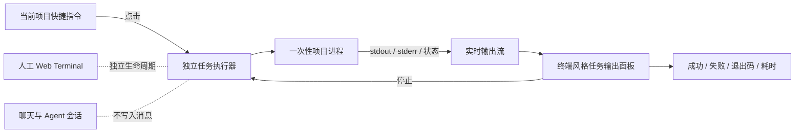

# 项目快捷指令与可见任务输出

## Problem Frame

用户经常需要在当前项目中重复执行编译、测试、代码生成或启动脚本。现有 Web Terminal 能提供完整交互式 Shell，但每次都需要手动打开终端、输入命令并自行判断是否完成；它也没有面向一次性项目任务的稳定状态、退出码、耗时、取消和重跑能力。

本功能要把这些高频操作沉淀为当前项目的快捷指令：用户从会话输入框上方打开项目指令列表，点击后由独立任务执行器在项目上下文中运行，并在专用的终端风格输出面板中实时显示日志和最终结果。快捷任务不注入人工 Web Terminal，也不进入聊天消息或 Agent 生命周期。

---

## Experience and System Boundary

该设计复用现有 Web Terminal 已验证的底部 Dock、ANSI 输出和实时流式展示体验，但不复用其交互式终端会话生命周期。快捷任务拥有独立的运行状态和进程控制。

---

## Actors

- A1. 项目用户：配置、选择、运行、查看或停止当前项目的快捷指令。
- A2. 快捷任务执行器：校验项目和指令定义，启动一次性进程，维护状态并转发有界输出。
- A3. Web 工作台：根据当前项目展示指令入口、运行状态和输出面板，不把任务混入聊天消息。

---

## Key Flows

- F1. 配置项目快捷指令
  - **Trigger:** 用户在当前项目首次配置或管理快捷指令。
  - **Actors:** A1, A3
  - **Steps:** 用户打开管理入口，填写名称、命令及必要选项，保存项目级配置；界面立即刷新当前项目的快捷指令列表。
  - **Outcome:** 指令仅在对应项目中可见，切换项目后不会错误沿用。
  - **Covered by:** R1, R2, R3, R4, R17

- F2. 执行并查看结果
  - **Trigger:** 用户从会话框上方选择一条快捷指令。
  - **Actors:** A1, A2, A3
  - **Steps:** 工作台按指令标识请求运行；执行器重新读取并校验项目配置；创建独立运行；输出面板实时展示日志、状态和耗时；进程结束后展示最终状态与退出码。
  - **Outcome:** 用户无需进入人工终端即可确认任务是否成功，并能查看完整的有界运行输出。
  - **Covered by:** R5, R6, R7, R8, R9, R10, R13, R14

- F3. 停止、收起和重新运行
  - **Trigger:** 任务正在运行，或用户查看一条已结束任务。
  - **Actors:** A1, A2, A3
  - **Steps:** 用户可以收起面板而不终止任务；可以显式停止运行中的任务；任务结束后可以重新运行相同指令；同项目同指令重复点击时，界面聚焦现有运行而不是无提示并发。
  - **Outcome:** 任务生命周期可控，不因 UI 收起或普通项目切换而意外终止。
  - **Covered by:** R8, R9, R11, R12, R15

- F4. 首次运行外部变更的指令
  - **Trigger:** 项目指令配置来自 Git、磁盘编辑或其可执行内容自上次确认后发生变化。
  - **Actors:** A1, A2, A3
  - **Steps:** 工作台展示完整命令、实际工作目录和环境变量名称；用户确认后才启动；后续仅在可执行配置再次变化时重新确认。
  - **Outcome:** 项目配置不能在用户无感知的情况下执行新命令。
  - **Covered by:** R16, R17

---

## Requirements

**项目配置与入口**

- R1. 快捷指令必须按规范化项目工作区隔离，并跟随当前 `activeCwd` 切换；同一项目的不同会话共享同一组指令，其他项目不得看到或运行该项目的指令。
- R2. 会话输入框上方应提供紧凑的“快捷指令”入口，并显示当前项目可用指令数量；无配置时应提供明确的首次配置入口，而不是空菜单。
- R3. 指令菜单应展示名称、可选描述和命令摘要，并提供管理入口；键盘、触屏和窄屏下均可完成选择与关闭操作。
- R4. 首版每条指令应支持：稳定标识、名称、命令、可选描述、项目内相对工作目录、可选环境变量覆盖、是否运行前确认、是否自动展开输出、启用状态和显示顺序。名称和命令为必填项。
- R5. 项目指令配置应属于项目目录，可随项目或 WorkTree 独立存在；是否纳入 Git 由项目自行决定。WebUI 应提供管理界面，不要求用户手工编辑文件。

**独立执行与状态**

- R6. 快捷任务必须由独立的一次性任务执行器运行，不得通过向现有 Web Terminal 注入键盘输入实现，也不得占用或污染用户的人工终端标签。
- R7. 浏览器发起运行时只能提交已保存指令的稳定标识和项目上下文；服务端必须重新读取并校验对应项目中的指令定义，不能执行请求体直接携带的任意命令文本。
- R8. 每次运行必须具有独立标识，并至少经历 `starting`、`running` 以及 `succeeded`、`failed`、`cancelled`、`timed_out` 之一的终态；终态应记录退出码或无法获得退出码的明确原因、开始时间和耗时。
- R9. 用户关闭或收起输出面板不得停止任务；用户应能显式停止运行，停止操作必须终止该任务拥有的进程树，避免留下编译器、测试进程或子 Shell。
- R10. 运行必须使用已授权的当前项目作为边界；工作目录必须解析在项目内部。指令应继承明确的 Shell 与基础环境策略，并仅叠加该指令配置的环境变量覆盖。
- R11. 同一项目的同一指令默认只允许一个活动运行；重复点击应聚焦现有运行并提示其状态。不同指令可以并行，但整体并发应受有界限制，达到上限时给出明确反馈。
- R12. 已结束的运行应支持一键重新运行；重新运行必须使用当时最新且通过校验的项目指令定义，而不是盲目复用旧命令文本。

**可见输出体验**

- R13. 点击指令后应立即出现运行反馈；当指令启用自动展开时，工作台应打开专用的底部任务输出面板，实时显示合并排序后的 stdout/stderr、当前状态和经过时间。
- R14. 输出面板应采用终端风格并正确展示常见 ANSI 颜色，同时提供运行标签切换、收起、停止、重新运行和清空已结束视图等操作；它应与人工 Web Terminal 在视觉上可区分。
- R15. 输出必须使用服务端有界缓冲；面板暂时断开或重新展开时可以恢复当前运行的近期输出和状态。单条异常大日志不得导致服务端或浏览器无限增长。
- R16. 任务完成后，会话框附近应保留简洁结果状态，至少包括指令名称、成功/失败/取消、耗时，并提供查看输出和重新运行入口；运行结果不得自动写入聊天消息或触发 Agent 回复。

**信任、安全与兼容性**

- R17. 首次执行来自项目磁盘的指令，或指令的命令、工作目录、环境变量等可执行内容发生变化后，必须进行信任确认；确认界面应展示完整命令、解析后的工作目录和环境变量名称，不显示已有秘密值。用户可为高风险指令配置每次运行前确认。
- R18. 快捷任务功能不应依赖人工 Web Terminal 面板当前是否打开，也不得改变现有聊天、Web Terminal、Automation 或 SnFlow 的生命周期。禁用或不可用的执行能力应产生可操作的错误状态，而不是静默失败。

---

## Acceptance Examples

- AE1. **Covers R1, R2, R5.** Given 项目 A 配置了“编译项目”，when 用户从项目 A 的任意会话打开快捷指令，then 可以看到该指令；when 切换到项目 B，then 不显示项目 A 的指令。
- AE2. **Covers R6, R8, R13, R16.** Given 用户点击“编译项目”，when 编译持续 20 秒并以退出码 0 结束，then 专用输出面板实时显示日志，最终显示成功、Exit 0 和耗时，人工 Web Terminal 不新增或修改任何标签。
- AE3. **Covers R8, R9.** Given 测试指令启动了父进程和多个子进程，when 用户点击停止，then 运行进入 `cancelled`，所属进程树被终止，输出面板保留停止前日志并展示取消状态。
- AE4. **Covers R11.** Given“编译项目”正在运行，when 用户再次点击同一指令，then 工作台聚焦现有运行并提示“正在运行”，不启动第二个编译；when 用户点击另一条“代码检查”，then 在未达到整体并发限制时可以并行执行。
- AE5. **Covers R7, R17.** Given 项目从 Git 拉取了一条新指令，when 用户首次点击，then 界面展示完整命令和实际工作目录并要求确认；浏览器不能通过修改请求体把该指令替换为未保存的其他命令。
- AE6. **Covers R12, R17.** Given 一次编译已经结束，且项目配置随后把命令从 `npm run build` 改为其他命令，when 用户点击重新运行，then 系统要求重新确认并执行最新定义，不执行旧命令。
- AE7. **Covers R15.** Given 一条任务持续输出大量日志，when 用户收起后重新展开输出面板，then 任务未中断，近期日志和当前状态可以恢复，服务端和浏览器内存仍受固定上限保护。
- AE8. **Covers R10, R18.** Given 指令把工作目录配置为项目外路径，when 用户尝试运行，then 服务端拒绝并展示可操作错误；聊天会话和人工 Web Terminal 保持不变。

---

## Success Criteria

- 用户能在不手工打开终端和输入命令的情况下，从当前项目会话区一键执行高频项目任务。
- 用户能实时看到任务进度，并可靠区分运行中、成功、失败、取消和超时，获得退出码与耗时。
- 快捷任务不会污染人工 Web Terminal 或聊天记录，收起 UI 也不会意外终止运行。
- 项目切换、外部配置变更、重复点击、超大输出和进程取消等边界均有明确且安全的行为。
- 后续实施计划无需再发明执行模式、主要交互、信任边界、状态模型或首版范围。

---

## Scope Boundaries

- 首版只面向有限时长、非交互式项目任务；登录、SSH、密码输入、交互式选择器和长期前台服务继续使用人工 Web Terminal。
- 首版不提供命令参数表单、任务依赖图、流水线编排、定时运行或 Automation 集成。
- 首版不自动导入或持续同步 `package.json` scripts、Makefile、Gradle Tasks 等外部任务目录；用户可以手工配置对应命令。
- 首版不提供跨项目全局快捷指令、组织级模板或远程命令市场。
- 首版不要求服务重启后恢复仍在运行的进程，也不要求持久保存完整历史日志；服务重启前的非终态运行可以明确标记为中断。
- 首版不把运行结果注入聊天上下文，也不让 Agent 自动解释失败日志。
- 快捷任务不是新的通用终端实现；人工交互、多标签 Shell 和自由输入仍由现有 Web Terminal 承担。

---

## Key Decisions

- 采用“独立任务执行 + 可见输出面板”，而不是直接向 Web Terminal 注入命令：确保可靠状态、退出码、取消和任务隔离。
- 输出默认可见而非后台静默：编译和测试可能耗时较长，用户需要实时确认进度和错误。
- 复用 Web Terminal 的 Dock/ANSI/SSE 体验，不复用其交互式 PTY 生命周期：减少视觉和基础能力重复，同时保持职责清晰。
- 指令按项目而非会话存储：同一项目多个会话共享，项目和 WorkTree 之间自然隔离。
- 运行请求使用保存后的指令标识，而非任意命令文本：缩小浏览器请求被篡改后的执行面。
- 对外部新增或已变更的可执行配置采用摘要信任确认，而非脆弱的危险关键词判断。
- 首版聚焦非交互式一次性任务；需要持续交互的命令仍进入人工 Web Terminal。

---

## Dependencies / Assumptions

- WebUI 服务运行在实际项目文件所在主机上，并具备启动本机子进程的权限。
- 当前项目已通过现有 allowed-roots/工作区授权机制，快捷任务不会扩大可访问项目范围。
- 现有 Web Terminal 的 Shell 与环境设置可以作为默认执行策略参考，但快捷任务不依赖 Terminal 面板挂载或已有终端会话。
- 用户理解项目级指令本质上能够执行本机代码；信任确认降低无感知执行风险，但不能把不可信项目命令变成安全命令。

---

## Outstanding Questions

### Deferred to Planning

- [Affects R4, R5, R17][Technical] 确定项目配置文件位置、版本格式、原子写入、并发修改检测和 Git 跟踪提示，并避免与 Pi/SnFlow 原生配置语义冲突。
- [Affects R6, R8, R9, R10][Technical] 选择跨 Windows/Unix 的一次性进程启动和进程树终止策略，明确 Shell 命令包装、信号、退出码和超时语义。
- [Affects R11, R15][Technical] 确定进程级运行注册表、全局/项目并发上限、输出字节上限、SSE 重连和服务重启后的中断投影。
- [Affects R2, R3, R13, R14, R16][Technical] 在 Composer 上方现有 Extension 状态/Widget 与底部 Terminal Dock 约束下确定组件归属、移动端展示和多个输出标签的协调方式。
- [Affects R17][Technical] 定义可执行配置摘要包含的字段、确认记录作用域和配置变化后的失效规则，确保不持久化环境变量秘密值。
- [Affects R18][Technical] 明确快捷任务功能开关与现有 Terminal enabled 设置的关系；推荐独立开关、共享默认 Shell 策略，以避免关闭人工终端时同时禁用快捷任务。
- [Affects R1-R18][Technical] 补充配置校验、路径越界、请求篡改、重复运行、取消进程树、输出截断、SSE 恢复、服务重启和中英文文案的自动化验证矩阵。

---

## Next Steps

-> /ce-plan for structured implementation planning
