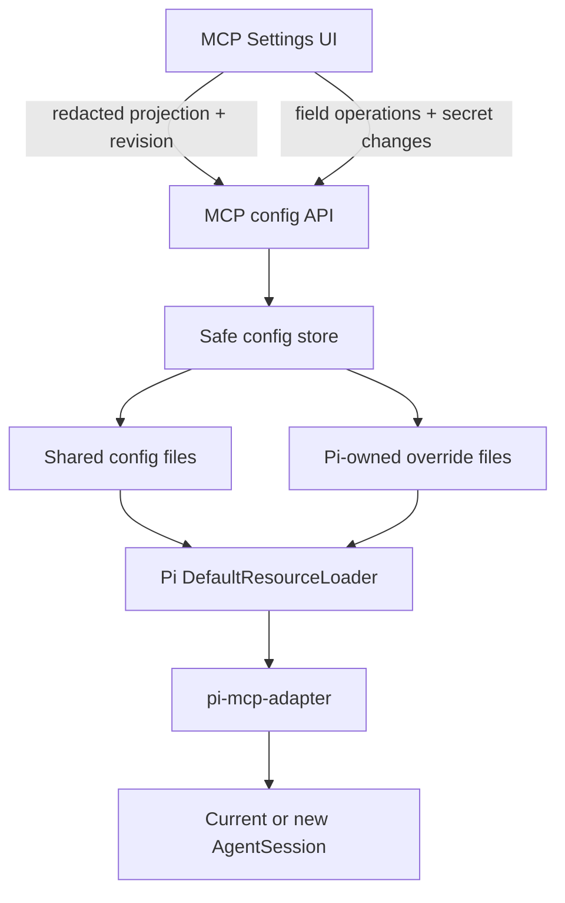
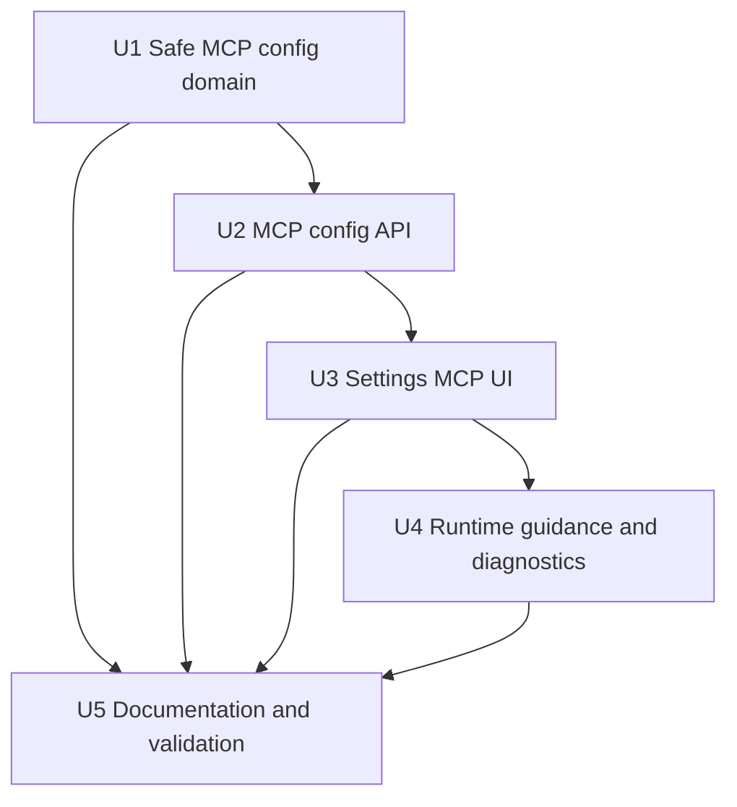
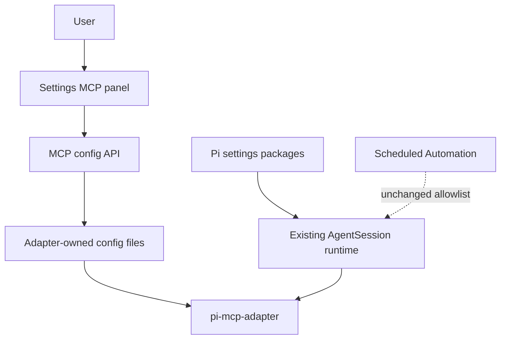

# feat: Add MCP configuration to WebUI settings

> Delivered in commit `0ea5a5b` (`feat(settings): add safe MCP configuration management`). The implementation lives in `lib/mcp-config.ts`, `app/api/mcp/config/route.ts`, and `components/McpConfig.tsx`; focused regression coverage is available through `npm run test:mcp`.

## Overview

在 Snail Pi Web 的 Settings 中增加独立的 **MCP** 配置页，管理 `pi-mcp-adapter` 已定义的标准 MCP 配置文件，而不是把 MCP 数据复制进 `pi-web.json`。用户可查看配置来源、在用户级或项目级添加/编辑/禁用服务器、设置 adapter 选项，并明确知道当前会话何时需要 `/reload`。

本设计以 `pi-mcp-adapter` 为运行时唯一来源：WebUI 负责安全编辑配置和展示诊断，不自行实现 MCP client，不复制 adapter 的连接、OAuth、缓存、工具注册或合并运行时。

---

## Problem Frame

当前 WebUI 的 Pi SDK 会通过 `DefaultResourceLoader` 加载 `settings.json` 中已配置的 Pi packages，因此用户安装 `npm:pi-mcp-adapter` 后，`mcp` proxy tool 已能进入普通 Web 会话；缺少的是适合 WebUI 的配置入口。adapter 自带 `/mcp` TUI/setup 流程，但 WebUI 不应依赖 TUI 面板来完成文件配置。

核心问题有三类：

1. adapter 支持六层配置来源和明确优先级，WebUI 不能另造一套存储。
2. MCP 配置包含命令、网络地址、headers、tokens 和可执行的 `!command` secret resolver，不能把完整配置无差别返回浏览器。
3. 配置保存与当前 AgentSession 的扩展生命周期不同步；自动重启所有同 cwd 会话会破坏现有 session lifecycle，不应隐式执行。

---

## Requirements Trace

- **R1.** Settings 增加独立 MCP 页，并支持当前工作区的项目级配置和用户全局配置。
- **R2.** 遵守 adapter 的原生配置路径与优先级，不在 `pi-web.json` 建立影子配置。
- **R3.** 支持 stdio、HTTP、rmcp-mux socket 三种互斥 transport，以及 adapter 2.15.0 文档中的常用 server/global settings。
- **R4.** 配置读取不得加载 adapter、连接服务器、启动子进程、执行 `!command` 或触发 OAuth。
- **R5.** 显式 secret 字段不返回明文；未修改的 secret 在保存时必须原样保留。
- **R6.** 写入必须限制在固定配置目标、使用 revision 冲突检测并原子落盘；解析错误时禁止覆盖。
- **R7.** UI 明确展示 adapter 是否已在 Pi packages 中配置，以及保存后的 `/reload` / 新会话生效规则。
- **R8.** 保留未知字段和 JSONC 注释，避免 WebUI 保存破坏 adapter 新版本或用户手写配置。

---

## Scope Boundaries

- 不在 WebUI 内实现 MCP transport、tool proxy、metadata cache、OAuth token store 或 output guard。
- 不自动安装/升级 `pi-mcp-adapter`；缺失时只显示安全提示和 `pi install npm:pi-mcp-adapter` 命令。
- 不在 v1 提供“连接测试”；连接可能执行本地命令或访问网络，继续由 adapter 的 `mcp({ connect })`、`/mcp reconnect` 和实际 tool call 承担。
- 不自动 destroy/recreate 当前 cwd 下的 AgentSession，也不修改 `globalThis.__piSessions` 生命周期。
- 不把 adapter 的 TUI `/mcp setup` 逐像素搬到 WebUI。
- 不在 v1 编辑 Cursor、Claude Code、Codex 等 host-specific 外部文件；只展示检测/导入配置项，并让 adapter 按 `imports` / `hostConfigDiscovery` 处理。
- 不为 Scheduled Automation 默认开放 MCP；Automation 继续遵守其独立的 approved-extension allowlist 和网络策略。

---

## Context & Research

### Relevant Code and Patterns

- `components/SettingsConfig.tsx`：Settings 左侧 section 导航与嵌入式独立设置面板模式。
- `components/AgentsConfig.tsx`：不属于 `pi-web.json` 的配置拥有独立 load/save/dirty/error 状态，可作为 MCP 页的主要 UI 模式。
- `lib/pi-subagent-settings.ts`：scope-aware 路径、revision hash、严格解析、surgical merge/delete、原子写入的直接参考。
- `lib/extension-settings.ts`：使用 `DefaultPackageManager.listConfiguredPackages()` 做只读 package 配置发现，不加载 extension。
- `lib/rpc-manager.ts`：普通 Web 会话已由 `DefaultResourceLoader` 加载配置 packages；无须为 MCP 建立第二套 session runtime。
- `app/api/web-config/route.ts` / `lib/pi-web-config.ts`：说明 MCP 不应混入 WebUI 自有配置。

### External References

- `pi-mcp-adapter` 2.15.0 文档：配置路径、precedence、server/settings schema、secret command、OAuth、direct tools、reload 语义和 runtime status contract。
- 本机已安装 package 源码确认：`MCP_STATUS_EVENT` 是只读 runtime snapshot；配置加载/合并 helper 不是 package export 的公共 API，因此 WebUI 不应直接依赖内部 `config.ts`。

---

## Key Technical Decisions

| 决策 | 选择 | 理由 |
| --- | --- | --- |
| 配置所有权 | adapter 原生文件 | 防止 `pi-web.json` 与 CLI/其他 host 配置漂移 |
| 默认写入目标 | 项目 `.mcp.json`、用户 `~/.config/mcp/mcp.json` | 符合 adapter 推荐的 shared config；高级页可选 Pi-owned override |
| Pi override | 项目 `.pi/mcp.json`、用户 `<Pi agent dir>/mcp.json` | 用于 `disabled`、`directTools` 等 Pi 特有覆盖，不污染 shared 文件 |
| 编辑协议 | revision + field operations，不做整份明文 JSON round-trip | 保留 secrets、未知字段和注释，并防止并发覆盖 |
| JSONC 保留 | 使用 JSONC AST edit 能力进行定点修改 | adapter 本身接受 comments；普通 JSON stringify 会造成破坏性重写 |
| runtime 应用 | 保存成功后提示 `/reload`，新会话自动生效 | 避免隐式销毁正在工作的 session；遵守 adapter 文档 |
| package 检测 | 只读 packages 配置，不 load extension | 配置页打开不能启动 eager server 或执行第三方代码 |
| runtime status | v1 不接入 Settings | adapter status 是 session-bound；配置页是 cwd/scope-bound，强行绑定会造成生命周期耦合 |

---

## Open Questions

### Resolved During Planning

- **MCP 是否写入 `pi-web.json`？** 否。adapter 原生配置文件是唯一事实来源。
- **WebUI 是否直接 import adapter 内部 config helper？** 否。`config.ts` 未公开 export，直接依赖会被 package 升级破坏。
- **保存后是否自动刷新当前会话？** 否。显示 reload 提示，避免破坏 session/fork invariants。
- **是否允许 UI 看到 token/header/env 明文？** 否。显式 secret 字段只返回 presence/masked projection，修改通过专门 secret operation 完成。

### Deferred to Implementation

- JSONC AST 编辑采用 `jsonc-parser` 或等价小型依赖，实施时以能稳定保留 comments/unknown fields 且满足 Next server bundling 为准。
- adapter package “configured but resolution failed”的精确诊断字段根据当前 Pi SDK `DefaultPackageManager` 返回结构确定；不得通过加载第三方 extension 探测。
- 配置文件中 command args 或 URL query 可能人为嵌入 secret，无法可靠启发式识别；v1 仅对 schema 明确的 secret-bearing 字段做强制遮蔽，并在 UI 显示风险提示。

---

## High-Level Technical Design

> *This illustrates the intended approach and is directional guidance for review, not implementation specification. The implementing agent should treat it as context, not code to reproduce.*

配置页只走 API → 文件路径；AgentSession 仍沿用现有 DefaultResourceLoader → adapter 路径。两条链只通过 adapter 配置文件相交。

### Supported configuration targets

| UI scope | Shared target | Pi override target | 默认 |
| --- | --- | --- | --- |
| User | `~/.config/mcp/mcp.json` | `<Pi agent dir>/mcp.json` | Shared |
| Project | `<cwd>/.mcp.json` | `<cwd>/.pi/mcp.json` | Shared |

其余只读来源 `~/.agents/mcp.json`、`~/.agents/mcp/mcp.json` 在“配置来源”中显示存在性、server 数量和优先级，但 v1 不直接写入。

### Browser-safe server projection

- 非敏感结构：name、transport、command、args、socket、cwd、url、lifecycle、timeouts、tool filters、directTools、debug/trace/disabled。
- secret-bearing map：`env.*`、`headers.*`、`bearerToken`、`oauth.clientSecret` 只返回键名和 `configured: true/false`，不返回值。
- OAuth 非 secret 元数据：auth mode、grant type、clientId、scope、redirectUri、client name/URI 可显示。
- 更新 secret 时采用三态：`preserve`、`replace`、`clear`。普通保存默认 `preserve`。

---

## Implementation Units

- [x] U1. **Build the safe MCP configuration domain**

**Goal:** 建立 adapter-compatible、scope-aware、secret-safe 的配置读取与定点写入层。

**Requirements:** R2, R3, R4, R5, R6, R8

**Dependencies:** None

**Files:**
- Create: `lib/mcp-config.ts`
- Create: `scripts/smoke-mcp-config.ts`
- Modify: `package.json`

**Approach:**
- 固定枚举四个 writable targets 和两个额外只读 shared sources；所有 project target 先 canonicalize cwd 并走 authorized workspace 校验。
- 解析 JSONC root、`mcpServers`、`settings`、`imports`；区分 missing、valid、parse-error，不在 parse-error 时回退覆盖。
- 建立与 adapter 2.15.0 公共文档对齐的本地 wire types 和 validators，但保留未知字段。
- 写 API 接收 field-level operations，通过 JSONC AST edits 修改目标路径；same-directory temp + rename 原子落盘。
- revision 基于目标文件原始 bytes；写前比较，冲突返回明确错误。
- 读取 projection 时遮蔽所有明确 secret-bearing values；日志与 validation error 不包含请求中的值。
- 对 transport 执行“恰好一个 command/url/socket”校验；允许 adapter 文档支持的 env interpolation 和 `!command`，但标记 executable-secret risk。

**Patterns to follow:**
- `lib/pi-subagent-settings.ts` 的 scope、revision、parse-error、atomic write 模式。
- `lib/allowed-roots.ts` 的 cwd authorization。
- `lib/pi-web-config.ts` 的 strict public projection + unknown raw preservation。

**Test scenarios:**
- Happy path：missing project `.mcp.json` 添加 stdio server 后创建合法 JSONC/JSON，read projection 能还原非敏感字段。
- Happy path：分别写入 HTTP、socket server，transport 字段和 advanced settings 保持正确。
- Edge case：原文件包含 comments、未知 root/server 字段，修改 lifecycle 后 comments 与未知字段仍保留。
- Edge case：headers/env/token 已存在但 UI 不修改，保存其他字段后 secret bytes 保持不变且 GET 不出现明文。
- Error path：同一 server 同时设置 command 与 url 时拒绝写入，原文件不变。
- Error path：revision 已变化时返回 conflict，绝不覆盖磁盘新内容。
- Error path：目标文件 JSONC 无法解析时返回 parse error，禁止任何 mutation。
- Security：读取和校验包含 `!command` 的配置不会执行命令；用 sentinel file 证明无副作用。
- Security：伪造 target/path/cwd 不能写到四个固定目标之外。

**Verification:**
- smoke script 覆盖 paths、redaction、preservation、conflict、atomicity 和 no-execution invariants。

---

- [x] U2. **Expose a local MCP configuration API**

**Goal:** 为 Settings 提供 browser-safe 的 discovery/read/update contract。

**Requirements:** R1, R4, R5, R6, R7

**Dependencies:** U1

**Files:**
- Create: `app/api/mcp/config/route.ts`
- Modify: `scripts/smoke-mcp-config.ts`
- Modify: `docs/modules/api.md`

**Approach:**
- `GET` 接受 `cwd`、scope、target，返回 package configured 状态、固定 precedence source summaries、selected target projection、revision、parse diagnostics 和 adapter version（能静态解析时）。
- package 检测只读取 Pi package 配置；禁止使用 `DefaultResourceLoader.reload()`，避免打开页面即执行 package/eager servers。
- `PUT` 接受 target、revision 和受限 operation 列表，调用 U1 store；不接受任意绝对路径或完整明文文件替换。
- 返回 `reloadRequired: true` 和适合 UI 展示的简短原因；不触碰 session registry。
- API error 仅返回字段路径/错误类型，不回显 secret value 或完整请求体。

**Patterns to follow:**
- `app/api/subagents/config/route.ts` 的 project/user scope 和 conflict handling。
- `app/api/web-config/route.ts` 的 validation error → 400 映射。

**Test scenarios:**
- Happy path：GET 返回当前 cwd 四个目标的存在性、正确路径标签和 redacted selected projection。
- Happy path：PUT 添加/更新/删除 server 或 settings 后返回新 revision 与 `reloadRequired`。
- Edge case：adapter 未配置时 GET 仍返回可编辑配置与安装提示状态，不报 500。
- Error path：无 cwd 的 project scope、未授权 cwd、未知 target、未知 operation 分别返回 400/403 类错误且不写文件。
- Error path：parse error 与 revision conflict 使用可区分的稳定错误 code。
- Security：API response/body diagnostics 不包含测试 token、header 或 env secret。

**Verification:**
- route contract 可由 smoke harness 直接调用核心 handler/store 验证；浏览器 network response 不出现 secret 明文。

---

- [x] U3. **Add the MCP Settings experience**

**Goal:** 提供可理解多来源配置、无需手写 JSON 的 MCP 管理界面。

**Requirements:** R1, R3, R5, R7

**Dependencies:** U2

**Files:**
- Create: `components/McpConfig.tsx`
- Modify: `components/SettingsConfig.tsx`
- Modify: `lib/i18n/messages/settings.ts`
- Modify: `docs/modules/frontend.md`

**Approach:**
- 按 `AgentsConfig` 模式让 MCP 页拥有独立 load/save/dirty/conflict/error 状态，不加入 `SettingsConfig` 的 `pi-web.json` 总保存 payload。
- 顶部显示 adapter package 状态；缺失时给出手动安装命令，不提供一键执行第三方 package。
- 提供 User/Project scope 和 Shared/Pi override target 切换，并展示 adapter precedence source list、存在性、server count、parse/conflict warnings。
- Server cards 支持新增、编辑、删除；transport 使用 stdio/HTTP/socket 三选一；advanced accordion 提供 lifecycle、timeout、resources、direct tools、include/exclude、auth、debug/trace、disabled。
- headers/env/token/clientSecret 使用 masked rows 和 Preserve/Replace/Clear 交互；普通字段保存不能意外清空 secret。
- settings 区支持 toolPrefix、timeouts、hostConfigDiscovery、directTools、disableProxyTool、autoAuth、sampling、samplingAutoApprove、elicitation、outputGuard 和 trace。
- 对 `!command`、sampling auto-approve、host discovery=on、output guard=false、eager/keep-alive 显示就地风险说明。
- 保存后显示“新会话自动生效；当前会话运行 `/reload`”，不自动关闭 Settings 或重启 session。

**Patterns to follow:**
- `components/AgentsConfig.tsx` 的独立配置生命周期。
- `components/SettingsConfig.tsx` 的 section button、Field、ToggleField 和 responsive modal。
- `components/ExtensionsConfig.tsx` 的 diagnostics/resource presentation。

**Test scenarios:**
- Happy path：项目 shared target 新增 stdio server，填写 args/env 并保存，重载面板后非敏感字段存在、env value 仍 masked。
- Happy path：HTTP OAuth server 配置 grant/client/scope 后保存，clientSecret 默认 preserve。
- Happy path：对 inherited server 选择禁用时，明确切换到 project Pi override 并写 `disabled: true`，不改来源文件。
- Edge case：切换 scope/target 时有 dirty state，UI 阻止静默丢弃并要求确认。
- Edge case：窄屏下 scope、server list、advanced fields 可纵向使用，无横向溢出阻断操作。
- Error path：409 conflict 后保留本地表单，提供 Reload/重新应用选择，不覆盖他人修改。
- Error path：目标 parse error 时展示文件路径和错误，所有保存按钮 disabled。
- Security：浏览器 DOM、React state 初始化数据和 network response 中不存在已有 secret 明文。

**Verification:**
- Settings 左侧可进入 MCP；项目/用户目标切换、server CRUD、secret 三态和 reload 提示均可手动完成。

---

- [x] U4. **Clarify runtime activation and package diagnostics**

**Goal:** 让用户准确理解“已配置”和“当前会话已加载”的区别，同时保持现有 runtime 不变。

**Requirements:** R4, R7

**Dependencies:** U3

**Files:**
- Modify: `components/McpConfig.tsx`
- Modify: `lib/i18n/messages/settings.ts`
- Modify: `docs/integrations/README.md`

**Approach:**
- 将状态拆分为：package 未配置、package 已配置但尚未确认当前 session、配置文件已保存需 reload。
- package 已配置时说明普通 Web sessions 会经现有 `DefaultResourceLoader` 自动获得 `mcp` proxy tool；不新增 extension factory，也不把 adapter 加入 WebUI custom tools。
- 提供 copyable 命令/指导：安装、`/reload`、`mcp({})`、`mcp({ connect: "server" })`；不从 Settings 后端代替用户执行。
- 若未来接入 `MCP_STATUS_EVENT`，作为单独 follow-up 的 session-bound status feature，不塞进配置 store/API。

**Patterns to follow:**
- `components/ExtensionsConfig.tsx` 的 package/diagnostic vocabulary。
- `lib/rpc-manager.ts` 当前 package resource loading lifecycle。

**Test scenarios:**
- Happy path：package 已配置时显示 adapter ready 与 reload guidance。
- Edge case：package 未配置、配置存在时同时显示“配置已保存但 runtime 不可用”，不误报 connected。
- Edge case：package 配置项存在但静态版本无法解析时显示 unknown version，不尝试 import/execute package。

**Verification:**
- 所有状态文案都不把“配置存在”误称为“server connected”，也不暗示 Settings 已执行命令或网络请求。

---

- [x] U5. **Complete documentation and regression validation**

**Goal:** 固化 MCP 配置边界、文件归属和验证入口。

**Requirements:** R1–R8

**Dependencies:** U1, U2, U3, U4

**Files:**
- Modify: `AGENTS.md`
- Modify: `docs/modules/api.md`
- Modify: `docs/modules/frontend.md`
- Modify: `docs/modules/library.md`
- Modify: `docs/integrations/README.md`
- Modify: `docs/standards/code-style.md`
- Modify: `package.json`
- Test: `scripts/smoke-mcp-config.ts`

**Approach:**
- 文档明确 adapter 是 runtime owner、WebUI 是 config editor，列出四个 writable targets、precedence、secret policy 和 reload semantics。
- 将 `npm run test:mcp` 加入 targeted smoke commands，并保持常规 lint/type-check 基线。
- 记录 Automation 不继承此交互式 MCP 配置的安全边界。

**Test scenarios:**
- Integration：运行 MCP smoke 后，所有 fixture/temp config 被清理，不污染真实 home、agent dir 或项目配置。
- Integration：常规 type-check 能验证 API wire types、component projection 与 config domain 同步。
- Regression：现有 `pi-web.json` round-trip 不增加 `mcp` root key，legacy unknown-key preservation 不变。
- Regression：普通 session 未配置 adapter 时仍正常启动；配置 adapter 时继续由 resource loader 只加载一次。

**Verification:**
- 文档和代码对配置路径、scope、reload、secret、安全边界的描述一致。

---

## System-Wide Impact

- **Interaction graph:** Settings 只修改 adapter 文件；下一次 session start 或显式 `/reload` 由既有 `rpc-manager` loader 读取 package/config。
- **Error propagation:** parse/validation/conflict 由 store → API stable code → MCP panel；不得降级为覆盖损坏文件。
- **State lifecycle risks:** 当前 session 可能继续使用旧 config，这是显式允许的 stale state；UI 必须展示 reloadRequired。
- **API surface parity:** Web Terminal、Automation、SnFlow 均不应从 `pi-web.json` 读取 MCP；普通 chat session 是 v1 唯一 runtime consumer。
- **Integration coverage:** 需验证 package configured/unconfigured、项目/用户 scope、secret preserve 和 session reload 指引的跨层行为。
- **Unchanged invariants:** 一个 session id 一个 wrapper、fork 后销毁旧 wrapper、Automation extension allowlist、unknown `pi-web.json` root preservation 均不改变。

---

## Risks & Dependencies

| Risk | Mitigation |
| --- | --- |
| WebUI schema 落后于 adapter 新字段 | 保留未知字段；文档注明以 adapter 为 runtime authority；避免 import 私有 `config.ts` |
| 配置读取泄漏 credential | 明确字段强制 redaction；secret 三态 patch；错误不回显请求值 |
| 修改 URL 后继承旧 credential | field operations 必须复现 adapter 的 URL-bound credential clearing 安全语义，或在 URL 变更时要求显式重新确认 auth fields |
| JSONC 修改破坏 comments/手工格式 | AST 定点编辑 + fixture regression，不做整份 stringify |
| 打开 Settings 意外启动 eager MCP | package discovery 只读 settings/package metadata，禁止 resource loader reload/import |
| 保存后用户误以为当前会话已更新 | 永久显示 reloadRequired；不展示伪 runtime connected 状态 |
| shared config 影响其他 MCP hosts | 清晰标注 Shared；Pi-only 行为建议写 override；删除/覆盖前展示目标路径 |
| `!command` 在后续连接时执行任意命令 | 保存时不执行；UI 风险标记；不提供自动 connect/test |
| Windows/macOS/Linux 路径差异 | 只用 adapter 文档定义的固定 home/cwd 路径和 Node path APIs；socket UI 在不支持平台仍可编辑但标注 runtime 约束 |

---

## Alternative Approaches Considered

- **把 MCP 放进 `pi-web.json` 并用 `createMcpAdapter({ config })` 注入 session：拒绝。** isolated SDK config 会跳过 adapter 原生 merge/import/files，造成 CLI 与 WebUI 两套事实来源，并可能与已安装 package 重复注册工具。
- **直接编辑整份 raw JSON：拒绝作为默认方案。** 会把 secrets 发到浏览器、容易覆盖 comments/unknown fields，也难以提供安全的 preserve semantics。
- **直接 import `pi-mcp-adapter/config.ts`：拒绝。** package exports 没有公开该子路径，内部 API 不稳定，且 standalone TypeScript source loader 对 Next bundling 形成额外耦合。
- **保存后自动重启同 cwd 全部 sessions：拒绝。** 会破坏用户正在运行的会话和现有 lifecycle invariants；显式 `/reload` 更安全。
- **WebUI 一键安装 adapter：延期。** Pi package 可执行第三方代码，安装属于供应链信任决策；v1 只提供检测和明确命令。

---

## Documentation / Operational Notes

- 发布说明应标注 `pi-mcp-adapter` 是可选 Pi package，不是 Snail Pi Web 内置 transport。
- Settings 文案使用中英文 i18n，不把 bearer/OAuth secret 存入 `pi-web.json`、localStorage 或 session JSONL。
- MCP 配置/工具不自动进入 Scheduled Automation；若未来支持，需要独立 threat model、allowlist snapshot 和 network policy 设计。

---

## Sources & References

- [pi-mcp-adapter package documentation](https://pi.dev/packages/pi-mcp-adapter?name=mcp)
- `components/SettingsConfig.tsx`
- `components/AgentsConfig.tsx`
- `lib/pi-subagent-settings.ts`
- `lib/extension-settings.ts`
- `lib/rpc-manager.ts`
- `docs/integrations/README.md`
