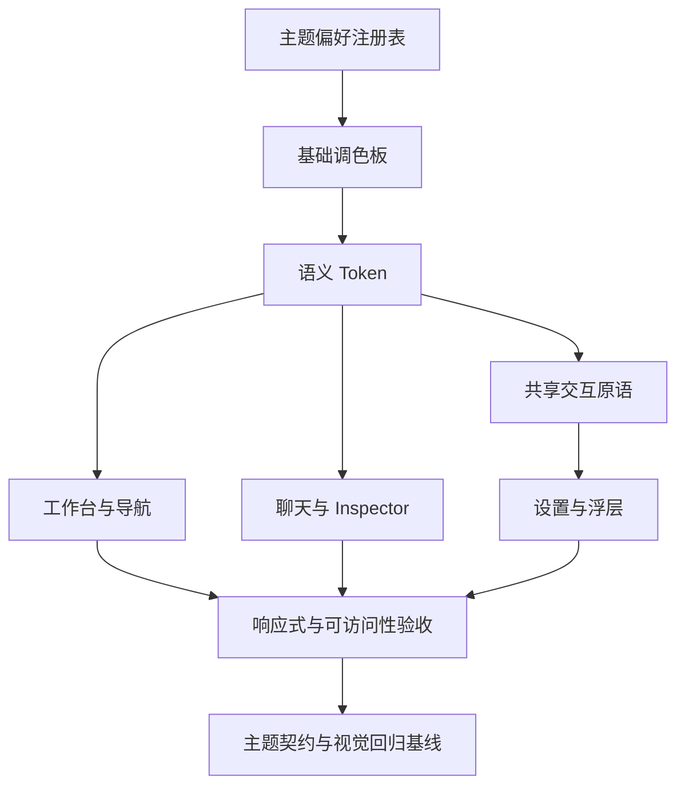
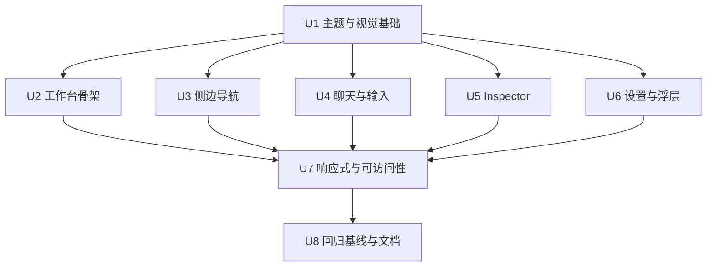
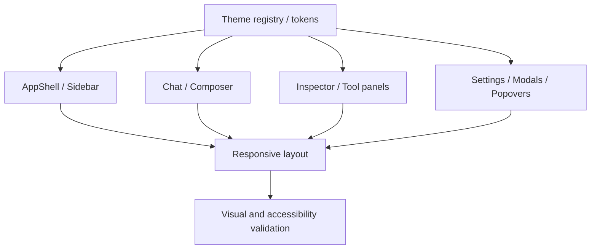

# refactor: 统一前端视觉系统并完成主题细节优化

> Iteration 1–8 全部完成。Iteration 8 浏览器矩阵与代表主题确认见 `docs/operations/ui-visual-validation-results-2026-08-10.md`。

## Overview

当前分支已经完成 Concept-B 工作台的第一轮视觉重构：三栏卡片式工作台、中心上下文栏、观察条、Inspector、多主题皮肤，以及侧边栏信息层级调整已经落地。后续工作不应再推翻现有方向，而应围绕“统一、收口、补齐、验证”继续优化。

本文件调整为总路线图：保留原有 8 个模块的需求、技术决策和验收标准，再拆分为 8 个可独立交付的迭代计划。每次只执行一个迭代，迭代完成并通过验收门后再进入下一阶段，避免一次改动横跨全部前端表面。

### 模块与优先级

| 优先级 | 模块 | 主要目标 | 主要代码范围 |
| --- | --- | --- | --- |
| P0 | 视觉基础与主题 Token | 统一颜色、层级、圆角、阴影、状态色和交互态语义 | `app/globals.css`, `lib/theme.ts`, `hooks/useTheme.ts`, `components/ThemePicker.tsx` |
| P0 | 工作台骨架与顶部上下文栏 | 收口三栏布局、响应式断点、信息密度和工具入口 | `components/AppShell.tsx`, `app/globals.css` |
| P0 | 左侧工作区与会话导航 | 完善工作区卡片、新建会话、搜索、会话状态和 Explorer 层级 | `components/SessionSidebar.tsx`, `components/sidebar/*` |
| P1 | 聊天消息与输入区 | 统一消息卡片、工具调用、流式状态、空态和 Composer 控件 | `components/ChatWindow.tsx`, `components/MessageView.tsx`, `components/ChatInput.tsx` |
| P1 | Inspector 与开发工具面板 | 统一 Changes/Preview/Git/SnFlow/Agents 的标题、标签、列表和空态 | `components/InspectorChangesPanel.tsx`, `components/GitPanel.tsx`, `components/WorkflowPanel.tsx`, `components/SubagentPanel.tsx`, `components/FileViewer.tsx` |
| P1 | 设置、配置与浮层体系 | 统一表单、开关、按钮、弹窗、下拉菜单、错误/警告提示 | `components/SettingsConfig.tsx`, `components/ModelsConfig.tsx`, `components/McpConfig.tsx`, `components/AppDialogProvider.tsx`, `components/ExtensionDialogHost.tsx` |
| P1 | 响应式、可访问性与动效 | 补齐移动端、键盘、焦点、对比度、减弱动效和触控状态 | 以上高频组件及 `app/globals.css` |
| P2 | 视觉回归与文档 | 固化主题契约、视口矩阵、手工验收清单和维护规则 | `scripts/`, `docs/modules/frontend.md`, `docs/operations/` |

### 迭代路线图

| 迭代 | 交付主题 | 对应总规划单元 | 依赖 | 状态 | 独立计划 |
| --- | --- | --- | --- | --- | --- |
| Iteration 1 | 主题基础与语义 Token | U1 | 无 | 已完成 | [`2026-08-01-002-refactor-theme-foundation-plan.md`](./2026-08-01-002-refactor-theme-foundation-plan.md) |
| Iteration 2 | 工作台骨架与左侧导航 | U2, U3 | Iteration 1 | 已完成 | [`2026-08-01-003-refactor-workbench-shell-navigation-plan.md`](./2026-08-01-003-refactor-workbench-shell-navigation-plan.md) |
| Iteration 3 | 聊天消息与 Composer | U4 | Iteration 1；建议在 Iteration 2 后实施 | 已完成 | [`2026-08-01-004-refactor-chat-visual-system-plan.md`](./2026-08-01-004-refactor-chat-visual-system-plan.md) |
| Iteration 4 | Inspector 与开发工具面板 | U5 | Iteration 2 | 已完成 | [`2026-08-01-005-refactor-inspector-visual-system-plan.md`](./2026-08-01-005-refactor-inspector-visual-system-plan.md) |
| Iteration 5 | 设置原语、Settings 外壳与共享 Dialog | U6（第一部分） | Iteration 1 | 已完成 | [`2026-08-01-006-refactor-settings-primitives-plan.md`](./2026-08-01-006-refactor-settings-primitives-plan.md) |
| Iteration 6 | MCP 与 Agents 配置面板迁移 | U6（第二部分） | Iteration 5 | 已完成 | [`2026-08-01-007-refactor-mcp-agents-settings-plan.md`](./2026-08-01-007-refactor-mcp-agents-settings-plan.md) |
| Iteration 7 | Models、Extensions 与 Skills 复杂面板迁移 | U6（第三部分） | Iteration 5；建议在 Iteration 6 后实施 | 已完成 | [`2026-08-01-008-refactor-resource-config-surfaces-plan.md`](./2026-08-01-008-refactor-resource-config-surfaces-plan.md) |
| Iteration 8 | 响应式、无障碍与视觉回归收口 | U7, U8 | Iteration 2–7 | 已完成 | [`2026-08-01-009-refactor-ui-quality-regression-plan.md`](./2026-08-01-009-refactor-ui-quality-regression-plan.md) |

### 迭代执行规则

- 每个迭代都是独立验收和独立交付边界；未通过当前迭代验收门时，不继续批量迁移下一模块。
- Iteration 1 是全部后续工作的基础；Iteration 3 与 Iteration 5 可在 Iteration 1 后并行规划，但同一工作区仍保持单一写入者。
- Iteration 6 与 Iteration 7 共享 Settings 原语，但不互相修改对方业务组件；如原语需要扩展，先回补 Iteration 5 的契约和文档。
- Iteration 8 只做跨模块组合检查与必要修复，不承接前面迭代遗漏的大规模视觉迁移。
- 各子计划的 U-ID 仅在子计划内有效；本文件原有 U1–U8 继续作为模块级追踪编号，不重编号。

---

## Problem Frame

近期提交 `c3038aa`、`63a4fa6`、`38033c8` 已经确立新视觉方向，但当前实现仍处于“新工作台样式覆盖在历史样式之上”的过渡阶段：

- `app/globals.css` 已达到约 2600 行，包含 184 处 `!important`、两套语义命名（如 `--bg-panel` 与 `--bg-card`、`--border` 与 `--line`）以及多处组件定向覆盖。
- Concept-B 样式集中追加在文件后部，而旧的桌面/移动端和弹窗规则仍位于前部；断点与层级规则分散，后续修改容易产生优先级冲突。
- `components/AppShell.tsx`、`components/ChatInput.tsx`、`components/MessageView.tsx` 等高频路径仍大量使用内联样式和事件中直接修改 style，主题交互态难以统一。
- 设置类界面视觉债务更明显：`SettingsConfig.tsx`、`ModelsConfig.tsx`、`McpConfig.tsx` 各自维护大量相似表单样式，新增主题时难以保证一致。
- 11 个主题偏好已经注册，但目前缺少主题 Token 完整性检查和固定的跨主题、跨视口验收矩阵。
- 新增 Inspector/Observe Bar 中仍有硬编码中英文标签，状态提示、空态和面板标题的视觉与文案规范尚未收口。

因此，后续优化重点应从“继续添加局部 CSS”转向“建立稳定语义层并按用户路径逐块迁移”，避免一次性重写全部历史组件。

---

## Requirements Trace

- R1. 保留现有 Concept-B 三栏工作台方向和已经完成的业务交互，不重新设计信息架构。
- R2. 统一所有主题偏好的基础颜色与语义 Token，使组件不依赖某个特定主题的硬编码颜色。
- R3. 桌面、窄桌面和移动端布局在固定断点下行为明确，Sidebar、Chat、Inspector 不互相挤压或遮挡关键操作。
- R4. 优先优化会话选择、阅读消息、执行工具、输入消息、查看变更等高频路径。
- R5. 设置、模型、MCP、弹窗和下拉菜单复用一致的表单与浮层视觉语言。
- R6. Hover、Focus、Active、Disabled、Loading、Success、Warning、Danger 等状态在鼠标、键盘和触控场景下均可识别。
- R7. 建立无需依赖主观记忆的主题契约检查和可执行的人工视觉回归清单。
- R8. 采用渐进式迁移，不进行与视觉优化无关的业务重构，不破坏现有本地存储键、会话生命周期和 API 契约。

---

## Scope Boundaries

- 不新增另一套工作台概念，也不恢复旧的顶部全宽工具栏。
- 不改变会话、Git、SnFlow、Automation、MCP、终端等业务行为或 API。
- 不在一个变更中清理全仓所有内联样式；仅迁移本规划覆盖的高频模块和明确重复的视觉模式。
- 不引入 DaisyUI、Material UI、Ant Design 等新 UI 框架；继续使用现有 CSS 变量、Tailwind 4 和局部 React 组件模式。
- 不新增主题皮肤；先保证现有 `system/light/dark/paper/graphite/ocean/forest/twilight/night/daisy-dark/dracula` 一致可用。
- 不重做 Monaco、xterm、Mermaid、KaTeX 等第三方渲染器内部 UI，仅保证其明暗模式和容器表面与当前主题兼容。
- 不把纯视觉优化扩大为完整 i18n 重构；只迁移本次触及的新工作台硬编码文案。

### Deferred to Follow-Up Work

- 自动截图差异平台：仓库当前没有 Playwright/浏览器 E2E 基础设施，先建立主题契约脚本和人工截图矩阵；是否引入截图测试框架在完成第一轮基线后单独评估。
- 全仓历史组件的内联样式清零：仅在高频路径迁移稳定后，再按模块持续收敛。

---

## Context & Research

### Relevant Code and Patterns

- `app/globals.css` 已提供基础 Token、Concept-B 语义别名、主题皮肤、响应式 Drawer、共享 resize handle 和 `.pi-modal-*` 响应式规则，是本轮收口的主入口。
- `lib/theme.ts` 是主题枚举与明暗模式的唯一注册表；`app/layout.tsx` 从该注册表生成首屏主题脚本，必须继续避免首屏闪烁。
- `hooks/useTheme.ts` 已处理系统主题变化、View Transition 与 `prefers-reduced-motion`，后续只扩展契约，不另建主题状态源。
- `components/ThemePicker.tsx` 已有键盘方向键/Home/End 交互，可作为浮层键盘行为的参考。
- `components/AppDialogProvider.tsx` 和 `.pi-modal-*` 已形成共享弹窗方向，设置/配置界面应向该模式靠拢，而不是继续创建新的 Overlay 变体。
- `components/SessionSidebar.tsx` 已拆分为 `components/sidebar/*`，适合按工作区、会话列表、归档、Explorer 分块优化。
- `docs/modules/frontend.md` 已记录 Concept-B、主题与响应式断点约束，实施后需要同步更新，而不是另建重复的架构说明。

### Institutional Learnings

- 仓库没有 `docs/solutions/` 下的既有视觉规范；本规划以当前实现、原型 `tmphtml/concept-b-workbench.html` 和前端模块文档为依据。
- 项目没有完整前端测试框架，现行标准是 lint、TypeScript 检查、领域 smoke 脚本和浏览器人工验证。

### External Research

- 本次工作沿用仓库已经建立的 Next.js/React/Tailwind/CSS 变量模式，不引入新框架或外部契约；本地模式足够明确，本规划不依赖外部资料。

---

## Key Technical Decisions

| 决策 | 选择 | 原因 |
| --- | --- | --- |
| 主题架构 | 保留一个主题注册表，增加完整的语义 Token 层 | 防止 `ThemePicker`、首屏脚本和 CSS 皮肤名单漂移 |
| 样式迁移 | 按用户路径渐进迁移到语义 class，保留真正动态的内联值 | 避免一次性重写大组件，同时消除 hover 事件直接改 style 的分叉 |
| 组件抽象 | 先稳定 Token/状态规范，再提取表单和浮层小组件 | 防止过早抽象出另一套不稳定设计系统 |
| 响应式 | 统一为宽桌面、窄桌面、移动端三档行为，CSS 与 TS 使用同一断点常量来源或明确同步契约 | 当前布局行为依赖 `960/959/640/641`，同时还有追加的 `860px` 外观规则，必须明确职责 |
| 主题验收 | 全主题做 Token/可读性契约检查，视觉回归选代表主题做固定截图，剩余主题做抽查 | 在当前无 E2E 基础设施下兼顾覆盖率与维护成本 |
| 第三方渲染器 | 继续使用 resolved `isDark` 二值兼容，外层使用完整语义主题 | Monaco 等组件只理解明暗模式，不应感知全部皮肤名称 |
| 视觉基线 | 以当前分支的 Concept-B 方向为基线，不以 `tmphtml/` 原型逐像素复制 | 原型用于设计意图参考，生产 UI 已包含更多真实状态和功能 |

---

## Open Questions

### Resolved During Planning

- 是否需要推翻现有布局：不需要；当前工作台方向已通过三次连续提交稳定下来，本轮做细节收口。
- 是否引入 UI 框架：不引入；现有技术栈和局部模式足以完成渐进优化。
- 是否一次性清理所有内联样式：不做；优先高频模块和重复状态样式。
- 是否现在引入截图测试依赖：暂不引入；先建立低成本契约检查和人工基线。

### Deferred to Implementation

- 哪些历史 class 可以直接删除：需在逐模块迁移时通过实际选择器使用情况和浏览器验证确认。
- 每个主题最终的精确对比度数值和阴影强度：在主题矩阵实测后微调，但不得绕过语义 Token 直接写组件专属颜色。
- `components/ui/` 中共享原语的最终拆分粒度：先从设置/弹窗重复模式中提取，不预设大型组件库结构。

---

## High-Level Technical Design

> *本图仅用于说明目标分层，是评审方向指引，不是需要逐字复现的实现规格。实施者应将其作为上下文，而不是可复制代码。*

语义层建议至少覆盖以下角色，而不是继续按具体组件命名颜色：

- 表面：应用背景、卡片、浮层、嵌套区域、Hover、Selected。
- 边界：默认、弱边界、强调边界、Focus ring。
- 文本：主文本、次文本、弱文本、反色文本、链接/强调文本。
- 状态：Success、Warning、Danger、Info 及各自弱背景/边框。
- 尺寸：圆角、间距、控件高度、阴影、动效时长和 easing。

---

## Implementation Units

### Phase 1 — P0 基础与主框架

- [x] U1. **收口主题注册表与语义 Token**

**Goal:** 建立所有主题共用的稳定视觉语义层，减少重复别名、硬编码状态色和皮肤定向覆盖。

**Requirements:** R2, R6, R7, R8

**Dependencies:** None

**Files:**
- Modify: `app/globals.css`
- Modify: `lib/theme.ts`
- Modify: `hooks/useTheme.ts`
- Modify: `app/layout.tsx`
- Modify: `components/ThemePicker.tsx`
- Create/Test: `scripts/smoke-ui-theme-contract.ts`
- Modify: `package.json`

**Approach:**
- 明确基础调色板与语义 Token 的单向映射，合并角色重复的 `--bg-panel/--bg-card`、`--border/--line` 使用约定，保留兼容别名并制定淘汰顺序。
- 为状态色增加完整的前景、弱背景和边框角色，替换业务组件中的通用红/黄/绿硬编码；图表或 Git lane 等数据可视化专用色不强制归并。
- 将圆角、阴影、控件高度、Focus ring、动效时长纳入统一 Token，减少组件局部猜值。
- 保持 `lib/theme.ts` 为主题名单与 mode 的唯一事实源；验证首屏脚本、Picker 选项和 CSS 皮肤均覆盖相同主题。
- 控制主题特例选择器，仅允许调色板和必要的材质效果差异，不让主题皮肤直接依赖具体业务组件结构。

**Patterns to follow:**
- `lib/theme.ts` 的 `THEME_PREFERENCES`/`THEME_META`。
- `app/layout.tsx` 由注册表派生首屏脚本名单的方式。
- `hooks/useTheme.ts` 的 reduced-motion 与系统主题监听。

**Test scenarios:**
- Happy path：11 个主题偏好均能在注册表、Picker、首屏初始化和 CSS 契约中找到对应定义。
- Edge case：非法或旧的本地存储主题值回落到 `system`，不残留过期 `data-theme-skin`。
- Integration：切换 `system` 后操作系统明暗模式变化仍更新 resolved mode；具体 skin 不被系统变化覆盖。
- Accessibility：启用 `prefers-reduced-motion` 时不执行主题切换动画。

**Verification:**
- 组件通用状态不再新增硬编码红/黄/绿颜色。
- 主题契约 smoke 能发现主题注册、首屏脚本或关键 Token 缺失。
- 默认浅色、默认深色和全部 curated skins 的主要文本、卡片、浮层、Selected 与 Focus 状态可辨识。

- [x] U2. **优化工作台骨架、顶部上下文栏与 Observe Bar**

**Goal:** 让三栏工作台在高信息密度下仍保持清晰层级，并消除 CSS/TS 响应式边界和内联交互样式分叉。

**Requirements:** R1, R3, R4, R6, R8

**Dependencies:** U1

**Files:**
- Modify: `components/AppShell.tsx`
- Modify: `app/globals.css`
- Modify: `lib/i18n/messages/common.ts`
- Modify: `docs/modules/frontend.md`
- Test: `scripts/smoke-ui-theme-contract.ts`

**Approach:**
- 将布局、顶部按钮、统计 Chip、空态、Inspector 外壳的静态内联样式迁移为语义 class，仅保留右栏动态宽度、Portal 坐标等运行时值。
- 统一 `960px` 宽桌面、`641–959px` 窄桌面、`≤640px` 移动端三档行为；明确 `860px` 仅负责卡片外观还是应删除，避免断点职责重叠。
- 为顶部上下文栏建立溢出优先级：Workspace/Session breadcrumb 可压缩，关键动作保持可点击，低优先级统计在小屏隐藏或进入受控滚动。
- 收口 Observe Bar 与 Inspector Tab 的 active/dirty/running/empty 状态，并把新增硬编码标签接入 i18n。
- 检查 Sidebar/Inspector 开关、遮罩、Portal、Terminal dock 的 z-index 层级，形成单一层级表。

**Patterns to follow:**
- 现有 `RIGHT_PANEL_INLINE_MIN_VIEWPORT` 计算与 `right-panel-*` CSS。
- `ThemePicker`/`BranchNavigator` 的 body Portal 防裁切模式。

**Test scenarios:**
- Happy path：1440px 下 Sidebar、Chat、Inspector 同时打开，Chat 保持最小可用宽度且右栏 resize 正常。
- Edge case：960px、959px、641px、640px 边界切换时不出现双栏占位、横向页面滚动或不可见关闭按钮。
- Integration：打开 Terminal、顶部辅助面板和右侧 Inspector 时，焦点入口与遮罩层级互不覆盖。
- Accessibility：右栏 resize handle 可通过键盘调整并持续显示 focus-visible。

**Verification:**
- AppShell 的静态视觉规则主要由 class/Token 控制。
- 三档布局在 Sidebar 开/关、Inspector 开/关组合下均可用。
- 顶部新增文案不再硬编码中英文。

- [x] U3. **完善左侧工作区、会话列表与 Explorer 视觉层级**

**Goal:** 让工作区切换、新建会话、搜索、会话状态、归档选择与 Explorer 的层级和交互反馈一致。

**Requirements:** R3, R4, R6, R8

**Dependencies:** U1

**Files:**
- Modify: `components/SessionSidebar.tsx`
- Modify: `components/sidebar/WorkspacePicker.tsx`
- Modify: `components/sidebar/SessionList.tsx`
- Modify: `components/sidebar/ArchivedSessionSection.tsx`
- Modify: `components/sidebar/SidebarExplorerPane.tsx`
- Modify: `components/sidebar/WorktreeBadge.tsx`
- Modify: `app/globals.css`
- Modify: `lib/i18n/messages/sidebar.ts`

**Approach:**
- 校准 Workspace Card、新建会话主按钮、Sessions/Archive 导航和搜索框的垂直节奏，避免首屏顶部操作过密。
- 统一会话行的 selected、running、idle、archived、multi-select、rename、hover action 状态；确保 hover-only 操作在键盘 focus 和触屏场景也可发现。
- 将 Session/Worktree Context Menu 和确认层迁移到共享表面、状态与按钮语义，减少局部硬编码 danger/warning 色。
- 统一 Explorer Header、Resize Handle、文件行和 Session List 的密度；保持现有 Explorer 高度持久化和移动端共享剩余高度行为。
- 继续保持 `SessionSidebar` 业务编排、`components/sidebar/*` 负责子视图的现有边界，不把视觉改造变成状态重构。

**Patterns to follow:**
- `components/sidebar/*` 的 memoized 子组件拆分。
- `.panel-resize-handle` 的键盘与视觉状态。

**Test scenarios:**
- Test expectation: none — 本单元以样式与可发现性调整为主，不改变会话数据流；使用下列人工场景验证。
- 手工场景：无工作区、普通工作区、WorkTree、会话加载中/错误/空列表/长列表、选中会话、批量归档、重命名、Explorer 展开与 resize。
- 手工场景：鼠标 hover、Tab 聚焦和 390px 触屏宽度下，归档/菜单/清除搜索等动作均可见可达。

**Verification:**
- 左栏从工作区到会话再到 Explorer 的层级清晰，主操作只有一个视觉最高优先级。
- 会话状态不只依赖颜色表达，危险操作不会与普通操作混淆。

### Phase 2 — P1 高频内容区

- [x] U4. **统一聊天消息、工具调用、空态与 Composer**

**Goal:** 优化最常使用的阅读与输入路径，使消息、工具状态和 Composer 在全部主题下保持一致、紧凑且可读。

**Requirements:** R2, R4, R6, R8

**Dependencies:** U1

**Files:**
- Modify: `components/ChatWindow.tsx`
- Modify: `components/MessageView.tsx`
- Modify: `components/ChatInput.tsx`
- Modify: `components/MarkdownBody.tsx`
- Modify: `components/ExtensionStatusBar.tsx`
- Modify: `components/ExtensionWidgetStack.tsx`
- Modify: `components/ExtensionTodoPanel.tsx`
- Modify: `app/globals.css`
- Modify: `lib/i18n/messages/chat.ts`

**Approach:**
- 明确 User、Assistant、Thinking、Tool Call、Tool Result、Error、Streaming 的卡片与元信息层级，避免 Assistant Markdown 被统一边框包裹后与工具卡片产生重复嵌套感。
- 将消息操作、复制/分支/编辑、TPS Badge、拖放区和工具状态中的通用颜色映射到语义 Token；保留 TPS 速度分级等数据表达所需的专用色阶。
- 统一 Composer 主输入、附件/模型/Thinking/Tools 控件、发送/停止按钮、Slash 下拉、Retry/Error 状态的高度、圆角和 focus-visible。
- 检查流式更新期间的动效仅作用于 live row，不能破坏现有 memoization 与性能优化。
- 完成空会话与无选择会话两套 Empty State 的视觉收口，避免 AppShell 与 ChatWindow 各自维护不同主按钮样式。

**Patterns to follow:**
- `components/MessageView.tsx` 已有的语义根 class（`message-view-*`）。
- `components/ChatInput.tsx` 的 body Portal 下拉定位和移动端横向控件条。
- `components/ChatWindow.tsx` 的历史消息稳定 identity 约束。

**Test scenarios:**
- Happy path：包含用户文本/图片、Assistant Markdown、Thinking、成功工具调用和最终 usage 的完整对话层级清晰。
- Edge case：超长路径、长代码块、Mermaid/KaTeX、连续工具调用、空工具结果和 390px 屏幕不撑破容器。
- Error path：重试提示、工具失败、会话错误和中断状态使用统一 danger/warning 语义且文本可读。
- Integration：流式消息更新不导致历史消息视觉闪动；Theme 切换时 Markdown、代码块和 Composer 同步更新。
- Accessibility：Composer 和所有下拉可键盘操作；触屏下消息操作不依赖 hover。

**Verification:**
- 高频聊天路径不再通过事件直接修改元素颜色实现 Hover。
- 浅色、深色、Paper、Twilight、Dracula 下消息与工具层级均清楚。
- 现有消息 memoization、流式状态和输入行为不发生功能回归。

- [x] U5. **统一 Inspector 与开发工具面板**

**Goal:** 让 Changes、Preview、Git、SnFlow、Agents 看起来属于同一个 Inspector，而不是五个独立嵌入页面。

**Requirements:** R3, R4, R6, R8

**Dependencies:** U1, U2

**Files:**
- Modify: `components/InspectorChangesPanel.tsx`
- Modify: `components/TabBar.tsx`
- Modify: `components/FileViewer.tsx`
- Modify: `components/GitPanel.tsx`
- Modify: `components/CommitGraph.tsx`
- Modify: `components/WorkflowPanel.tsx`
- Modify: `components/SubagentPanel.tsx`
- Modify: `components/DiffModal.tsx`
- Modify: `components/SideBySideDiffView.tsx`
- Modify: `components/UnifiedDiffView.tsx`
- Modify: `app/globals.css`

**Approach:**
- 建立 Inspector 内统一的 Section Header、Tab、Stat Card、List Row、Status Badge、Empty/Error/Loading State 和底部操作区样式。
- Changes 保留新增/删除的语义差异，但统计卡和文件行使用共享密度；Preview 的 TabBar 与 Inspector Tab 不争夺主层级。
- Git、SnFlow、Agents 仅迁移外壳与通用状态，不改提交图、任务生命周期、Subagent 数据加载逻辑。
- Diff/CommitGraph 的数据色保留领域含义，同时将背景、边界、选中行、悬停和文本映射到主题 Token。
- 检查 300px 最小 Inspector 宽度下各面板的长路径、按钮组和表格降级策略。

**Patterns to follow:**
- `components/InspectorChangesPanel.tsx` 的 stat/file card 结构。
- `components/DiffModal.tsx` 的共享 Unified/Side-by-side 外壳。

**Test scenarios:**
- Happy path：逐个切换 Changes/Preview/Git/SnFlow/Agents，标题、内边距、滚动边界和空态位置保持一致。
- Edge case：300px 宽 Inspector、长文件路径、无 Git 仓库、无 SnFlow 初始化、无 Agent 运行时内容不溢出。
- Error path：Changes 加载失败、Git 请求失败、文件预览不可用时使用相同错误层级并保留恢复入口。
- Integration：从 Changes/Git 打开 Diff、从 Preview 切文件、从 SnFlow 聚焦任务时，Modal/Panel 层级正确。

**Verification:**
- 五个 Inspector Tab 使用一致的视觉骨架，但保留领域数据色和业务功能。
- Inspector 在最小宽度和移动全屏 Drawer 下均无横向页面溢出。

### Phase 3 — P1 复杂界面与质量收口

- [x] U6. **统一设置、配置表单、弹窗与浮层**

**Goal:** 降低设置类大组件的视觉重复和主题漂移，形成可复用但不过度抽象的表单/浮层原语。

**Requirements:** R2, R5, R6, R8

**Dependencies:** U1

**Files:**
- Create: `components/ui/SettingsPrimitives.tsx`
- Modify: `components/SettingsConfig.tsx`
- Modify: `components/ModelsConfig.tsx`
- Modify: `components/AgentsConfig.tsx`
- Modify: `components/McpConfig.tsx`
- Modify: `components/ExtensionsConfig.tsx`
- Modify: `components/SkillsConfig.tsx`
- Modify: `components/AppDialogProvider.tsx`
- Modify: `components/ExtensionDialogHost.tsx`
- Modify: `components/UsageStatsModal.tsx`
- Modify: `app/globals.css`

**Approach:**
- 从现有重复模式中提取最小集合：Section Header、Field、Input/Select/Textarea、Toggle、Button variants、Inline Notice、Empty/Error State；不创建通用页面布局框架。
- 统一 normal/hover/focus/disabled/read-only/dirty/saving/success/error/conflict 状态，尤其覆盖 MCP 的 secret/conflict 和 Models 的复杂编辑状态。
- 让所有 Modal 使用一致的 Overlay、Panel、Header、Body、Footer、关闭按钮与移动端全屏规则；保留 App Dialog 的队列与键盘行为。
- 下拉/Popover 统一表面、边界、阴影和视口约束，但定位继续由各组件现有逻辑负责。
- 先迁移 `SettingsConfig.tsx` 与 `McpConfig.tsx` 作为原语验证，再迁移体量更大的 `ModelsConfig.tsx`，避免一次提交覆盖全部复杂界面。

**Patterns to follow:**
- `SettingsConfig.tsx` 当前的 `Field`、`TextInput`、`ToggleField`。
- `.pi-modal-overlay`、`.pi-modal-panel` 和 `AppDialogProvider` 的键盘/焦点行为。

**Test scenarios:**
- Happy path：Settings 各 section、Models 编辑、MCP server CRUD 在浅色/深色下使用一致表单状态。
- Edge case：长路径、长模型名、密钥掩码、冲突提示、窄屏双列转单列不截断关键操作。
- Error path：加载失败、保存失败、revision conflict、字段校验错误和危险确认使用清晰且一致的状态层级。
- Integration：Modal 内再打开二级 Dialog/Popover 时 z-index、滚动锁定和 Escape 行为正确。
- Accessibility：Label 与控件关联，Toggle 暴露真实 checked 状态，Dialog 打开后焦点进入、关闭后焦点返回。

**Verification:**
- 新增设置字段不再需要复制整段内联样式。
- 设置/Models/MCP 的按钮、输入框、Notice 和 Modal 在各主题下保持同一视觉语言。
- 原有保存、dirty、conflict、secret preserve/replace/clear 行为不变。

- [ ] U7. **完成响应式、键盘、焦点、对比度与动效质量检查**（代码与静态契约已收口；四视口/五主题浏览器矩阵待执行）

**Goal:** 对前六个模块做跨视口和跨输入方式的统一收口，解决局部优化后才会暴露的组合问题。

**Requirements:** R3, R6, R7, R8

**Dependencies:** U2, U3, U4, U5, U6

**Files:**
- Modify: `app/globals.css`
- Modify: `components/AppShell.tsx`
- Modify: `components/ThemePicker.tsx`
- Modify: `components/ChatInput.tsx`
- Modify: `components/AppDialogProvider.tsx`
- Modify: `components/ExtensionDialogHost.tsx`
- Test: `scripts/smoke-ui-theme-contract.ts`

**Approach:**
- 固定验收视口：1440×900、1024×768、768×1024、390×844；补测 960/959 与 641/640 断点边界。
- 建立统一 `:focus-visible`、触控目标、禁用态和键盘导航规则；hover-only 操作必须有 focus/touch 等价路径。
- 对主文本、次文本、状态文字、选中态、Focus ring 做对比度检查，优先调整 Token，不在单个组件打补丁。
- 所有非必要动画遵守 `prefers-reduced-motion`；Theme View Transition、Popover、Notice、Drawer 动画保持一致时长层级。
- 检查 body Portal 的 Theme、font、z-index、Viewport clamp 和移动端 safe area。

**Patterns to follow:**
- `hooks/useTheme.ts` 的 reduced-motion 处理。
- `ThemePicker` 的 roving focus。
- `panel-resize-handle` 的 `role="separator"` 键盘模式。

**Test scenarios:**
- Happy path：四个固定视口下完成“选择工作区 → 新建会话 → 输入 → 查看 Changes → 打开 Settings → 切换主题”流程。
- Edge case：浏览器缩放 125%/150%、超长中英文、系统 reduced-motion、高对比浅色/深色主题。
- Accessibility：仅键盘可访问顶部栏、Sidebar、Composer、Inspector Tabs、Modal，并可见当前焦点。
- Integration：移动端 Sidebar 与 Inspector Drawer、Composer 下拉、Modal、Terminal dock 不互相遮挡。

**Verification:**
- 不存在只能通过颜色或 hover 才能识别的关键状态/操作。
- 断点边界无布局跳变、双滚动条和不可关闭的浮层。
- 动画关闭后不影响状态切换和焦点恢复。

### Phase 4 — P2 回归与维护

- [x] U8. **建立主题契约、视觉回归清单和维护文档**

**Goal:** 让后续 UI 变更有固定验证入口，避免主题或视口在下一次局部改动中回退。

**Requirements:** R7, R8

**Dependencies:** U7

**Files:**
- Modify/Test: `scripts/smoke-ui-theme-contract.ts`
- Modify: `package.json`
- Create: `docs/operations/ui-visual-validation.md`
- Modify: `docs/modules/frontend.md`
- Modify: `docs/standards/code-style.md`

**Approach:**
- 为主题名单同步、关键语义 Token、首屏初始化、reduced-motion 契约建立无浏览器 smoke 检查，并提供单一 npm script 入口。
- 在视觉验证文档中固定主题矩阵、视口矩阵、关键用户流程、状态组合和截图命名规则。
- 代表主题固定为 Light、Dark、Paper、Twilight、Dracula；其余主题至少执行 Token smoke 与关键路径抽查。
- 记录组件样式规则：静态样式优先 class/Token，动态坐标/尺寸可内联，领域数据色与通用状态色分离。
- 在 `docs/modules/frontend.md` 更新最终 Token、断点、共享原语和 Inspector/Settings 视觉约定。

**Test scenarios:**
- Happy path：主题契约脚本在当前 11 个主题下通过，并能被标准 npm script 调用。
- Error path：删除一个主题元数据、关键 Token 或首屏映射时 smoke 明确失败并指出缺失项。
- Manual integration：按文档从空态、活动会话、流式工具、Inspector、Settings、Modal、移动 Drawer 采集代表主题截图。

**Verification:**
- 新增主题或修改主题 Token 时有明确自动检查和人工验收步骤。
- 前端模块文档与实际主题名单、断点、共享组件保持一致。

---

## System-Wide Impact

- **Interaction graph:** Theme 注册表影响首屏脚本、ThemePicker、Monaco/Markdown 明暗投影；Shell 的断点影响 Sidebar、Inspector、Terminal 和 Portal；共享表单/浮层原语影响所有设置类页面。
- **Error propagation:** 本规划不改变 API 错误传播，只统一错误、警告、冲突和重试的表现层。
- **State lifecycle risks:** Theme 切换必须继续持久化到 `localStorage["pi-theme"]`；右栏宽度、Explorer 高度、Sidebar/Inspector 状态和 Modal 队列不能因视觉迁移丢失。
- **API surface parity:** 无 API 变更；唯一新增契约是仓库内部主题 smoke 与样式维护规则。
- **Integration coverage:** 单组件检查无法证明 Portal 层级、移动 Drawer、Terminal dock、主题切换和 Modal 组合，必须按 U7/U8 用户流程联调。
- **Unchanged invariants:** 保持 `AppShell` 为 `activeCwd` 唯一事实源、现有会话生命周期、Inspector 业务 Tab、主题存储键和第三方编辑器明暗兼容逻辑不变。

---

## Risks & Dependencies

| Risk | Mitigation |
| --- | --- |
| Token 重命名导致大量组件瞬时失色 | 先加新语义与兼容别名，按模块迁移后再删除旧别名 |
| `!important` 和追加 CSS 导致新旧规则互相覆盖 | 按层重排 `globals.css`，每个模块迁移后删除对应旧覆盖，而不是继续向文件尾追加 |
| 大组件视觉改造意外触及业务状态 | 保留现有 state/fetch/callback 边界，只迁移静态样式和通用显示原语 |
| 多主题下状态色对比不足 | 通用状态色从 Token 调整，并使用主题矩阵检查前景/弱背景/边框组合 |
| 移动端仅靠 `[style*="grid-template-columns"]` 等脆弱选择器 | 给受影响布局补语义 class，逐步替换结构依赖选择器 |
| 共享原语过度抽象，增加调用复杂度 | U6 仅提取高频 Field/Toggle/Button/Notice/Modal 结构，业务布局留在原组件 |
| 视觉回归依赖人工，容易漏测 | 固定代表主题、视口和用户流程；先用主题契约 smoke 覆盖可自动判断的漂移 |
| 本地存在与本规划无关的未提交文件 | 实施时不得覆盖 `lib/automation-*.meta.json`、`tmphtml/` 等现有用户改动 |

---

## Iterative Delivery

### Foundation

- Iteration 1：主题基础与语义 Token。
- 交付门：主题契约稳定，后续组件可以只依赖语义角色。

### Core workbench

- Iteration 2：工作台骨架与左侧导航。
- Iteration 3：聊天消息与 Composer。
- Iteration 4：Inspector 与开发工具面板。
- 交付门：三个高频用户路径分别完成验收，不要求在同一变更中同时落地。

### Configuration surfaces

- Iteration 5：先落地最小 Settings 原语、Settings 外壳和共享 Dialog。
- Iteration 6：迁移 MCP 与 Agents，验证复杂状态和独立保存边界。
- Iteration 7：迁移 Models、Extensions 与 Skills，处理最高密度配置界面。
- 交付门：每个迭代只迁移计划内组件，保持其保存、dirty、conflict 和 secret 行为不变。

### Final hardening

- Iteration 8：统一完成跨视口、键盘、对比度、reduced-motion、Portal 组合与视觉回归文档。
- 交付门：主题契约 smoke、人工视觉矩阵和前端模块文档均可指导后续 UI 变更。

---

## Documentation / Operational Notes

- 每个 Phase 完成后同步 `docs/modules/frontend.md`，不要等到最后才修正文档。
- 视觉变更的最低代码检查仍为 lint 与 TypeScript；U1/U8 完成后增加主题契约 smoke。
- 浏览器人工验证应使用固定数据状态，至少包含：空工作区、空会话、普通对话、流式工具调用、失败状态、Changes、Git、Settings、Modal、移动 Drawer。
- 本规划不要求执行发布构建；只有发布验证时才使用仓库封装的 `npm run build`。

---

## Sources & References

- Related code: `app/globals.css`
- Related code: `components/AppShell.tsx`
- Related code: `components/SessionSidebar.tsx`
- Related code: `components/ChatWindow.tsx`
- Related code: `components/ChatInput.tsx`
- Related code: `components/MessageView.tsx`
- Related code: `components/SettingsConfig.tsx`
- Related code: `components/ModelsConfig.tsx`
- Related code: `components/McpConfig.tsx`
- Related docs: `docs/modules/frontend.md`
- Related standards: `docs/standards/code-style.md`
- Design reference: `tmphtml/concept-b-workbench.html`
- Baseline commits: `c3038aa`, `63a4fa6`, `38033c8`
