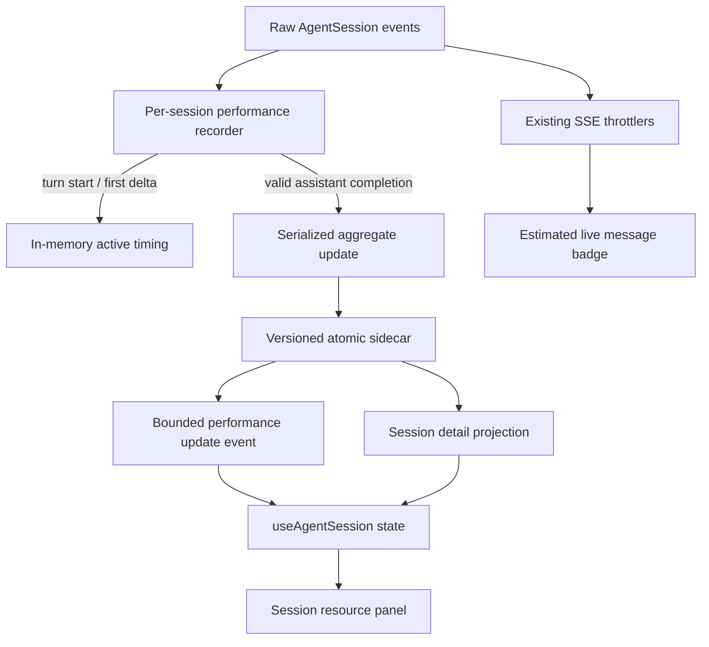

# feat: Add durable session performance metrics

## Overview

Upgrade the existing transient, character-estimated TPS badge into a coherent session performance surface. The live assistant row will keep a clearly estimated speed indicator, while the server records accurate post-call samples from provider-reported output tokens and unthrottled AgentSession timing. A versioned per-session aggregate will survive reloads and service restarts and will expose weighted TPS, average TTFT, sample count, and provider/model breakdowns in the current-session resource panel.

This is a cross-layer feature: AgentSession lifecycle events provide timing, a sidecar owns durable aggregates, the existing session-detail/SSE paths transport summaries, and a focused top-bar component presents the result without changing Pi JSONL or global Usage semantics.

---

## Problem Frame

`components/MessageView.tsx` currently estimates one active assistant message's TPS from content length divided by four and a browser timer. The value disappears at stream completion, depends on component visibility/lifetime, and cannot represent a session. Persisted messages contain final output usage but no generation duration, so old sessions cannot be accurately backfilled from JSONL timestamps.

The implementation must add durable measurements only for newly observed ordinary Assistant calls, retain immediate live feedback, explain mixed-model sessions, and preserve all existing billing/context/Usage behavior (see origin: `docs/brainstorms/2026-08-11-session-performance-metrics-requirements.md`).

---

## Requirements Trace

- R1–R3. Keep live TPS explicitly estimated; measure completed ordinary Assistant calls from model-call start, first effective output, completion, and final provider output usage; exclude invalid/error/aborted/incomplete samples.
- R4–R5. Aggregate TPS as total output tokens divided by total stream duration; average TTFT arithmetically; exclude tools, tool-result usage, compaction, and branch-summary calls.
- R6–R9. Show session average TPS, TTFT, sample count, mixed-model breakdown, neutral styling, and an accurate empty state for old/no-sample sessions.
- R10–R12. Persist by session without modifying Pi JSONL; preserve archive/restore and Branch lifetime semantics; isolate Forks and clean data on delete; do not alter existing billing, context, global Usage, Automation, or Subagent stats.
- R13–R15. Measure before browser/SSE throttling, avoid high-frequency writes/scans/rerenders, and add domain, lifecycle, persistence, i18n, and UI-contract validation.

**Origin flows:** F1 (view a streaming reply), F2 (view session performance summary), F3 (reopen or manage a session)

**Origin acceptance examples:** AE1 (live estimate to exact sample), AE2 (weighted average), AE3 (TTFT/tool exclusion), AE4 (mixed models), AE5 (no historical backfill), AE6 (persistence/archive/delete), AE7 (Fork isolation)

---

## Scope Boundaries

- Do not infer or backfill TPS/TTFT for calls completed before this feature is installed.
- Do not add trends, percentiles, per-call history, rankings, provider benchmarks, or fixed red/yellow/green speed grades.
- Do not include compaction, branch summary, Vision fallback, tool-owned model usage, Automation, or Subagent calls in this session-performance aggregate.
- Do not change Pi session JSONL, `SessionBillingStats`, `lib/usage-stats.ts`, the global Usage date/cost aggregation, or provider quota panels.
- Do not introduce a new polling route or scan all session files; session detail and one completion-triggered SSE projection are sufficient.

---

## Context & Research

### Relevant Code and Patterns

- `lib/rpc-manager.ts` receives raw in-process `AgentSession.subscribe()` events before `AgentEventThrottler` and hidden-tab presentation coalescing. This is the authoritative timing boundary and remains active even with no SSE listener.
- Pi 0.84.1 exposes `turn_start`, cumulative `message_update` plus typed `assistantMessageEvent` deltas, and final `message_end` usage. Effective output can be recognized from `text_delta`, `thinking_delta`, or `toolcall_delta`; `message_end` supplies authoritative provider/model/usage/stop reason.
- `lib/session-file-changes.ts` is the direct sidecar precedent: PI-agent-dir-aware storage, version validation, per-session promise queues, atomic temp-file rename, best-effort failure isolation, explicit flush, and delete cleanup.
- `app/api/sessions/[id]/route.ts` already returns lifetime `sessionStats` and is loaded after prompt settlement. Adding a separate optional `sessionPerformance` projection avoids changing billing semantics or adding another request.
- `hooks/useAgentSession.ts` centralizes session detail and SSE event handling; `ChatWindow` forwards stable scalar summaries to `AppShell`.
- The current session resource trigger is implemented inline in `components/AppShell.tsx` and already combines context/cost with provider quota panels. Extracting that bounded block into a dedicated component reduces AppShell complexity while adding a structured popover.
- `components/ChatGptUsagePanel.tsx` and shared `usage-*` styles provide the body-portal positioning, outside/Escape close, focus, responsive, and semantic resource-popover pattern.
- `scripts/smoke-session-file-changes.mjs`, `scripts/smoke-session-billing-stats.ts`, `scripts/smoke-ui-theme-contract.ts`, and the i18n parity check are the relevant validation patterns.

### Institutional Learnings

- Session display projections should remain non-Git sidecars and must not mutate Pi JSONL.
- Live session metrics should be produced server-side and transported as bounded summaries; browser visibility and presentation throttling must not determine authoritative state.
- Existing top-bar resources should stay compact and container-responsive, with detailed content in a bounded body portal rather than widening the header.

### External References

- External research is not required. The pinned SDK event contract and multiple local sidecar/resource-popover patterns directly cover the implementation.

---

## Key Technical Decisions

- **Server-owned monotonic timing:** Capture timestamps at the raw `AgentSessionWrapper.start()` subscription boundary with an injectable monotonic clock. This avoids browser disconnect, hidden-tab throttling, wall-clock adjustments, and render cadence.
- **Typed first-output boundary:** Start TTFT at `turn_start`; set first output only on a non-empty text/thinking/tool-call delta; end at the matching ordinary Assistant `message_end`. A sample without all three boundaries is excluded rather than guessed.
- **Provider usage is authoritative:** Use final `message.usage.output` as the numerator. The UI describes this as provider-reported output throughput because some providers may include reasoning tokens according to their own usage contract.
- **Aggregate-only sidecar:** Persist versioned totals globally and per provider/model—sample count, output tokens, stream duration, and TTFT total—without retaining per-call prompts, content, timestamps, or an unbounded sample list. This satisfies current diagnostics while bounding file size and privacy exposure.
- **One queued write per valid call:** Start/update events mutate only in-memory timing state; only a valid completion queues an atomic read-modify-write. Per-session serialization follows `lib/session-file-changes.ts` and the one-wrapper-per-session invariant.
- **Dual delivery path:** The existing session-detail GET returns the durable summary for initial/reload state. After a successful sidecar write, a bounded `session_performance_update` SSE event carries the same summary so UI freshness does not race the `agent_settled` reload.
- **Separate performance from billing:** Add `sessionPerformance` beside `sessionStats`; do not extend billing totals with timing fields or change callers that only understand cost/tokens.
- **Focused resource component:** Extract the current session context/cost trigger into `components/SessionResourcePanel.tsx`. Its trigger adds average TPS; its popover explains performance, model breakdown, billing, and context, and retains an explicit action to open the existing global Usage modal.
- **Neutral live estimate:** Keep the current character approximation only while streaming, render it with an approximation marker/label, and remove universal fast/slow color tiers.

---

## Open Questions

### Resolved During Planning

- **Where is timing captured?** At the server's unthrottled in-process subscription, not in React or after SSE coalescing.
- **How are old sessions handled?** No backfill; missing sidecar/zero samples is an explicit accurate-empty state.
- **How is mixed-model data represented?** One weighted session total plus stable provider/model rows, each calculated from its own aggregate counters.
- **How is current UI detail exposed?** A compact session resource popover replaces the ambiguous direct jump from the resource trigger to global Usage; global Usage remains available as a secondary action.
- **What happens to single-chunk/zero-duration calls?** Store only samples with a positive measured stream duration. Never clamp or fabricate duration; calls whose first-output and completion boundaries cannot produce positive elapsed time remain excluded.

### Deferred to Implementation

- Exact internal helper/type names may change to fit nearby style.
- If the installed provider adapter emits a non-empty completed payload without any delta event, implementation should confirm the observed event order; absent a reliable first-output boundary, the call must remain excluded rather than using message timestamps.
- Final compact numeric rounding is presentation-only and should be selected while testing narrow header layouts; persisted aggregates retain unrounded integer token/millisecond totals.

---

## High-Level Technical Design

> *This illustrates the intended approach and is directional guidance for review, not implementation specification. The implementing agent should treat it as context, not code to reproduce.*

The accurate recorder is upstream of throttling. The estimated live badge remains downstream because it is presentation feedback, not durable telemetry.

---

## Implementation Units

- [x] U1. **Build the session performance domain and sidecar**

**Goal:** Create a bounded, testable recorder and persistent aggregate that converts model lifecycle events into accurate session/provider/model summaries.

**Requirements:** R2–R5, R9–R10, R13–R14; F1–F3; AE1–AE3, AE5–AE7

**Dependencies:** None

**Files:**
- Create: `lib/session-performance.ts`
- Modify: `lib/types.ts`
- Create/Test: `scripts/smoke-session-performance.ts`
- Modify: `package.json`

**Approach:**
- Define client-safe summary/wire types separately from private sidecar/active-call structures.
- Use an injected clock in the recorder so event timing is deterministic in tests; use a monotonic production clock for durations and wall time only for sidecar metadata.
- Recognize first effective output from non-empty assistant delta events; clear stale active state on terminal/error/settled boundaries.
- Validate eligibility at Assistant completion: ordinary response, non-error/non-aborted, provider/model present, positive finite output tokens, model-call start present, first-output present, positive finite stream duration and TTFT.
- Maintain aggregate counters only. Derive weighted TPS and average TTFT when projecting a summary, with stable provider/model ordering and no division-by-zero/NaN/Infinity on the wire.
- Store a versioned file under the Pi agent data directory, serialize updates per session, write atomically, tolerate missing/malformed files as an empty aggregate, and expose read/flush/delete operations.

**Execution note:** Implement the pure event-to-sample and aggregate behavior test-first before adding filesystem persistence.

**Patterns to follow:**
- `lib/session-file-changes.ts` for agent-dir resolution, version validation, per-session queues, atomic rename, flush, and best-effort delete.
- `lib/session-billing-stats.ts` for small deterministic aggregate projections.

**Test scenarios:**
- Happy path / **Covers AE1:** turn start at 0 ms, first non-empty output at 3,000 ms, completion at 7,000 ms with 120 output tokens produces one sample at 30 TPS and 3,000 ms TTFT.
- Happy path / **Covers AE2:** 100 tokens/2 seconds plus 100 tokens/8 seconds projects 20 TPS, not 31.25 TPS; TTFT uses the sample arithmetic mean.
- Happy path / **Covers AE4:** two provider/model tuples produce one mixed session summary and two independently correct breakdown rows.
- Edge case: empty delta/start/end events do not establish first output; the first non-empty text, thinking, or tool-call delta does.
- Edge case: zero/negative/non-finite duration, zero/missing output usage, missing provider/model, error, aborted, or no-first-output completions do not increment any aggregate.
- Error path: malformed/unknown-version sidecars read as no accurate samples and the next valid update writes a valid current version without throwing into Agent delivery.
- Concurrency: two valid updates queued for one session are both preserved; different session IDs remain isolated.
- Lifecycle / **Covers AE6–AE7:** reload preserves aggregates, delete removes only the target sidecar, and a different Fork session ID starts empty.
- Privacy/bounds: persisted data contains counters and model identifiers only—no message content, prompts, tool input, or per-call history.

**Verification:**
- The smoke suite deterministically proves event eligibility, weighted aggregation, model splitting, persistence, corruption recovery, serialization, and cleanup.
- Sidecar reads always return either a bounded valid summary or no-sample state; never NaN/Infinity or raw private records.

---

- [x] U2. **Integrate recording with the raw AgentSession lifecycle**

**Goal:** Feed the recorder from authoritative server events, flush it on wrapper disposal, and publish fresh summaries after durable completion.

**Requirements:** R2–R3, R5, R10, R13–R14; F1, F3; AE1, AE3

**Dependencies:** U1

**Files:**
- Modify: `lib/rpc-manager.ts`
- Test: `scripts/smoke-session-performance.ts`

**Approach:**
- Instantiate one recorder per `AgentSessionWrapper`, using the wrapper's stable session ID/file/cwd metadata.
- Observe raw lifecycle events before `SubagentProgressThrottler` and `AgentEventThrottler`; do not depend on listener count or the browser event buffer.
- Keep timing observation synchronous/in-memory; queue persistence only when a valid `message_end` sample is produced.
- After a successful write, emit a bounded `session_performance_update` containing session ID and public summary. Persistence/measurement failures are diagnostic-only and must not interrupt ordinary event delivery.
- Flush pending performance writes alongside changed-file projection during wrapper destruction.

**Patterns to follow:**
- The changed-file observer block and destroy flush in `lib/rpc-manager.ts`.
- Existing buffered `emitEvent()` delivery for asynchronously completed sidecar projections.

**Test scenarios:**
- Integration: feeding the recorder the same raw sequence seen by the wrapper produces one durable sample and one update callback only after persistence succeeds.
- Integration / **Covers AE3:** a tool execution interval and subsequent `turn_start` create separate model timing windows; tool duration is absent from both TPS denominators.
- Retry path: an error/aborted Assistant completion followed by retry lifecycle and a successful completion records only the successful attempt.
- Listener edge: recorder persistence and summary generation occur with zero browser listeners; attaching an SSE listener is not a prerequisite.
- Failure path: a rejected sidecar write does not block or reorder delivery of the original Agent event stream.
- Teardown: flush waits for a queued valid completion and clears stale in-memory timing without adding an incomplete sample.

**Verification:**
- Accurate timing is taken upstream of all existing event throttlers and is independent of browser state.
- Wrapper teardown cannot leave an in-process queued update intentionally unawaited.

---

- [x] U3. **Expose performance through session detail and live client state**

**Goal:** Deliver one consistent optional performance summary on initial load, reload, and live completion while preserving billing and session lifecycle semantics.

**Requirements:** R6–R7, R9–R13; F2–F3; AE4–AE7

**Dependencies:** U1, U2

**Files:**
- Modify: `app/api/sessions/[id]/route.ts`
- Modify: `hooks/useAgentSession.ts`
- Modify: `components/ChatWindow.tsx`
- Modify: `components/AppShell.tsx`
- Modify/Test: `scripts/smoke-session-performance.ts`

**Approach:**
- Add optional `sessionPerformance` beside `sessionStats` in session-detail JSON; read the small aggregate sidecar directly after the session path has been authorized.
- On session delete, await live-wrapper destruction/flush before deleting artifacts and both sidecars, then call performance cleanup next to `deleteSessionChangesSidecar`. This ordering prevents a queued completion from recreating the performance file after deletion. Archive/unarchive require no move because identity-keyed sidecars remain stable.
- Extend `SessionData` and hook state with the optional summary. Apply `session_performance_update` only when its session ID matches the active session; ignore late events from a previous selection.
- Forward the summary through a stable `ChatWindow` callback to AppShell, using a scalar/stable key so unchanged summaries do not trigger top-level rerender loops; clear it on session unmount/switch.
- Keep `sessionStats`, context usage, and `/api/usage` untouched.

**Patterns to follow:**
- Existing `sessionStats` projection in `app/api/sessions/[id]/route.ts` and `useAgentSession.ts`.
- `session_file_changes_update` session-ID filtering in `hooks/useAgentSession.ts`.
- `ChatWindow`'s scalar-keyed session-stats/context callbacks.

**Test scenarios:**
- API happy path: a session with a valid sidecar returns `sessionPerformance`; a valid session without one returns `null`/absent no-sample state without failing the detail request.
- Live integration: a completion update for the active session replaces the client summary without waiting for another full JSONL parse.
- Race edge: an update for a previously selected session is ignored after navigation.
- Lifecycle / **Covers AE6:** refresh and service restart read the same sidecar summary; archive/restore leaves it intact; delete waits for queued writes and removes it without post-delete recreation.
- Lifecycle / **Covers AE7:** a Fork's new ID has no summary until its own first valid call, while the parent remains unchanged.
- Compatibility: existing consumers that use only `sessionStats` continue receiving the same billing values and shape.

**Verification:**
- Initial and live summaries converge to the same wire projection.
- No extra polling endpoint, full session scan, or performance-to-billing field coupling is introduced.

---

- [x] U4. **Create a coherent session resource UI and clarify live TPS**

**Goal:** Present average TPS as the primary session performance indicator, provide balanced diagnostics in a compact accessible popover, and make the active-row estimate honest and neutral.

**Requirements:** R1, R6–R9, R14–R15; F1–F2; AE1, AE4–AE5

**Dependencies:** U3

**Files:**
- Create: `components/SessionResourcePanel.tsx`
- Modify: `components/AppShell.tsx`
- Modify: `components/MessageView.tsx`
- Modify: `app/globals.css`
- Modify: `lib/i18n/messages/app.ts`
- Modify: `lib/i18n/messages/chat.ts`
- Modify: `lib/i18n/messages/panels.ts`
- Test: `scripts/smoke-ui-theme-contract.ts`
- Test: `scripts/check-i18n-keys.ts`

**Approach:**
- Extract the existing inline session context/cost trigger into a memoized resource component; keep provider quota panels separate and preserve AppShell's current state ownership.
- Show compact context, cost/token fallback, and exact average TPS only when each value exists. Use container-responsive labels so narrow headers retain the value without horizontal overflow.
- Open a bounded body-portaled popover with: accurate session average TPS, average TTFT, sample count, no-sample explanation, mixed-model notice, provider/model rows, existing token/cost/context detail, and an explicit action to open `UsageStatsModal`.
- Follow existing top-bar popover behavior for viewport positioning, outside click/focus, Escape, focus return, semantic Tokens, touch target sizing, and safe-area/mobile constraints.
- In the active Assistant row, retain the character estimate but render an approximation marker/accessible label; remove fixed speed tier selection and tier-specific success/warning/danger classes.
- Keep numeric calculations out of render duplication where practical by using small pure format/project helpers within the new component or performance module.

**Patterns to follow:**
- `components/ChatGptUsagePanel.tsx` for body portal and bounded positioning.
- `components/ui/SettingsPrimitives.tsx` and shared `usage-*`/resource classes for semantic surfaces and actions.
- Existing top-bar container breakpoints and focus/coarse-pointer rules in `app/globals.css`.

**Test scenarios:**
- UI happy path / **Covers AE4:** exact mixed-session average appears on the trigger; popover shows TTFT, sample count, mixed-model copy, and separate provider/model rows.
- UI empty path / **Covers AE5:** no sidecar/zero samples shows “no accurate samples” and never substitutes the live estimate or JSONL timestamp approximation.
- Live path / **Covers AE1:** the active row labels `~N t/s` (or localized equivalent) as estimated; after completion the exact session average updates independently.
- Responsive: compact header labels hide at existing container breakpoints without hiding the primary numeric indicator or causing overflow at the 300–380 px Inspector constraints and mobile header.
- Accessibility: trigger exposes expanded/control state; popover closes on Escape/outside focus and restores trigger focus; metrics are understandable without color.
- Visual contract: no TPS fast/steady/moderate/slow status classes remain; all generic surfaces use semantic Tokens and existing z-layer variables.
- i18n: every new app/chat/panel key exists with matching zh/en catalog structure and interpolation parameters.

**Verification:**
- Current-session resource details are coherent: performance is session-scoped, global date-range Usage remains a secondary explicit action, and quota panels remain unchanged.
- Manual representative-theme/viewport/keyboard/Portal validation finds no clipping, focus loss, or contrast regression.

---

- [x] U5. **Document, validate, and close the feature contract**

**Goal:** Update durable architecture/module/test documentation and run the complete targeted validation matrix.

**Requirements:** R12, R14–R15; all success criteria

**Dependencies:** U1–U4

**Files:**
- Modify: `AGENTS.md`
- Modify: `docs/architecture/overview.md`
- Modify: `docs/modules/api.md`
- Modify: `docs/modules/frontend.md`
- Modify: `docs/modules/library.md`
- Modify: `docs/standards/code-style.md`
- Modify: `docs/plans/README.md`
- Modify: `docs/plans/2026-08-11-001-feat-session-performance-metrics-plan.md`

**Approach:**
- Document the new sidecar location/lifecycle, timing boundary, session-detail field, SSE event, resource component, no-backfill policy, and distinction from billing/global Usage.
- Add the targeted `test:session-performance` command to project navigation and test standards.
- Record implementation completion/evidence in this plan and update the plan index only after all acceptance gates pass.
- Validate focused smoke suites first, then i18n/UI contracts, lint, and TypeScript. Do not run `next build` for routine development.

**Patterns to follow:**
- Existing session changes and billing documentation entries in architecture/module maps.
- Status/index conventions in `docs/plans/README.md`.

**Test scenarios:**
- Automated: session-performance smoke covers domain, persistence, lifecycle, and wire summaries.
- Automated: agent-stream regression confirms lifecycle/throttling behavior remains intact.
- Automated: session-stats regression confirms lifetime billing remains unchanged.
- Automated: i18n and UI-theme contract checks cover new catalogs/classes/popover constraints.
- Static: lint and strict TypeScript pass with no `any` leakage at the new shared type boundaries.
- Manual: generate replies with one model, switch model in the same session, refresh/restart, archive/restore, Fork, and delete; confirm values/empty states follow AE1–AE7.
- Manual: validate light/dark representative themes, desktop/narrow/mobile widths, keyboard Escape/focus return, coarse pointer targets, and body-portal clipping.

**Verification:**
- Every requirement and acceptance example has automated or explicit manual evidence.
- Documentation describes the implemented contract without claiming historical backfill or changing Usage semantics.

---

## System-Wide Impact

- **Interaction graph:** Raw AgentSession events feed an independent recorder before existing throttlers; valid writes project through session detail and a new bounded SSE event; `useAgentSession` forwards the summary to a dedicated top-bar resource component.
- **Error propagation:** Timing/persistence failures degrade to no/older accurate samples and optional diagnostics. They must never fail prompts, delay tool execution, break SSE, or make session detail unavailable.
- **State lifecycle risks:** Per-session queues prevent lost updates; atomic rename prevents torn files; wrapper flush handles graceful disposal; deletion awaits flush before cleanup so queued writes cannot recreate sidecars; session-ID filters prevent late SSE updates after navigation.
- **API surface parity:** Only `sessions/[id]` gains an optional field and Agent SSE gains one additive event. Context, export, global Usage, Automation, Subagent, and provider quota APIs remain unchanged.
- **Integration coverage:** Pure tests cannot alone prove body-portal positioning, event ordering in a real provider stream, archive/Fork browser behavior, or restart recovery; U5 includes targeted manual integration checks.
- **Unchanged invariants:** One wrapper per session remains authoritative; Pi JSONL stays the source of chat/billing truth; session performance remains a WebUI-owned projection; archive preserves identity; Fork creates a new identity; existing billing totals include their current compaction/branch/tool-result usage exactly as before.

---

## Risks & Dependencies

| Risk | Mitigation |
| --- | --- |
| Provider adapters differ in chunk/event cadence | Require typed non-empty delta and complete usage boundaries; exclude ambiguous calls instead of guessing; test text/thinking/tool-call deltas and inspect one real-provider stream during manual validation. |
| Provider output usage may include hidden reasoning tokens | Label the metric as provider-reported output TPS and keep numerator/denominator inclusive of emitted thinking/tool-call generation where observable; do not claim cross-provider benchmarking precision. |
| Session-detail reload races an asynchronous sidecar write | Emit the canonical summary after the durable write; client accepts that additive update even if `agent_settled` reload read the previous aggregate. |
| Aggregate update is lost on abrupt process termination | Queue one small atomic write per valid completion and flush on graceful wrapper disposal; accept that an ungraceful kill between completion and rename may lose only the final sample, not corrupt prior data. |
| Corrupt sidecar hides or poisons the session header | Validate version/shape, return no-sample on read failure, isolate errors from chat/session APIs, and repair on the next valid atomic write. |
| Delete races a queued completion write | Await wrapper destruction and queue flush before deleting artifacts/sidecars; suppress completion-update SSE once the wrapper is no longer alive. |
| Top-bar detail increases layout/focus complexity | Extract a dedicated component, reuse established portal/focus/container patterns, extend static UI contracts, and run the manual visual matrix. |
| Large mixed-model sessions grow storage | Persist aggregate rows only; size grows by unique provider/model pairs, not calls or message count. |

---

## Documentation / Operational Notes

- Add `~/.pi/agent/session-performance/<encoded-session-id>.json` (final naming may follow the implementation helper) to the data-location documentation; it contains aggregate counters and model identifiers only.
- No migration or one-time scan is required. Rollout is additive: existing sessions begin with no accurate samples and accumulate them on future calls.
- No feature flag is required because missing/corrupt sidecars safely project as no-sample and the collection cost is one bounded write per valid model call.
- Operators do not need to back up the sidecar for chat correctness; losing it affects diagnostics only, not session content or billing usage.

---

## Sources & References

- **Origin document:** [docs/brainstorms/2026-08-11-session-performance-metrics-requirements.md](../brainstorms/2026-08-11-session-performance-metrics-requirements.md)
- Related code: `components/MessageView.tsx`
- Related code: `components/AppShell.tsx`
- Related code: `hooks/useAgentSession.ts`
- Related code: `lib/rpc-manager.ts`
- Related code: `lib/session-file-changes.ts`
- Related code: `app/api/sessions/[id]/route.ts`
- SDK contract: `node_modules/@earendil-works/pi-coding-agent/dist/core/extensions/types.d.ts`
- SDK message events: `node_modules/@earendil-works/pi-ai/dist/types.d.ts`
