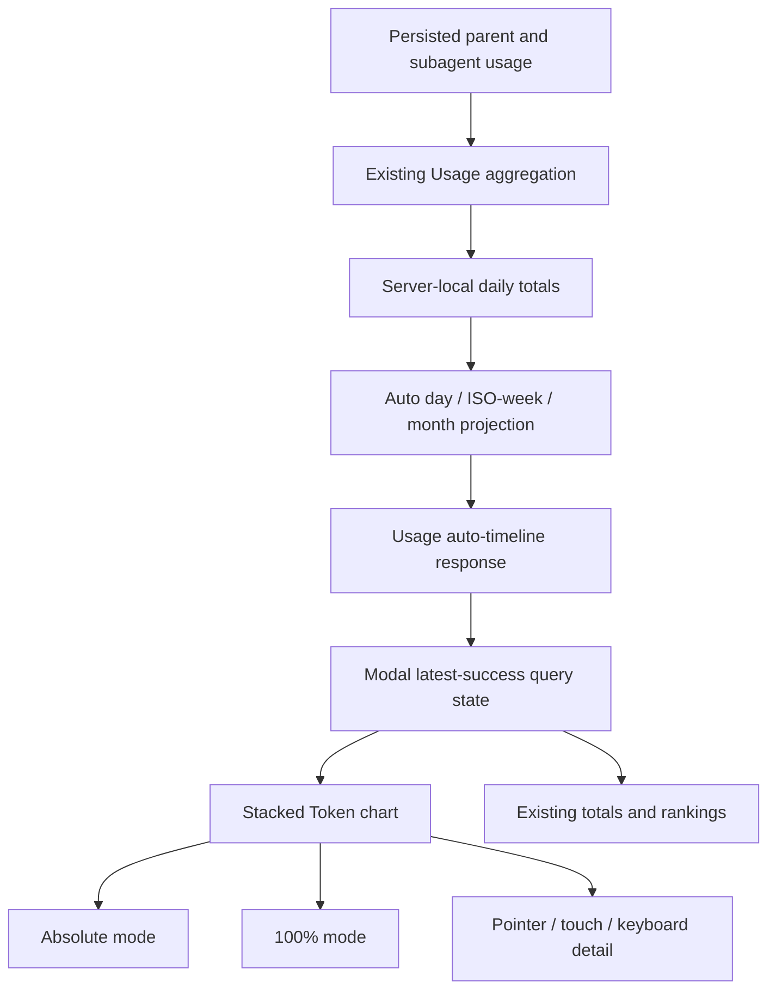

# feat: Add usage token structure charts

## Overview

Enhance the existing global Usage modal with one focused Token-structure chart. The current daily cost bars will be replaced by an accessible stacked time-series chart for input, output, cache-read, and cache-write tokens. Users can switch between absolute totals and 100% composition without another request, inspect exact values by pointer, touch, or keyboard, and use 7/30/90-day presets or a custom range whose time buckets automatically change from day to ISO week to calendar month.

The implementation remains deliberately small: the server continues to own persisted-usage scanning and calendar bucketing; the modal continues to load dynamically; a dependency-free HTML/CSS chart keeps the first-open chunk, theme integration, and keyboard model under project control; and the existing model/provider/session summaries remain exact-range details rather than becoming linked charts.

---

## Problem Frame

`components/UsageStatsModal.tsx` currently presents exact totals and rankings but only a simple daily cost bar. It does not make the four Token categories or their composition changes visually comparable. Long custom ranges also have no display-granularity policy, and the current refresh error path clears the last successful result.

The plan must add the chart without turning Usage into a separate analytics product, changing persisted usage semantics, or introducing a costly chart/runtime subsystem (see origin: `docs/brainstorms/2026-08-11-usage-token-structure-charts-requirements.md`).

---

## Requirements Trace

- R1–R2. Preserve all/current-workspace and custom-date controls; add 7/30/90-day presets; replace daily cost bars with one full-width four-series Token chart while retaining cost summary cards.
- R3–R7. Support absolute and 100% modes from one response; auto-select day/week/month buckets; zero-fill gaps; expose exact Tooltip values; make legends highlight-only; preserve lower-range summaries without cross-filtering.
- R8–R9. Support keyboard, pointer, and touch reading; keep Tooltip content dismissible and viewport-bounded; avoid color-only meaning, page overflow, and nonessential motion.
- R10–R11. Preserve Assistant/subagent/archive totals and declared server-local timezone; ensure bucket sums equal the selected-range totals.
- R12–R15. Return aggregate chart buckets rather than usage records; reuse responses for view-only interaction; cancel stale requests without discarding good data; preserve dynamic loading; and keep the 1,000-session scale baseline within the agreed regression budget.

**Origin flows:** F1 (view recent Token structure), F2 (compare absolute totals and proportions), F3 (view medium/long-term trends)

**Origin acceptance examples:** AE1 (four-series totals/percentages), AE2 (90-day weekly gap), AE3 (touch/keyboard Tooltip), AE4 (refresh keeps prior result), AE5 (subagent/archive/timezone parity)

---

## Scope Boundaries

- Keep Usage in the existing modal; do not add an independent Usage center.
- Do not add pie charts, model/provider charts, linked views, drilldown, series hiding, zoom, brush selection, or dragging.
- Do not retain a daily cost trend; cost remains in existing summary cards.
- Do not add budgets, alerts, period-over-period comparison, forecasting, export, or sharing.
- Do not add user-selectable timezone behavior.
- Do not introduce a persistent Usage database, background pre-aggregation, or a general chart framework.
- Do not refactor synchronous JSONL scanning or add a cache unless implementation benchmarks demonstrate that this feature—not pre-existing transcript size—is responsible for violating R15.

---

## Context & Research

### Relevant Code and Patterns

- `lib/usage-stats.ts` is the single persisted-usage aggregation boundary. It already applies current archive, parent/subagent, provider/model/session, and local-date semantics; candidate collection is index-accelerated and falls back to full reader scans.
- `app/api/usage/route.ts` owns date validation, server-local day boundaries, active/archive configuration, and the `/api/usage` response. Existing default behavior can remain compatible while the modal opts into an auto-bucket timeline projection.
- `components/UsageStatsModal.tsx` already owns scope/date/filter state, aborts effect-owned requests, and is dynamically imported by `components/AppShell.tsx`; this is the correct integration surface.
- `components/CommitGraph.tsx` demonstrates repository-owned data visualization, domain visualization colors, runtime geometry, and memoized projection, but its pointer-only Tooltip is not sufficient for the new chart's stronger keyboard/touch requirements.
- `components/ThemePicker.tsx` and Inspector tabs demonstrate roving focus with Arrow/Home/End. `components/SessionResourcePanel.tsx` demonstrates Escape/outside interaction and viewport-aware detail positioning.
- `components/ui/SettingsPrimitives.tsx`, `usage-*` styles in `app/globals.css`, and `scripts/smoke-ui-theme-contract.ts` provide the modal, tabs, semantic Token, responsive, and static-contract patterns.
- `scripts/smoke-usage-subagents.ts` protects parent/subagent/archive accounting. `scripts/smoke-scale-baseline.ts` protects indexed candidate selection and records Usage timing at 40/1,000-session fixtures.
- Repo search confirms `UsageStatsModal` is the only in-repository consumer of `UsageStatsResult.byDay`; the route remains a package-visible HTTP surface, so the plan preserves its default response and uses an explicit chart projection rather than silently changing default semantics.

### Institutional Learnings

- No matching `docs/solutions/` entry exists.
- Shared wire changes must update every consumer, module docs, i18n, and targeted smoke coverage.
- Static visuals belong in semantic classes; runtime bar geometry and Tooltip coordinates may remain inline. Data-visualization colors may retain domain meaning, but labels and text must make the chart understandable without color.
- Browser-only visual and focus behavior requires the representative-theme/viewport/keyboard matrix in addition to static smoke checks.

### External References

- WCAG 2.2 guidance for content shown on hover/focus requires custom Tooltip content to be dismissible, hoverable when needed, and persistent long enough to read; the chart will also expose it on keyboard focus.
- W3C keyboard guidance requires all chart-reading functionality available from a keyboard, supporting the roving-focus Arrow/Home/End model.
- MDN documents `prefers-reduced-motion` as the standard signal for removing or reducing nonessential motion. This plan goes further by omitting chart geometry animation in v1.

---

## Key Technical Decisions

- **Server-owned calendar bucketing:** Extend the Usage domain with a pure timeline projection built from the existing daily aggregate. The server selects the finest required granularity—day for inclusive spans up to 31 days, ISO week starting Monday for 32–180 days, calendar month for 181+ days—zero-fills gaps, and clamps the first/last bucket labels to the selected range. This keeps timezone and total-reconciliation logic out of React.
- **Explicit auto-timeline API projection:** Let the modal request an auto-bucket response explicitly. The chart response contains a self-describing timeline (`granularity` plus bounded period rows) and omits unneeded daily chart rows; the route's existing default response retains `byDay` for compatibility. No raw usage records cross the API boundary.
- **Calendar strings stay calendar strings:** Bucket keys/ranges remain server-local date values and are formatted without reparsing bare `YYYY-MM-DD` strings as UTC instants. The response's existing IANA timezone is displayed beside the range/granularity. DST changes therefore do not create or skip calendar buckets.
- **Dependency-free HTML/CSS chart:** Build the stacked columns from semantic HTML buttons and CSS segments rather than adding a chart package. Native focus targets simplify roving keyboard behavior, touch pinning, accessible names, and responsive sizing; the bounded feature does not need canvas/SVG rendering, zooming, or a general chart API.
- **No chart animation in v1:** Mode/range changes update geometry directly. Hover/focus emphasis may use existing short semantic transitions, with the global reduced-motion gate suppressing them; there is no entrance, scale, or interpolation animation.
- **One data response, two views:** Absolute/percentage geometry, percentages, axis labels, visible tick density, highlighted series, and focused bucket derive in memoized client-safe helpers from the returned timeline. Mode and legend interaction never fetch.
- **Roving bucket focus and persistent detail:** One bucket is tabbable. Left/Right and Home/End move focus. Hover/focus reveals the same Tooltip; touch/click pins it; Escape or blank-area activation clears it. Each bucket has a complete accessible label so Tooltip rendering is not the only text alternative.
- **Highlight without semantic mutation:** Pointer/focus/click on a legend emphasizes one series and dims the others without removing segments, changing totals, or recalculating percentages.
- **Applied query separate from draft custom dates:** Presets update and load immediately. Custom date fields update a draft; an enabled Apply action commits only a complete valid range. The query effect remains abortable and sequence-guarded.
- **Stale-while-refresh UI, not a server cache:** The modal retains the last successful statistics while a newer query is pending or fails, overlays clear progress/error status, and applies only the latest request. No persistent or process cache is added because the measured 1,000-session baseline is already approximately 173.9 ms on the reference machine.

---

## Open Questions

### Resolved During Planning

- **Where should weekly/monthly grouping and empty-bucket filling live?** In the server-owned Usage domain, exposed as a pure, directly tested timeline projection; React receives final buckets.
- **Which week definition applies?** ISO-style Monday-through-Sunday weeks, with first/last displayed ranges clipped to the user's selected dates.
- **Should a chart dependency be added?** No. The bounded stacked-column interaction is simpler and more accessible with semantic HTML/CSS, avoids a new dependency, and stays in the already lazy modal chunk.
- **Should the current Usage API default shape change?** No. Add an explicit auto-timeline projection for the modal and retain the existing default daily response for compatibility.
- **Should JSONL scanning/caching be redesigned now?** No. Preserve indexed candidate selection, measure before/after with the existing scale fixture, and defer deeper scanner work unless R15 is missed.
- **How should remote browser/server timezone differences be handled?** Preserve current server-local usage semantics, display the returned timezone, and avoid client UTC reinterpretation; user-selectable timezone is out of scope.

### Deferred to Implementation

- Exact helper/type names and whether small projection helpers live beside the chart or in a client-safe Usage timeline module may follow the cleanest dependency graph discovered while coding.
- The final Token series palette and axis tick count should be selected against representative themes and narrow layouts; series identity and order are fixed, but exact domain colors are presentation data.
- If real long-transcript/concurrent-request evidence breaches the regression budget, record the evidence and stop for a scoped follow-up decision rather than silently adding a persistent cache or broad scanner refactor.

---

## High-Level Technical Design

> *This illustrates the intended approach and is directional guidance for review, not implementation specification. The implementing agent should treat it as context, not code to reproduce.*

The chart and existing detail panels consume one selected-range response. View-only interactions never return to the server.

---

## Implementation Units

- [x] U1. **Add the server-owned Usage timeline projection**

**Goal:** Produce correct, zero-filled day/week/month Token buckets without changing existing Usage accounting or silently breaking the route's default daily contract.

**Requirements:** R4, R10–R12, R15; F3; AE2, AE5

**Dependencies:** None

**Files:**
- Create: `lib/usage-timeline.ts`
- Modify: `lib/usage-stats.ts`
- Modify: `app/api/usage/route.ts`
- Create/Test: `scripts/smoke-usage-timeline.ts`
- Modify/Test: `scripts/smoke-usage-subagents.ts`
- Modify/Test: `scripts/smoke-scale-baseline.ts`
- Modify: `package.json`

**Approach:**
- Add client-safe timeline/granularity/bucket types and pure calendar helpers. Reuse the existing `UsageTotals` shape and sum every Token/cost/call field so reconciliation remains available even though the chart visualizes Token fields only.
- Calculate inclusive calendar-day span without elapsed-millisecond division, then select exact threshold boundaries at 31/32 and 180/181 days.
- Aggregate from the existing daily totals, create every expected natural bucket in chronological order, and fill missing periods with independent zero totals. ISO-week buckets start Monday; month buckets start on day one; first/last display ranges are clipped to the selected dates.
- Extend `getUsageStats` with an opt-in auto-timeline projection used by the modal. Preserve the existing direct/default `byDay` result for compatibility, while the chart projection returns only the self-describing timeline series needed by the new client.
- Keep archive, cwd, parent/subagent, provider/model/session, scan-source, and duration behavior unchanged.
- Add a dedicated `test:usage` script that runs timeline and existing subagent/accounting smokes; keep scale timing as a separate regression command.

**Execution note:** Implement the pure calendar and reconciliation cases test-first before changing the route projection.

**Patterns to follow:**
- `lib/usage-stats.ts` for local date parsing/formatting and additive `UsageTotals` behavior.
- `scripts/smoke-usage-subagents.ts` for fixture-isolated Usage tests.
- `scripts/smoke-scale-baseline.ts` for indexed candidate and timing evidence.

**Test scenarios:**
- Happy path: a 7-day range returns seven daily buckets in chronological order and the sum of each Token field equals `totals`.
- Threshold edges: inclusive ranges of 31/32 days resolve to day/week; 180/181 days resolve to week/month.
- Covers AE2: a 90-day range uses Monday-based weekly buckets and inserts a zero-total row for a week with no usage.
- Calendar edge: a range crossing month/year boundaries produces correctly ordered monthly buckets; leap day is preserved; a DST boundary does not duplicate or omit a calendar day.
- Partial edge: a custom range beginning midweek and ending midweek groups by natural week while labeling the first/last rows with clipped selected-range dates.
- Empty/single-day edges: an all-empty range returns zero-filled buckets and zero totals; one selected day returns exactly one daily bucket.
- Covers AE5: parent and subagent records across active/archived fixtures still reconcile to the same totals, and the declared server timezone remains present.
- Compatibility: default/direct Usage aggregation still exposes its existing daily rows; the explicit chart projection exposes timeline metadata and does not serialize raw records.
- Performance: the existing 1,000-session fixture remains index-backed and completes within 20% of the same-machine pre-change reference (approximately 173.9 ms; treat this as benchmark evidence, not a brittle CI wall-clock assertion).

**Verification:**
- Every timeline bucket boundary and zero row is deterministic under the server's local calendar.
- Timeline Token sums equal selected-range totals across day/week/month and main/subagent/archive fixtures.
- The route documents and preserves its default compatibility response while the modal can request the optimized timeline projection.

---

- [x] U2. **Make Usage range selection and refresh state resilient**

**Goal:** Add presets and custom-range application while ensuring stale, aborted, or failed requests never replace the latest successful statistics.

**Requirements:** R1, R7, R13; F1, F3; AE4

**Dependencies:** U1

**Files:**
- Modify: `components/UsageStatsModal.tsx`
- Modify: `lib/usage-timeline.ts`
- Modify: `lib/i18n/messages/panels.ts`
- Test: `scripts/smoke-usage-timeline.ts`
- Test: `scripts/check-i18n-keys.ts`

**Approach:**
- Represent 7/30/90 presets and custom date values separately from the applied query. Preserve the current default of current workspace (when available) plus the last seven local calendar days.
- Preset/scope changes apply immediately. Custom edits stay draft-only until both dates are valid and ordered; Apply commits one query. Display inline validation rather than relying on an API round trip.
- Have the modal request the auto-timeline projection and identify requests by an incrementing sequence in addition to `AbortController`; only the latest sequence may commit success or failure.
- Keep `stats` as the latest successful payload. Track initial loading, refreshing, and refresh error separately so a later failure produces a nonblocking notice over usable data. A first-load failure still uses the existing blocking error/empty treatment.
- Explicit refresh reissues the current applied query without altering preset/custom selection.

**Patterns to follow:**
- Existing cwd/scope isolation and abort cleanup in `components/UsageStatsModal.tsx`.
- Sequence/cwd isolation patterns in `hooks/useSessionBrowser.ts` and `lib/session-search-client.ts`.
- `SettingsTabs`, `SettingsInput`, `SettingsButton`, and `SettingsNotice` for compact controls and state.

**Test scenarios:**
- Happy path: opening with a cwd creates an applied current-workspace 7-day query; without a cwd it creates an all-workspaces 7-day query.
- Presets: choosing 30 or 90 days computes an inclusive local range ending today and applies exactly one new query.
- Custom validation: blank, malformed, or `from > to` drafts cannot apply and expose localized guidance; valid equal dates apply a one-day query.
- Covers AE4: after a successful 7-day payload, applying 90 days keeps the 7-day chart/details visible with a refresh indicator until success; a 90-day failure leaves the 7-day payload visible and shows a nonblocking error.
- Race: if request A is superseded by B, A's late success or error cannot replace B's state even if abort delivery is delayed.
- Scope edge: removing the current cwd while current-workspace scope is selected falls back to all scope without emitting an unauthorized/empty cwd query.
- i18n: new preset, custom, Apply, granularity, timezone, validation, and refresh-state keys have zh/en parity.

**Verification:**
- Network requests occur only for applied query changes or explicit refresh, never for absolute/percentage mode or incomplete custom drafts.
- The latest successful totals and rankings remain readable through refresh and recover correctly on the next success.

---

- [x] U3. **Build the accessible Token structure chart**

**Goal:** Implement the four-series stacked chart, dual view modes, Tooltip, legend highlighting, and complete pointer/touch/keyboard reading without a new chart dependency.

**Requirements:** R2–R6, R8–R9, R12–R14; F1–F2; AE1, AE3

**Dependencies:** U1

**Files:**
- Create: `components/UsageTokenChart.tsx`
- Modify: `lib/usage-timeline.ts`
- Modify: `app/globals.css`
- Modify: `lib/i18n/messages/panels.ts`
- Test: `scripts/smoke-usage-timeline.ts`
- Test: `scripts/smoke-ui-theme-contract.ts`
- Test: `scripts/check-i18n-keys.ts`

**Approach:**
- Render one semantic chart region with a localized title/description, an absolute/percentage segmented control, four labeled legend controls, a bounded plot, sparse x-axis labels, and y-axis reference labels.
- Use equal-width HTML bucket buttons and four stacked CSS segments. Absolute mode scales bucket height to the largest total in the response; percentage mode scales nonzero buckets to 100%. All-zero ranges show the explicit empty state rather than a misleading full-height percentage chart. Keep a usable minimum bucket hit width; uncommon very long monthly ranges may scroll inside the bounded plot, but must never create page-level overflow or require chart dragging/zooming.
- Keep series order stable: input, output, cache read, cache write. Define Usage-specific data-visualization color variables mapped through existing semantic palette/status roles; series names, accessible labels, Tooltip rows, and legend markers make color nonessential.
- Compute exact totals and percentages from raw integer totals. Keep display rounding out of geometry/reconciliation, use locale-aware number formatting, and show both values and percentages in either mode.
- Implement roving focus across bucket buttons. ArrowLeft/ArrowRight move one bucket, Home/End jump to boundaries, and focus updates the same detail shown by hover. Range replacement clamps/resets the active index predictably.
- Distinguish transient hover/focus detail from click/touch pinning. Escape dismisses without moving bucket focus; pointer activation on chart blank space clears pinned detail. Tooltip position is measured relative to the chart and clamped within its visible card.
- Legend hover/focus provides transient emphasis; click/touch persists or clears one highlighted series. Nonhighlighted segments dim but retain geometry, totals, accessible text, and denominator.
- Avoid entrance/geometry animation. Use memoized pure projection for max scale, percentages, axis/tick visibility, and accessible labels so pointer/focus state does not rebuild server data.

**Patterns to follow:**
- `components/ThemePicker.tsx` for roving Arrow/Home/End focus.
- `components/SessionResourcePanel.tsx` for Escape/outside interaction and bounded detail positioning.
- `components/CommitGraph.tsx` only for data-visualization geometry and domain colors; improve on its pointer-only Tooltip behavior.
- Shared `usage-*`, focus-ring, coarse-pointer, and reduced-motion contracts in `app/globals.css`.

**Test scenarios:**
- Covers AE1: totals 600/200/150/50 render as one four-part 1,000-Token bucket; both modes expose 60%/20%/15%/5%; changing mode does not change the response identity or request state.
- Geometry edge: a bucket with one Token category at zero omits only that segment; an all-zero series/range never produces NaN, Infinity, negative height, or a false 100% column.
- Scale edge: very large integer totals format compactly on the axis but retain exact locale-formatted Tooltip/accessibility values.
- Covers AE3: Tab enters one bucket; Arrow/Home/End move focus and update accessible detail; Escape dismisses pinned/focus Tooltip without trapping focus.
- Pointer/touch: hover and focus reveal equivalent content; touch/click pins a bucket; activating blank space clears it; moving from a bucket into the Tooltip does not make required content disappear prematurely.
- Legend: highlighting each series dims only visual peers and never changes segment height, total, percentages, or Tooltip rows.
- Responsive: 7, 30, weekly-90, and monthly-long ranges fit the card without page-level horizontal overflow; label density drops while every bucket remains present and focusable, and an extreme multi-year range uses bounded internal scrolling with a usable hit target.
- Theme/motion: representative light/dark/curated themes keep all four series, focus outline, text, and Tooltip readable; reduced motion has no chart geometry animation.
- i18n: chart title, modes, legend, granularity, Tooltip labels, empty state, and keyboard hint have zh/en parity.

**Verification:**
- Chart reading is equivalent across mouse, keyboard, and touch and never depends on color or hover alone.
- The modal chunk gains no chart-library dependency, and AppShell's initial bundle path remains unchanged.

---

- [x] U4. **Integrate the chart into the focused Usage layout**

**Goal:** Replace the old daily cost panel, preserve every in-scope summary/detail, and deliver a responsive information hierarchy across loading, empty, and error states.

**Requirements:** R2, R7, R9, R11, R13–R14; F1–F3; AE3–AE5

**Dependencies:** U2, U3

**Files:**
- Modify: `components/UsageStatsModal.tsx`
- Modify: `app/globals.css`
- Modify: `lib/i18n/messages/panels.ts`
- Test: `scripts/smoke-ui-theme-contract.ts`
- Test: `scripts/check-i18n-keys.ts`

**Approach:**
- Place the full-width chart immediately after the summary metric grid. Remove the daily cost progress rows and their obsolete styles.
- Keep Token exact rows, model/provider breakdowns, session rows, active/archive counters, skipped entries, scan source, and duration. Reorganize only enough to prevent duplicate Token hierarchy and ensure the chart owns the primary trend position.
- Show applied date range, auto granularity, archive mode, scan source/duration, and server timezone in concise chart/meta copy. Lower panels remain explicitly scoped to the whole applied range and are unaffected by bucket focus/highlight.
- During refresh, mark the retained content busy without disabling chart reading. Show initial skeleton/loading only when no successful payload exists. Show zero-filled chart/empty detail states for a successful no-usage response; do not confuse that with request failure.
- Add Usage chart/layout classes under the existing `usage-*` family, use semantic surface/border/text/focus tokens, and preserve the current ≤640px full-viewport modal/safe-area behavior.
- Extend the UI-theme smoke contract only for stable class, responsive, focus, and reduced-motion rules that can be checked statically; leave geometry/contrast/focus-order judgment to manual validation.

**Patterns to follow:**
- Existing metric and detail sections in `components/UsageStatsModal.tsx`.
- Shared modal and Settings primitives instead of new shell/control styles.
- `docs/operations/ui-visual-validation.md` for representative-theme, 200% zoom, keyboard, coarse-pointer, and mobile checks.

**Test scenarios:**
- Covers AE4: retained content remains visible and marked refreshing after a new range is applied; refresh failure adds a notice without replacing chart/details with zeros.
- Covers AE5: chart sum, Token rows, and top total agree for main/subagent and archive-enabled fixtures; displayed timezone/granularity match the response.
- Empty/error distinction: a successful all-zero range shows the chart empty state plus zero totals; an initial HTTP error shows a retryable error and no fabricated statistics.
- Layout: the old daily cost bar and `usage-daily-bar-fill` contract are removed; one full-width chart precedes exact details on desktop and mobile.
- Responsive: controls wrap without obscuring close/refresh/Apply actions; the chart and existing wide session rows do not create page-level overflow at ≤640 px and 200% zoom.
- Accessibility: loading uses polite status semantics, refresh does not move focus, modal close remains reachable, and chart focus is not reset by view-only state changes.

**Verification:**
- Users encounter one clear Token trend/composition visual followed by exact range details, with no competing daily cost chart.
- Existing cost, provider, model, session, subagent, archive, and scan diagnostics remain present and semantically unchanged.

---

- [x] U5. **Document and validate the Usage chart contract**

**Goal:** Update durable module/API/test documentation and close all functional, performance, accessibility, and visual acceptance gates.

**Requirements:** R10–R15; all success criteria

**Dependencies:** U1–U4

**Files:**
- Modify: `AGENTS.md`
- Modify: `docs/modules/api.md`
- Modify: `docs/modules/frontend.md`
- Modify: `docs/modules/library.md`
- Modify: `docs/standards/code-style.md`
- Modify: `docs/operations/ui-visual-validation.md` if the chart adds a reusable validation case
- Modify: `docs/plans/README.md`
- Modify: `docs/plans/2026-08-11-002-feat-usage-token-charts-plan.md`
- Modify: `package.json`

**Approach:**
- Document the auto-timeline request/response, day/week/month thresholds, Monday week boundary, server timezone, zero-fill/reconciliation behavior, chart component, and no-chart-dependency decision.
- Add the targeted `test:usage` command to project navigation and standards; keep `test:scale-baseline`, `test:i18n`, and `test:ui-theme` as explicit related gates.
- Record before/after 40-session and 1,000-session Usage timings from the same environment. If the latter exceeds the agreed ~208.7 ms reference threshold (173.9 ms + 20%) due to the new projection, optimize the pure grouping path before considering broad scanner changes.
- Validate focused domain smokes first, then i18n/UI contracts, lint, strict TypeScript, and the manual Usage flow across representative themes/viewports/input modes. Do not run `next build` for routine validation.
- Mark units complete and update the plan index only after evidence exists; do not claim browser accessibility/visual acceptance from static tests alone.

**Patterns to follow:**
- Existing Usage entries in `docs/modules/api.md`, `docs/modules/frontend.md`, and `docs/modules/library.md`.
- Validation/status closeout in `docs/plans/2026-08-11-001-feat-session-performance-metrics-plan.md`.

**Test scenarios:**
- Automated: `test:usage` covers threshold selection, ISO-week/month boundaries, zero fill, total reconciliation, and parent/subagent/archive accounting.
- Automated: `test:scale-baseline` confirms index-backed cwd/global Usage correctness and records before/after timing at normal and 1,000-session scales.
- Automated: `test:i18n` confirms all zh/en chart/filter/error strings and interpolation parameters remain in parity.
- Automated: `test:ui-theme` confirms stable Usage chart classes, semantic tokens, ≤640px behavior, focus contracts, and reduced-motion rules.
- Static: lint and strict TypeScript pass with no client import of server filesystem modules and no unsafe wire casts.
- Manual / Covers AE1–AE5: verify 7/30/90/custom ranges; absolute/percentage modes; zero gaps; pointer, touch, and keyboard Tooltip behavior; legend highlighting; stale refresh success/failure; current/all scope; archive toggle setting; main/subagent totals; light/dark/curated themes; 200% zoom; and desktop/641–959/≤640 widths.
- Manual performance: opening the dynamically loaded modal does not delay initial workbench paint; mode/highlight/Tooltip interaction produces no network requests or visible jank.

**Verification:**
- Every origin requirement, flow, acceptance example, and scope boundary has implementation or explicit validation evidence.
- Documentation accurately distinguishes the optimized chart projection from the preserved default daily API response.
- Scale, accessibility, theme, i18n, and static quality gates are recorded before the plan is closed.

---

## System-Wide Impact

- **Interaction graph:** AppShell continues to lazy-load `UsageStatsModal`; applied filter state requests the new auto-timeline Usage projection; `lib/usage-stats.ts` reuses current persisted records and shared totals; the modal sends the same payload to the chart and unchanged detail panels.
- **Error propagation:** Invalid custom dates are blocked client-side; API validation remains authoritative; initial request failures use blocking error treatment; refresh failures preserve the prior successful payload and surface a nonblocking notice; stale responses are ignored by request sequence.
- **State lifecycle risks:** Draft/applied range separation prevents request churn; request sequence plus AbortController prevents late replacement; chart focus/pinned/highlight state must reset or clamp when bucket identity changes but survive view-mode changes.
- **API surface parity:** The default `/api/usage` daily response remains compatible. The modal opts into an additive auto-timeline projection documented in `docs/modules/api.md`; no session, billing, quota, Automation, or provider API changes.
- **Integration coverage:** Pure tests prove dates, totals, projection, and focus-index helpers. They do not prove real Tooltip geometry, touch behavior, modal focus order, theme contrast, 200% zoom, or request counts in a browser; U5 carries explicit manual coverage.
- **Unchanged invariants:** Persisted JSONL remains the usage source of truth; session index remains only candidate acceleration; parent-session attribution owns nested subagent usage; archive configuration remains global; cost/model/provider/session totals retain existing semantics; no raw records or prompts are exposed.

---

## Risks & Dependencies

| Risk | Mitigation |
| --- | --- |
| Local calendar, DST, and partial natural-week logic causes missing or double-counted buckets | Use calendar-component arithmetic, ISO Monday boundaries, clipped edge labels, zero-fill tests, and strict bucket-sum reconciliation. |
| Bare date strings shift when parsed as UTC in a remote browser | Keep server-local date strings as calendar values, display the returned timezone, and test without `new Date("YYYY-MM-DD")` reinterpretation. |
| Four series are hard to distinguish in some curated themes | Use stable domain variables, visible markers/labels, text Tooltip rows, focus/highlight states, and representative-theme contrast review; never rely on hue alone. |
| Touch pinning, focus Tooltip, and legend persistence conflict | Keep transient and pinned state explicit, define Escape/blank-clear precedence, and test pointer/touch/keyboard flows separately. |
| Long ranges create very narrow columns or too many focus targets | Auto-group at fixed thresholds, reduce axis-label density, enforce a minimum bucket hit width, allow bounded plot-only scrolling for extreme multi-year ranges, and validate representative long ranges/200% zoom. |
| Refresh failure is mistaken for an empty range | Separate latest-success data, initial loading/error, refresh status, and successful-zero state. |
| New projection regresses Usage scanning | Build from existing daily aggregates in linear time, avoid a second JSONL scan, run the same-machine 1,000-session baseline, and reject unmeasured cache/index expansion. |
| New chart code increases initial workbench cost | Keep `UsageStatsModal` dynamically imported and add no chart dependency; verify initial AppShell import path remains unchanged. |
| Default API consumers depend on `byDay` | Preserve default response semantics and make auto timeline opt-in; document both projections. |

---

## Documentation / Operational Notes

- No migration, feature flag, background job, or persistent storage change is required.
- The feature is local/read-only and does not change server-mode authorization or mutation policy.
- Use `npm run build` only if release validation is explicitly requested; routine completion uses targeted smokes, lint, strict TypeScript, and manual browser validation.
- If implementation discovers a genuine scanner bottleneck, capture fixture size, transcript bytes, concurrency, and timing as a separate research/follow-up item instead of expanding this chart feature.

---

## Delivery evidence

- Automated: `npm run test:usage`, `npm run test:scale-baseline` (40 and 1,000 sessions), `npm run test:i18n`, `npm run test:ui-theme`, `npm run lint`, `node_modules/.bin/tsc --noEmit`.
- Scale (this machine): 40-session Usage all ≈ 13.9 ms; auto-timeline ≈ 11.2 ms. 1,000-session Usage all ≈ 174.2 ms; auto-timeline ≈ 166.6 ms (reference ≈ 173.9 ms; within +20% / ~208.7 ms budget).
- Browser/manual AE1–AE5 theme-viewport-keyboard matrix not executed in this delivery; remains ordinary follow-up using `docs/operations/ui-visual-validation.md`.

## Sources & References

- **Origin document:** [docs/brainstorms/2026-08-11-usage-token-structure-charts-requirements.md](../brainstorms/2026-08-11-usage-token-structure-charts-requirements.md)
- Related code: `lib/usage-stats.ts`, `lib/usage-timeline.ts`, `app/api/usage/route.ts`, `components/UsageStatsModal.tsx`, `components/UsageTokenChart.tsx`, `components/CommitGraph.tsx`, `components/SessionResourcePanel.tsx`, `app/globals.css`
- Related tests: `scripts/smoke-usage-timeline.ts`, `scripts/smoke-usage-subagents.ts`, `scripts/smoke-scale-baseline.ts`, `scripts/smoke-ui-theme-contract.ts`, `scripts/check-i18n-keys.ts`
- [W3C WCAG 2.2 — Understanding Content on Hover or Focus](https://www.w3.org/WAI/WCAG22/Understanding/content-on-hover-or-focus.html)
- [W3C WCAG 2.2 — Keyboard Accessible](https://www.w3.org/WAI/WCAG22/Understanding/keyboard-accessible.html)
- [MDN — prefers-reduced-motion](https://developer.mozilla.org/en-US/docs/Web/CSS/Reference/At-rules/@media/prefers-reduced-motion)
