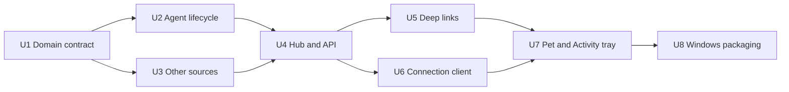

# feat: Add independent Windows desktop pet task observer

## Overview

Build a Windows-first Electron companion for Snail Pi Web. It launches independently, stays in the system tray, renders an animated pet plus Activity tray, observes concurrent tasks through one local service-level stream, maintains desktop-local unread state, sends deduplicated Windows notifications, and opens the existing WebUI in the default browser.

The v1 desktop is **attach-only**: it connects to an already running local-mode `spi`. If no service is listening, it displays “蜗牛派服务未启动”, provides a copyable `spi --no-open` command, setup guidance and Retry. It never starts, stops, restarts, signals or supervises the service.

This removes the highest-risk work—packaging Next/pi/native modules inside Electron and managing Windows descendant processes—without reducing the core task-observer value.

---

## Requirements Trace

- R1. Multi-project Activity tray and aggregate counts.
- R2. Agent/Subagent, SnFlow, Automation and Quick Command coverage; Web Terminal excluded.
- R3. Desktop states and priority: Needs input > Blocked > Ready > Running.
- R4. Separate execution, outcome and attention axes.
- R5. Stable task, activity and transition identities.
- R6. Desktop-local unread/acknowledged Ready semantics.
- R7. SnFlow host-session deduplication.
- R8. Verifiable progress only.
- R9. Windows 10/11 desktop capabilities.
- R10. Pet toggles Activity tray; activity/notification opens browser WebUI.
- R11. Required visual/service states, non-color cues and reduced motion.
- R12. Versioned built-in pet selection and persistence.
- R13. Close-to-tray, pass-through recovery and Retry.
- R14. Desktop/service independent startup and shutdown.
- R15. IPv4 loopback local-mode only.
- R16. Service-not-running guidance without command execution.
- R17. Desktop exit never affects service/tasks.
- R18. Unknown/incompatible/server-mode diagnostic without process ownership.
- R19. Dedicated local observer session and unchanged public health boundary.
- R20. No cwd/Prompt/firstMessage/output/command/path/env/secret/raw-error payload.
- R21. Safe title/error fallback policy.
- R22. Server-produced and main-validated relative deep links.
- R23. Stale, reset and service-not-running semantics.
- R24. Stable transition deduplication across reconnect/restart.
- R25. Initial/reset snapshot notification baseline.
- R26. Windows notification policies and independent categories.
- R27. Activity tray selection and local mark-read behavior.
- R28. One bounded full-snapshot SSE; elapsed time does not cause revisions.

**Flows:** F1 browser-independent observation, F2 result/attention, F3 service-not-running/incompatible handling, F4 multi-activity selection.

**Acceptance:** AE1–AE13 in the origin requirements.

---

## Scope Boundaries

- Windows 10/11 release and acceptance only.
- Desktop pet and Snail Pi service launch/exit independently.
- No service spawn, stop, restart, PID tracking, process signal, crash supervision, Node sidecar or Next server bundling.
- Service lifecycle management is deferred low-priority work requiring a separate requirements/design/plan set.
- No remote/server-mode attach, multiple-service aggregation or access-key integration.
- No embedded WebUI or task mutation.
- Mark-read is desktop-local presentation state only.
- No Web Terminal observation or Agent/Quick Command crash recovery.
- No fabricated percentage, custom pet upload, AI pet generation, skin store, cloud sync or auto-update.
- Desktop installer remains separate from the npm `spi` package.

---

## Current Code Context

### Existing patterns to reuse

- `lib/rpc-manager.ts`: global Agent wrappers, raw events, browser buffering, tools and current idle teardown.
- `lib/agent-lifecycle.ts`, `lib/chat-prompt-lifecycle.ts`: settlement semantics.
- `lib/subagent-progress.ts`, `lib/subagent-event-projection.ts`: bounded Subagent projection.
- `lib/workflow-chat-lifecycle.ts`, `lib/workflow-store.ts`: SnFlow parent correlation/run state.
- `lib/automation-store.ts`, `lib/automation-service.ts`, `lib/automation-run-registry.ts`: Automation state.
- `lib/quick-command-runner.ts`, `lib/quick-command-types.ts`: process-local run identity/status/listener boundary.
- `lib/automation-connection-context.ts`, `lib/automation-local-access.ts`: loopback gate/token pattern.
- `lib/process-runtime.ts`, `app/api/health/route.ts`: instance identity and local compatibility probe.
- `components/AppShell.tsx`, `components/WorkflowPanel.tsx`, `hooks/useAutomations.ts`: URL/session/panel selection paths.

### Confirmed gaps

- Agent idle timer can destroy a still-active silent tool after ten minutes.
- Ordinary sessions lack prompt activity identity.
- Browser React state owns much ordinary running presentation.
- Observer must not reuse session `firstMessage` or raw prompt errors.
- Quick Commands need a safe summary listener.
- AppShell/panels need one-time deep-link query intent.

### Deliberately irrelevant to v1

- `bin/pi-web.js` child process structure.
- Electron Node mode and `ELECTRON_RUN_AS_NODE`.
- Node 22 sidecar.
- Automation worker packaging inside Electron.
- Windows Job Objects/process-tree cleanup.
- Owned/external service distinction.

These belong only to a future service-management feature.

---

## Target Output Structure

```text
app/api/desktop-observer/
  protocol/route.ts
  session/route.ts
  snapshot/route.ts
  events/route.ts
desktop/
  main/
    main.ts
    observer-client.ts
    connection-state.ts
    activity-store.ts
    window-manager.ts
    tray-controller.ts
    notification-controller.ts
    settings-store.ts
    autostart.ts
  preload/pet-preload.ts
  renderer/
    index.html
    pet-app.tsx
    pet-state.ts
    pet.css
  assets/
    pets/*/manifest.json
    tray/*
lib/
  task-observer-types.ts
  task-observer-projection.ts
  task-observer-snflow.ts
  task-observer-automation.ts
  task-observer-quick-command.ts
  task-observer-hub.ts
  desktop-observer-access.ts
  desktop-deep-link.ts
scripts/
  smoke-task-observer.ts
  smoke-desktop-observer-api.ts
  smoke-desktop-deep-links.ts
  smoke-desktop-contract.ts
  smoke-desktop-package.mjs
forge.config.ts
```

---

## Delivery Dependency Graph



---

## Implementation Units

### [x] U1. Define observer identity, state and privacy contract

**Goal:** Establish task/activity/transition identities, three-axis state, desktop presentation derivation, bounded serialization and local acknowledgement semantics.

**Requirements:** R1, R3–R6, R8, R20, R21, R23–R25, R28; AE2, AE3, AE8, AE9, AE11

**Dependencies:** None

**Files:**
- Create: `lib/task-observer-types.ts`
- Create: `lib/task-observer-projection.ts`
- Create: `scripts/smoke-task-observer.ts`
- Modify: `package.json`

**Approach:**
- Define `taskKey`, `activityId`, `transitionId`, execution/outcome/attention axes and safe phase/reason codes.
- Derive `Service not running/Disconnected > Needs input > Blocked > Ready > Retrying > Running > Idle`.
- Keep read/unread desktop-local and keyed by transition id.
- Support indeterminate or real progress only.
- Enforce row/text/child/transition and 256 KiB encoded budgets.
- Exclude cwd, prompt/firstMessage, output, command/env/path/tool args and raw errors by public type construction.
- Do not change revision for time-only changes.

**Execution note:** Test-first.

**Test scenarios:**
- Two prompts in one session have one task key and distinct activity ids.
- Rebuilt terminal snapshot produces no duplicate transition.
- Needs input can clear and resume running.
- Presentation priority and local acknowledgement work.
- Forbidden fields cannot serialize.
- Oversized fixtures truncate deterministically.
- Stale overlay does not mutate task state.

**Verification:** Every source adapter can produce a safe activity without React/Electron dependencies.

**Completed:** 2026-08-12 — domain types + pure projection/serialize/ack helpers; `npm run test:task-observer` covers identity, priority, privacy, budgets, stale overlay, and content-revision stability.

---

### [x] U2. Make ordinary Agent prompt activity observable server-side

**Goal:** Track prompt epoch, retries, tools, blocking extension UI, nested Subagents and safe settlement in `AgentSessionWrapper` independently of browser listeners.

**Requirements:** R2, R4, R5, R8, R20, R21, R23; AE1, AE3, AE9

**Dependencies:** U1

**Files:**
- Modify: `lib/rpc-manager.ts`
- Modify/Reuse: `lib/agent-lifecycle.ts`
- Modify/Reuse: `lib/subagent-progress.ts`
- Create: `lib/task-observer-agent.ts`
- Modify: `lib/extension-web-ui.ts` (`getPendingBlockingCount`)
- Test: `scripts/smoke-task-observer.ts`
- Modify: `docs/architecture/overview.md`
- Modify: `docs/modules/library.md`

**Approach:**
- Add bounded observation getter and prompt epoch.
- Keep retries/compaction/steer in the current activity until real new prompt boundary.
- Track safe tool names and Subagent counters only.
- Map blocking extension UI to Needs input without content/options.
- Classify prompt errors into stable codes.
- Settle on `agent_settled`.
- Start idle teardown only after genuine settlement and zero active tools/Subagents/UI.
- Observer access never changes chat SSE count or settled retention.

**Execution note:** Characterize current lifecycle first.

**Test scenarios:**
- Two prompt cycles produce independent activities.
- Retry remains active across `agent_end`.
- Silent tool survives idle threshold with zero browser listeners.
- Settled wrapper still tears down later.
- Blocking extension UI safely enters/clears Needs input.
- Raw errors/output/args never enter observation.

**Verification:** Browser closure no longer prevents reliable Agent observation or terminates silent active work.

**Completed:** 2026-08-12 — `AgentTaskObserver` + wrapper `getTaskObservation()`; settlement-based idle timer; U2 scenarios in `npm run test:task-observer`.

---

### [x] U3. Add SnFlow, Automation and Quick Command adapters

**Goal:** Project all other v1 task sources and deduplicate the SnFlow host Agent.

**Requirements:** R1, R2, R4, R5, R7, R8, R20, R21; AE1, AE4

**Dependencies:** U1, U2

**Files:**
- Create: `lib/task-observer-snflow.ts`
- Create: `lib/task-observer-automation.ts`
- Create: `lib/task-observer-quick-command.ts`
- Create: `lib/task-observer-invalidate.ts`
- Modify: `lib/workflow-store.ts` (notify on run write; chat lifecycle already uses this path)
- Modify: `lib/automation-store.ts`
- Modify: `lib/automation-run-registry.ts`
- Modify: `lib/quick-command-runner.ts`
- Test: `scripts/smoke-task-observer.ts`
- Modify: `docs/modules/library.md`

**Approach:**
- Project active/bounded recent SnFlow and Automation records through existing APIs.
- Preserve Automation blocked/ambiguous/timed-out meaning.
- Add read-only Quick Command summary/listener with no command/output/env/path.
- Best-effort invalidate observer after source transitions.
- Correlate SnFlow parent session/tool call and suppress duplicate host row.
- Isolate malformed source records.

**Test scenarios:**
- SnFlow host dedupe yields one top-level activity.
- Automation states map correctly.
- Quick Command states map without sensitive execution data.
- Persisted transition identities remain stable on re-read.
- Observer failure never fails source mutation.

**Verification:** Multi-source snapshot grouping is correct and privacy-safe.

**Completed:** 2026-08-12 — three source adapters + invalidate bus + QC safe listener; host dedupe and privacy covered by `npm run test:task-observer`.

---

### [x] U4. Add observer hub, local session and bounded SSE

**Goal:** Expose one secure service-level observer stream without widening public health or execution ownership.

**Requirements:** R1, R15, R18–R25, R28; F1, F3; AE8, AE9, AE13

**Dependencies:** U2, U3

**Files:**
- Create: `lib/task-observer-hub.ts`
- Create: `lib/desktop-observer-access.ts`
- Create: `app/api/desktop-observer/protocol/route.ts`
- Create: `app/api/desktop-observer/session/route.ts`
- Create: `app/api/desktop-observer/snapshot/route.ts`
- Create: `app/api/desktop-observer/events/route.ts`
- Modify: `lib/rpc-manager.ts` (`listLiveAgentTaskObservations` / cwds)
- Reuse: `lib/automation-connection-context.ts` + `assertDirectLoopbackConnection` (no proxy public-path widening)
- Create: `scripts/smoke-desktop-observer-api.ts`
- Modify: `package.json`, `AGENTS.md`
- Modify: `docs/modules/api.md`
- Modify: `docs/modules/library.md`
- Modify: `docs/architecture/overview.md`

**Approach:**
- Keep one global hub with deterministic snapshots/revisions and stable transition ring.
- Coalesce progress at 500 ms; flush retry/terminal/attention immediately.
- Enforce count and byte budgets.
- Send initial/reset snapshots and heartbeat comments; no unchanged snapshot.
- Reuse direct-loopback capture; reject non-loopback/server-mode/cross-origin callers.
- Mint hashed short-lived tokens bound to instance/loopback.
- Dedicated header auth, no-store and explicit stream expiry.
- Keep `/api/health` metadata-minimal.

**Execution note:** Access/Proxy tests first.

**Test scenarios:**
- Unauthorized, remote, forwarded, cross-origin and server-mode access rejected.
- One SSE carries all sources and immediate attention transitions.
- Progress coalesces; terminal bypasses delay.
- Heartbeat/time do not change revision.
- Reset returns full bounded snapshot.
- Observer does not change chat SSE ownership.
- Health remains task-metadata-free.

**Verification:** A local client can safely observe all required sources through one SSE.

**Completed:** 2026-08-12 — hub + `/api/desktop-observer/*` + access/token gate; `npm run test:desktop-observer-api` covers access/coalesce/health; routes not public under server-access policy.

---

### [ ] U5. Add one-time WebUI deep links

**Goal:** Open the exact ordinary session, SnFlow task, Automation run or Quick Command output in the existing browser WebUI.

**Requirements:** R10, R20, R22; AE6

**Dependencies:** U4

**Files:**
- Create: `lib/desktop-deep-link.ts`
- Modify: `components/AppShell.tsx`
- Modify: `components/AutomationPanel.tsx`
- Modify: `components/WorkflowPanel.tsx`
- Modify: `components/QuickCommandOutputPanel.tsx`
- Modify/Reuse: `hooks/useAutomations.ts`
- Modify/Reuse: `hooks/useQuickCommands.ts`
- Create: `scripts/smoke-desktop-deep-links.ts`
- Modify: `docs/modules/frontend.md`
- Modify: `docs/modules/library.md`

**Approach:**
- Generate relative links using stable ids only.
- Preserve `?session=`.
- Add one-time SnFlow/Automation/Quick Command intents.
- Reuse existing focused/open-run paths.
- Missing targets show panel unavailable state.
- Reject arbitrary/absolute/protocol-relative/cwd-bearing links.

**Test scenarios:**
- Ordinary restore remains compatible.
- SnFlow/Automation select intended target once.
- Quick Command missing after service restart shows unavailable fallback.
- Closing a panel is not undone by rerender.
- Invalid URLs/query keys rejected.

**Verification:** Every activity has a safe route or explicit unavailable fallback.

---

### [ ] U6. Implement desktop connection client and service-not-running UX

**Goal:** Connect only to an already running compatible local service and provide clear no-service/incompatible/reconnect behavior.

**Requirements:** R14–R18, R19, R23, R25; F3; AE7, AE9, AE10, AE13

**Dependencies:** U4

**Files:**
- Create: `desktop/main/observer-client.ts`
- Create: `desktop/main/connection-state.ts`
- Create: `desktop/main/settings-store.ts`
- Create: `scripts/smoke-desktop-connection.ts`

**Approach:**
- Implement pure state machine: probing, connected, reconnecting, service-not-running, incompatible.
- Probe exact `127.0.0.1:<port>` health then protocol.
- Connection refusal produces service-not-running, not generic failure.
- Unknown response, protocol mismatch and server mode have distinct reason codes.
- Main uses fetch-based SSE with token header/remint/reset baseline.
- Provide copyable `spi --no-open`, help link and Retry actions.
- Optional low-rate bounded retry; no child process/PID/signal APIs.
- Desktop quit stops only its own networking/timers.

**Execution note:** Pure state machine test-first.

**Test scenarios:**
- Compatible service connects.
- Refused port shows service-not-running and copy command.
- Independently starting `spi` then Retry connects.
- Unknown/protocol mismatch/server mode map to distinct diagnostics.
- Token expiry and instance change reset notification baseline.
- Quit creates no child-process or service mutation call.

**Verification:** Connection handling cannot affect service lifecycle.

---

### [ ] U7. Build Windows pet, Activity tray and notifications

**Goal:** Deliver the complete attach-only desktop experience.

**Requirements:** R1, R3, R6, R9–R13, R16, R22–R28; F1, F2, F4; AE1, AE2, AE5–AE12

**Dependencies:** U5, U6

**Files:**
- Create: `desktop/main/main.ts`
- Create: `desktop/main/activity-store.ts`
- Create: `desktop/main/window-manager.ts`
- Create: `desktop/main/tray-controller.ts`
- Create: `desktop/main/notification-controller.ts`
- Create: `desktop/main/autostart.ts`
- Create: `desktop/preload/pet-preload.ts`
- Create: `desktop/renderer/index.html`
- Create: `desktop/renderer/pet-app.tsx`
- Create: `desktop/renderer/pet-state.ts`
- Create: `desktop/renderer/pet.css`
- Create: `desktop/assets/pets/*`
- Create: `desktop/assets/tray/*`
- Create: `forge.config.ts`
- Create: `scripts/smoke-desktop-contract.ts`
- Modify: `package.json`

**Approach:**
- Single-instance Electron main; second launch shows pet.
- Renderer receives sanitized state only.
- Maintain acknowledged/notified transition LRU.
- Pet toggles project-grouped Activity tray and visual priority.
- Display Service not running with copy/help/Retry, never Run command.
- Multiple versioned built-in pet manifests/static fallbacks.
- Reduced motion, non-color cues, keyboard selection, mark-one/all-read.
- Close hides to tray; tray recovers click-through and offers Retry/Open WebUI/Quit.
- Main validates deep links before `shell.openExternal`.
- Quit never warns about task interruption because it cannot stop tasks.

**Execution note:** Activity/read/notification pure state before window wiring.

**Test scenarios:**
- Multi-project priority and grouping.
- Initial/reset no notification; later transition once; replay none.
- Mark-read changes local priority only.
- Close-to-tray and click-through recovery.
- Service-not-running copy action copies but cannot execute.
- Quit leaves a separately running service/task untouched.
- Reduced-motion static frames and keyboard accessibility.
- Renderer cannot access token, Node, arbitrary IPC/navigation/URL execution.

**Verification:** Users can start `spi`, close browsers and observe reliably; without `spi`, they receive actionable guidance.

---

### [ ] U8. Harden pet-only Windows packaging and release validation

**Goal:** Produce a signed-ready Windows pet installer and close regression/documentation gaps without bundling the Snail Pi runtime.

**Requirements:** R1–R28; AE1–AE13

**Dependencies:** U7

**Files:**
- Modify: `forge.config.ts`
- Modify: `package.json`
- Create: `scripts/smoke-desktop-package.mjs`
- Modify: `README.md`
- Modify: `README.zh-CN.md`
- Modify: `docs/deployment/README.md`
- Modify: `docs/operations/troubleshooting.md`
- Create: `docs/operations/desktop-pet-validation.md`
- Modify: `docs/modules/api.md`
- Modify: `docs/modules/frontend.md`
- Modify: `docs/modules/library.md`
- Modify: `docs/architecture/overview.md`
- Modify: `docs/architecture/decisions/desktop-pet-task-observer.md`
- Modify: `docs/plans/README.md`
- Modify: `AGENTS.md` only if top-level navigation/scripts change

**Approach:**
- Configure pet-only Windows installer, icons, AppUserModelID and signing placeholders.
- Explicitly assert package excludes Next server, pi SDK, Automation workers, node-pty and Node sidecar.
- Keep desktop publication separate from npm package files.
- Verify install/update-over-install/launch-at-login/notification/uninstall.
- Document start `spi --no-open`, no-service/incompatible diagnostics, Retry and click-through recovery.
- Run lint/typecheck and focused Agent/Subagent/SnFlow/Automation/Quick Command/server-auth/runtime/desktop suites.
- Manual matrix: reduced motion, DPI, multi-monitor, taskbar positions, Windows themes and notification permissions.

**Test scenarios:**
- Full AE1–AE13 matrix.
- Clean profile pet install requires no Node, while service remains separately installed/launched.
- Desktop package contains no server runtime/native execution stack.
- Quitting/uninstalling pet leaves `spi` and Agent data untouched.
- Notification denial degrades gracefully.
- Renderer isolation and observer security hold in package.
- Existing WebUI and CLI work without the pet installed.

**Verification:** Clean Windows 10/11 can install/remove the pet with no service/task/data side effects.

---

## Phased Delivery

### Phase 1 — Observer foundation

U1–U4: domain, ordinary lifecycle, all source adapters and secure API.

**Exit:** CLI fixture/client observes all sources through one safe SSE.

### Phase 2 — Navigation and connection

U5–U6: browser deep links and attach-only connection/no-service UX.

**Exit:** Desktop connection behavior is deterministic and cannot mutate service lifecycle.

### Phase 3 — Windows desktop product

U7: pet, Activity tray, unread state, notifications, tray and built-in pets.

**Exit:** Core browser-closed workflow works against independently running `spi`.

### Phase 4 — Windows release

U8: pet-only installer, signing-ready distribution, clean-profile/accessibility/regression matrix.

---

## System-Wide Impact

- Raw Agent events feed existing browser SSE and a separate bounded observation projection.
- SnFlow/Automation writes and Quick Command transitions best-effort invalidate one hub.
- Observer subscribers never become execution owners or chat SSE listeners.
- New one-time URL intents affect AppShell and existing panels.
- Electron adds a separate pet-only release artifact but no server runtime or process-management path.

### Unchanged invariants

- One Agent wrapper per session and one Next process.
- `agent_settled` ordinary terminal boundary.
- SnFlow structured terminal authority.
- Automation immutable terminal records.
- Quick Commands remain independent of Web Terminal/chat.
- Public health remains metadata-minimal.
- Desktop cannot mutate task or service execution.

---

## Risks and Mitigations

| Risk | Mitigation |
| --- | --- |
| Same session executes multiple prompts | Task key + prompt activity epoch. |
| Reconnect/restart duplicates notifications | Stable transition IDs + reset baseline + desktop LRU. |
| Silent Agent destroyed after browser close | Settled-only idle teardown and integration test. |
| Observer leaks task/path/error content | Restricted public types and redaction/byte tests. |
| SnFlow appears twice | Parent correlation and host suppression. |
| Quick Command leaks command/output | Dedicated safe summary adapter. |
| User assumes pet starts Snail Pi | Distinct Service not running state, copyable command and onboarding copy. |
| Pet accidentally affects service | No child-process/PID/signal code in desktop; static/package contract tests. |
| Unknown port owner mistaken for Snail Pi | Health + protocol verification and incompatible diagnostics. |
| Full snapshots churn | Byte/count budget, coalescing, no time-only revisions. |
| Renderer opens arbitrary URLs | Main-only strict deep-link validation. |

---

## Success Metrics

- One connection represents at least 50 projects/200 activities under 256 KiB.
- Browser closure does not terminate/hide active ordinary work, including silent tools.
- Two prompts in one session produce independent activities.
- Each Needs input/Blocked/Ready transition notifies at most once per installation.
- SnFlow host produces one top-level activity.
- Payload contains no cwd, firstMessage, Prompt, command, output, args, paths, env or raw errors.
- Refused port displays service-not-running and never starts a process.
- Quitting/crashing/uninstalling pet has no effect on `spi` or tasks.
- Pet-only package passes on clean Windows 10/11.

---

## Validation Commands

Focused scripts are added per unit. Final minimum validation:

```bash
npm run lint
node_modules/.bin/tsc --noEmit
npm run test:agent-stream
npm run test:subagent-observability
npm run test:snflow
npm run test:automation
npm run test:quick-commands
npm run test:server-auth
npm run test:runtime
# focused observer/desktop scripts added by U1–U8
```

`npm run build` is required only for normal WebUI release regression when appropriate; the desktop package must not embed that server output.

---

## Documentation and Operational Notes

- Update module maps with each new route/module/component.
- Document independent startup explicitly: start `spi --no-open`, then launch pet in either order; the pet reconnects when service becomes available.
- Document that browser closure is safe while service remains alive; service crash/sleep/shutdown does not resume ordinary/Quick Command work.
- Explain no-service, incompatible protocol, server-mode refusal and Retry.
- Record signing/SmartScreen limitations; broad distribution requires signing.
- Keep desktop versioning/publication separate from npm `spi`.
- Any future service auto-start proposal must create a separate requirements, architecture and plan artifact rather than silently expanding this plan.

---

## Sources and References

- Origin: `docs/brainstorms/2026-08-12-desktop-pet-task-observer-requirements.md`
- Architecture: `docs/architecture/decisions/desktop-pet-task-observer.md`
- New-session handoff prompts: `docs/plans/desktop-pet-handoff-prompts.md`
- Code: `lib/rpc-manager.ts`, `lib/workflow-chat-lifecycle.ts`, `lib/automation-store.ts`, `lib/quick-command-runner.ts`, `lib/automation-local-access.ts`, `lib/process-runtime.ts`
- OpenAI Codex Pets: https://developers.openai.com/codex/pets
- OpenAI Codex Notifications: https://developers.openai.com/codex/notifications
- Electron BrowserWindow: https://www.electronjs.org/docs/latest/api/browser-window
- Electron Tray: https://www.electronjs.org/docs/latest/api/tray
- Electron Notifications: https://www.electronjs.org/docs/latest/tutorial/notifications
- Electron Forge packaging: https://www.electronjs.org/docs/latest/tutorial/tutorial-packaging
