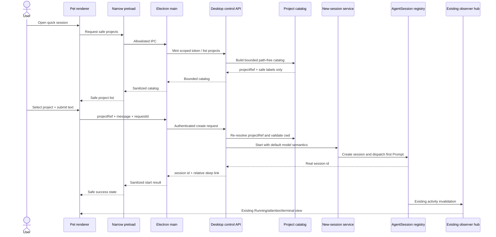
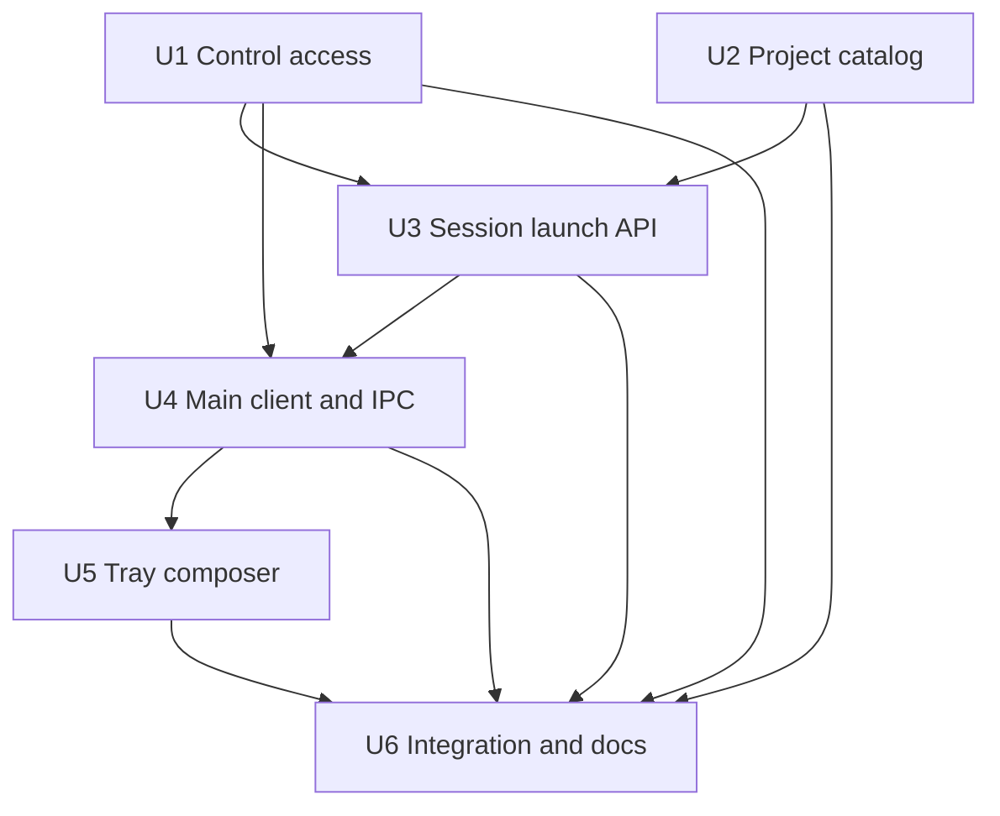
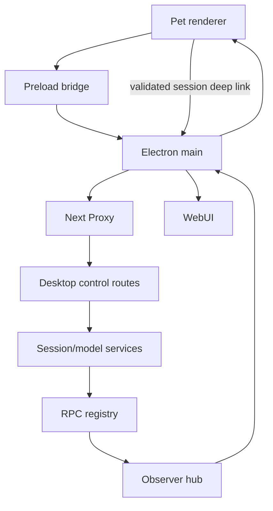

# feat: Add desktop pet quick sessions

## Overview

在现有 Windows 桌宠 Activity tray 中增加一个紧凑的“快速会话”入口：用户选择服务端已知项目、输入首条文字消息并立即启动真实 Agent 会话；桌宠随后继续通过现有 observer 展示状态，查看回复和继续对话仍进入 WebUI。

这是一个跨服务端权限、项目目录投影、AgentSession 生命周期、Electron main/preload/renderer 与 Windows 交互的安全敏感改动。实施必须保留 attach-only（不管理 `spi` 进程）、pet-only 打包和 observer 隐私协议，同时为主动写操作建立独立且最小化的 desktop-control 边界（see origin: `docs/brainstorms/2026-08-17-desktop-pet-quick-session-requirements.md`）。

---

## Problem Frame

当前桌宠只观察任务并通过 deep link 打开 WebUI。用户即使只想交代一句新任务，也必须先切换到浏览器、选择项目并进入新会话。服务端已经有创建真实会话并异步发送首条消息的能力，但现有 `/api/agent/new` 接收 raw cwd、依赖浏览器认证边界；现有 desktop observer token 则被明确设计为只读且 renderer payload 禁止 cwd/Prompt。

计划采用“窄写入、首条消息、默认配置”的方式补齐启动入口，而不是复用 observer token、直接暴露 `/api/agent/new`，也不建设桌宠内 mini-chat。

---

## Requirements Trace

- R1. 已连接且服务声明支持时，用户可从桌宠主动打开快速会话面板；被动状态更新不抢焦点。
- R2. 面板提供最近项目、搜索、文字输入、取消与启动。
- R3. 项目目录来自服务当前确认的活跃/归档会话项目；桌宠不新增任意目录。
- R4. 空白或超限消息不可提交，提交期间阻止重复动作。
- R5. 模型选择遵循现有 WebUI 新会话的默认语义，思考和工具不新增桌面选择器。
- R6. 同一用户确认在双击、超时和重试路径中至多启动一个会话。
- R7. 成功返回真实 session id，并由现有 observer 接管后续状态。
- R8. 独立、短时、有 scope 的 desktop-control token 仅在 Electron main；observer token 不升级为写权限。
- R9. Renderer 只提交 projectRef；服务端重新解析、规范化并验证 cwd。
- R10. 未发送/传输中的文字不进入桌宠设置、日志、通知、项目缓存或 observer snapshot。
- R11. 项目列表不包含 raw cwd、firstMessage 或历史正文；重名项目用安全辅助标签区分。
- R12. 成功后使用既有 allowlist session deep link；连续交互仍在 WebUI。
- R13. 连接、鉴权、项目、模型、初始化和结果不确定错误必须可区分，并保留草稿。

**Origin actors:** A1（桌宠用户）、A2（桌宠客户端）、A3（蜗牛派服务）

**Origin flows:** F1（快速启动会话）、F2（启动失败与恢复）、F3（转入完整会话）

**Origin acceptance examples:** AE1（单次成功启动并进入 Running）、AE2（超时重试不重复）、AE3（renderer payload 无敏感字段）、AE4（项目删除后拒绝）、AE5（高级配置/追问回到 WebUI）

---

## Scope Boundaries

- 只发送首条文字消息；不显示流式回复、历史消息或连续追问。
- 不支持图片、附件、`@` 文件引用、系统 Prompt 或会话模板。
- 不在桌宠中选择模型、思考等级或工具预设；不新增模型配置入口。
- 不新增项目、目录浏览、WorkTree 创建、归档管理或持久项目注册表。
- 不停止任务、不批准权限、不响应任意 extension UI、不执行 Quick Command。
- 不启动、停止、重启或监督 `spi`；桌宠与服务仍独立安装和运行。
- 不把 raw cwd、历史 Prompt、control/observer token 或访问密钥放入 renderer、通知、设置或 observer snapshot。
- 不把 desktop-control 设计成通用命令转发器；首版 scope 只允许项目列表和新会话启动。

### Deferred to Follow-Up Work

- 桌宠结构化 `ask_user` 单选应答继续由独立的 Proposed 方案处理；可复用通用 access primitives，但不得自动继承 quick-session scope。
- 从未创建会话项目的持久注册、桌宠内“添加项目”和跨服务实例持久幂等均留待单独需求。

---

## Context & Research

### Relevant Code and Patterns

- `app/api/agent/new/route.ts` + `lib/rpc-manager.ts`：现有新会话路径；`AgentSessionWrapper.send("prompt")` 已是 fire-and-forget，HTTP 可立即返回 session id，生命周期继续走 SSE/observer。
- `hooks/useAgentSession.ts` + `app/api/models/route.ts`：新会话优先使用有效 configured default，否则使用排序后第一个 available model；没有可用模型时 WebUI 阻止发送。
- `app/api/sessions/route.ts` + `lib/session-reader.ts` + `lib/session-index.ts`：项目摘要来自活跃 session index，归档 cwd/count 由 `scanArchivedCwds()` 补齐，归档 entry mtime 可用于 archived-only 排序；原响应含 cwd/firstMessage，不能直接下发桌宠。
- `lib/task-observer-agent.ts`：`buildProjectKeyFromCwd()` 已生成稳定 path-free 项目标识，observer 项目分组可与快速会话 catalog 对齐。
- `lib/desktop-observer-access.ts` + `app/api/desktop-observer/**`：direct IPv4 loopback、Origin、server-mode access key、短时哈希 token 和 instance 绑定的直接模式。
- `lib/server-access-policy.ts` + `proxy.ts`：Electron main 在 server mode 下无浏览器 cookie，必须由 Proxy 对 proven loopback companion namespace 放行，再由 route 自身完成强门控。
- `desktop/main/observer-client.ts` + `desktop/main/access-key-store.ts`：token/key 留在 main，支持 server-mode access key 和可注入 transport 测试。
- `desktop/main/ipc-contract.ts` + `desktop/preload/pet-preload.ts`：每个动作一个窄 bridge method，renderer 不获得 raw Electron API。
- `desktop/main/activity-store.ts`：renderer-bound payload 的 cwd/Prompt/token/absolute URL 泄露断言可复用于项目 catalog 和创建结果。
- `lib/desktop-deep-link.ts` + `desktop/main/deep-link-opener.ts`：成功会话可复用 `/?session=<id>` allowlist 和二次验证。
- `scripts/smoke-desktop-observer-api.ts`、`scripts/smoke-desktop-connection.ts`、`scripts/smoke-desktop-contract.ts`：访问域、main transport、IPC/UI/打包静态契约的现有测试分层。

### Institutional Learnings

- 仓库没有 `docs/solutions/` 记录；本计划以已接受的桌宠 observer ADR、模块文档和现有 smoke 约束为本地事实源。
- 历史桌宠设计持续强调“main 持有能力、renderer 只见安全投影”和“退出桌宠不影响任务”，本功能只在用户主动启动会话这一条路径上窄化扩展控制边界。

### External References

- Electron 官方安全清单要求保持 context isolation/sandbox/CSP、限制导航与窗口创建、验证所有 IPC sender，并避免把 raw `ipcRenderer` 暴露给 renderer。新 privileged IPC 必须显式校验来源并继续使用一动作一方法的 preload surface：<https://www.electronjs.org/docs/latest/tutorial/security>。

---

## Key Technical Decisions

| Decision | Chosen approach | Rationale |
| --- | --- | --- |
| Control authentication | 新增 `/api/desktop-control/**` 与独立 scoped token，按需 mint，建议 TTL 5 分钟 | 不把只读 observer token 静默变成写 token；main 可复用已保存 access key，renderer 永不见 token。 |
| Version compatibility | 在现有 observer protocol probe 增加可选 `quick_session` capability；不提升 task snapshot protocol version | 新桌宠连接旧服务时隐藏/禁用入口，旧桌宠忽略新增字段；不改变 observer snapshot。 |
| Project identity | 将现有 path-free project key 作为 projectRef；提交时重建 catalog 并要求唯一匹配 | 与 observer 分组一致、无需下发 cwd；哈希碰撞或目录失效一律拒绝而不是猜测。 |
| Project catalog | 合并活跃项目摘要与 archived-only cwd，过滤不存在目录，最多返回最近 100 项并报告 truncation | 覆盖 origin 首版范围，保持 payload 有界；不引入新持久注册表。 |
| Model/default behavior | 抽取现有模型 metadata，复用 WebUI 的“configured default，否则第一个 available”选择规则 | 不让桌宠产生与 WebUI 不同的隐式模型语义，也不新增模型 picker。 |
| Session launch | 抽取 `/api/agent/new` 的可复用新会话启动服务；浏览器 route 和 desktop route 调用同一生命周期 | 防止两套 session 创建、tool selection、allowed-root 和 prompt dispatch 逻辑漂移。 |
| Idempotency | 每个提交携带 requestId；所有无副作用预检通过后，在首个创建副作用前保存 body hash + in-flight/terminal outcome（不保存正文），建议保留 10 分钟 | 并发、双击和不确定重试收敛到同一 session id；相同 id 不同 payload 返回冲突；项目/模型修复后可重试而不被旧预检错误锁死。 |
| Instance restart | instance 变化使 control token/request context 失效；客户端不自动跨实例重放，提示结果不确定并要求先检查活动 | 避免为“全局 exactly-once”引入持久 Prompt 或修改 Pi session schema。 |
| Desktop surface | 复用当前 Activity tray 的覆盖式 composer，不创建第二个 BrowserWindow | 降低焦点、多屏、sender、生命周期和打包复杂度；仍满足“小弹窗”体验。 |
| Draft/privacy | 草稿只在 renderer 内存；关闭面板可保留，显式取消或成功后清空；不写 settings/localStorage | 满足失败恢复，同时不新增 Prompt 持久化面。 |

---

## Open Questions

### Resolved During Planning

- **是否复用 observer token：** 否；使用独立、有限 scope 的 control token。
- **projectRef 如何生成：** 复用 `buildProjectKeyFromCwd()`；catalog collision 时拒绝/省略冲突项，重名显示名追加 projectRef 短后缀。
- **幂等是否持久化：** 首版只保证单个服务 instance 内；跨 instance 不自动重放，不写持久 sidecar。
- **输入面板形态：** 首版使用 Activity tray 内覆盖层，不增加 BrowserWindow。
- **默认模型：** 与当前 WebUI 新会话一致：有效 configured default 优先，否则第一个 available；完全无模型时启动前失败。
- **DND 行为：** DND 只抑制主动通知/气泡/声音，不阻止用户显式发起快速会话；成功后的 observer 展示仍遵循既有 DND 规则。

### Deferred to Implementation

- Activity tray 内 composer 的最终尺寸、滚动区域和 100%–200% DPI 下的细节需要在真实 Windows 上调校；不得通过新增窗口绕过验收。
- Pi provider 在通过 metadata 预检后仍可能于异步首轮请求失败；该失败继续由现有 observer outcome 展示，桌面启动 API只承诺会话已创建并已派发 Prompt。
- 若 route handler 的 Next 运行时导入不适合纯 smoke，测试应通过注入式 domain seam 覆盖相同行为，而不是在计划阶段绑定具体 mocking 工具。

---

## Output Structure

```text
app/api/desktop-control/
  session/route.ts
  projects/route.ts
  quick-sessions/route.ts
lib/
  desktop-local-access.ts
  desktop-control-constants.ts
  desktop-control-access.ts
  desktop-project-catalog.ts
  desktop-quick-session.ts
  new-agent-session.ts
  model-metadata.ts
desktop/main/
  quick-session-client.ts
desktop/renderer/
  quick-session-state.ts
scripts/
  smoke-desktop-quick-session.ts
docs/architecture/decisions/
  desktop-pet-quick-session.md
```

该树是预期边界，不是实现代码约束；若实施中现有模块能承担职责，可减少文件，但不得合并 observer/control token 或把 server-only graph 打入桌宠包。

---

## High-Level Technical Design

> *This illustrates the intended approach and is directional guidance for review, not implementation specification. The implementing agent should treat it as context, not code to reproduce.*



关键状态边界：control response 只确认“会话已创建且 Prompt 已派发”；模型调用的异步成功/失败由现有 observer 生命周期表达。HTTP 网络不确定时仅可复用同一 requestId；instance 变化时禁止自动重放。

---

## Implementation Units



- [x] U1. **Establish the scoped desktop-control access boundary**

**Goal:** 增加与 observer 隔离的 loopback control session/token，并通过协议 capability 安全协商新旧桌宠/服务版本。

**Requirements:** R1, R8, R13；F2；AE3

**Dependencies:** None

**Files:**
- Create: `lib/desktop-local-access.ts`
- Create: `lib/desktop-control-constants.ts`
- Create: `lib/desktop-control-access.ts`
- Create: `app/api/desktop-control/session/route.ts`
- Modify: `lib/desktop-observer-access.ts`
- Modify: `lib/server-access-policy.ts`
- Modify: `proxy.ts`
- Modify: `desktop/main/connection-state.ts`
- Modify: `desktop/main/observer-client.ts`
- Test: `scripts/smoke-desktop-quick-session.ts`
- Test: `scripts/smoke-desktop-observer-api.ts`
- Test: `scripts/smoke-server-access-proxy.ts`

**Approach:**
- 只抽取 observer/control 共用的 direct IPv4 loopback、Host、Origin 和 server-mode access-key 校验；保留 observer 现有导出作为兼容 facade，避免行为漂移。
- Control token 使用独立 header、独立哈希 store、instance/remote/expiry 绑定和有限 `quick_session` scope；不得被 observer route 接受，反向亦然。
- Control session 在用户打开快速会话时按需 mint；Electron main 可提交现有安全存储中的 access key，token 不持久化、不下发 renderer。
- Proxy 只对 proven loopback 的 control namespace跳过浏览器 cookie/HTTPS门槛；所有 route 仍必须执行自身 Host/remote/token gate，control namespace不加入 public paths。
- Protocol probe 增加可选 capability 集合；旧 payload 缺少 capability 时 observer 仍可连接，但 `quickSessionAvailable=false`。

**Execution note:** 先补 observer gate 与 Proxy 的 characterization 覆盖，再抽公共访问逻辑和新增 control token；安全重构不得依赖静态字符串检查代替行为测试。

**Patterns to follow:**
- `lib/desktop-observer-access.ts` 的随机 token、哈希存证、timing-safe compare、instance/remote 绑定。
- `app/api/desktop-observer/session/route.ts` 的 bounded body、no-store 和缺 Origin 的 Electron main 语义。
- `proxy.ts` 的 desktop observer proven-loopback bypass + route 内二次门控。

**Test scenarios:**
- Happy path: direct `127.0.0.1` + Host `127.0.0.1` 在 local mode mint 仅含 quick-session scope 的 control token，projects/create route 可验证该 token。
- Integration: server mode 使用正确 access key mint；错误/缺失 key 返回稳定 `auth_required` / `auth_invalid`，并共享既有登录尝试预算。
- Security: non-loopback remote、`localhost` Host、forwarded non-loopback、跨端口/恶意 Origin均被拒绝；Electron main 缺 Origin 仍允许。
- Security: observer token 请求 control route、control token 请求 observer route、过期/篡改/不同 instance token 均返回 unauthorized。
- Compatibility: 新 server protocol 声明 quick-session capability，旧 server payload 无 capability 时连接保持成功但入口不可用；旧 client 可忽略新增字段。
- Regression: 现有 observer protocol/session/snapshot/events 和 server-access Proxy smoke 保持原语义。

**Verification:**
- Control namespace 在 local/server mode 都只能由 proven loopback + 有效 control token访问。
- 现有 observer token、protocol version、SSE 和 snapshot payload 无权限或格式回归。

---

- [x] U2. **Build a bounded path-free desktop project catalog**

**Goal:** 从现有 session/归档事实源生成可搜索、可解析、无 raw cwd/历史正文的桌面项目列表。

**Requirements:** R2, R3, R9, R11, R13；F1, F2；AE3, AE4

**Dependencies:** None

**Files:**
- Create: `lib/desktop-project-catalog.ts`
- Modify: `lib/task-observer-agent.ts`（仅在需要共享已存在的 project key/display-name 规则时）
- Test: `scripts/smoke-desktop-quick-session.ts`

**Approach:**
- 合并 `listProjectSummaries()` 的活跃 cwd 与 archived session index 中的 archived-only cwd，canonicalize、去重并检查目录仍存在；归档 index mtime 提供 archived-only 最近活动排序，`scanArchivedCwds()` 仅作为 membership/count fallback；不把完整 `ProjectSummary` spread 到输出。
- ProjectRef 复用 path-free project key，catalog 内维护 server-only ref→cwd 映射；提交时重新构建/解析，不信任客户端缓存。
- 输出只含 projectRef、basename displayName、重名辅助短标识、recent timestamp、archived/worktree 的安全分类和 truncation 元数据；禁止 cwd、firstMessage、latestSession、branch 文本和 Git 路径。
- 最近修改排序后最多返回 100 项；同一 projectRef 对应多个 canonical cwd 时省略冲突项并报告安全诊断，绝不任选一个目录。
- Resolver 对已删除目录、未知 ref、collision 和超出 catalog 的 ref 返回稳定错误码。

**Patterns to follow:**
- `lib/session-reader.ts#listProjectSummaries` 与 `lib/session-index.ts#getSessionIndexEntries` 的 index-backed 项目发现、mtime 和 malformed-file 隔离。
- `lib/task-observer-agent.ts#buildProjectKeyFromCwd` / `buildProjectDisplayNameFromCwd` 的 path-free 身份。
- `lib/task-observer-projection.ts` 的 bounded projection 与 deterministic truncation。

**Test scenarios:**
- Covers F1 / AE3. Happy path: 活跃项目与 archived-only 项目都被投影，按最新活动排序，serialized payload 无 cwd/firstMessage/latestSession/Prompt。
- Edge case: 活跃与归档重复 cwd 合并为一项；Windows 大小写/分隔符变体 canonicalize 后不重复。
- Edge case: 两个相同 basename 项目得到不同且稳定的安全辅助标签，不暴露父目录或 branch。
- Error path: 目录在 catalog 构建后删除，提交时 resolver 返回 `project_unavailable`，不回退到 process cwd。
- Security: 人工构造 project-key collision 时两个冲突目录均不可解析；任意 raw path 不能作为 projectRef 通过。
- Boundary: 超过 100 项时结果有 deterministic truncation，最新项目保留且 encoded payload 维持预算。

**Verification:**
- Renderer 可区分和选择已知项目，但任何 catalog/错误对象都不包含路径或历史会话内容。
- Resolver 只返回当前 catalog 中唯一、存在的 canonical cwd。

---

- [x] U3. **Create the shared idempotent quick-session service and routes**

**Goal:** 让 WebUI 与桌宠复用同一新会话启动生命周期，并为桌面提交增加默认模型预检、有界输入、幂等和稳定错误语义。

**Requirements:** R4–R10, R12, R13；F1–F3；AE1, AE2, AE4, AE5

**Dependencies:** U1, U2

**Files:**
- Create: `lib/model-metadata.ts`
- Create: `lib/new-agent-session.ts`
- Create: `lib/desktop-quick-session.ts`
- Create: `app/api/desktop-control/projects/route.ts`
- Create: `app/api/desktop-control/quick-sessions/route.ts`
- Modify: `app/api/models/route.ts`
- Modify: `app/api/agent/new/route.ts`
- Test: `scripts/smoke-desktop-quick-session.ts`
- Test: `scripts/smoke-chat-provider-errors.ts`（仅当共享模型就绪语义影响现有分类时）

**Approach:**
- 将 models route 的 metadata/cache 构建提取为共享 server module，保持 `/api/models` 响应、缓存和 primary-candidate 排序不变；为 quick session 复用“configured default，否则第一个 available”的选择语义。
- 将 `/api/agent/new` 的 cwd 检查、随机临时启动键、AgentSession 创建、allowed-root 注册、model/thinking/tool 应用和 Prompt dispatch 抽成共享服务；浏览器 route 保持现有 images/model/thinking/tool payload 兼容。
- Desktop projects route 只返回 U2 安全 catalog。Create route 接受 bounded JSON（建议 32 KiB body、8,000 字符 message）、projectRef、UUID-like requestId；拒绝未知字段中可能携带 cwd/path/token 的能力扩张。
- Desktop route 固定使用解析出的默认 model、现有默认 thinking 和 `all` 工具语义；无可用 model 时在创建 session 前返回 `model_unavailable`。
- 使用 process-global、instance-scoped idempotency registry：body/project/model 等无副作用预检先完成；紧邻首个 session 创建副作用前原子写入 body hash + in-flight promise，成功保存 session id/deep link，副作用阶段失败保存稳定 terminal/unknown outcome，TTL 建议 10 分钟；registry 不保留 message/cwd 明文。
- 同 requestId + 同 hash 返回同一 in-flight/terminal outcome；同 id + 不同 hash 返回 conflict。纯预检失败不写 registry，配置或项目修复后可用原 requestId重试；服务 instance 变化后旧 token 无效，route 不跨 instance恢复。
- 成功只返回真实 session id、relative agent deep link 和 duplicate 标记；不回显 message、cwd、model auth 或内部错误。异步 provider 结果继续由 observer 表达。

**Execution note:** 以 domain-level failing scenarios 先固定 browser parity、project revalidation 和 concurrent idempotency，再接 route；不要通过复制 `/api/agent/new` 代码获得短期通过。

**Patterns to follow:**
- `app/api/agent/new/route.ts` 的当前浏览器兼容载荷与 `registerAllowedRoot` 时机。
- `lib/rpc-manager.ts#startRpcSession` 的 single-wrapper/start-lock 不变量和 fire-and-forget Prompt。
- `hooks/useAgentSession.ts` 的新会话 model fallback 规则。
- `lib/desktop-deep-link.ts#buildAgentDeepLink` 的 allowlisted session target。

**Test scenarios:**
- Covers F1 / AE1. Happy path: 有效 projectRef + 非空 message 创建一次真实 session-starter 调用，返回 session id/deepLink，传入 default/fallback model、默认 thinking 和标准工具选择。
- Covers AE2. Concurrency: 两个同时到达的相同 requestId/body 共享一个 in-flight start，二者得到同一 session id；完成后重试仍返回相同结果。
- Error path: 相同 requestId 携带不同 projectRef/message hash 返回 conflict，starter 未再次调用；项目/model纯预检失败不占用 idempotency entry，修复后相同请求可重新预检。
- Covers AE4. Error path: unknown/stale/deleted/collision projectRef 在 starter 前失败，不使用请求 cwd、process cwd 或任意 fallback。
- Boundary: 空白、8,001 字符、超 body 预算、非法 requestId、非 JSON 和 capability-smuggling 字段被稳定拒绝且不进入日志/registry。
- Model path: configured default 可用时选中它；default 无效但列表非空时选第一项；列表空时 `model_unavailable` 且不创建 session。
- Browser regression: `/api/agent/new` 仍支持显式 model/thinking/tool/images，并返回与重构前相同 success/error envelope。
- Lifecycle integration: shared starter 返回后，Prompt 已派发且现有 task observer 会收到 Running invalidation；HTTP 不等待模型完成。
- Privacy: idempotency registry、error response 和 serialized result 不含 message、cwd、access key、token 或 raw provider error。

**Verification:**
- Browser 和 desktop 新会话不再有两套 AgentSession 创建逻辑。
- 单 instance 内重复/并发提交不会创建第二个会话；输入/项目/模型错误在创建前失败并使用稳定 code。

---

- [x] U4. **Add the main-process quick-session client and privileged IPC**

**Goal:** 由 Electron main 独占 control token/access key/HTTP，向 renderer 暴露两个有界动作：列项目与启动首条消息。

**Requirements:** R1, R4, R6–R13；F1–F3；AE2, AE3

**Dependencies:** U1, U3

**Files:**
- Create: `desktop/main/quick-session-client.ts`
- Modify: `desktop/main/main.ts`
- Modify: `desktop/main/ipc-contract.ts`
- Modify: `desktop/main/activity-store.ts`
- Modify: `desktop/preload/pet-preload.ts`
- Modify: `desktop/main/observer-client.ts`
- Test: `scripts/smoke-desktop-connection.ts`
- Test: `scripts/smoke-desktop-contract.ts`
- Test: `scripts/smoke-desktop-quick-session.ts`

**Approach:**
- Quick-session client 使用与 observer client 一致的 injectable fetch/connection classification，但独立持有 control token；token 仅按需 mint，并使用 main 已持有的 access key。
- GET/list 在 token 过期时可 remint 后重试；create 只有在保持同一 requestId 时才可重试。网络结果不确定或 instance 变化时返回明确状态，不生成新 requestId 自动重放。
- Main 对 renderer input 再做 projectRef/requestId/message 类型与长度检查，对 server output 做 schema/隐私断言；不把 token、cwd、message echo 或 raw error放进 `DesktopActivityView`。
- Protocol capability 投影为安全布尔值，供 renderer 决定入口可用性；连接断开、旧服务或无 control permission 时不发起请求。
- 新 IPC handler 必须验证 sender 正是当前 pet window 的 top-level local renderer；preload 每个动作暴露独立方法，不暴露 `ipcRenderer`、通用 invoke、URL 或 header 参数。
- Access key 设置/清除和退出流程同步更新/清空 quick-session client；退出只取消 client 请求，不影响已启动 session。

**Patterns to follow:**
- `desktop/main/observer-client.ts` 的 transport injection、token expiry 和 instance reset。
- `desktop/preload/pet-preload.ts` 的 allowlist channel + callback event stripping。
- `desktop/main/activity-store.ts#assertRendererViewSafe` 的 nested forbidden-key 检查。
- Electron 官方 sender validation 与最小 contextBridge 建议。

**Test scenarios:**
- Happy path: connected + capability server 下，renderer list invocation 经过 main 获取安全 catalog；create invocation 返回 session id/deepLink，不返回 control token。
- Server mode: main 使用安全存储 key mint control token；key 更新/清除后旧 control token 被丢弃并按新状态处理。
- Token expiry: list 自动 remint；create 使用相同 requestId重试并由 server idempotency 收敛。
- Covers AE2. Network uncertainty: response 丢失时客户端保留同一 requestId并返回 `result_unknown`；service instance 改变时禁止自动 POST。
- Security: 非 pet window sender、subframe、非法 channel、超限 message、raw cwd/project path 和 renderer-supplied URL/header均被 main拒绝。
- Security: preload source 无 token/accessKey getter、raw ipcRenderer 或通用 fetch；project/result payload 通过 renderer safety assertion。
- Compatibility: protocol 无 quick-session capability 时 observer 功能正常、quick IPC 返回 feature unavailable且不探测 create route。
- Lifecycle: quick client quit/renderer reload只取消本地网络，不 abort 已成功创建的 AgentSession。

**Verification:**
- 只有经过验证的 pet renderer 可以请求 main 发起 quick-session control 操作。
- Renderer 观察不到 control token、access key、raw cwd 或 server内部错误，旧 server仍可作为只读 observer 使用。

---

- [x] U5. **Implement the in-tray quick-session composer**

**Goal:** 在现有 Activity tray 内实现可访问、低干扰、保草稿的项目选择与首条消息启动体验。

**Requirements:** R1–R7, R11–R13；F1–F3；AE1–AE5

**Dependencies:** U4

**Files:**
- Create: `desktop/renderer/quick-session-state.ts`
- Modify: `desktop/renderer/index.html`
- Modify: `desktop/renderer/pet-app.tsx`
- Modify: `desktop/renderer/pet.css`
- Modify: `desktop/renderer/pet-app.js`（由现有 desktop build 生成并提交）
- Modify: `scripts/preview-desktop-pet-states.mjs`
- Test: `scripts/smoke-desktop-contract.ts`
- Test: `scripts/smoke-desktop-quick-session.ts`

**Approach:**
- Activity tray header 增加“快速会话”主入口；打开后在同一窗口切换到覆盖式 composer，Activity list、settings 与 composer 保持互斥，不创建第二 BrowserWindow。
- 建立纯 renderer 状态 reducer：closed/loading/editing/submitting/success/error；保存 project list、筛选、selected ref、draft、稳定 requestId 和 error code，不保存 token/cwd。
- 打开时按 recent 顺序默认选择首项并聚焦输入；本地搜索仅匹配 server-provided safe labels。无项目、truncated、旧 server 和 disconnected 各有明确空态/恢复动作。
- Plain Enter 输入换行，Ctrl/Cmd+Enter 提交；IME composition 期间不得误提交。空白/超限/提交中按钮禁用并有非颜色状态。
- requestId 绑定一次提交快照：首次点击到网络不确定重试始终复用同一 id；错误后若用户修改项目或正文则生成新 id，避免同 id/different hash冲突。可重试错误保留 draft；关闭/收起 tray和被动 snapshot更新保留内存草稿，显式取消或成功后清空。
- 成功态显示项目、安全 session 标识、“打开会话”和“再开一个”；打开会话继续走既有 main deep-link allowlist。桌宠不订阅 chat SSE、不展示回复。
- DND 不阻止主动打开/提交；提交成功后的通知/气泡继续遵循现有 DND。被动 observer/connection 更新不得自动 show/focus composer。
- Preview 增加 editing、submitting、success、error/empty 代表状态，覆盖小/中/大尺寸和 reduced-motion 静态契约。

**Patterns to follow:**
- `desktop/renderer/pet-app.tsx` 的 settings/activity 互斥、safe DOM construction、keyboard selection 与 timer cleanup。
- `desktop/renderer/pet-state.ts` 的 pure reducer + smoke-importable state helpers。
- `desktop/renderer/index.html` 当前 strict CSP（`connect-src 'none'` 保持不变）和 semantic roles。
- `desktop/main/window-manager.ts` 的 360×480 tray geometry、focus/reveal 原则和多屏 clamp。

**Test scenarios:**
- Covers F1 / AE1. Happy path: 打开 composer → 项目列表加载 → 默认最近项目 → 输入文字 → 单次提交 → success → 活动随后进入现有 Running 列表。
- Input boundaries: whitespace-only、恰好上限、超过上限、含 emoji/中日韩文本均有确定计数和提交行为。
- Keyboard/accessibility: Tab 顺序可达项目搜索/列表/textarea/按钮，Escape 关闭但保留草稿，显式取消清空；Ctrl/Cmd+Enter提交，IME composition Enter不提交。
- Covers AE2. Duplicate protection: 双击/键盘重复事件在 submitting状态只触发一次 bridge call；result-unknown原样重试复用 requestId，错误后编辑正文或换项目会轮换 id。
- Error recovery: disconnected/auth/project/model/start/result-unknown错误显示不同安全文案，draft和选择保留；无 raw error/path。
- State lifecycle: tray 收起、settings切换、observer revision更新、DND切换和 renderer state refresh都不覆盖 draft或主动抢焦点。
- Covers AE3. Privacy: DOM/project option/success/error 不渲染 cwd、firstMessage、token或历史 Prompt；重名项目使用安全短标识。
- Covers AE5. Scope: success态只有打开 WebUI/再开一个，不出现模型、工具、回复流或 follow-up输入。
- Visual: 100%–200% DPI、三种 pet scale、四个 tray anchor下 composer不裁切；reduced-motion无装饰动画但状态仍可读。

**Verification:**
- 用户可在现有桌宠窗口内完成三步启动，失败不丢草稿、重复操作不产生第二次调用。
- UI 未引入网络权限、新窗口或完整 Chat 功能，现有 Activity tray/设置/宠物交互保持可恢复。

---

- [x] U6. **Close integration, compatibility, documentation, and release gates**

**Goal:** 用跨层 smoke、版本兼容、桌面包约束和文档更新证明功能可发布且未改写既有产品边界。

**Requirements:** R1–R13；F1–F3；AE1–AE5

**Dependencies:** U1, U2, U3, U4, U5

**Files:**
- Create: `docs/architecture/decisions/desktop-pet-quick-session.md`
- Modify: `package.json`
- Modify: `desktop/package.json`
- Modify: `AGENTS.md`
- Modify: `docs/plans/README.md`
- Modify: `docs/architecture/overview.md`
- Modify: `docs/architecture/decisions/desktop-pet-task-observer.md`（增加被本 ADR 窄化扩展的说明，不重写历史决定）
- Modify: `docs/modules/api.md`
- Modify: `docs/modules/frontend.md`
- Modify: `docs/modules/library.md`
- Modify: `docs/deployment/README.md`
- Modify: `desktop/README.md`
- Modify: `docs/operations/desktop-pet-validation.md`
- Modify: `docs/operations/desktop-pet-visual-review.md`
- Test: `scripts/smoke-desktop-quick-session.ts`
- Test: `scripts/smoke-desktop-package.mjs`
- Test: `scripts/smoke-desktop-contract.ts`

**Approach:**
- 新增独立 `test:desktop-quick-session` smoke 并纳入 `test:desktop-observer` 聚合；专项 smoke 覆盖 server domain + main client contract，现有 observer/contract/package smokes覆盖不变量回归。
- ADR 明确：桌宠仍 attach-only、不管理服务、不成为完整 WebUI；observer snapshot/SSE 继续只读且不含正文，protocol probe 只增加 additive capability，新增的是用户主动触发的 scoped control surface。
- 文档同步 control routes、projectRef/Prompt 隐私、模型默认语义、旧 server capability fallback、server-mode access key和故障排查。
- Desktop 包描述从“observer only”调整为“task observer + quick-session initiator”，但 package contract继续禁止 Next/pi SDK/server runtime、`child_process` 和服务 PID。
- Windows 手工矩阵加入：local/server mode、中文 IME、多屏/DPI、DND、click-through恢复、旧服务兼容、超时同 requestId重试、项目删除、打开 deep link和退出桌宠不影响新会话。
- 发布顺序允许 server先于 desktop：能力字段为 additive；desktop先升级且 server不支持时功能隐藏/说明升级，不破坏观察。

**Patterns to follow:**
- `docs/architecture/decisions/desktop-pet-task-observer.md` 的进程/隐私/失败语义结构。
- `docs/operations/desktop-pet-validation.md` 的自动 smoke 与真实 Windows 未执行项分离。
- `package.json#test:desktop-observer` 的专项套件聚合。

**Test scenarios:**
- Covers F1 / AE1. Integration: mocked/in-process full path从 safe catalog、renderer submission、main control client、idempotent starter到 observer Running projection只创建一个 session。
- Covers F2 / AE2. Integration: create response丢失后同 requestId重试返回原 session；instance变化停止重放并给出 result-unknown恢复路径。
- Covers AE3. Package/static: renderer/preload/bundle无 control token/raw cwd/Prompt持久化、raw ipcRenderer、server imports、Node integration或新增 connect-src。
- Compatibility: old desktop + new server、new desktop + old server、local mode、server mode有效/无效 access key均有明确预期。
- Regression: task-observer、desktop observer API/deep links/connection/contract/package、server-auth proxy和 agent prompt lifecycle专项均通过。
- Manual Windows: 小/中/大尺寸、四角 anchor、100%/150%/200% DPI、双屏、IME、键盘、reduced motion、DND、隐藏/退出语义记录实际结果；未执行项不宣称通过。

**Verification:**
- Lint、strict type-check、quick-session专项、desktop observer聚合、server-access与agent lifecycle回归均无错误。
- Checked-in `desktop/renderer/pet-app.js` 与 TypeScript source同步，pet-only package scan无新增运行时依赖。
- 文档能够准确解释功能可用条件、隐私边界、版本兼容和故障恢复；真实 Windows未验证项被明确记录。

---

## System-Wide Impact



- **Interaction graph:** 新增 renderer→preload→main→control API→shared session starter→RPC registry 路径；会话启动后仍走 RPC→observer hub→main→renderer，完整对话通过 deep link进入 WebUI。
- **Error propagation:** server只返回稳定 code和安全 metadata；main将 token/transport/instance错误归一化；renderer映射本地文案并保留草稿。异步 provider错误不回灌 create response，而由现有 observer outcome呈现。
- **State lifecycle risks:** control token、draft和 idempotency均有不同生命周期。Token/main memory、draft/renderer memory、idempotency/server memory必须独立清理；任一层不得持久化 message。instance变化同时失效 token与自动重试资格。
- **API surface parity:** `/api/agent/new` 与 `/api/models` 对浏览器保持兼容；desktop control不接受浏览器 cookie替代 token，也不成为通用 `/api/agent/*` 代理。
- **Integration coverage:** 单层测试不能证明重复提交只创建一个 RPC wrapper、success deep link可打开、或 observer立即出现 Running；U6 browser-free跨层 smoke和 Windows手工矩阵共同覆盖。
- **Unchanged invariants:** task observer protocol/snapshot不含 cwd/Prompt；`globalThis.__piSessions` / `__piStartLocks` 单会话不变量不变；桌宠不管理 `spi`、不导入 server/pi SDK、不因退出而停止任务；deep link仍只能是 allowlisted relative URL。
- **Stakeholders:** 用户获得更短启动路径；开发者新增安全敏感 companion API和双端版本兼容；发布/QA需要同时关注独立 server npm包与桌宠安装包的错版本组合。

---

## Alternative Approaches Considered

- **让 Electron main 直接调用 `/api/agent/new`：** 拒绝。该 route接受 raw cwd且依赖浏览器/全局 auth语义，无法证明 renderer未扩大目录权限，也无法提供 desktop专用 idempotency和版本能力协商。
- **复用 observer token 增加 POST：** 拒绝。会把所有 observer token升级为写能力，破坏现有只读承诺，并使未来 scope无法独立审计。
- **为每次提交 mint 单次 capability：** 首版不采用。用户主动创建会话不涉及第三方 pending request；短时 scoped control token + request idempotency已覆盖威胁，单次 capability会增加无必要状态。未来响应 `ask_user` 仍需独立 request-bound capability。
- **创建独立 quick-session BrowserWindow：** 首版拒绝。当前 360×480 tray足以容纳首条消息，新增窗口会扩大 sender、焦点、DPI、virtual desktop和生命周期测试面。
- **建立持久项目 registry 与跨重启 idempotency sidecar：** 延后。当前 WebUI项目列表本身以 session事实源为主，持久化会新增数据迁移、清理与隐私成本，不是本次价值前提。
- **完整 mini-chat：** 产品范围拒绝。会复制 chat SSE、模型/工具、附件、extension UI和失败恢复，违背 origin 的首条消息边界。

---

## Risks & Dependencies

| Risk | Likelihood | Impact | Mitigation |
| --- | --- | --- | --- |
| Proxy loopback bypass使 control route意外匿名可写 | Medium | High | 独立 route token、Host/remote/origin二次门控、observer/control token交叉拒绝、server-auth回归。 |
| Renderer或其他 webContents调用 privileged IPC | Medium | High | 验证 top-level pet sender、窄 bridge、无 raw ipcRenderer、CSP/导航/窗口禁用保持。 |
| 超时/双击创建重复 session | Medium | High | requestId + body hash + in-flight promise + terminal result TTL；UI提交锁；instance变化不自动重放。 |
| ProjectRef stale/collision映射到错误 cwd | Low | High | 提交时重建 catalog、canonical directory check、unique-only resolution，无 cwd fallback。 |
| Prompt泄露到日志/settings/observer | Low | High | 禁止 echo/log，idempotency只存 hash，renderer draft仅内存，静态 forbidden-field和序列化测试。 |
| 默认模型语义与 WebUI漂移 | Medium | Medium | 抽取共享 model metadata/selection并保留 browser response parity测试。 |
| 新旧 server/desktop独立发布导致入口失败 | High | Medium | additive protocol capability；旧 server隐藏功能，observer继续可用；文档版本提示。 |
| Activity tray新增输入破坏焦点、IME或多屏布局 | Medium | Medium | 同窗覆盖层、pure reducer、键盘/IME smoke、preview与真实 Windows DPI矩阵。 |
| 大项目数量导致 catalog延迟/过大 | Low | Medium | session index复用、100项最近排序、truncation、无全目录递归。 |
| Session创建后 provider异步失败被误报为启动失败/成功 | Medium | Medium | 明确 success只表示“已创建并派发”；provider outcome交给 observer，文案和测试区分。 |

**Dependencies:** 兼容的本地 `spi` 服务、现有 server-mode access key、安全存储、Pi model registry和 AgentSession lifecycle。无新第三方运行时依赖。

---

## Success Metrics

- 用户在桌宠内通过项目选择和一段文字即可创建真实会话，且无需先打开浏览器。
- 并发/双击/同 requestId重试测试中的 starter调用次数恒为一次。
- Quick-session所有 renderer-bound payload通过 cwd/Prompt/token/firstMessage泄露断言。
- 新旧版本错配时 observer仍可用，quick-session入口不会发起不支持的写请求。
- 项目、模型和连接失败保留草稿并提供可操作恢复；成功后现有 observer及时显示活动。

---

## Documentation / Operational Notes

- 新 ADR 必须明确它只窄化扩展旧 observer ADR 的“WebUI是唯一启动面”结论，不推翻 attach-only、无服务进程控制、pet-only包装和完整交互回 WebUI。
- `docs/modules/api.md` 记录 control routes的 loopback/token/access-key/body预算与稳定错误，不把它描述为 public/local-trusted通用 API。
- `desktop/README.md` 与部署文档解释 server与桌宠需独立升级，旧 server下快速会话不可用但观察正常。
- 真实 Windows验证必须记录安装包版本、server版本、显示缩放、屏幕布局、DND/IME条件；未执行签名/安装器矩阵继续标为未验证。
- 不新增 telemetry或Prompt审计；故障排查只记录 code、instance/session/request identity和时间，不记录正文/cwd。

---

## Sources & References

- **Origin document:** [`docs/brainstorms/2026-08-17-desktop-pet-quick-session-requirements.md`](../brainstorms/2026-08-17-desktop-pet-quick-session-requirements.md)
- Related architecture: [`docs/architecture/decisions/desktop-pet-task-observer.md`](../architecture/decisions/desktop-pet-task-observer.md)
- Related proposed control design: [`docs/architecture/decisions/desktop-pet-ask-user-interaction.md`](../architecture/decisions/desktop-pet-ask-user-interaction.md)
- Existing server entry: `app/api/agent/new/route.ts`
- Existing lifecycle: `lib/rpc-manager.ts`
- Existing desktop access gate: `lib/desktop-observer-access.ts`
- Existing Electron boundary: `desktop/main/ipc-contract.ts`, `desktop/preload/pet-preload.ts`
- External security guidance: [Electron Security](https://www.electronjs.org/docs/latest/tutorial/security)
