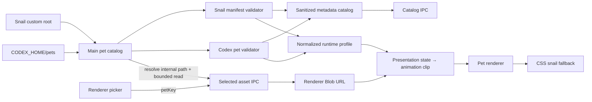

# feat: Add native Codex pet resource compatibility

## Overview

在不移除现有蜗牛派 `manifest.json` 资源格式的前提下，增加 Codex v1/v2 `pet.json + spritesheet.webp` 原生兼容层。实现从“扫描时读取并 base64 推送所有位图”调整为“目录元数据扫描 + 当前选择项按需加载”，再用统一 runtime profile 将两种 atlas 映射到蜗牛派现有 8 个业务展示状态。

首轮完成本地目录直通、标准动作播放、设置迁移和安全回退；v2 16 向注视与拖动方向动作作为同一能力的增强单元落地。`.codex-pet.zip` 一键导入单独后续实现，不阻塞官方 `hatch-pet` 目录产物直接使用。

---

## Problem Frame

当前自定义资源能力已经解决安全目录扫描、manifest 校验、renderer 隔离和 spritesheet 播放，但契约与 Codex 不兼容，并且 256 KB 单文件限制、2048 px 尺寸限制和全量 base64 IPC 不适合 2–3 MB 的 Codex atlas。直接提高现有限制会放大启动内存和 IPC 成本，也会混淆两种资源规范。

方案需要复用现有安全边界，同时让 `${CODEX_HOME:-~/.codex}/pets/<id>/pet.json + spritesheet.webp` 成为一等本地资源来源（see origin: `docs/brainstorms/2026-08-18-codex-pet-resource-compatibility-requirements.md`）。

---

## Requirements Trace

- R1. 保留现有内置资源与蜗牛派自定义 manifest。
- R2. 原生支持 Codex v1 8×9 和 v2 8×11 atlas。
- R3. 安全解析 `pet.json` 已知展示字段，未知字段不进入能力面。
- R4. 蜗牛派业务状态仍是事实来源，Codex action 仅作表现映射。
- R5. v2 注视方向、v1 和 reduced-motion 有明确能力回退。
- R6. 目录元数据与大型位图分离，位图按选择项加载并释放。
- R7. 保持 root containment、类型、大小、数量、图片尺寸和 renderer 隔离。
- R8. 资源 key 能区分格式/来源并迁移现有选择设置。
- R9. 任何资源错误都回退内置 CSS 蜗牛。
- R10. 本地加载不自动赋予第三方资源再分发许可。

**Origin actors:** A1（桌宠用户）、A2（资源制作者）、A3（Electron main）、A4（renderer）

**Origin flows:** F1（自动发现）、F2（原生播放）、F3（复用 Codex 生成工作流）

**Origin acceptance examples:** AE1–AE7

---

## Scope Boundaries

- 不建立在线资源市场、远程下载、云同步或资源自动更新。
- 不删除或迁移 `skills/desktop-pet-assets` 与现有自定义资源格式。
- 不把 Codex atlas 离线转换为项目 4×8 图集。
- 不把 `codex-ui-resouce/` 中样例素材提交为仓库资源或测试夹具。
- 不修改 observer wire、任务状态优先级、通知、声音或 Activity tray 业务语义。

### Deferred to Follow-Up Work

- `.codex-pet.zip` 文件选择、安全解压、冲突确认和导入审计：单独桌宠资源导入切片。
- 在线社区资源发现、许可证索引和更新：独立产品能力。

---

## Context & Research

### Relevant Code and Patterns

- `desktop/main/custom-pets.ts`：现有自定义资源扫描、大小门禁和安全 renderer payload。
- `desktop/renderer/pet-assets.ts`：蜗牛派 manifest v2 的严格 validator，应继续作为独立 profile，而不是放宽成混合 schema。
- `desktop/renderer/pet-state.ts`：8 个业务展示状态、manifest 注册和 CSS fallback。
- `desktop/renderer/pet-sheet.ts`：当前单行连续帧与统一时长的 CSS spritesheet runtime。
- `desktop/renderer/pet-app.tsx`：资源注册、图片解码失败回退、角色选择、指针和拖动生命周期。
- `desktop/main/ipc-contract.ts`、`desktop/preload/pet-preload.ts`、`desktop/main/main.ts`：受控 IPC、资源刷新和主进程文件访问边界。
- `desktop/main/settings-store.ts`：`selectedPetId` 持久化和 v1 设置归一化。
- `scripts/smoke-desktop-contract.ts`：桌宠 manifest、spritesheet、custom pets、设置、IPC 与 renderer 静态契约测试入口。

### Sample Findings

- `codex-ui-resouce/extracted/blue-whale-maid/`：`pet.json` + 2,743,918-byte RGBA WebP，1536×2288。
- `codex-ui-resouce/extracted/minato/`：`pet.json` + 2,296,232-byte RGBA WebP，1536×2288。
- 两者均为 8×11、192×208 单元格、`spriteVersionNumber: 2`，且 `pet.json` 包含可选 `kind`。
- 样例证明当前 256 KB、2048 px 高度和全量 base64 设计不能直接复用。
- 样例 ZIP 不含作者、来源或许可证，不能据此认定可再分发；`minato` 还涉及明确的第三方角色形象。

### External References

- OpenAI 公共 `hatch-pet` skill 定义 v1 的 9 行标准动作与 192×208 单元格。
- Codex v2 社区同步规范在前 9 行动作之外增加 2 行 16 向注视，并要求 `spriteVersionNumber: 2`。
- 公开资源同时存在 v1/v2，运行时不应只接受单一版本。

---

## Key Technical Decisions

- **保持两个外部 schema，归一为一个内部 runtime profile。** `pet-assets.ts` 不放宽为 Codex schema；新增 Codex parser，再投影成共享 clip 描述。
- **使用 namespaced `petKey`，不把外部 id 直接当运行时唯一标识。** 建议语义为 `snail:<id>` / `codex:<id>`；CSS token 单独生成安全值，避免冒号和任意外部文本进入 selector/keyframe 名。
- **扫描两个本地来源。** 现有 `~/.pi/agent/desktop-pets` 继续承载蜗牛派包，也可识别解压后的 Codex 包；`${CODEX_HOME:-~/.codex}/pets` 作为只读 Codex 发现根。
- **同一个 Codex id 的重复项采用确定性优先级。** 蜗牛派自定义根中的显式副本优先于 Codex 根；返回有界 duplicate 诊断，不显示两个不可区分条目。
- **目录与位图分离。** 扫描只读取小 manifest 和 stat；renderer 通过 catalog key 请求当前选择项，main 从内部 catalog 解析路径并返回有界二进制，不接受 renderer 传入文件路径。
- **renderer 使用 Blob URL。** IPC 传有界字节和 MIME；renderer 本地创建/revoke object URL，CSP 仅增加 `blob:` 图片来源，不增加网络能力。
- **Codex profile 使用固定 atlas 常量。** v1：8×9；v2：8×11；均为 192×208。标准 row 顺序和帧数由内置 profile 定义，`pet.json` 不得声明命令、脚本或运行时能力。
- **业务状态映射固定在表现层。** 初始映射如下，文字/glyph 仍来自蜗牛派状态：

| 蜗牛派状态 | Codex clip | 说明 |
| --- | --- | --- |
| `idle` | `idle` | 空闲主循环 |
| `running` | `running` | 非方向性工作动画 |
| `retrying` | `review` | 表达重新检查/再尝试，保留 `↻` 状态提示 |
| `needs_input` | `waiting` | 等待批准、回答或输入 |
| `ready` | `jumping` | 完成庆祝 |
| `blocked` | `failed` | 失败/受阻 |
| `disconnected` | `failed` 静态或低动效 | 由 `⚠/未连接` 覆盖精确语义 |
| `service_not_running` | `idle` 静态并降级显示 | 由 `⏻/未启动` 覆盖精确语义 |

- **额外动作是能力增强，不改变业务状态。** v2 look rows 用于空闲指针注视；`running-right/left` 可用于拖动方向；`waving` 可保留给后续问候/交互反应。
- **加载容错与质量校验分离。** 版本、路径、尺寸、类型为硬错误；未使用单元格存在像素、动作质量不足等为诊断/质检警告，不阻止用户本地加载。

---

## Open Questions

### Resolved During Planning

- 是否替换现有资源格式：否，双格式并存。
- 是否使用离线转换器作为主路径：否，Codex atlas 原生播放。
- 是否首轮支持 ZIP 一键导入：否，先支持解压目录与 Codex 根自动发现。
- 是否自动打包下载样例：否，缺少许可证和来源证明。

### Deferred to Implementation

- Codex 资源单文件硬上限的最终值：根据公开/本地资源分布设定保守上限并记录验证证据；不能简单沿用 256 KB，也不能无界提高。
- 动画最后一帧停留时长是否完全复刻 Codex App：先按公开 profile 常量实现，实际动效在 preview/桌面实机中调整，不改变资源格式。
- `disconnected` / `service_not_running` 是否附加灰度滤镜：由实际可读性矩阵决定；状态文字和 glyph 已是必须保留的主语义。

---

## High-Level Technical Design

> *This illustrates the intended approach and is directional guidance for review, not implementation specification. The implementing agent should treat it as context, not code to reproduce.*

---

## Implementation Units

- [x] U1. **Define Codex resource contract and normalized runtime profile**

**Goal:** 独立解析 Codex v1/v2 metadata，并把蜗牛派 manifest 与 Codex fixed atlas 投影为统一的只读动画 profile。

**Requirements:** R1–R5, R9

**Dependencies:** None

**Files:**
- Create: `desktop/renderer/codex-pet-assets.ts`
- Create: `desktop/renderer/pet-runtime-profile.ts`
- Modify: `desktop/renderer/pet-assets.ts`
- Modify: `desktop/renderer/pet-state.ts`
- Test: `scripts/smoke-desktop-contract.ts`

**Approach:**
- 保持现有 `PetManifestV2` validator 行为不变。
- Codex parser 只投影已知安全字段；未知字段不进入返回对象，危险路径/URL/版本组合直接拒绝。
- 用固定常量表达 v1/v2 atlas、标准 row、帧数、时序和 v2 look 方向。
- 统一 profile 表达画布、单元格、clip timeline、静态帧和 capabilities，不让 Codex 外部 schema渗入业务状态模块。

**Patterns to follow:**
- `desktop/renderer/pet-assets.ts` 的纯函数、判别式返回和字段 allowlist。
- `desktop/renderer/pet-state.ts` 的 CSS fallback 与状态文字/glyph 来源。

**Test scenarios:**
- Happy path：缺省/1 版本的 1536×1872 metadata 解析为 Codex v1，2 版本的 1536×2288 metadata 解析为 v2。
- Happy path：包含 `kind: "person"` 的样例 metadata 被接受，但 `kind` 不影响能力。
- Edge case：相同外部 id 在不同格式中产生不同 namespaced key。
- Error path：绝对 URL、路径穿越、非法 id、未知版本、缺少 spritesheet 字段被拒绝。
- Error path：未知命令/URL类字段被丢弃且永不出现在 runtime profile。
- Integration：8 个蜗牛派状态都能解析到一个 Codex clip 或明确静态 fallback。

**Verification:**
- 两种 schema 都可投影为同一 runtime profile，现有内置/自定义 manifest 测试无回归。

- [x] U2. **Generalize secure pet catalog and lazy asset loading**

**Goal:** 扫描蜗牛派根与 Codex 根，目录 IPC 只传 metadata，位图通过 namespaced key 按需读取。

**Requirements:** R2, R3, R6–R9

**Dependencies:** U1

**Files:**
- Create: `desktop/main/pet-catalog.ts`
- Modify: `desktop/main/custom-pets.ts`
- Modify: `desktop/main/main.ts`
- Modify: `desktop/main/ipc-contract.ts`
- Modify: `desktop/preload/pet-preload.ts`
- Test: `scripts/smoke-desktop-contract.ts`

**Approach:**
- 把当前扫描结果拆为 renderer-safe catalog entry 与 main-only asset locator。
- 根目录和候选文件使用 canonical realpath containment；不跟随越界符号链接。
- Codex 根按 `CODEX_HOME` / home 默认解析；根不存在时返回空集合，不影响桌宠。
- 读取请求只接受 catalog key；资源在扫描后被替换/删除时返回稳定错误并触发 renderer fallback。
- 使用格式级单文件/总量/候选数预算；大型 atlas 不在 catalog 阶段读取或 base64 编码。
- 重复 Codex id 按固定根优先级去重并保留有界诊断。

**Execution note:** 先为现有扫描器增加 characterization coverage，再拆分目录与位图职责。

**Patterns to follow:**
- `desktop/main/custom-pets.ts` 的“单项失败不破坏整个扫描”策略。
- `desktop/main/ipc-contract.ts` 与 preload 的窄 channel allowlist。

**Test scenarios:**
- Covers AE1. 两个根中同时存在 Snail 和 Codex 包，catalog 返回两种格式。
- Happy path：catalog 不含位图/base64；请求已选 key 后才返回一个有界二进制 payload。
- Edge case：同 Codex id 同时存在两个根时只返回优先项并产生 duplicate 诊断。
- Edge case：候选数/manifest/位图大小到达上限时行为确定且扫描其余合法项。
- Error path：目录符号链接、sheet 符号链接或 `spritesheetPath` 越界被拒绝。
- Error path：扫描后文件删除、mtime/size 变化或读取失败返回 typed failure，不泄漏路径。
- Integration：rescan 使旧 catalog locator 失效，renderer 收到新目录而不是陈旧字节。

**Verification:**
- 安装多个大资源时，首次 catalog payload 与资源数量相关但不与位图总字节线性增长。

- [x] U3. **Render Codex clips and manage bitmap lifecycle**

**Goal:** 让 renderer 原生播放 192×208 Codex clip，并安全管理单个选中资源的 Blob URL、解码校验和回退。

**Requirements:** R2, R4–R7, R9

**Dependencies:** U1, U2

**Files:**
- Modify: `desktop/renderer/pet-sheet.ts`
- Modify: `desktop/renderer/pet-sheet-assets.ts`
- Modify: `desktop/renderer/pet-app.tsx`
- Modify: `desktop/renderer/index.html`
- Modify: `desktop/renderer/pet.css`
- Test: `scripts/smoke-desktop-contract.ts`

**Approach:**
- 让 spritesheet runtime 接受 normalized clip，而不是只接受 Snail manifest 的 `firstFrame + frameCount + durationMs`。
- 支持统一间隔与 per-frame duration timeline；背景坐标按源单元格计算，再缩放到现有 avatar box。
- preload 返回字节后在 renderer 创建 Blob URL；切换、刷新、失败和 destroy 时 revoke。
- CSP 只为 `img-src` 增加 `blob:`，继续保持 `connect-src 'none'`。
- 浏览器解码后核对 v1/v2 精确宽高；不匹配、损坏、超限或 decode reject 时移除 sprite class 并回退 CSS 蜗牛。

**Patterns to follow:**
- `desktop/renderer/pet-sheet.ts` 的 DOM-free 坐标/样式计算。
- `desktop/renderer/pet-app.tsx` 现有 decode-verify + CSS fallback。

**Test scenarios:**
- Covers AE2. 每个业务状态选择正确 Codex row 并保持现有 label/glyph。
- Happy path：192×208 cell 缩放到当前 108×92 avatar box 时坐标和背景尺寸正确。
- Happy path：per-frame timeline 的总时长与固定 profile 一致，reduced-motion 使用静态帧。
- Edge case：连续快速切换角色时，旧 Blob URL 只 revoke 一次且最后选择项不被过期加载覆盖。
- Error path：WebP 解码失败、版本尺寸不匹配、字节 MIME 不匹配时回退 CSS 蜗牛。
- Integration：rescan 替换当前资源后，旧 URL 被释放，新资源重新请求并解码。
- Security：renderer 不收到路径，CSP 仍拒绝网络图片与任意连接。

**Verification:**
- 本地两个 v2 样例可原生播放，且不创建转换后的中间 spritesheet。

- [x] U4. **Map business states and enable v2 interaction capabilities**

**Goal:** 完成 Codex 动作语义映射，并为 v2 增加 16 向注视和拖动方向动作，同时保持 v1/reduced-motion/高优先级状态回退。

**Requirements:** R4, R5, R9

**Dependencies:** U3

**Files:**
- Modify: `desktop/renderer/pet-runtime-profile.ts`
- Modify: `desktop/renderer/pet-state.ts`
- Modify: `desktop/renderer/pet-app.tsx`
- Test: `scripts/smoke-desktop-contract.ts`

**Approach:**
- 业务 presentation 始终先选择标准 clip；注视/拖动只能在允许的装饰性时机覆盖画面。
- v2 look direction 以屏幕坐标向量、deadzone 和 22.5° 量化选择 row 9/10；无方向时回到当前业务 clip。
- attention、blocked、ready、连接异常等高优先级状态可禁用 look 覆盖，避免装饰动作遮蔽任务语义。
- 拖动超过阈值后，按水平增量选择 running-right/left；停止/取消后恢复业务 clip。
- v1 没有 look rows；reduced-motion 不播放循环和高频指针跟随，只显示稳定静态帧。

**Patterns to follow:**
- `desktop/renderer/pet-app.tsx` 的 pointer capture、drag threshold、cancel 和 lost-capture 清理。
- `desktop/renderer/pet-state.ts` 的 presentation priority 与装饰性 progressive sleep 边界。

**Test scenarios:**
- Covers AE3. v2 指针向量分别量化到 0/90/180/270 及跨 row 边界的 157.5/180/337.5/0。
- Edge case：deadzone、零向量、指针离开和隐藏窗口恢复当前业务 clip。
- Edge case：Needs input/Blocked 到达时立即抢占 look/drag 装饰画面。
- Edge case：拖动向右/向左选择对应 locomotion，垂直或零增量保持上次确定方向或业务 fallback。
- Error path：v1 或能力缺失时不访问 row 9/10。
- Reduced motion：所有业务状态保留静态语义，指针移动不触发连续帧更新。

**Verification:**
- v2 的标准动作与 16 向注视都可使用，且任何装饰动作都不改变 observer/presentation 状态。

- [x] U5. **Migrate selection settings and update the resource picker**

**Goal:** 持久化 namespaced 资源 key，在同一角色选择器中展示来源、加载状态和诊断，同时兼容旧设置。

**Requirements:** R1, R8, R9

**Dependencies:** U2, U3

**Files:**
- Modify: `desktop/main/settings-store.ts`
- Modify: `desktop/main/activity-store.ts`
- Modify: `desktop/main/main.ts`
- Modify: `desktop/renderer/index.html`
- Modify: `desktop/renderer/pet-app.tsx`
- Modify: `desktop/renderer/pet.css`
- Test: `scripts/smoke-desktop-contract.ts`

**Approach:**
- 设置 schema 增加稳定 `selectedPetKey`，读取旧 `selectedPetId` 时按内置/现有 Snail 资源迁移；保留安全默认值。
- renderer view 和 prefs patch 传 key，不传路径。
- 选择器按内置、蜗牛派自定义、Codex 分组或加来源 badge；目录空/损坏时给出有界诊断。
- 已选资源消失时回退 `snail-default` 并持久化安全选择，避免每次启动重复失败。
- 大量条目使用有界滚动和轻量过滤，不把远程 gallery 引入本轮。

**Patterns to follow:**
- `desktop/main/settings-store.ts` 的 normalize/migration 和 forbidden-key assertion。
- 当前 custom pet picker 的动态 DOM、键盘可选项和重新扫描路径。

**Test scenarios:**
- Covers AE6. 旧 `selectedPetId` 的内置和自定义 Snail 角色升级后恢复为正确 namespaced key。
- Happy path：Snail/Codex 同名时都可选择且互不覆盖。
- Edge case：保存的 key 不存在时回退默认角色；后续刷新重新出现不会自动抢回选择。
- Edge case：Codex 根不存在、空目录、部分坏包时，合法资源和内置角色仍可选择。
- Security：设置文件不持久化资源绝对路径、字节、token 或其他 forbidden keys。
- Accessibility：动态 Codex 选项支持当前角色的 checked 状态和键盘焦点。

**Verification:**
- 升级、重启、刷新和资源删除后的选择行为稳定，现有设置契约无敏感字段扩张。

- [x] U6. **Complete compatibility validation and documentation**

**Goal:** 建立双格式回归门禁、人工视觉矩阵和用户使用说明，明确许可证边界。

**Requirements:** R1–R10

**Dependencies:** U1–U5

**Files:**
- Modify: `desktop/README.md`
- Modify: `docs/modules/frontend.md`
- Modify: `docs/modules/library.md`
- Modify: `docs/operations/desktop-pet-validation.md`
- Modify: `scripts/smoke-desktop-contract.ts`
- Modify: `scripts/build-desktop-pet.mjs`

**Approach:**
- build/package smoke 覆盖新增模块、CSP 和 pet-only bundle 不变量。
- 文档分别说明 Snail 格式、Codex v1/v2、自动发现根、刷新、错误诊断和 ZIP 后续范围。
- 人工矩阵至少覆盖两个本地 v2 样例、一个合成 v1 fixture、8 个业务状态、reduced-motion、指针注视、拖动、切换和资源删除。
- 样例二进制保持 untracked，只记录本地验证结果；任何内置/发布资源必须单独保存作者、来源和许可依据。

**Test scenarios:**
- Covers AE1–AE6. 从 catalog 发现到选择、二进制加载、状态播放、刷新/删除和 fallback 的跨层 smoke。
- Packaging：桌宠包仍不包含 Next/pi/server runtime，不意外收录 `codex-ui-resouce/` 或用户 pets 目录。
- Build：renderer 生成文件与 TypeScript 源同步，新增 CSP/IPC contract 通过静态门禁。
- Manual：WebP 在 small/medium/large 下无遮挡、无严重缩放模糊或基线跳动；look direction 在实际桌面尺寸可辨识。
- Licensing：文档明确本地使用与项目再分发是两个不同授权边界。

**Verification:**
- 桌宠专项 smoke、TypeScript、lint 和桌宠 build 均通过；人工矩阵记录未验证项与残余风险。

---

## Phased Delivery

### Phase 1 — Native compatibility core

- U1–U3：双格式解析、双根 catalog、按需位图加载、标准动作原生播放和安全 fallback。
- 该阶段完成后，Codex `hatch-pet` 产物已可直接使用，即使尚未启用 v2 look rows。

### Phase 2 — Interaction and UX completion

- U4–U5：16 向注视、拖动方向动作、namespaced 设置迁移、来源分组和诊断。

### Phase 3 — Validation and rollout

- U6：专项回归、打包检查、文档和人工视觉矩阵。
- `.codex-pet.zip` 一键导入保持为独立后续切片。

---

## System-Wide Impact

- **Interaction graph:** 文件扫描 → main catalog → preload IPC → renderer bitmap/profile → pet presentation；observer 与任务数据流不变。
- **Error propagation:** 单资源扫描/读取/解码错误只生成有界诊断并回退，不影响 sibling 资源、Activity tray 或服务连接。
- **State lifecycle risks:** rescan 与异步加载可能产生过期结果；必须用 key/fingerprint/sequence 隔离并清理 Blob URL。
- **API surface parity:** main、preload、renderer 三层 IPC allowlist 和类型必须同步；设置 view/patch 同步迁移到 petKey。
- **Integration coverage:** 仅纯 parser 测试不能证明二进制按需加载、CSP Blob、解码回退和 rescan 竞态，需要跨层 smoke 与真实 Electron preview。
- **Unchanged invariants:** renderer 仍无 Node/file access；不接受任意 URL/路径；退出桌宠不影响 `spi`/任务；observer payload 与业务状态不变。

---

## Risks & Dependencies

| Risk | Mitigation |
| --- | --- |
| Codex atlas 大导致启动内存/IPC 放大 | metadata catalog + 单选择项二进制加载 + Blob URL 释放 |
| v1/v2 或官方 skill 版本变化 | 外部 schema parser 与 fixed profile 分离；按 `spriteVersionNumber` 和精确尺寸判别；未知版本拒绝并诊断 |
| Codex 动作与蜗牛派 8 状态不一一对应 | 固定表现映射；保留蜗牛派文字/glyph；连接异常使用静态 fallback |
| rescan 与切换竞态显示旧图 | sequence/fingerprint 门禁；旧 Blob 释放；selected key 失效回退 |
| 路径穿越或 symlink 读取根外文件 | main-only locator + realpath containment + basename/扩展名/大小限制 |
| 大量资源让选择器难用 | 有界 catalog、分组、滚动与轻量过滤；不在首轮引入远程 gallery |
| 下载资源版权/许可证不明确 | 只做用户本地加载；仓库/安装包不包含样例；再分发需单独 provenance/license |
| WebP 在 Electron/平台上的解码差异 | renderer decode gate、CSS fallback、Windows 安装版实机矩阵 |

---

## Documentation / Operational Notes

- `desktop/README.md` 应将“自定义资源”拆为 Snail native 与 Codex compatible 两节。
- 明确官方 `hatch-pet` 输出目录可被自动发现；下载 ZIP 首轮需要先安全解压成目录。
- 说明 Codex v2 look rows 是增强能力，业务状态提示仍来自蜗牛派。
- 许可说明必须写清：资源可加载不代表可随项目分发。

---

## Sources & References

- **Origin document:** `docs/brainstorms/2026-08-18-codex-pet-resource-compatibility-requirements.md`
- Related code: `desktop/main/custom-pets.ts`, `desktop/renderer/pet-assets.ts`, `desktop/renderer/pet-sheet.ts`, `desktop/renderer/pet-app.tsx`
- OpenAI public hatch-pet skill: https://github.com/openai/skills/blob/main/skills/.curated/hatch-pet/SKILL.md
- V1 animation rows: https://github.com/openai/skills/blob/main/skills/.curated/hatch-pet/references/animation-rows.md
- V2 compatibility guide: https://awesome-codex-pet.pages.dev/guide
- V2 synchronized skill: https://github.com/legeling/awesome-codex-pet/blob/main/.agents/skills/hatch-pet-v2/SKILL.md
