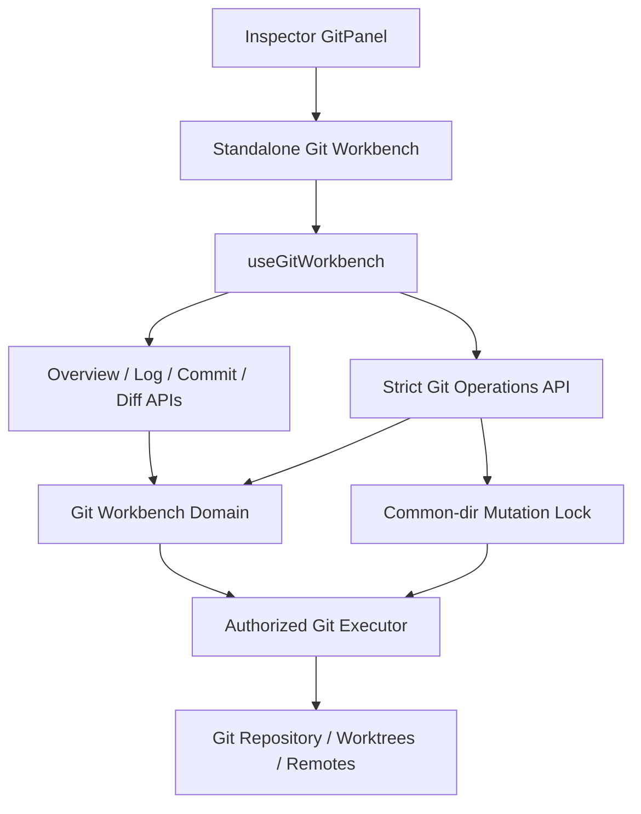
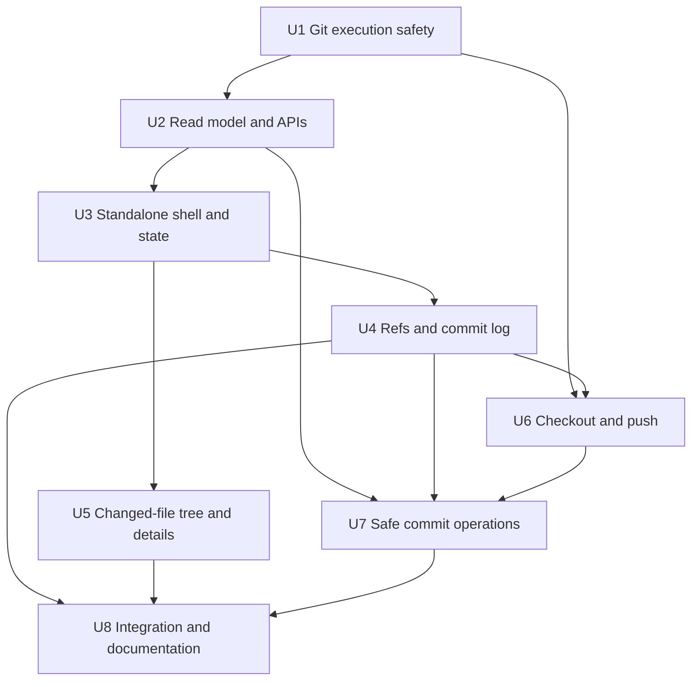
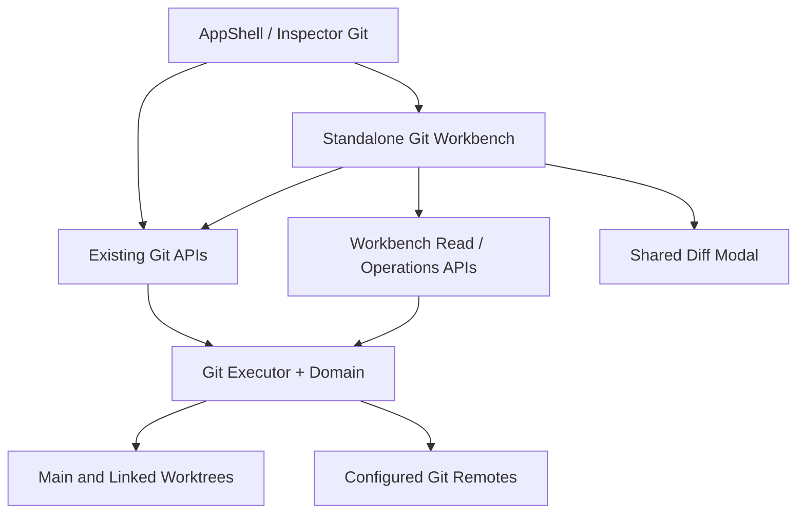

# feat: 新增 IDEA 风格 Git 工作台

## Overview

在保留现有 Inspector Git 面板的前提下，新增一个从该面板进入的独立 Git 工作台页面。工作台参考 IntelliJ IDEA 2026.2 Log Tab：左侧管理本地分支、远程分支和 Tag，中间默认展示全部 refs 的提交图并提供搜索、分支、作者过滤，右侧以上下分区展示选中提交的文件树和提交详情。

首版同时提供用户指定的常用操作，但采用已确认的“安全首版”边界：不提供强推和网页冲突解决器；编辑提交消息和删除提交只允许作用于当前分支中根据本地 remote-tracking refs 判定为未推送的线性、非 merge 提交；可能产生冲突的操作失败时自动尝试中止并恢复，恢复失败则冻结后续写操作并明确引导用户检查仓库。

---

## Delivery Record

Completed on the implementation branch. U1–U8 are delivered through the shared authorized Git executor/domain, standalone `/git?cwd=` page, revision-bound All log, refs/author/search filters, changed-file tree, strict safe operations, i18n/CSS/docs, and disposable-repository smoke coverage. Automated validation: `npm run test:git-workbench`, `npm run test:git-diff`, `npm run test:i18n`, `npm run test:ui-theme`, `npm run lint`, and `node_modules/.bin/tsc --noEmit`. The representative browser/theme/viewport and destructive-dialog visual matrix remains explicitly unexecuted and is documented in `docs/operations/ui-visual-validation.md`; it is not replaced by static smoke.

## Problem Frame

当前 `components/GitPanel.tsx` 已具备 Git 状态、本地分支预览/签出、提交图、提交详情、变更文件和平铺 Diff，但它位于最小 300px 的 Inspector 中，无法承载 IDEA 式三栏日志工作流。现有 Git API 也以只读查询为主，唯一普通写操作是 `POST /api/git/switch`，尚未形成适合 reset、cherry-pick、revert、历史改写和 push 的统一授权、并发、超时与恢复边界。

现状还有以下行为差距：

- `app/api/git/graph/route.ts` 在无 branch 参数时能读取 `--all`，但 `GitPanel` 加载后会自动选择当前分支并重新请求，因此用户实际看到的是当前分支，而不是 IDEA 默认的 All。
- 分支数据只有本地分支；远程 refs 和 Tag 只作为已加载提交的 decoration 出现，不是完整可管理列表。
- 提交列表固定请求 50 条、最多渲染 30 条，没有服务端搜索、作者过滤或稳定的继续加载契约。
- `GitCommitDetail.files` 由 `GitPanel` 平铺展示，没有按目录构建树。
- `status`、`graph`、`commit`、`diff`、`switch` 各自重复 `execFile` 封装，超时、buffer、错误投影和 cwd 授权不一致；只有 `lib/git-worktree.ts` 具备 120 秒 Git 超时约束。
- 自动化覆盖仅有 `scripts/smoke-git-diff.ts`，没有真实临时仓库和 bare remote 下的 Git 写操作回归。

---

## Requirements Trace

- **R1. 独立入口：** 从现有 Inspector Git 面板提供明确链接，在独立 Git 工作台中打开当前 `cwd`；原聊天工作区不被替换或丢失。
- **R2. 分支区域：** 左侧显示默认收起的 Local、Remote、Tags 三组；Local/Remote 分支提供适用的签出操作，Local 分支提供推送操作。
- **R3. 提交区域：** 中间默认显示 All（本地、远程和 Tag 可达历史），提供提交图、普通搜索、分支选择和作者选择，并支持有界继续加载。
- **R4. 提交操作：** 提交右键菜单提供 cherry-pick、Reset Current Branch to Here（soft/mixed/hard/keep）、revert、编辑提交消息、删除提交、新建分支、新建 Tag。
- **R5. 提交检查器：** 右上按目录树展示选中提交的变更文件，右下展示提交详情；文件仍可复用现有 Git Diff 查看器。
- **R6. 安全首版：** 不提供 force push；历史改写只作用于当前分支的安全提交范围；冲突自动 abort；所有写操作有授权、仓库级互斥、状态重验、超时和稳定错误码。
- **R7. 兼容现状：** 现有 `GitPanel`、`CommitGraph`、`/api/git/status|graph|commit|diff|switch` 的现有调用保持兼容，紧凑 Inspector 不被直接扩建成工作台。
- **R8. Web 完整性：** 中文/英文、键盘、右键、触控替代入口、焦点恢复、主题 Token、响应式布局和 reduced-motion 均进入交付范围。
- **R9. 可验证性：** 使用临时普通仓库、linked worktree 和 bare remote 覆盖读取、过滤、签出、推送、ref 创建及安全历史操作，不依赖开发者真实仓库。

---

## Scope Boundaries

- 不新增 stage、unstage、commit、amend 文件内容、stash、fetch、pull、merge 或通用 rebase UI。
- 不提供 force push、force-with-lease、远程分支删除、Tag 推送/删除或受保护分支配置。
- 不建设冲突编辑器，也不提供 cherry-pick/revert/rebase 的 continue/skip 页面；首版以自动 abort 和恢复检查为边界。
- 不支持 merge commit 的 cherry-pick、revert、reword 或 drop；不支持 root commit 的 reword/drop。
- 不支持多仓库根同步操作；一个工作台绑定一个已授权 Git repository/worktree cwd。
- Remote 节点只反映本地 remote-tracking refs 的最近状态；首版不自动 fetch，也不宣称这是远程实时状态。
- 搜索首版覆盖提交消息、完整/前缀 hash 和作者筛选，不实现 IDEA 的正则、大小写、日期、路径和 Git Log 索引功能。
- Tag 首版创建 lightweight tag，不包含 annotated/signed tag 编辑器。
- 不把工作树 staged/unstaged/stash 管理搬入独立工作台；这些信息继续保留在现有紧凑 `GitPanel`。
- 不持久化 Git 操作历史；刷新后以仓库本身为唯一事实来源。

### Deferred to Follow-Up Work

- 已推送历史改写、force-with-lease 和受保护分支策略：需要单独的风险设计与产品确认。
- Web 冲突解决、continue/abort/skip 工作流：需要独立的仓库操作状态机和文件合并体验。
- Fetch/Pull/自动刷新远程 refs：避免首版把网络同步与本地历史操作混为同一交付边界。
- Annotated/signed Tag、Tag 推送和远程 ref 删除：不属于本轮常用操作清单。

---

## Context & Research

### Relevant Code and Patterns

- `components/AppShell.tsx`：`activeCwd` 是主工作区事实源，Git 位于 Inspector tab，当前 Git 脏状态会进入 Inspector attention dot。
- `components/GitPanel.tsx`：现有紧凑状态、分支预览/签出、提交选择、详情及 Diff 入口，应保留并增加独立工作台链接。
- `components/CommitGraph.tsx`：已有 lane、refs、选择、键盘 Enter/Space 和主题感知 tooltip；工作台应扩展而非复制图算法。
- `components/GitCommitDiffModal.tsx`、`components/DiffModal.tsx`：现有提交文件 Diff 和 body portal，可直接复用。
- `components/AppDialogProvider.tsx`：适合简单 alert/confirm/prompt；reset 四模式、push target 和创建 ref 需要专用共享 shell dialog。
- `components/sidebar/ProjectPickerDialog.tsx`、`components/SessionSidebar.tsx`：已有 body/context menu、viewport 定位、右键和工作区切换模式可参考，但工作台菜单还需补齐键盘与触控入口。
- `app/api/git/status/route.ts`、`graph/route.ts`、`commit/route.ts`、`diff/route.ts`、`switch/route.ts`：当前 Git wire contract 和兼容入口。
- `lib/git-worktree.ts`：Git subprocess 120 秒超时、worktree metadata 和可操作错误的既有模式；新执行边界应与其超时语义对齐。
- `lib/allowed-roots.ts`、`lib/cwd.ts`：工作区 cwd canonicalization 和 allowed-root 授权模式。
- `lib/types.ts`：现有 Git status/graph/commit/diff 共享 wire types。
- `hooks/useSessionBrowser.ts`、`lib/session-search-client.ts`：abort、序号隔离、cwd 隔离和分页合并模式。
- `app/file/page.tsx`、`components/StandaloneFileViewer.tsx`：独立工具页的 I18nProvider/AppDialogProvider、metadata、返回入口和当前上下文传递模式。
- `app/globals.css`：`git-*`、`commit-graph-*`、`diff-*`、`.pi-modal-*`、语义 Token、Portal z-index 和响应式契约。

### Institutional Learnings

- 项目约定 Git lane、ref 和 diff added/deleted 可保留领域色，但通用 surface/border/status/focus 必须使用语义 Token。
- App Router state-changing 请求在 server mode 下受 `proxy.ts` 的 access-key 和 exact-origin 保护；Git 路由仍需自行限制 cwd，不能把实例认证等同于文件系统授权。
- 官方运行模式是单进程；可使用 `globalThis` 持有进程内仓库锁，但必须承认外部 Git/IDE/终端仍可能并发修改仓库。
- 大型仓库必须有固定 buffer、条数和执行时间预算，并通过 `truncated`/`hasMore` 显式降级，不能把截断误报为空。

### External References

- IntelliJ IDEA Log Tab 明确采用 Branches / Commits / Changed Files / Commit Details 四区结构，默认可显示所有 local/remote branches，并在工具栏提供搜索、Branch 和 User 过滤。
- IntelliJ IDEA 对 Edit Commit Message 限制为未推送提交；Reset 对 soft/mixed/hard/keep 的工作树与 index 语义不同。
- Git 官方文档说明 hard reset 可能覆盖工作树，keep 会在本地修改与目标冲突时拒绝；push 默认拒绝 non-fast-forward。
- Git rebase 冲突会留下可 continue/abort/skip 的中间状态，因此首版不能只返回普通 500，必须自动 abort 并验证恢复结果。

---

## Key Technical Decisions

| Decision | Choice | Rationale |
| --- | --- | --- |
| 页面形态 | 新增 `/git?cwd=` 独立页面，现有 GitPanel 以新标签页链接进入 | 三栏布局不受 Inspector 最小宽度约束；原聊天与文件编辑现场保持挂载 |
| 数据源 | 仓库实时读取，不建立持久 Git 索引 | 首版范围可控，仓库仍是唯一事实来源；查询通过分页、超时和 cap 限制 |
| 默认日志 | `All`，覆盖 local/remote/tag refs 可达提交 | 对齐 IDEA Log 默认心智；点击左侧 ref 或 Branch 过滤器后才收窄 |
| API 形态 | overview、log、operations 三个新端点，复用 commit/diff | overview 聚合仓库 revision、refs、authors；operations 仅接受严格 action union，禁止通用命令执行 |
| 并发键 | canonical git common-dir，而不是 cwd | 同一仓库的多个 linked worktree 共享 refs；按 cwd 加锁会允许危险并发 |
| 乐观并发 | overview/log 提供 refs revision；写操作携带 expected revision/HEAD/ref tip | 拒绝页面读取后由其他标签页或外部工具改动导致的陈旧操作 |
| 历史改写 | 仅当前分支、remote-tracking refs 未包含、第一父链且目标到 HEAD 线性无 merge | 避免首版无意改写已发布历史或丢弃 merge 结构 |
| 冲突策略 | cherry-pick/revert/rewrite 冲突自动 abort；失败后返回 recoveryRequired 并冻结写入口 | 不在没有冲突 UI 的情况下把仓库静默留在半完成状态 |
| Push | 普通 fast-forward push；有 upstream 直接预览目标，无 upstream 选择 remote/target 并可 set-upstream | 满足常用 push，同时不开放历史覆盖 |
| Remote 数据 | 只读本地 remote-tracking refs，不隐式 fetch | 防止打开页面或筛选产生不可见网络副作用 |
| Tag | lightweight tag | 满足首版“新建标记”且避免引入 message/signing 表单 |
| Diff | 继续复用现有 commit diff API/Modal | 避免复制成熟的 binary/too-large/unavailable 降级行为 |

### Reset Mode Contract

| Mode | 首版效果 | 额外保护 |
| --- | --- | --- |
| Soft | 移动当前分支，index 和工作树保持；被移除提交的变化保留为 staged | 显示操作后会产生 staged changes；校验非 detached HEAD 和 expected HEAD |
| Mixed | 移动当前分支并重置 index，工作树变化保留为 unstaged | 显示操作后会产生 unstaged changes；拒绝 unmerged index |
| Hard | 分支、index、工作树全部对齐目标提交 | danger 样式、二次目标确认；明确提交之后的本地历史会被移除 |
| Keep | 移动分支并尽量保留本地变化；Git 判断会覆盖本地变化时拒绝 | 允许 dirty 但拒绝 unmerged；失败不自动改用 hard/mixed |

---

## Open Questions

### Resolved During Planning

- **历史改写安全级别：** 用户选择“安全首版”；不支持 pushed history rewrite、force push 或网页冲突解决。
- **默认日志范围：** 使用 All，不沿用紧凑 GitPanel 自动切到当前分支的行为。
- **工作台入口：** 从 Inspector Git 面板新标签打开，避免独立工具页替换当前聊天现场。
- **远程实时性：** 首版不 fetch；Remote 明确标注为本地 remote-tracking snapshot。
- **Tag 类型：** 首版 lightweight tag。
- **冲突行为：** 自动 abort；abort 无法确认完成时阻止继续写并要求人工检查。

### Deferred to Implementation

- 不同 Git 版本和认证后端的 stderr 文案映射细节：实现时以稳定 error code 为 UI 合同，原始输出仅作为有界 detail。
- Windows 下受控 reword sequence/message editor 的最终进程参数转义：必须由跨平台 smoke 证明，不能仅靠静态推断。
- 极端仓库的最佳 page size：默认 100、单页硬上限 200、前端累计渲染上限 500 作为初始预算；实现时可在不改变 API 语义下按基准下调。

---

## Output Structure

```text
app/
├── git/page.tsx
└── api/git/
    ├── workbench/route.ts
    ├── log/route.ts
    └── operations/route.ts
components/
└── git-workbench/
    ├── GitWorkbench.tsx
    ├── GitWorkbenchHeader.tsx
    ├── GitRefTree.tsx
    ├── GitLogPane.tsx
    ├── GitCommitInspector.tsx
    ├── GitContextMenu.tsx
    └── GitWorkbenchDialogs.tsx
hooks/
└── useGitWorkbench.ts
lib/
├── git-executor.ts
├── git-workbench.ts
├── git-workbench-client.ts
└── git-workbench-url.ts
scripts/
├── git-rebase-editor.cjs
└── smoke-git-workbench.ts
```

该结构表达预期边界，不是实现时不可调整的约束；每个 Implementation Unit 的文件列表才是对应交付单元的权威范围。

---

## High-Level Technical Design

> *This illustrates the intended approach and is directional guidance for review, not implementation specification. The implementing agent should treat it as context, not code to reproduce.*



### Read Projection

1. Overview 返回 canonical cwd/repo root/common-dir identity、当前 HEAD/branch、dirty/unmerged/operation state、refs revision、Local/Remote/Tags、remotes 和作者选项。
2. Log 以 `revision + scope + query + author + offset + limit` 读取一页提交；继续加载若 revision 已变化则返回 stale，前端清空旧页并刷新 overview。
3. 选中提交继续使用 commit detail，但增加 action capabilities：每个菜单项返回 allowed/disabled reason，UI 不自行猜测 pushed、merge、root、first-parent 和 operation-state 条件。
4. Changed files 通过 client-safe pure projection 构建目录树；Git 的 `/` 作为路径层级，rename 同时保留 old path，不把用户文件名当 HTML。

### Mutation Lifecycle

1. Operations API 校验 strict action payload、canonical cwd 和 allowed-root。
2. 解析 git common-dir，以 common-dir 获取进程内互斥；同仓库另一写操作立即返回 busy，不排队造成陈旧意图。
3. 在锁内重新读取 refs revision、HEAD、目标 ref tip、dirty/unmerged/operation state和 action capability；任何 expected 值不匹配返回 conflict/stale。
4. 执行有界 Git 操作；禁用终端交互，保留 hooks，超时后不自动重试网络或历史写操作。
5. cherry-pick/revert/rewrite 失败且识别到本次操作生成的中间状态时自动 abort，再检查 operation markers 与 HEAD；无法确认恢复则返回 `recoveryRequired`。
6. 成功后返回新的 overview revision、HEAD/branch 和推荐选中提交；前端清理旧 detail/diff/context menu，并统一刷新三栏。

### Capability Matrix

| Selection | Checkout | Push | Reword / Drop | Other commit actions |
| --- | --- | --- | --- | --- |
| 当前 Local | 隐藏或禁用 | 允许普通 push | 由选中 commit capability 决定 | 正常 |
| 其他 Local | clean 且未被其他 worktree 占用时允许 | 允许普通 push，不要求先 checkout | 不适用分支行 | 不适用分支行 |
| Remote | 创建/复用 tracking local 后 checkout | 不显示 | 不适用 | 不适用 |
| Tag | 首版不提供 checkout/push | 不显示 | 不适用 | 不适用 |
| Merge commit | 不适用 | 不适用 | 禁用 | cherry-pick/revert 禁用；reset/new branch/new tag 仍可用 |
| 已发布或不在线性当前分支的 commit | 不适用 | 不适用 | 禁用 | cherry-pick/revert/reset/new branch/new tag 按各自条件判断 |

---

## Implementation Units



- [x] U1. **建立统一 Git 执行与仓库安全边界**

**Goal:** 在新增写操作前统一 cwd 授权、Git subprocess、common-dir identity、超时、错误码、operation-state 检测和仓库级互斥，并让现有普通 Git 路由逐步使用同一边界。

**Requirements:** R6, R7, R9

**Dependencies:** None

**Files:**
- Create: `lib/git-executor.ts`
- Create: `lib/git-workbench.ts`
- Modify: `app/api/git/status/route.ts`
- Modify: `app/api/git/graph/route.ts`
- Modify: `app/api/git/commit/route.ts`
- Modify: `app/api/git/diff/route.ts`
- Modify: `app/api/git/switch/route.ts`
- Modify: `lib/types.ts`
- Create/Test: `scripts/smoke-git-workbench.ts`
- Modify/Test: `scripts/smoke-git-diff.ts`

**Approach:**
- canonicalize 并验证 cwd 是已授权 allowed root 下的现存目录，再解析 repo root/common-dir；非仓库返回稳定 `NOT_GIT_REPOSITORY`，越权返回 403。
- 统一只接受参数数组的 Git executor，不经过任意 shell；读取和写入配置独立 buffer/timeout，写操作与现有 worktree 约束对齐为 120 秒。
- 为网络命令禁用 terminal prompt，保留 credential helper 和 Git hooks；认证或 hook 失败作为可操作错误返回，绝不静默绕过 hooks。
- 为 common-dir 建立 `globalThis` mutation lock；锁只包写操作，读取用 revision 检测陈旧，不把长时间读取串行化。
- 识别 merge/rebase/cherry-pick/revert/bisect 等仓库中间状态；首版所有新写操作在已有 operation state 时拒绝。
- 现有 status 解析迁移到 NUL-safe 输出，避免空格、箭头、引号或换行文件名误解析；保留现有响应字段。
- 现有路由响应保持兼容，可添加稳定 `code`/`details`，但不得删除既有 `status`、`data`、`detail` 或 diff 字段。

**Execution note:** 先用临时仓库写 characterization coverage，再迁移现有 route executor 和 status parser，避免安全重构改变紧凑 GitPanel 行为。

**Patterns to follow:**
- `lib/git-worktree.ts` 的 120 秒超时和用户错误投影。
- `lib/allowed-roots.ts`、`lib/cwd.ts` 的 canonical cwd 授权。
- `proxy.ts` 的 state-changing same-origin 只是实例访问层，不能替代 cwd 授权。

**Test scenarios:**
- Happy path：注册的临时仓库可执行 status/graph/commit/diff/switch，现有响应关键字段不变。
- Edge case：普通目录返回非仓库；linked worktree 与主 worktree 解析到同一 common-dir lock key。
- Edge case：包含空格、引号、Unicode、` -> ` 和换行的文件名仍正确进入 staged/unstaged/untracked projection。
- Error path：未注册且不在 allowed roots 的 cwd 返回 403；不存在路径和文件路径返回稳定 4xx。
- Error path：Git 超时、maxBuffer、缺少 Git executable、已有 rebase/cherry-pick state 均映射为稳定 code，不伪装为 clean/empty。
- Concurrency：同 common-dir 第二个写操作返回 busy；不同仓库写操作互不阻塞。
- Compatibility：现有 `scripts/smoke-git-diff.ts` 的 commit/staged/unstaged diff、invalid scope 和 missing selector 继续成立。

**Verification:**
- 所有 Git API 不再各自发明 cwd/exec/error 规则。
- 现有 Inspector GitPanel 无 wire contract 回归。
- common-dir 锁和 operation-state 检测可被后续 operations API 直接复用。

---

- [x] U2. **建立工作台读取模型、refs revision 与分页 API**

**Goal:** 提供工作台初始化、完整 refs、作者选项、All 日志过滤和稳定继续加载，并为菜单能力提供服务端事实。

**Requirements:** R2, R3, R4, R5, R6, R9

**Dependencies:** U1

**Files:**
- Create: `app/api/git/workbench/route.ts`
- Create: `app/api/git/log/route.ts`
- Modify: `app/api/git/commit/route.ts`
- Modify: `lib/git-workbench.ts`
- Modify: `lib/types.ts`
- Modify/Test: `scripts/smoke-git-workbench.ts`

**Approach:**
- Overview 聚合 repository state、refs revision、Local/Remote/Tags、remotes、upstream/ahead/behind 和作者选项；refs 采用完整 refname/object id，不靠 decoration 反推列表。
- refs revision 由 HEAD 与相关 local/remote/tag ref name+object id 的稳定排序摘要构成；后续 log/load-more 和 operations 以此检测陈旧页面。
- Log 默认 scope=All；选中 Local/Remote/Tag 时传递完整 ref，服务端验证 ref 属于 overview allowlist，禁止任意 revision expression 注入。
- 普通查询按提交消息做不区分大小写的 literal search；纯十六进制查询同时支持完整/前缀 hash 定位；作者筛选使用服务端返回的 canonical identity，构造时转义 Git regex 元字符。
- 日志格式使用 NUL/record-safe 字段，增加 author email、timestamp、parents 和 refs；默认 100、单页最大 200，累计前端最大 500。
- offset/load-more 必须携带 revision；revision 变化返回 stale 而不是把不同快照的页面拼接。
- commit detail 增加 additive capabilities：cherry-pick、reset、revert、reword、drop、new branch、new tag 的 allowed/reason，以及 published/first-parent/linear-range/merge/root/head 事实。
- “未推送”依据当前本地 remote-tracking refs 的可达性判断，并在 API/UI 中明确这是 last-fetched knowledge；无强推能力保证远程不会被工作台覆盖。
- refs、authors、changed files 都有 hard cap 与 `truncated` 元数据；截断不得显示为真实总数或空列表。

**Patterns to follow:**
- `app/api/git/graph/route.ts` 的 decoration 和 local branch projection。
- `app/api/git/commit/route.ts` 的 hash normalization 与 first-parent changed files。
- `hooks/useSessionBrowser.ts` 的有界分页和 stale request isolation。

**Test scenarios:**
- Happy path：多 local branch、bare remote tracking branch 和多个 tags 被分到正确类别，current/upstream 元数据正确。
- Happy path：All 同时返回多个分支可达提交；指定 local/remote/tag 只返回该 ref 可达历史。
- Happy path：消息 literal、hash prefix 和作者筛选分别返回正确提交，清空过滤恢复 All。
- Pagination：两页在同 revision 下无重复且顺序稳定；页间修改 ref 后旧 revision 请求返回 stale。
- Capability：未推送线性普通提交允许 reword/drop；remote-tracking 可达、merge、root、非当前第一父链或目标到 HEAD 含 merge 时给出明确禁用原因。
- Edge case：空仓库、detached HEAD、无 remote、无 tag、同名 local/remote branch、Unicode 作者、超长 subject 正确降级。
- Error path：不存在/伪造 ref、非法 author id、负 offset、超大 limit、越权 cwd 被拒绝。
- Large repo：refs/authors/files 超 cap 时 `truncated` 为真，API 仍返回有界有效数据。

**Verification:**
- 首次请求能够渲染三栏所需全部稳定元数据。
- 默认日志为 All，过滤和继续加载不依赖浏览器全量历史。
- UI 菜单可完全依据 capability 投影解释禁用原因，服务端执行时仍重新校验。

---

- [x] U3. **新增独立工作台页面、入口和客户端状态编排**

**Goal:** 从现有 GitPanel 进入保持 cwd 隔离的独立页面，并建立不受陈旧请求污染的 overview/log/detail 选择状态。

**Requirements:** R1, R7, R8

**Dependencies:** U2

**Files:**
- Create: `app/git/page.tsx`
- Create: `components/git-workbench/GitWorkbench.tsx`
- Create: `components/git-workbench/GitWorkbenchHeader.tsx`
- Create: `hooks/useGitWorkbench.ts`
- Create: `lib/git-workbench-client.ts`
- Create: `lib/git-workbench-url.ts`
- Modify: `components/GitPanel.tsx`
- Modify: `lib/types.ts`
- Modify/Test: `scripts/smoke-git-workbench.ts`

**Approach:**
- `/git?cwd=` 使用独立 `I18nProvider` + `AppDialogProvider`，header 展示仓库名、当前分支、dirty/worktree/remote snapshot 提示、refresh 和返回工作区入口。
- `GitPanel` sticky toolbar 增加“打开 Git 工作台”链接，新标签打开并带 `noopener`；没有 cwd 或不是仓库时不显示可用入口。
- URL builder 只生成站内 `/git` URL，不接受外部 return URL；cwd 通过 URLSearchParams 编码，页面内容仍由授权 API 决定。
- `useGitWorkbench` 以 cwd + request sequence + AbortController 隔离 overview/log/detail；cwd 变化立即清除旧仓库数据。
- 单一状态源维护 selected ref（All 或完整 ref）、query、author、selected commit、revision、pages、busy operation 和 recoveryRequired。
- mutation 成功统一清除旧 Diff/context menu，按响应 recommendation 选择新 HEAD/目标，并刷新 overview/log/detail；stale 响应显示可恢复提示后刷新，绝不乐观伪造 Git 结果。
- 页面加载、空仓库、非 Git、403、Git 不可用、recovery required 都有独立状态，不用同一个“空列表”代替。

**Patterns to follow:**
- `app/file/page.tsx`、`components/StandaloneFileViewer.tsx` 的独立工具页 provider/header 模式。
- `hooks/useSessionBrowser.ts`、`lib/session-search-client.ts` 的 cwd/seq/abort 隔离。
- `components/GitPanel.tsx` 的加载、重试和 commit detail selection 语义。

**Test scenarios:**
- Happy path：从 GitPanel 构造的链接保留 Windows/Unix/Unicode cwd，目标为站内 `/git` 且新标签打开。
- State：首次加载选中 All 和首条 commit；切换 ref/author/search 清空旧页并丢弃迟到响应。
- State：load-more 合并按 hash 去重；revision stale 时不拼接旧页。
- Mutation integration：成功响应触发三栏统一刷新；失败保持当前选择；recoveryRequired 禁用所有写入口但仍允许读取和复制信息。
- Error path：缺少 cwd、非仓库、越权、空仓库、网络失败和手动重试分别显示准确状态。
- Navigation：关闭工作台标签不影响原聊天；返回链接可回到主工作区。

**Verification:**
- 独立页面可以仅凭 cwd 初始化，不依赖 AppShell React state。
- 任何旧 cwd/旧 filter 请求都不能覆盖当前仓库状态。
- GitPanel 原功能保留，只增加工作台入口。

---

- [x] U4. **实现左侧 refs 树和中间 IDEA 式提交日志**

**Goal:** 完成默认收起的 Local/Remote/Tags 管理区、All/branch/user/search 过滤和支持上下文菜单的工作台提交图。

**Requirements:** R2, R3, R4, R8

**Dependencies:** U3

**Files:**
- Create: `components/git-workbench/GitRefTree.tsx`
- Create: `components/git-workbench/GitLogPane.tsx`
- Create: `components/git-workbench/GitContextMenu.tsx`
- Modify: `components/CommitGraph.tsx`
- Modify: `components/git-workbench/GitWorkbench.tsx`
- Modify: `hooks/useGitWorkbench.ts`
- Modify: `lib/git-workbench-client.ts`
- Modify: `app/globals.css`
- Modify/Test: `scripts/smoke-git-workbench.ts`
- Modify/Test: `scripts/smoke-ui-theme-contract.ts`

**Approach:**
- 左侧顶部固定 All；Local、Remote、Tags 初始收起，用户本页内展开/收起，类别标题显示真实 count/truncated 状态。
- 点击 ref 同步 selected ref 和中间 Branch 过滤器；当前 Local、tracking 关系和 last-fetched Remote 使用文字/图标而非只靠颜色。
- 分支行右键、Shift+F10 和显式更多按钮打开同一菜单；菜单通过 body portal、viewport clamp、roving focus、Escape/outside focus close 和 focus restore 工作。
- 中间工具栏提供普通搜索、Branch（All + refs）和 User（All + canonical authors）；输入 debounce/Enter 行为不得并发叠加陈旧请求。
- `CommitGraph` 增加不破坏 compact 调用的 workbench variant：展示 message、author、timestamp/hash 可选列，支持选中、上下键移动、Enter、context-menu callback 和触控更多入口。
- commit 行菜单始终列出用户要求的八类操作；不可用项 disabled 并提供 capability reason，不让功能“消失得无从理解”。
- 加载更多只在 hasMore 且未达到累计上限时出现；到达 UI 上限明确提示进一步收窄过滤，而不是冻结页面。
- 桌面三栏优先；641–959px 将 refs 变为可关闭侧栏并把 commit inspector 放到下方；≤640px 使用 Branches/Log/Changes/Details 单区 tabs，所有功能无需 hover。

**Patterns to follow:**
- `components/CommitGraph.tsx` 的 lane/domain color 和 commit selection。
- `components/ThemePicker.tsx`、Inspector tabs 和 Composer popover 的 focus/portal 规则。
- `.sidebar-context-menu` 只作为行为参考；新工作台使用自己的语义 class，不把 sidebar 领域名扩散。

**Test scenarios:**
- Happy path：三类 refs 默认收起；展开后当前、本地、远程、Tag 标识和 count 正确；点击 ref 同步 Branch filter。
- Happy path：All、branch、author、search 组合过滤，清空任何一项保留其他项并重新加载。
- Commit interaction：单击/Enter 选择；右键、Shift+F10、更多按钮打开同一目标 commit 的菜单；Escape 恢复触发元素焦点。
- Disabled action：merge、published、dirty、detached、operation-in-progress 对应项显示具体原因。
- Edge case：同名 local/remote、超长层级分支名、5,000+ refs 截断、空类别、500 commit 累计上限仍可操作。
- Responsive：桌面三栏；中宽 refs drawer；移动 tabs 无页面级横向滚动，菜单不超 viewport/safe area。
- Accessibility：菜单和提交行具有正确 role/aria-selected/aria-disabled，键盘和 coarse pointer 不依赖 hover。
- Theme：语义 surface/border/focus/motion 和 `--z-context-menu` 契约可被静态 smoke 检查。

**Verification:**
- 首屏默认是 All，且三类 refs 按要求默认收起。
- 所有用户指定的 commit 操作都能从 commit 行上下文菜单发现。
- compact GitPanel 的 CommitGraph 外观和选择行为不回归。

---

- [x] U5. **实现右侧变更文件树与上下提交检查器**

**Goal:** 将选中提交的变更文件按目录树显示在右上，并把提交元数据独立放到右下，同时复用现有 Diff。

**Requirements:** R5, R7, R8

**Dependencies:** U3

**Files:**
- Create: `components/git-workbench/GitCommitInspector.tsx`
- Modify: `components/GitPanel.tsx`
- Modify: `components/GitCommitDiffModal.tsx`
- Modify: `components/git-workbench/GitWorkbench.tsx`
- Modify: `lib/git-workbench-client.ts`
- Modify: `app/globals.css`
- Modify/Test: `scripts/smoke-git-workbench.ts`
- Modify/Test: `scripts/smoke-ui-theme-contract.ts`

**Approach:**
- 将 `GitPanel` 内部 CommitDetailPanel 的纯展示部分提取为可复用提交详情视图；紧凑面板可继续显示平铺文件，工作台详情区不重复文件列表。
- client-safe tree builder 以 Git `/` 路径构建 folder/file node，folder-first 稳定排序，合并只有单一子目录的路径以降低层级噪音。
- Local 展开状态仅属于当前 selected commit；切换 commit 清除旧树选择和打开的 Diff，避免 hash/path 跨提交串用。
- file leaf 显示 status、rename old→new、binary、additions/deletions；单击选择，Enter/双击或显式 Diff 动作打开现有 `GitCommitDiffModal`。
- 右栏使用上下两个独立滚动区，首版固定合理比例而不引入可持久化 splitter；窄布局按 U4 的 Details/Changes 区域切换。
- commit detail 保留 subject/body、完整 hash、author、committer、parents、refs，并明确 first-parent diff 语义；不把 Changed Files 重复塞入下区。

**Patterns to follow:**
- `components/FileExplorer.tsx` 的目录树与长路径降级。
- `components/GitCommitDiffModal.tsx` 的 binary/too-large/unavailable 处理。
- 现有 `git-commit-detail`、`git-commit-file-*` 视觉语义。

**Test scenarios:**
- Happy path：多目录文件形成稳定 folder tree，展开/收起和键盘导航正确，文件打开对应 hash/path 的 Diff。
- Rename：old/new path 位于不同目录时仍只有一个 change leaf，Diff 请求同时携带 oldPath。
- Edge case：root-level 文件、空提交、binary、Unicode、空格、超长目录、数千文件和 truncated detail 正确展示。
- Detail：普通、merge、root commit 的 parents/refs/author/committer 元数据准确；merge 文件说明仍是 first-parent。
- Race：快速切换 commit 时旧 detail 和旧 Diff 响应被丢弃。
- Responsive：右侧上下区域独立滚动；移动 Changes/Details tabs 保持选中 commit 一致。
- Compatibility：Inspector GitPanel 仍能平铺文件并打开原 Diff，不被共享详情提取改变。

**Verification:**
- 右上是目录树而非平铺列表，右下只呈现提交详情。
- 任意文件 Diff 继续使用现有统一/左右模式和 fallback。
- 文件树构建为纯函数并有特殊路径覆盖。

---

- [x] U6. **实现分支签出与普通推送**

**Goal:** 从左侧分支菜单安全签出 Local/Remote 分支，并把任意 Local 分支普通推送到其 upstream 或用户选择的 remote target。

**Requirements:** R2, R6, R8, R9

**Dependencies:** U1, U4

**Files:**
- Create: `app/api/git/operations/route.ts`
- Create: `components/git-workbench/GitWorkbenchDialogs.tsx`
- Modify: `components/git-workbench/GitRefTree.tsx`
- Modify: `components/git-workbench/GitContextMenu.tsx`
- Modify: `hooks/useGitWorkbench.ts`
- Modify: `lib/git-workbench.ts`
- Modify: `lib/types.ts`
- Modify: `app/globals.css`
- Modify/Test: `scripts/smoke-git-workbench.ts`

**Approach:**
- Operations route 只接受严格 action union；本单元先交付 checkout/push，未知 action 或额外危险字段被拒绝，绝不接受任意 Git args。
- Local checkout 要求 clean、无 unmerged/operation state、非当前 branch，且目标 branch 未被另一个 linked worktree 占用。
- Remote checkout 使用完整 remote ref；若对应 tracking local 不存在则创建并设置 tracking，若同名 local 已存在则只在 tracking 关系安全明确时复用，否则要求用户确认本地名称而不自动 reset。
- Push 可作用于非当前 Local branch；请求携带 expected revision 和 expected local tip，不要求先 checkout。
- 有 upstream 时 dialog 预览 local→remote/branch 和 outgoing count；无 upstream 时从 overview remotes 中选择 remote、目标默认同名，并显式选择是否设置 upstream。
- 仅普通 fast-forward push，route 不接受 force 相关字段；使用 machine-readable push 输出，明确 up-to-date、created、updated、rejected、auth/hook failure。
- Push timeout 或连接中断可能发生“远端已更新但客户端未知”，此时返回 unknown outcome，UI 禁止自动 retry并要求 refresh。
- 成功 checkout/push 后统一刷新 overview/log/capabilities；checkout 同时更新当前分支和选择位置。

**Patterns to follow:**
- `app/api/git/switch/route.ts` 的 clean preflight 和 branch existence validation。
- `components/AppDialogProvider.tsx` 的 focus trap/restore；复杂 target 选择使用 `.pi-modal-*` 专用 dialog。
- `lib/git-worktree.ts` 的 linked worktree 识别。

**Test scenarios:**
- Checkout happy path：clean Local branch 成功签出并刷新 HEAD；当前分支操作禁用。
- Remote checkout：不存在 Local 时创建 tracking branch；安全同名 Local 时复用；冲突 tracking/其他 worktree 占用时拒绝且仓库不变化。
- Dirty/unmerged：Local/Remote checkout 都拒绝，不自动 stash、不 force。
- Push happy path：有 upstream 的 Local branch fast-forward 更新 bare remote；无 upstream 选择 origin 后创建 remote branch并设置 upstream。
- Push non-current：无需 checkout 即推送指定 Local branch，当前工作树和 HEAD 不变化。
- Push rejection：remote 已前进时返回 non-fast-forward，绝不转为 force；认证、pre-push hook 和不存在 remote 给出稳定 code。
- Stale/concurrency：selected branch tip 或 refs revision 已变化时返回 conflict；同 common-dir 并发写返回 busy。
- Timeout/unknown：网络进程超时后不自动重试，响应标记 outcome unknown并要求 refresh。
- Security：伪造 refspec、以 `-` 开头 remote/branch、额外 force 字段和任意 args 均被拒绝。

**Verification:**
- Local/Remote 分支签出和 Local push 可从同一上下文菜单到达。
- 无任何 UI 或 API 路径能够发起 force push。
- 操作后工作台与真实 refs/HEAD 一致，无乐观假成功。

---

- [x] U7. **实现安全提交操作、Reset 模式和 ref 创建**

**Goal:** 完成提交菜单中的 cherry-pick、四模式 reset、revert、reword、drop、新建分支和新建 Tag，并落实已确认的安全首版限制与恢复行为。

**Requirements:** R4, R6, R8, R9

**Dependencies:** U2, U4, U6

**Files:**
- Create: `scripts/git-rebase-editor.cjs`
- Modify: `app/api/git/operations/route.ts`
- Modify: `components/git-workbench/GitWorkbenchDialogs.tsx`
- Modify: `components/git-workbench/GitContextMenu.tsx`
- Modify: `components/git-workbench/GitLogPane.tsx`
- Modify: `hooks/useGitWorkbench.ts`
- Modify: `lib/git-workbench.ts`
- Modify: `lib/types.ts`
- Modify: `app/globals.css`
- Modify/Test: `scripts/smoke-git-workbench.ts`

**Approach:**
- 所有 action 在 common-dir lock 内重新验证 expected revision/HEAD、normalized commit hash、operation state 和服务端 capability；客户端确认不具有授权意义。
- Cherry-pick：要求 clean/current branch/non-merge，且目标不是当前分支已包含提交；冲突时中止本次 cherry-pick并验证 HEAD/operation markers 已恢复。
- Revert：要求 clean/current branch/non-merge，以默认 revert message 创建新提交；冲突处理与 cherry-pick 相同。
- Reset：专用 dialog 展示四模式效果和目标 short hash/subject/current branch；soft/mixed/hard/keep 分别执行其原生语义，不做模式 fallback。hard 要求二次匹配目标确认，所有模式拒绝 detached/unmerged/stale HEAD。
- Reword：只允许 current first-parent、remote-tracking refs 不可达、非 root/merge，且目标到 HEAD 的重写区间线性无 merge；HEAD 可走 amend 语义，较早提交通过受控 sequence/message editor 执行非交互 reword。
- Drop：使用受控线性历史重写移除目标并重放后续提交；沿用 reword 的 unpublished/first-parent/linear 限制并增加 danger 确认。
- `scripts/git-rebase-editor.cjs` 只能编辑 Git 提供的 todo/message 临时文件，动作和目标通过受限环境传入；不得执行用户命令、读取工作区内容或成为通用脚本入口。需要覆盖 Windows/Unix 路径与引号。
- Reword/drop 任一步失败时自动 abort；若 abort 后 HEAD、branch 或 operation markers 无法回到 preflight snapshot，返回 `recoveryRequired` 并禁止本页继续写。
- New Branch：校验 ref format/重复名，以选中 commit 创建；可选 checkout 仅在 clean 且 branch 未被其他 worktree 使用时执行。
- New Tag：校验 tag ref format/重复名，以选中 commit 创建 lightweight tag；不自动 push。
- 成功后 response 返回新 HEAD/revision 和 selection recommendation；reword/drop 不尝试用旧 hash 继续展示 stale detail。

**Execution note:** 历史改写必须从临时线性仓库的失败用例开始，优先证明“拒绝不安全范围”和“冲突后恢复”，再接 UI 菜单。

**Patterns to follow:**
- `AppDialogProvider` 和 `.pi-modal-*` 的 danger confirmation/focus 规范。
- `lib/git-worktree.ts` 的“不对超时后的部分状态做破坏性猜测”原则。
- Git 官方 reset/rebase/revert/cherry-pick 原生中止语义，不自行模拟 index/working tree。

**Test scenarios:**
- Cherry-pick happy path：另一分支普通提交应用到当前分支并产生新 HEAD；原提交和源分支不变化。
- Cherry-pick rejection：目标已包含、merge commit、dirty/unmerged/detached、stale HEAD 均拒绝。
- Cherry-pick conflict：自动 abort 后 HEAD、index、working tree 和 operation markers 回到 preflight；abort 注入失败时返回 recoveryRequired。
- Revert happy path：普通提交产生反向新提交；merge commit 和冲突场景按安全边界处理。
- Reset soft：HEAD 移动且变化 staged；mixed：变化 unstaged；hard：HEAD/index/worktree 对齐目标；keep：无冲突本地变化保留、有覆盖风险时拒绝。
- Reset safety：detached/unmerged/stale target/确认不匹配拒绝；hard 不因 UI 误触直接执行。
- Reword HEAD：message 更新且 tree/author 语义保留；较早线性未发布提交重写后 descendants 保留顺序、旧 hash 不再位于当前分支。
- Drop：线性未发布提交被移除且后续提交重放；依赖冲突自动 abort并恢复。
- Rewrite rejection：remote-tracking ref 可达、非当前第一父链、root、merge、目标到 HEAD 范围含 merge、已有 rebase state 均禁用并服务端拒绝。
- Cross-platform editor：临时路径、Node 路径、消息中的引号/换行/Unicode 在 Windows 和 Unix 语义下正确，不执行消息内容。
- New ref：从任意普通/merge/root commit 创建合法 branch/lightweight tag；重复名、非法 ref、以选项前缀伪装和 checkout dirty 被拒绝。
- Concurrency：操作开始后其他 WebUI 写请求 busy；操作完成或安全 abort 后锁释放。
- Hooks/timeout：hook 失败作为失败返回；timeout 不声明回滚成功，必须检查 operation state。

**Verification:**
- 用户指定的八类提交操作均存在，并按 capability 提供准确禁用理由。
- 测试证明冲突不会在正常 abort 路径留下半完成仓库。
- 测试证明已发布/merge/root/非线性历史不能通过篡改客户端 payload 绕过限制。
- 无 force push、通用 rebase 或任意 Git 命令执行表面。

---

- [x] U8. **完成跨层集成、i18n、文档和验收矩阵**

**Goal:** 将工作台纳入项目模块地图、脚本和视觉/手工验证合同，确保现有 GitPanel、worktree 和独立页面在主题及视口下共同稳定。

**Requirements:** R1–R9

**Dependencies:** U4, U5, U7

**Files:**
- Modify: `lib/i18n/messages/git.ts`
- Modify: `app/globals.css`
- Modify: `package.json`
- Modify: `AGENTS.md`
- Modify: `docs/modules/frontend.md`
- Modify: `docs/modules/api.md`
- Modify: `docs/modules/library.md`
- Modify: `docs/architecture/overview.md`
- Modify: `docs/operations/ui-visual-validation.md`
- Modify: `scripts/smoke-ui-theme-contract.ts`
- Modify/Test: `scripts/smoke-git-workbench.ts`
- Modify/Test: `scripts/smoke-git-diff.ts`

**Approach:**
- Git 工作台所有 chrome、dialog、capability reason 和稳定 API error code 补齐 zh/en；原始 Git stderr 只作为有界 detail，不直接作为唯一产品文案。
- `app/globals.css` 使用独立 `git-workbench-*` class，复用 semantic Tokens、`--z-context-menu`、`--z-dialog` 和 reduced-motion；保留 lane/diff domain colors。
- 新增 `test:git-workbench` package script，并保留 `test:git-diff` 作为兼容小套件；工作台 smoke 自建并清理 temp repos/bare remotes。
- UI theme smoke 增加独立页面稳定 classes、context menu/dialog portal、focus hook、coarse pointer、safe area 和 reduced-motion 静态合同。
- 模块文档记录新页面/API/library、All 默认、remote snapshot、安全操作矩阵、common-dir lock、自动 abort/recoveryRequired 和无 force push边界。
- AGENTS Git entry 增加独立工作台入口及 targeted smoke；不把详细操作矩阵堆入根文档。
- 手工矩阵至少覆盖 light/dark/curated theme、桌面三栏、中宽 drawer/stack、移动 tabs、200% zoom、键盘菜单、Portal stacking、长路径和 destructive dialog。

**Patterns to follow:**
- `docs/modules/frontend.md`、`api.md`、`library.md` 的模块地图格式。
- `docs/operations/ui-visual-validation.md` 的代表主题/视口/键盘/Portal 验证结构。
- `scripts/smoke-ui-theme-contract.ts` 的静态 class/token 契约，而非主观截图断言。

**Test scenarios:**
- i18n：zh/en key parity，所有新增菜单、模式说明、错误码和空态有翻译。
- Full smoke：临时仓库读取、bare remote push、linked worktree common lock、所有安全操作和拒绝路径一次完成且清理目录。
- Regression：现有 git diff、GitPanel status/graph/switch、worktree create/archive/remove 不因共享 executor 改造回归。
- Static UI：工作台 class、Token、Portal layer、focus/Escape、safe-area、coarse-pointer 和 reduced-motion 合同存在。
- Manual desktop：三栏比例、右栏上下滚动、菜单 viewport clamp、reset hard danger 层级和 diff dialog stacking。
- Manual narrow/mobile：refs drawer 或 tabs、commit menu、changed file tree、dialog footer 和关闭入口持续可达。
- Failure UX：auth、push rejected、stale revision、busy、conflict auto-aborted、recovery required、timeout unknown outcome 都能区分并给出下一步。

**Verification:**
- lint、TypeScript、Git workbench/diff、i18n、UI theme targeted suites全部通过。
- 项目文档能让后续维护者定位页面、API、共享 Git 领域和安全边界。
- 手工矩阵明确记录已执行与未执行项，不用静态 smoke 代替视觉和破坏性操作验证。

---

## System-Wide Impact



- **Interaction graph:** GitPanel 只增加入口并继续消费现有 API；独立页消费 overview/log/operations，并复用 commit/diff；所有 Git route 逐步落到共享 executor/domain。
- **Error propagation:** server 以 stable code + bounded detail 返回；hook 区分 stale/busy/rejected/conflict-aborted/recovery-required/unknown，组件使用 i18n 产品文案展示。
- **State lifecycle risks:** mutation 前后 HEAD/refs 变化会使 selected hash、detail、diff 和分页失效；统一刷新和 revision 检查负责清理，不做局部乐观 patch。
- **API surface parity:** 现有 compact GitPanel wire fields不删除；新增 capability/revision 字段为 additive；operations 是新 surface，不通过 agent RPC 或 terminal API 间接执行。
- **Integration coverage:** route + real Git subprocess + temp worktree/bare remote 才能证明 refs、upstream、冲突中止和历史重写；纯 mock 不足。
- **Unchanged invariants:** `AppShell.activeCwd`、session changed-file sidecar、Git worktree archive流程、shared Diff renderer、server access auth和单进程官方运行模式不改变。
- **External concurrency:** common-dir lock 只协调本 WebUI 进程；外部 IDE/terminal 仍可修改仓库，所以 expected revision/HEAD/ref tip 必须在锁内即时重验。
- **Network side effects:** 只有用户显式 Push 访问 remote；打开页面、展开 Remote、过滤日志和 capability 计算不会 fetch。

---

## Phased Delivery

### Phase 1 — 安全读取工作台

- U1–U5：统一 Git 执行边界，交付独立页面、All 日志、refs/filter、文件树和详情。
- 在任何危险写操作可达前，先证明现有 GitPanel 兼容、cwd 授权、revision stale 和三栏 UI。

### Phase 2 — 分支操作

- U6：签出 Local/Remote 与普通 push。
- 先通过 bare remote/worktree smoke，再开放入口；绝不以真实仓库手工试验代替自动化。

### Phase 3 — 提交操作与硬化

- U7–U8：四模式 reset、cherry-pick、revert、安全 reword/drop、branch/tag 创建、i18n、文档和完整矩阵。
- 历史改写菜单只有在 capability + route 拒绝测试都完成后才算交付。

---

## Alternative Approaches Considered

- **直接扩大 Inspector GitPanel：** 拒绝。300px 最小宽度、Inspector drawer 和现有 staged/unstaged 内容无法可靠容纳 IDEA 三栏结构，也会增加 AppShell rerender/state 复杂度。
- **只拼接现有 status/graph/commit/diff/switch API：** 拒绝。缺少完整 refs、稳定 revision、author/filter/page、capabilities 和统一写安全边界。
- **提供通用 Git command API，让前端传 args：** 拒绝。会形成高风险命令执行面，难以做 ref/cwd/action 级授权和产品错误映射。
- **首版直接做到完整 IDEA 冲突恢复与强推：** 用户已选择不采用。该方案需要持久/可恢复 operation state、冲突文件编辑和 protected branch/force-with-lease 设计，明显超出本轮边界。
- **为 Git Log 建持久索引：** 暂不采用。首版查询可通过有界 Git 原生命令满足，持久索引会增加失效、跨 worktree 和后台刷新复杂度。

---

## Risks & Dependencies

| Risk | Likelihood | Impact | Mitigation |
| --- | --- | --- | --- |
| Reset hard/drop 导致本地历史丢失 | Medium | High | 服务端 capability、expected HEAD、danger/目标二次确认、reflog 仍由 Git 保留；不自动强推 |
| cherry-pick/revert/rewrite 冲突留下半完成状态 | Medium | High | 自动 abort + marker/HEAD 恢复验证；失败即 recoveryRequired 并冻结写入口 |
| 外部 IDE/terminal 与 WebUI 并发 | Medium | High | common-dir WebUI lock + 锁内 expected revision/HEAD/ref tip 重验；不声称能锁住外部进程 |
| Push 超时后远程结果未知 | Low/Medium | High | machine-readable output、120 秒边界、unknown outcome、不自动 retry、强制 refresh |
| Remote refs 过期导致“未推送”误判 | Medium | Medium | 明确 last-fetched snapshot；检查所有 remote-tracking refs；工作台无 force push，远程历史不被覆盖 |
| Windows rebase editor 参数转义失败 | Medium | High | 独立受限 CJS editor、Windows/Unix temp path/quote/newline smoke；失败自动 abort |
| 大型仓库 refs/log/files 卡住 Node | Medium | Medium | page/cap/maxBuffer/timeout、truncated/hasMore、前端累计 500 commit 上限 |
| 特殊文件名破坏解析或树结构 | Medium | Medium | Git NUL-safe 格式、纯树 builder、Unicode/空格/换行/rename 测试 |
| Linked worktree 错误并发或 branch in use | Medium | High | common-dir lock、worktree list preflight、拒绝签出被其他 worktree 占用的 branch |
| Git hooks/credential helper 阻塞或失败 | Medium | Medium | 保留 hooks、禁 terminal prompt、超时和稳定错误；不使用 no-verify 绕过项目策略 |
| 共享 executor 改造影响现有 GitPanel | Medium | Medium | characterization-first、additive wire、保留 `test:git-diff` 与 compact panel 手工回归 |

---

## Success Metrics

- 从 Inspector GitPanel 一次点击进入绑定当前 cwd 的独立工作台，原聊天页面不被替换。
- 首屏默认 All，Local/Remote/Tags 默认收起；branch/user/search 过滤和继续加载在 refs 变化时不会混页。
- 提交文件在右上以目录树显示，提交详情在右下独立显示，文件 Diff 继续工作。
- 用户指定的分支和提交操作全部可发现；不安全项有明确禁用原因。
- 所有新写操作通过 common-dir lock、expected revision/HEAD/ref、operation-state 检测和 allowed-root 授权。
- 自动化证明普通冲突路径 abort 后没有残留 cherry-pick/revert/rebase 状态。
- API 和 UI 均不存在 force push 或任意 Git args 入口。
- 现有紧凑 GitPanel、Git Diff 和 worktree 流程无行为回归。

---

## Documentation / Operational Notes

- 无数据迁移、配置迁移、后台调度或持久 sidecar。
- 新页面随应用发布即可使用；无需 feature flag，但实现分支中应在 read model 稳定后再挂出可见入口。
- Push 运行在 WebUI server 主机环境，使用该主机现有 Git credential helper/SSH 配置；浏览器不接收或保存凭据。
- recoveryRequired 不是普通 toast：页面必须持续显示阻塞状态、仓库/cwd/operation 摘要和打开现有 Web Terminal 的入口；不得自动执行未知恢复命令。
- 发布验证不得对开发者真实仓库执行 reset/drop/reword；所有自动化使用 temp repo，手工 destructive UX 可使用一次性 fixture repo。

---

## Sources & References

- Related code: `components/GitPanel.tsx`
- Related code: `components/CommitGraph.tsx`
- Related code: `app/api/git/graph/route.ts`
- Related code: `app/api/git/commit/route.ts`
- Related code: `app/api/git/diff/route.ts`
- Related code: `app/api/git/switch/route.ts`
- Related code: `lib/git-worktree.ts`
- Related docs: `docs/modules/frontend.md`
- Related docs: `docs/modules/api.md`
- Related docs: `docs/modules/library.md`
- External: [IntelliJ IDEA — Log tab](https://www.jetbrains.com/help/idea/log-tab.html)
- External: [IntelliJ IDEA — Manage Git branches](https://www.jetbrains.com/help/idea/manage-branches.html)
- External: [IntelliJ IDEA — Undo changes in Git repository](https://www.jetbrains.com/help/idea/undo-changes.html)
- External: [IntelliJ IDEA — Edit Git project history](https://www.jetbrains.com/help/idea/edit-project-history.html)
- External: [IntelliJ IDEA — Commit and push changes](https://www.jetbrains.com/help/idea/commit-and-push-changes.html)
- External: [Git — git-reset](https://git-scm.com/docs/git-reset)
- External: [Git — git-rebase](https://git-scm.com/docs/git-rebase)
- External: [Git — git-push](https://git-scm.com/docs/git-push)
