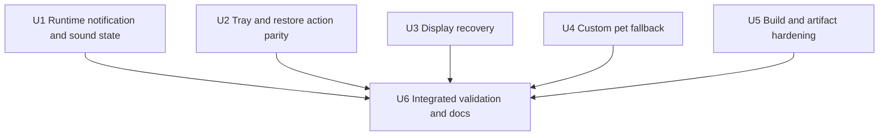
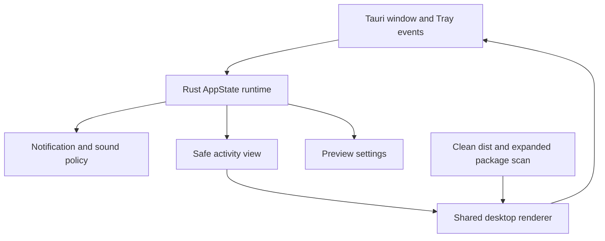

# fix: Harden Tauri desktop pet parity after migration review

## Overview

在现有 Tauri Preview 主迁移已经完成的基础上，补齐本次 Electron/Tauri 对照审查发现的宿主行为差异、运行时状态缺口和打包验证盲区。工作重点不是继续扩展产品能力，而是让 `desktop-tauri/` 更忠实地实现 `desktop/` 已有语义，并把这些语义固化为可回归的自动测试与 Windows 实机验收项。

本计划是 [`2026-09-17-001-refactor-tauri-desktop-pet-migration-plan.md`](2026-09-17-001-refactor-tauri-desktop-pet-migration-plan.md) 的后续加固计划。原迁移计划仍保持 Gate D **Extend**；完成本计划也不会自动把 Tauri 切换为正式发行物。

---

## Problem Frame

Tauri Preview 已具备 Observer、Quick Session、共享 Renderer、设置/密钥、自定义宠物、Tray、通知、声音、Deep Link 和 NSIS 打包能力，现有自动契约也能通过。但审查发现部分行为只完成了接口映射，没有完整迁移 Electron 的状态生命周期：

- 默认 `background-only` 完成通知把“窗口可见”误当成“应用前台”，导致正常桌面使用时漏通知并永久消费 transition；
- Tray 修改 DND、声音和穿透设置后没有立即向 Renderer/Tray 回推新状态；
- “恢复默认位置和大小”只做了可见区域限制，没有恢复 medium 尺寸和默认停靠点；
- 显示器拔除后缺少与 Electron 等价的窗口恢复触发；
- 声音冷却状态只在单个 Snapshot 调用内存在；
- 已选自定义宠物被删除后，Tauri 不会修正持久化选择；
- 构建目录不清理，NSIS 扫描又只检查外部文件名，无法真正证明 pet-only artifact。

这些问题多数不会阻止基础启动，却会在长期常驻、通知、显示器热插拔和发布打包场景中暴露，因此需要以“先补行为 characterization，再修宿主实现，最后加强打包/实机证据”的顺序处理。

---

## Requirements Trace

- R1. Tauri 的 `background-only` 完成通知必须以焦点/后台状态判断，与 Electron 行为一致；被策略消费的 transition 不得因错误状态永久漏报。
- R2. 从系统 Tray 修改 DND、声音或穿透状态后，Renderer view、Tray checked/enabled 状态和持久化设置必须立即一致。
- R3. “恢复默认位置和大小”必须恢复 medium、收起 tray，并移动到当前显示器的默认右下停靠点。
- R4. 显示器移除、DPI/工作区变化后，窗口必须自动回到仍可见的工作区，且被动恢复不得抢焦点。
- R5. 声音同类 cue 的 10 秒冷却必须跨连续 Snapshot 生效，同时保留 baseline、DND、设置关闭和 LRU 不重放语义。
- R6. 当前选中的自定义 Snail/Codex 宠物消失后，Tauri 必须回退并持久化为内置默认宠物。
- R7. Tauri 前端构建必须从干净、allowlist 可审计的 `desktop-tauri/dist` 开始；发布验证必须检查实际应用内容，而非只检查 NSIS 文件名。
- R8. 新增回归覆盖必须同时守住 attach-only、凭据不进 WebView、共享 Renderer 单一来源和 Electron 不回归等既有不变量。
- R9. Windows 实机矩阵必须明确覆盖焦点通知、Tray 即时刷新、显示器拔除、默认位置恢复和 expanded artifact 扫描，不得把自动契约或 Electron 结果替代为 Tauri 实机 Pass。

---

## Scope Boundaries

- 不删除或重构 Electron `desktop/`，只把它作为行为基线和共享 Renderer 来源。
- 不改变 Observer/Control/Deep Link 服务协议，不增加 WebView 网络、文件系统、shell 或 opener 权限。
- 不重新设计桌宠 UI、通知策略、声音种类、DND 产品语义或自定义宠物格式。
- 不在本计划中切换正式 App ID、默认下载、发布入口或删除 Preview 标识。
- 不把 Windows 手工验证结果预填为 Pass；没有真实证据的行继续保持“未执行”。
- 不以修复为由引入全局鼠标/键盘 Hook 或 Node sidecar。

### Deferred to Follow-Up Work

- Tauri 正式替换 Electron、设置正式导入、签名发布和 Electron 退场：继续由未来独立切换计划决策。
- 完整 Windows 10/11、clean-profile、签名、全进程树内存基准：仍属于 Gate D 资格验证，但本计划应补齐对应测试入口和矩阵行。

---

## Context & Research

### Relevant Code and Patterns

- `desktop/main/main.ts`：Electron 宿主行为基线，包括 blur/focus 通知状态、Tray action 后 `pushState()`、显示器变化恢复和自定义宠物选择修正。
- `desktop/main/sound-policy.ts`：跨 Snapshot 保存 `lastPlayedAt` 的声音控制器模式。
- `desktop/main/window-manager.ts`：默认停靠、medium 恢复、窗口布局转换和多显示器恢复纯函数。
- `desktop-tauri/src-tauri/src/app_state.rs`：Tauri runtime、Snapshot effect、设置、catalog 和 event emit 的主要修改点。
- `desktop-tauri/src-tauri/src/lib.rs`：窗口事件与 `window.snailPet` command wiring。
- `desktop-tauri/src-tauri/src/tray_controller.rs`：系统 Tray model、菜单事件和窗口 reveal 路径。
- `desktop-tauri/src-tauri/src/activity_view.rs`：view projection、transition notification/sound effect 和本地 LRU。
- `scripts/build-desktop-tauri.mjs`：共享 Renderer 的 Tauri 前端产物边界。
- `scripts/smoke-desktop-tauri-package.mjs`：配置/NSIS/artifact contract，目前只看到 bundle 外层文件。
- `scripts/smoke-desktop-tauri-view-parity.ts` 与 `desktop-tauri/src-tauri/tests/activity_view_parity.rs`：跨宿主 fixture 模式，但当前只比较 view 摘要和单次 effect。

### Institutional Learnings

- `docs/architecture/decisions/desktop-pet-tauri-migration.md` 已确定：Rust 持有网络、密钥、原生能力；WebView 只接收安全投影；Electron 保持默认发行物。
- `docs/operations/desktop-pet-tauri-validation.md` 已明确自动契约不能替代真实 Windows Tray、焦点、多屏、通知和安装验证。
- 仓库没有相关 `docs/solutions/` 记录；本计划以现有 Electron 实现、Tauri ADR、验证矩阵和本次审查证据为依据。

### External References

本计划不需要新增外部框架研究。目标行为已经由同仓库 Electron 实现定义，优先复用本地模式，避免为等价修复引入新的 Tauri 插件或权限面。

---

## Key Technical Decisions

| Decision | Chosen approach | Rationale |
| --- | --- | --- |
| 后台状态来源 | 在 Rust runtime 中维护窗口 focus/background 状态，Snapshot policy 读取该状态 | `visible` 与“用户正在使用其他应用”不是同一语义；Electron 已以 blur/focus 为基线。 |
| effect 生命周期 | 把跨 Snapshot 的声音冷却状态放在长期 runtime/controller 中，持久化仍只保存 transition LRU | 冷却是进程内短期状态，不应写设置；但不能每次 Snapshot 清零。 |
| host action 刷新 | 所有 Tray 用户动作通过统一的“修改 → 持久化 → emit view → refresh tray”边界 | 避免各 action 忘记回推，确保 Renderer 与系统 Tray 原子可见地一致。 |
| 窗口恢复 | 复用/对齐 Electron 纯几何语义；宿主触发保持被动、不聚焦 | 位置算法应可自动测试，平台监听只负责触发，不混入业务规则。 |
| 自定义宠物回退 | catalog 更新后在 Rust 后端校验当前 key，缺失则持久化默认内置 key | Renderer fallback 只能防止空白，不能修正持久化事实。 |
| artifact 证明 | 构建前清空并 allowlist `dist`；资格验证扫描 release/安装后展开内容 | 单个压缩 NSIS 文件的外层名称无法证明内部没有旧文件或服务端运行时。 |

---

## Open Questions

### Resolved During Planning

- 是否改服务端协议：不改，本轮全部是宿主状态与验证加固。
- 是否复制 Renderer：不复制，继续由 `scripts/build-desktop-tauri.mjs` 复用 `desktop/renderer/`。
- 是否持久化声音冷却时间：不持久化，仅保留进程内状态；持久化 LRU 继续负责历史不重放。
- 是否把完成本计划视为 Gate D Proceed：不视为；资源、安装、签名和完整实机矩阵仍需独立证据。

### Deferred to Implementation

- 显示器拓扑变化的最终触发机制：优先使用公开 Tauri/winit/Windows 消息能力；若当前版本没有稳定事件，再选择低频、可停止的拓扑检测。不得以全局输入 Hook 代替。
- NSIS expanded scan 的具体实现：根据现有 Windows/CI 工具选择“解包”或“静默安装到临时目录”，但必须扫描真实展开内容并安全清理临时目录。

---

## Phased Delivery

- **Phase 1 — Runtime parity:** U1–U4，可独立实现并分别补 characterization tests。
- **Phase 2 — Release boundary:** U5，清理构建输入并让 artifact 证据覆盖真实内容。
- **Phase 3 — Acceptance consolidation:** U6，执行自动回归并更新独立 Tauri 实机矩阵。

---

## Implementation Units

- [x] U1. **Fix focus-aware notifications and cross-Snapshot sound cooldown**

**Goal:** 恢复 Electron 定义的后台通知与声音冷却生命周期，避免可见但失焦时漏通知，以及连续 Snapshot 重复播放同类 cue。

**Requirements:** R1, R5, R8

**Dependencies:** None

**Files:**
- Modify: `desktop-tauri/src-tauri/src/app_state.rs`
- Modify: `desktop-tauri/src-tauri/src/activity_view.rs`
- Modify: `desktop-tauri/src-tauri/src/lib.rs`
- Modify: `desktop-tauri/src-tauri/src/notifications.rs`
- Modify: `scripts/fixtures/desktop-pet-host/transition-cases.json`
- Modify: `scripts/smoke-desktop-tauri-view-parity.ts`
- Test: `desktop-tauri/src-tauri/tests/activity_view_parity.rs`
- Test: `desktop-tauri/src-tauri/tests/native_contract.rs`

**Approach:**
- 在长期 Rust runtime/controller 中维护 app background/focus 与每类 sound cue 的最近播放时间。
- 窗口启动为 no-activate 时默认视为后台；`Focused` 事件只更新本地 runtime，不触发窗口显示。
- notification policy 继续在策略关闭或 DND 抑制时消费 transition；修复点是传入正确的后台状态。
- 声音 policy 保持 transition LRU 独立于通知 LRU，冷却时间只存在内存并跨 Snapshot 更新。
- 共享 fixture 增加连续 Snapshot 序列，而不是只验证单次纯函数调用。

**Execution note:** 先添加可见但失焦通知和跨 Snapshot 冷却的失败测试，再修改 runtime 状态。

**Patterns to follow:**
- `desktop/main/notification-controller.ts`
- `desktop/main/sound-policy.ts`
- `desktop/main/main.ts` 的 blur/focus wiring

**Test scenarios:**
- Happy path：窗口可见但未聚焦，默认 `background-only` 下收到 `ready` transition → 通知一次并记录 notified LRU。
- Happy path：窗口聚焦，默认 `background-only` 下收到 `ready` → 不通知但消费 transition；切到后台后不重放历史。
- Edge case：两个不同 `ready` transition 分属相邻 Snapshot 且间隔小于 10 秒 → 只播放一次 completion cue，两个 transition 都进入 sounded LRU。
- Edge case：第二个同类 cue 超过 10 秒 → 可以再次播放。
- Integration：`WindowEvent::Focused` 更新后台状态后，下一个 Observer Snapshot 使用新状态，且事件本身不 show/focus 窗口。
- Regression：reset/instance baseline、DND、sound master/per-event 开关继续消费且不重放。

**Verification:**
- Tauri 与 Electron 在 visible+blurred、focused、hidden 三种状态下产生一致的完成通知决策。
- 声音冷却跨 Snapshot 生效，且设置文件不新增时间戳状态。

---

- [x] U2. **Unify Tray actions and restore-default behavior**

**Goal:** 让系统 Tray 与 Renderer 的用户动作立即同步，并完整恢复 Electron 的默认位置/大小和 Tray 左键行为。

**Requirements:** R2, R3, R8

**Dependencies:** None

**Files:**
- Modify: `desktop-tauri/src-tauri/src/app_state.rs`
- Modify: `desktop-tauri/src-tauri/src/lib.rs`
- Modify: `desktop-tauri/src-tauri/src/tray_controller.rs`
- Modify: `desktop-tauri/src-tauri/src/window_controller.rs`
- Test: `desktop-tauri/src-tauri/tests/native_contract.rs`
- Modify: `scripts/smoke-desktop-tauri-contract.ts`

**Approach:**
- 为 Tray action 建立统一完成边界：成功修改 runtime/native state 后持久化、emit 最新 view，并刷新系统 Tray。
- DND action 必须立即触发 Renderer 状态更新，以便关闭当前可抑制气泡；声音/穿透 checked state 同步更新。
- 恢复默认值使用纯几何 helper：medium、collapsed、当前显示器右下角 24px padding、可见区域 clamp。
- Tray 左键直接执行用户主动 reveal；上下文菜单保留在右键，不扩大 capability。

**Execution note:** 对 Tray action 和恢复几何先写纯/宿主契约测试，避免依赖手工观察发现状态遗漏。

**Patterns to follow:**
- `desktop/main/main.ts` 的 `handleTrayAction()` 与 `pushState()`
- `desktop/main/window-manager.ts` 的 `defaultPetWindowPosition()` / `handleRestoreDefaultPosition()`

**Test scenarios:**
- Happy path：Tray 开启 DND → 设置持久化、Renderer 收到新 view、Tray 勾选立即更新。
- Happy path：Tray 切换声音 → 只修改 master，保留 needsInput/completion 子开关，并立即刷新两端。
- Happy path：点击“恢复默认位置和大小” → medium、collapsed、当前屏右下默认 dock。
- Edge case：当前屏小于 expanded 窗口或有负坐标 → 恢复结果仍完全可见。
- Integration：Tray 左键从隐藏/点击穿透状态恢复窗口并聚焦，右键仍提供菜单。
- Error path：原生窗口操作失败 → 不伪造已同步状态，保留可重试入口。

**Verification:**
- Tray、Renderer view 和持久化设置在每个用户动作完成后立即一致。
- 恢复按钮的实际结果与 Electron 文案和行为一致。

---

- [x] U3. **Recover safely from display topology changes**

**Goal:** 在显示器拔除、工作区变化和 DPI 变化后自动找回窗口，同时保持被动不抢焦点。

**Requirements:** R4, R8, R9

**Dependencies:** U2

**Files:**
- Modify: `desktop-tauri/src-tauri/src/lib.rs`
- Modify: `desktop-tauri/src-tauri/src/window_controller.rs`
- Modify: `desktop-tauri/src-tauri/Cargo.toml` only if the chosen existing-platform hook requires an already-approved narrow dependency/feature
- Test: `desktop-tauri/src-tauri/tests/native_contract.rs`
- Modify: `docs/operations/desktop-pet-tauri-validation.md`

**Approach:**
- 将“当前 bounds 是否仍与任一 work area 相交”及“恢复到最近/主显示器默认可见位置”保持为纯函数。
- 宿主监听只负责在显示器拓扑、work area 或 scale 变化时触发恢复；被动路径使用 no-activate 移动，不调用用户 reveal。
- 恢复成功后更新并持久化窗口位置；隐藏窗口保持隐藏。
- 若需要轮询，只允许低频、可停止、无窗口聚焦副作用，并在退出时清理。

**Patterns to follow:**
- `desktop/main/main.ts` 的 `recoverToVisibleDisplays()`
- `desktop/main/window-manager.ts` 的 `recoverWindowToNearestWorkArea()`
- `desktop-tauri/src-tauri/src/window_controller.rs` 现有 union/clamp helpers

**Test scenarios:**
- Happy path：窗口所在副屏被移除 → bounds 自动回到剩余 work area 并持久化。
- Edge case：副屏位于负 X/负 Y，移除主屏或副屏 → 选择仍存在的最近 work area。
- Edge case：150%→200% DPI/work area 变化 → 新物理尺寸和位置可见，宠物锚点不永久漂移。
- Integration：隐藏窗口发生拓扑变化 → 位置恢复但保持隐藏；普通前台应用焦点不变。
- Error path：短暂无法读取 monitor topology → 保留现状并等待下一次触发，不移动到 `(0,0)`。

**Verification:**
- 自动几何测试覆盖负坐标、屏幕移除和 work area 缩小。
- Windows `TA-D8` 有独立 Tauri 实机记录后才能标记 Pass。

---

- [x] U4. **Normalize stale custom-pet selection after catalog changes**

**Goal:** 删除或损坏当前自定义宠物后，Tauri 后端修正并持久化默认选择，而不只依赖 Renderer 的视觉 fallback。

**Requirements:** R6, R8

**Dependencies:** None

**Files:**
- Modify: `desktop-tauri/src-tauri/src/app_state.rs`
- Modify: `desktop-tauri/src-tauri/src/custom_pets.rs` if a catalog membership helper is needed
- Test: `desktop-tauri/src-tauri/tests/persistence_security.rs`
- Modify: `scripts/smoke-desktop-tauri-view-parity.ts`

**Approach:**
- 在初始 catalog 加载与每次 rescan 后校验 `selectedPetKey`。
- 内置宠物始终有效；自定义 key 必须存在于当前 catalog locator。
- key 不存在时统一回退到 `snail:snail-default`，同步 `selectedPetId`，持久化 Preview 设置并 emit view。
- catalog payload 保持 path-free，不向 Renderer 暴露 locator 或根目录。

**Execution note:** 先用临时 custom-pet 目录构造“选择 → 删除 → rescan”回归测试。

**Patterns to follow:**
- `desktop/main/main.ts` 的 `ensureSelectedPetAvailable()`
- `desktop-tauri/src-tauri/tests/persistence_security.rs` 的临时目录和 path-free 断言

**Test scenarios:**
- Happy path：当前自定义 Snail/Codex 仍存在 → 选择保持不变。
- Edge case：当前自定义宠物文件夹被删除后 rescan → view 与设置都回退默认 key。
- Edge case：manifest/asset 变坏导致 catalog 排除当前宠物 → 同样回退，不崩溃。
- Restart：设置中保存已不存在 key，应用启动扫描后 → 首个稳定 view 已使用并持久化默认 key。
- Privacy：回退/错误 payload 不包含自定义宠物绝对路径。

**Verification:**
- Renderer 实际显示、选中项和持久化 `selectedPetKey` 不再出现相互矛盾状态。

---

- [x] U5. **Make Tauri frontend and NSIS contents auditable**

**Goal:** 消除 `dist` 残留文件进入安装包的可能，并让 pet-only 检查覆盖真实应用内容。

**Requirements:** R7, R8, R9

**Dependencies:** None

**Files:**
- Modify: `scripts/build-desktop-tauri.mjs`
- Modify: `scripts/smoke-desktop-tauri-package.mjs`
- Modify: `desktop-tauri/src-tauri/tauri.conf.json` only if an explicit packaging hook/output setting is required
- Test: `scripts/smoke-desktop-tauri-package.mjs`
- Modify: `docs/operations/desktop-pet-tauri-validation.md`
- Modify: `desktop-tauri/README.md`

**Approach:**
- 每次 UI build 先删除并重建 `desktop-tauri/dist`，再生成固定 allowlist 文件；构建结束后拒绝额外文件、目录和 source map。
- 静态层验证 `frontendDist`、release executable 和 bundle 配置；qualification 层解包或临时静默安装 NSIS 后扫描 expanded application tree。
- expanded scan 继续拒绝 `.next`、Node/Electron/Forge/pi SDK、server runtime、测试 fixture、Electron/用户设置和 Access Key 文件。
- 临时安装/解包路径必须与正式用户目录隔离，失败时保留可定位日志但不触碰 Electron、`~/.pi/agent` 或 Preview 正式设置。
- 保留 installer ≤20 MB 和 app-specific install dir ≤30 MB 两种独立口径。

**Execution note:** 先增加“在 dist 注入一个额外文件时构建/扫描必须失败”的契约测试，再加入清理与 allowlist。

**Patterns to follow:**
- `scripts/smoke-desktop-package.mjs` 的 expanded resources / ASAR / NUPKG 分层扫描
- `scripts/smoke-desktop-tauri-package.mjs` 现有 forbidden needles 和身份检查

**Test scenarios:**
- Happy path：干净构建只生成预期 HTML/CSS/bridge/app/metadata 文件。
- Edge case：构建前 `dist` 存在旧 fixture 或任意额外文件 → build 清除它，最终 allowlist 通过。
- Failure path：expanded app tree 注入 `.next`、Electron 设置名或测试 fixture → package smoke 明确失败。
- Package：NSIS 外层只有 setup exe 时，测试不得仅凭 `files=1` 宣称内部 pet-only；没有 expanded evidence 时输出明确 SKIPPED/未执行。
- Isolation：qualification 扫描不读取或修改正式 Electron/Preview user-data。

**Verification:**
- `ARTIFACT_SCAN_OK` 只在真实 expanded 内容被检查后输出；仅外层 NSIS 检查使用不同状态标识。
- 构建输入可重复，连续构建不会携带历史文件。

---

- [x] U6. **Consolidate parity regression and Windows acceptance evidence**

**Goal:** 将 U1–U5 的关键语义纳入统一回归入口，并更新 Gate C/D 记录，避免“自动测试通过”掩盖实机空白。

**Requirements:** R8, R9

**Dependencies:** U1, U2, U3, U4, U5

**Files:**
- Modify: `scripts/smoke-desktop-tauri-contract.ts`
- Modify: `scripts/smoke-desktop-tauri-view-parity.ts`
- Modify: `package.json` only if a new bounded smoke must join `test:desktop-tauri-contract`
- Test: `desktop-tauri/src-tauri/tests/activity_view_parity.rs`
- Test: `desktop-tauri/src-tauri/tests/native_contract.rs`
- Test: `desktop-tauri/src-tauri/tests/persistence_security.rs`
- Modify: `docs/operations/desktop-pet-tauri-validation.md`
- Modify: `docs/architecture/decisions/desktop-pet-tauri-migration.md`
- Modify: `docs/modules/frontend.md`
- Modify: `docs/modules/library.md`

**Approach:**
- 扩大 parity fixture 到完整关键字段或分领域摘要，至少覆盖 notification/background、sound sequence、Tray state、restore result 和 pet fallback。
- 自动测试继续区分纯策略、Rust host integration、构建/包扫描和实机证据。
- Tauri 通过新增自动测试后，只更新 Automated 列；Windows 行只有实际执行后才更新。
- 回归同时运行 Electron desktop contract，保证共享 Renderer/基线没有被 Tauri 修复反向破坏。

**Test scenarios:**
- Integrated：Tauri contract 汇总执行 U1–U5 新增测试并保持现有 isolation/quick-session/observer tests 通过。
- Cross-host：同一 notification/sound sequence 在 Electron TS 与 Rust 输出一致。
- Cross-surface：Tray action 后 native setting、Tray model 和 Renderer view 一致。
- Regression：Electron desktop contract 与 package contract 不读取 Tauri 输出且继续通过。
- Manual：可见但失焦完成通知、Tray 左键、默认恢复、显示器拔除和真实 expanded artifact 各有独立记录。

**Verification:**
- 自动测试能在重新引入本次任一缺口时失败。
- ADR/validation 准确描述已修复行为、未执行项和 Gate D 状态，不提前宣布 Proceed。

---

## System-Wide Impact

- **Interaction graph:** Window/Tray 事件更新 Rust runtime；runtime 负责策略、持久化和安全 view emit；共享 Renderer 不新增宿主权限。
- **Error propagation:** 原生窗口/Tray/通知失败保持 best-effort，但不得先更新 UI 为成功状态；打包扫描失败必须阻止资格声明。
- **State lifecycle risks:** focus、sound cooldown 是进程内状态；transition LRU、选择和窗口位置是持久化状态，二者不能混用。
- **API surface parity:** `window.snailPet` 方法形状、Observer/Control wire payload 和服务端 capability 不变。
- **Integration coverage:** 纯 reducer 无法证明真实焦点、Tray 左键、显示器拔除和 NSIS 展开内容，仍需 host/实机层证据。
- **Unchanged invariants:** attach-only、loopback-only、Token/Access Key 留在 Rust、WebView `connect-src 'none'`、退出宠物不影响 `spi`/任务、Electron 保持默认发行物。

---

## Success Metrics

- 本次审查列出的 7 个功能/状态缺口均有自动回归；Tray 左键差异有明确修复或经记录的 Windows 接受结论。
- 可见但失焦时，默认完成通知与 Electron 一致，不再永久漏报。
- 连续 Snapshot 的同类 sound cue 在 10 秒窗口内只播放一次。
- Tray action 完成后无需等待 Observer 事件即可看到 Renderer/菜单状态一致。
- 当前宠物被删除后，首个稳定 view 和磁盘设置都回退默认 key。
- 连续 UI build 不携带历史 `dist` 文件；expanded artifact scan 才能输出内部内容通过结论。
- `test:desktop-tauri-contract` 与 Electron `test:desktop-contract` 均通过；实机未执行项继续如实保留。

---

## Risks & Dependencies

| Risk | Mitigation |
| --- | --- |
| focus 事件和 Observer callback 并发更新 runtime | 使用现有 mutex 边界，只保存最小布尔/时间状态；测试锁顺序和退出路径。 |
| 为显示器热插拔引入不稳定私有 API | 优先公开事件；Windows-only 补丁保持窄且无全局 Hook，并保留手工 Gate。 |
| Tray action emit 形成递归刷新或重复菜单重建 | 统一单向 state-change 边界，model refresh 不再次触发 action。 |
| 声音 cooldown 与 persisted LRU 混淆 | cooldown 仅内存，LRU 仍是历史不重放来源；分别测试。 |
| NSIS 解包工具在 CI 不可用 | 将 always-on clean/allowlist 与 qualification expanded scan 分层；缺工具时明确 SKIPPED，不伪装通过。 |
| Tauri 修复意外影响共享 Renderer/Electron | 不修改 bridge 方法形状；每阶段运行 Electron contract 和 shared view fixture。 |

---

## Documentation / Operational Notes

- `docs/operations/desktop-pet-tauri-validation.md` 增加或强化以下实机行：visible-but-unfocused completion、Tray DND/sound immediate refresh、Tray left-click reveal、restore medium/default dock、monitor unplug、expanded package scan。
- `docs/architecture/decisions/desktop-pet-tauri-migration.md` 仅在实现完成后记录新的 runtime state 与 artifact qualification 边界。
- `desktop-tauri/README.md` 在 U5 后说明 clean build 和 expanded scan 的区别。
- 本计划完成时，如果 Gate D 资源/实机证据仍未齐全，状态可以 completed，但原迁移计划继续 active/Extend；两者状态不要混为一谈。

---

## Sources & References

- Original migration plan: `docs/plans/2026-09-17-001-refactor-tauri-desktop-pet-migration-plan.md`
- Migration ADR: `docs/architecture/decisions/desktop-pet-tauri-migration.md`
- Tauri validation matrix: `docs/operations/desktop-pet-tauri-validation.md`
- Electron host baseline: `desktop/main/main.ts`
- Electron window behavior: `desktop/main/window-manager.ts`
- Electron notification/sound policies: `desktop/main/notification-controller.ts`, `desktop/main/sound-policy.ts`
- Tauri runtime: `desktop-tauri/src-tauri/src/app_state.rs`
- Tauri host wiring: `desktop-tauri/src-tauri/src/lib.rs`, `desktop-tauri/src-tauri/src/tray_controller.rs`
- Tauri package boundary: `scripts/build-desktop-tauri.mjs`, `scripts/smoke-desktop-tauri-package.mjs`
