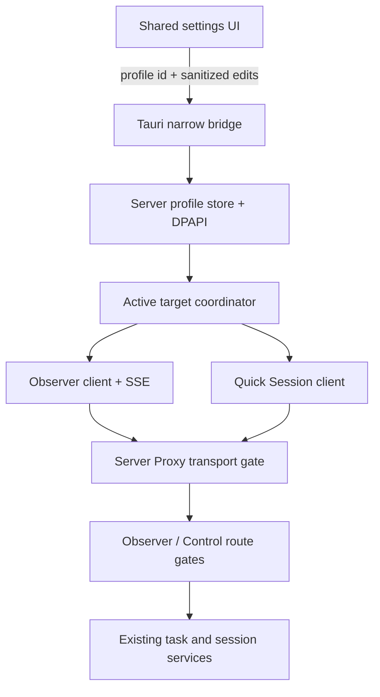
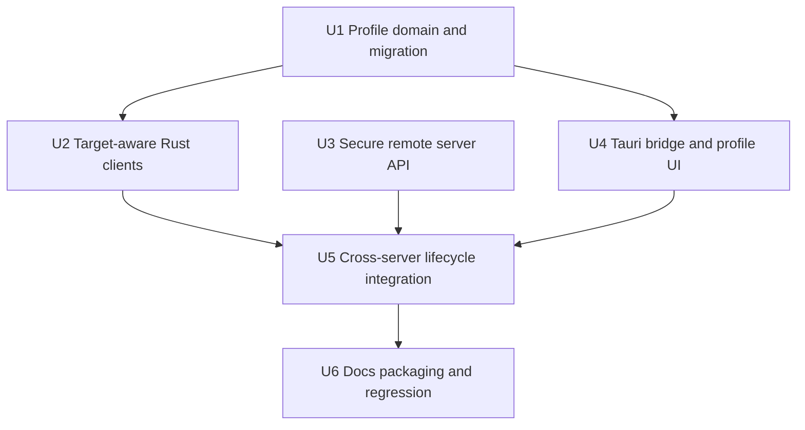
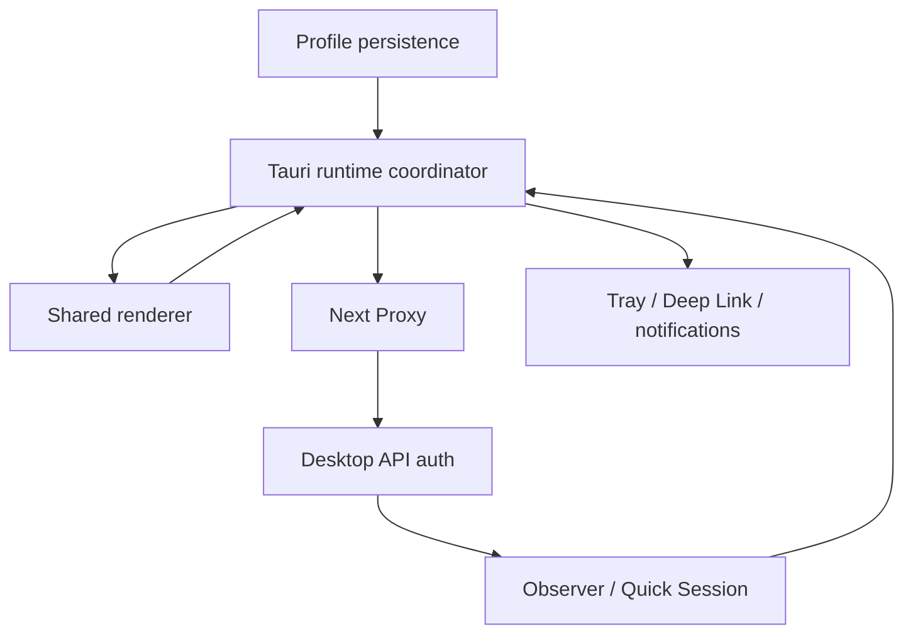

# feat: Add secure multi-server profiles to the Tauri desktop pet

## Overview

为 `desktop-tauri` 增加多个 Snail Pi Web 服务器档案：用户可录入名称、服务器地址和访问密钥，保存后选择一个档案作为当前服务器并切换。桌宠在任一时刻只连接一个服务器；切换时 Observer、Quick Session、Deep Link、通知基线和当前活动视图必须整体切换，不能混合旧服务器状态。

本功能按远程服务器场景规划，不只修改 Tauri 客户端。当前桌宠和服务端都强制 `127.0.0.1`，因此必须同步扩展 `/api/desktop-observer/**`、`/api/desktop-control/**` 和根 `proxy.ts` 的安全边界。远程连接默认要求 HTTPS；用户已确认允许每个服务器显式开启不安全 HTTP 兼容，但客户端和服务端必须双重同意，且不得提供“忽略 TLS 证书错误”。

| 连接模式 | 客户端要求 | 服务端要求 | 密钥 |
| --- | --- | --- | --- |
| 本机 loopback HTTP | 自动允许 | local/server mode 均沿用现状 | local mode 可无密钥；server mode 需要 |
| 远程 HTTPS | 默认允许 | server mode；远程桌宠 API 已启用 | 必须 |
| 远程 HTTP | 档案显式 `allowInsecureHttp` 并持续提示风险 | `--allow-insecure-http` / `PI_WEB_ALLOW_INSECURE_HTTP=1` | 必须，链路风险由用户明确承担 |

---

## Problem Frame

当前 Tauri Preview 的连接目标由 `DesktopPetSettings.port` 表示，`connection_state.rs` 每次都重建 `http://127.0.0.1:<port>`；`ObserverClient`、`QuickSessionClient`、SSE、Deep Link 和“打开 WebUI”均依赖这一固定 loopback origin。Access Key 也只有一个 DPAPI 密文槽位。

服务端同时通过 `lib/desktop-local-access.ts`、Observer/Control Token Store 和 `proxy.ts` 三层强制 loopback。仅在桌宠 UI 中新增 IP 输入框无法建立远程连接，也会绕过既有 HTTPS、Origin、Token 远端绑定和访问密钥速率限制设计。

目标是把“单端口 + 单密钥”升级为“有界服务器档案列表 + 一个活动档案”，保持以下现有边界：attach-only、WebView 无网络权限、Token/密钥只在 Rust/服务端内存、Observer 与 Control Token 分离、退出桌宠不影响任何服务器任务。

---

## Requirements Trace

- R1. 用户可保存多个服务器档案；每个档案包含稳定 ID、可选显示名称、规范化服务器 origin、显式不安全 HTTP 标记和独立访问密钥状态。
- R2. 用户可在已保存档案间切换；任一时刻只连接一个活动服务器，不聚合多个服务器的活动、通知或项目列表。
- R3. 访问密钥不写入普通设置、不回传 WebView、不进入日志/错误/测试夹具；Windows 上继续使用 DPAPI 密文持久化，DPAPI 不可用时只保留内存密钥并明确提示未持久化。
- R4. 旧版 `port` + 单 Access Key 自动迁移为默认“本机”档案；迁移成功前不删除旧密钥文件，失败时仍可按旧配置启动。
- R5. 远程 HTTPS 为默认安全路径；远程 HTTP 只有客户端档案和服务端部署都显式允许时才可连接，且绝不关闭证书/主机名校验。
- R6. 保存档案只做格式、安全和持久化校验，不要求服务器在线；切换档案才触发连接，并把连接错误归因到目标档案。
- R7. 切换或修改活动档案时，旧 Observer/Control Token、SSE、Snapshot、Quick Session catalog/request state 和通知基线全部失效；旧服务器的迟到事件不得污染新服务器视图。
- R8. 服务端仅在 server mode 下接受远程桌宠；远程 session mint 必须验证访问密钥并复用现有速率限制，后续 API 继续使用短期、实例绑定、命名空间隔离的 Observer/Control Token。
- R9. 根 Proxy 对远程桌宠 namespace 只跳过浏览器 Cookie，不跳过有效传输检查；route handler 仍是访问密钥/Token/Origin/Host/remote address 的最终授权边界。
- R10. Electron 桌宠保持现有 loopback 单服务器行为；共享 renderer 中的新 UI 必须通过 Tauri bridge 能力检测隐藏，不能给 Electron 暴露远程连接能力。
- R11. Deep Link、“打开 WebUI”和 Quick Session 始终解析到当前活动服务器；服务切换后旧 `projectRef`、旧活动 ID 和旧 Deep Link 不可继续执行。
- R12. 档案数量、名称、地址和序列化大小必须有界；拒绝 userinfo、路径、query、fragment、重复 origin、无效端口和未显式授权的远程 HTTP。

---

## Scope Boundaries

- 不实现多服务器活动聚合、后台同时连接、跨服务器统一未读数或故障自动切换。
- 不给 Electron 桌宠增加远程服务器功能；只允许为共享 renderer 增加默认隐藏的能力检测 UI。
- 不启动、停止、重启或探测服务器进程 PID；所有档案仍为 attach-only。
- 不保存 Observer/Control Token；它们继续是短期内存态。
- 不支持在桌宠中导入 CA 文件、固定证书指纹、关闭证书验证或接受任意自签名证书。私有 CA 应安装到 Windows 信任库。
- 不把服务器访问密钥升级为多用户/细粒度 API Key；仍复用实例级 Server Access Key。
- 不让 `authBypassCidrs` 代替远程桌宠 session mint 的访问密钥；远程桌宠始终提交密钥。
- 不在保存档案时强制联网验证，避免离线服务器无法预配置。

### Deferred to Follow-Up Work

- 同时观察多个服务器并聚合通知：需要新的跨实例身份、冲突、排序和资源预算设计。
- 客户端证书、证书指纹固定或内置私有 CA 管理：需要独立的证书生命周期和吊销设计。
- Electron 与 Tauri 共用远程服务器档案：必须先决定正式桌宠迁移和密钥存储兼容策略。
- 服务器导入/导出和设备间同步：密钥不可直接导出，需另行设计安全交换机制。

---

## Context & Research

### Relevant Code and Patterns

- `desktop-tauri/src-tauri/src/settings.rs`：当前 `port` 设置规范化、设置安全断言和 Electron 只读迁移模式。
- `desktop-tauri/src-tauri/src/access_key.rs`：单 Access Key 的 DPAPI/内存回退契约；新档案存储应复用 codec，而不是把密钥并入 settings。
- `desktop-tauri/src-tauri/src/connection_state.rs`：当前 origin 被固定为 `127.0.0.1`，也是切换目标抽象的主要改造点。
- `desktop-tauri/src-tauri/src/observer_client.rs`、`quick_session_client.rs`：Observer/Control Token 生命周期和网络传输；必须统一消费同一个活动目标。
- `desktop-tauri/src-tauri/src/app_state.rs`：Snapshot、通知、Deep Link、Quick Session 和设置持久化的编排入口；需要拥有 profile generation 并隔离迟到事件。
- `desktop-tauri/src/tauri-bridge.ts`、`desktop/preload/pet-preload.ts`：共享 `window.snailPet` 窄桥；新增方法应为 Tauri-only optional capability。
- `desktop/renderer/index.html`、`desktop/renderer/pet-app.tsx`、`desktop/renderer/pet.css`：Tauri/Electron 共用设置 UI；远程档案区必须 capability-gated。
- `lib/desktop-local-access.ts`、`lib/desktop-observer-access.ts`、`lib/desktop-control-access.ts`：当前 loopback Gate、Access Key 校验和两个独立 Token Store。
- `proxy.ts`、`lib/server-access-policy.ts`：Server Mode 的 Cookie、HTTPS、Origin、trusted proxy 和桌宠 namespace 例外逻辑。
- `scripts/smoke-desktop-observer-api.ts`、`scripts/smoke-desktop-quick-session.ts`、`scripts/smoke-server-access-proxy.ts`：服务端安全矩阵的现有测试入口。
- `desktop-tauri/src-tauri/tests/persistence_security.rs`、`observer_connection.rs`、`quick_session.rs`：Rust 密钥、连接和控制客户端的现有测试入口。

### Institutional Learnings

- `docs/architecture/decisions/desktop-pet-task-observer.md` 和 `desktop-pet-quick-session.md` 把 loopback-only 作为 v1 安全边界；本功能必须新增独立 ADR，不能静默改写既有历史决策。
- Tauri Preview 的固定边界是 Rust 拥有网络/密钥，WebView CSP 保持 `connect-src 'none'`；远程支持不能改为 WebView fetch。
- 当前 Server Mode 默认要求有效 HTTPS，仅为受信任加密隧道提供显式 `--allow-insecure-http` 兼容；桌宠应镜像而不是削弱该策略。
- 当前 `ureq 2.12.1` 默认使用 rustls + Mozilla roots。其文档说明 `native-tls` 使用 OS 证书验证器/根证书库，并适用于 IP 地址证书校验；Windows 远程连接应优先采用系统信任库，仍保持严格证书验证。

### External References

- `ureq 2.12.1` TLS 与 trusted roots：<https://docs.rs/crate/ureq/2.12.1>。

---

## Key Technical Decisions

| Decision | Chosen approach | Rationale |
| --- | --- | --- |
| 多服务器语义 | 保存多个、仅一个活动连接 | 符合“选择切换”，避免引入聚合身份/通知复杂度。 |
| 地址模型 | 存储规范化 origin，而不是分离 IP/port 字段 | 同时支持 HTTPS、IPv4/IPv6/hostname 和反向代理端口，并禁止 path/query/userinfo。 |
| 裸地址输入 | 裸 IP/主机默认补为 `https://<host>:62666`；HTTP 必须显式写出并勾选风险开关 | 保留用户“录入 IP”的便捷性，同时让安全默认清晰。 |
| 档案存储 | 新建版本化 `tauri-preview-server-profiles.json`，原子写入有界 metadata + 每档案 DPAPI ciphertext；普通 settings 不含密钥 | 一个事务边界减少 metadata/secret 跨文件部分写，仍不落明文。 |
| 密钥编辑 | `preserve / replace / clear` 三态命令；WebView 只见 `hasAccessKey` / `keyPersisted` | 避免空输入误清除或把旧密钥回显到表单。 |
| 迁移 | 首次加载将旧 port/单密钥映射为稳定本机档案；新存储落盘成功后才清理旧密钥文件 | 保持升级可回退，避免密钥丢失。 |
| 切换一致性 | 为活动目标维护递增 generation；切换先失效旧 token/view，再启动新 generation | 阻止阻塞 SSE 的迟到数据覆盖新服务器状态。 |
| TLS | Windows 使用 OS 信任库；不提供跳过证书验证 | 支持企业/私有 CA 和 IP SAN，同时守住访问密钥链路。 |
| HTTP 兼容 | 每档案显式 `allowInsecureHttp` + 服务端显式 allow-insecure 双重 Gate | 用户已确认需要兼容，但误配置不能自动降级。 |
| 服务端远程授权 | Proxy 仅为桌宠 namespace 提供 cookie-free transport gate；route 继续验证 Access Key 或短期 Token | Rust 客户端无法携带浏览器 Cookie，且不能把 namespace 变成匿名公共 API。 |
| Token 绑定 | 直接连接按规范化 socket remote 精确绑定；本机反向代理按受信任有效 origin + proxy hop 绑定，始终绑定 instance/expiry/namespace | 不信任 `X-Forwarded-For`，同时允许官方 HTTPS reverse-proxy 部署。 |
| 协议兼容 | protocol v1 增加 additive `remote_attach` capability；远程档案要求该能力，本机旧服务器继续可连接 | 新 Tauri 能给旧服务明确“不支持远程桌宠”诊断，Electron 忽略新字段。 |
| Shared renderer | 新档案方法作为 optional bridge capability，Electron bridge 不实现 | 保持一套 UI 源，Electron 行为和权限面不扩大。 |

---

## Open Questions

### Resolved During Planning

- **“服务器 IP”是否指其他机器：** 是，按远程服务器并同步修改服务端安全边界规划。
- **远程 HTTP 是否完全禁止：** 否；用户选择“默认 HTTPS，但允许每档案显式不安全 HTTP 兼容”。
- **是否聚合多个服务器：** 否；保存多个但只选择一个活动服务器。
- **保存时是否必须在线验证：** 否；保存只做静态/持久化验证，切换时连接。
- **是否允许忽略 TLS 错误：** 否；私有 CA 应进入 Windows 系统信任库。
- **是否让 trusted CIDR 替代密钥：** 否；远程桌宠 mint 始终要求 Access Key。

### Deferred to Implementation

- `ureq` 切到 `native-tls` 后对现有 Rust MSRV、NSIS 体积和 Windows 构建链的精确影响需在实施时由 Cargo lock/build 结果确认；若影响不可接受，可改用 rustls native certs，但不能退化为跳过证书校验。
- 阻塞 SSE 在切换时能否主动中止取决于 transport 能力；计划要求 generation 隔离为正确性底线，主动取消作为实现期优化。
- Profile ID 的具体生成函数名和 UUID/随机十六进制格式由实现决定，但必须稳定、非 origin 派生、不可由 renderer 指定覆盖。

---

## High-Level Technical Design

> *This illustrates the intended approach and is directional guidance for review, not implementation specification. The implementing agent should treat it as context, not code to reproduce.*

切换顺序必须是：持久化 active profile → generation 增长 → 清空旧 Snapshot/选择/Quick Session 状态 → 撤销旧内存 Token → 发布 probing view → 连接新服务器 → 首个 reset Snapshot 建立通知基线。任何旧 generation 的 callback/SSE block 均被丢弃。

---

## Implementation Units

- [x] U1. **建立服务器档案、密钥存储和兼容迁移**

**Goal:** 建立有界、版本化、无明文的服务器档案 source of truth，并无损迁移当前本机 port/Access Key。

**Requirements:** R1, R3, R4, R6, R12

**Dependencies:** None

**Files:**
- Create: `desktop-tauri/src-tauri/src/server_profiles.rs`
- Create: `desktop-tauri/src-tauri/tests/server_profiles.rs`
- Modify: `desktop-tauri/src-tauri/src/access_key.rs`
- Modify: `desktop-tauri/src-tauri/src/settings.rs`
- Modify: `desktop-tauri/src-tauri/src/lib.rs`
- Modify: `desktop-tauri/src-tauri/tests/persistence_security.rs`

**Approach:**
- 定义固定上限的 profile store（建议最多 20 个档案），包含 `activeServerId` 和稳定档案 ID；renderer 只能提交新建/编辑意图，不能指定或覆盖内部 ID。
- 规范化 origin：只接受 `http`/`https`，禁止 userinfo/path/query/fragment，无端口时使用 62666；裸 host/IP 默认 HTTPS。
- loopback HTTP 自动允许；非 loopback HTTP 必须同时带 `allowInsecureHttp=true`，并在安全投影中标记 `insecure`。
- 每个档案独立调用现有 `AccessKeyCodec` 生成 DPAPI ciphertext。内存 fallback 时 profile metadata 可持久化，但 key 不写盘并返回 `keyPersisted=false`。
- 使用同目录 temp + rename 原子替换 profile store；限制名称、origin、ciphertext 和总文件大小。
- 迁移时从旧 settings.port 构造本机档案并读取旧单密钥；只有新 store 成功持久化且可重新读取后才删除旧 `tauri-preview-access-key.json`。无密钥、损坏密钥和 DPAPI 不可用均有确定性回退。

**Patterns to follow:**
- `desktop-tauri/src-tauri/src/access_key.rs` 的 codec 可用性/明文泄漏断言。
- `lib/model-favorites.ts`、`lib/mcp-config.ts` 的版本化、规范化和原子写入思路（实现语言不同，采用边界而非照抄代码）。

**Test scenarios:**
- Happy path：保存两个 HTTPS 档案及不同密钥，重启加载后 active ID、origin 和 `hasAccessKey` 正确，文件不含任一明文密钥。
- Happy path：保存 loopback HTTP 档案无需不安全开关；保存远程 HTTP 且显式开关后标记为 insecure。
- Edge case：裸 IPv4、IPv6、hostname 和显式端口规范化为唯一 origin；重复 origin、超过数量/长度上限被拒绝。
- Error path：userinfo、路径、query、fragment、无效端口、未知 scheme、未授权远程 HTTP 均失败且不改变原 store。
- Error path：DPAPI 不可用时 metadata 保存成功、密钥仅留内存、磁盘无明文，重启后显示需要重新录入密钥。
- Migration：旧 port + 可解密单密钥迁移为本机 active 档案；新文件验证成功后旧文件删除。
- Migration failure：新文件写入/校验失败时旧 key 文件不删除，应用仍按旧本机配置启动。
- Security：序列化 profile projection 只含 `hasAccessKey`/`keyPersisted`，不含 ciphertext、明文或 codec 错误细节。

**Verification:**
- Profile store 成为 Tauri 连接目标唯一 source of truth，旧配置可自动升级且不存在明文密钥落盘路径。

---

- [x] U2. **将 Rust 连接栈改为活动目标驱动**

**Goal:** 让 Observer、SSE、Quick Session、Deep Link 和打开 WebUI 统一消费规范化活动 origin，并用 generation 隔离切换竞态。

**Requirements:** R2, R5, R7, R11

**Dependencies:** U1

**Files:**
- Modify: `desktop-tauri/src-tauri/Cargo.toml`
- Modify: `desktop-tauri/src-tauri/Cargo.lock`
- Modify: `desktop-tauri/src-tauri/src/connection_state.rs`
- Modify: `desktop-tauri/src-tauri/src/observer_client.rs`
- Modify: `desktop-tauri/src-tauri/src/quick_session_client.rs`
- Modify: `desktop-tauri/src-tauri/src/app_state.rs`
- Modify: `desktop-tauri/src-tauri/src/deep_links.rs`
- Modify: `desktop-tauri/src-tauri/src/native.rs`
- Modify: `desktop-tauri/src-tauri/tests/observer_connection.rs`
- Modify: `desktop-tauri/src-tauri/tests/quick_session.rs`
- Modify: `desktop-tauri/src-tauri/tests/native_contract.rs`

**Approach:**
- 用不可变 `ConnectionTarget`（profile ID、origin、安全模式、内存密钥、generation）替代客户端内部独立 port/access_key 状态，确保 Observer 和 Control 不会指向不同服务器。
- `connection_state` 保留 renderer 需要的 origin/port 兼容投影，但 reducer 不再从 port 强制重建 loopback origin。
- 切换目标时先递增 generation 使旧 callback 失效，再清 token 和旧 snapshot；所有网络响应/SSE callback 在应用状态前验证 generation。
- Quick Session target 切换立即清 Control Token、instance、catalog 可用性；旧 `projectRef` 请求因 generation 不匹配而失败。
- 远程目标使用 Windows OS 信任库的严格 TLS；HTTP 仅在 profile 已显式授权时构造 transport，绝不自动从 HTTPS 降级。
- Deep Link 和 Open WebUI 从活动 target origin 解析，仍只接受服务端给出的相对 allowlist path。

**Patterns to follow:**
- `desktop-tauri/src-tauri/src/app_state.rs` 的 main-owned networking 和 safe view emission。
- `desktop-tauri/src-tauri/src/observer_client.rs` 的 instance mismatch、token expiry 和 reset baseline。
- `desktop-tauri/src-tauri/src/deep_links.rs` 的相对 URL 二次校验。

**Test scenarios:**
- Happy path：HTTPS profile 的 health/protocol/session/events 全部命中配置 origin，Observer 与 Quick Session 使用相同目标和密钥。
- Happy path：从服务器 A 切到 B 后，状态立即 probing，A token 清除，B 首个 snapshot 以 reset baseline 接收。
- Race：A 的阻塞 SSE 在切换后迟到返回 snapshot/stream error，generation 不匹配时完全忽略，不修改 B 状态或通知。
- Edge case：编辑当前 profile 的 origin 或 key 视为新 generation；仅改名称不重连。
- Error path：TLS 主机名/链验证失败显示有界连接诊断，不回退 HTTP、不泄漏底层证书或密钥内容。
- Error path：远程 HTTP profile 未显式授权时 transport 在发请求前拒绝。
- Integration：切换后旧 Quick Session projectRef/create 请求失败为 disconnected/stale-target，新 catalog 只能从 B 加载。
- Integration：旧活动 Deep Link 在切换清空 view 后不可打开；新活动只在 B origin 打开。

**Verification:**
- 任意时刻所有网络能力只指向一个活动 profile，且旧服务器迟到事件无法跨 generation 生效。

---

- [x] U3. **安全开放远程 Desktop Observer/Control API**

**Goal:** 在不依赖浏览器 Cookie、且不把 namespace 公开匿名化的前提下，让远程 Tauri 通过 Access Key 换取短期 Token。

**Requirements:** R5, R8, R9, R12

**Dependencies:** None（可与 U1/U2 并行）

**Files:**
- Modify: `proxy.ts`
- Modify: `lib/server-access-policy.ts`
- Modify: `lib/server-access-auth.ts`
- Modify: `lib/desktop-local-access.ts`
- Modify: `lib/desktop-observer-access.ts`
- Modify: `lib/desktop-control-access.ts`
- Modify: `lib/desktop-control-constants.ts`
- Modify: `app/api/desktop-observer/protocol/route.ts`
- Modify: `app/api/desktop-observer/session/route.ts`
- Modify: `app/api/desktop-observer/events/route.ts`
- Modify: `app/api/desktop-observer/snapshot/route.ts`
- Modify: `app/api/desktop-control/session/route.ts`
- Modify: `app/api/desktop-control/projects/route.ts`
- Modify: `app/api/desktop-control/models/route.ts`
- Modify: `app/api/desktop-control/quick-sessions/route.ts`
- Modify: `scripts/smoke-server-access-auth.ts`
- Modify: `scripts/smoke-server-access-proxy.ts`
- Modify: `scripts/smoke-desktop-observer-api.ts`
- Modify: `scripts/smoke-desktop-quick-session.ts`

**Execution note:** 先扩展安全矩阵测试，再放宽 Proxy/route Gate；这是从 local-only 到 remote-capable 的高风险边界变化。

**Approach:**
- 把现有“loopback Gate”拆成：请求网络身份分类、有效传输检查、session mint Access Key 校验、后续 bearer Token 校验。local loopback 路径保持现状。
- 远程请求仅在 server mode 接受；HTTPS 默认必须有效，HTTP 只有部署显式 `allow-insecure-http` 时通过。Remote profile 的客户端开关不能替代服务端 Gate。
- Proxy 对 desktop namespace 执行 transport gate 后跳过浏览器 Cookie；不把这些路径加入通用 `isPublicPath`。协议/session/token route 由专用 handler 完成最终授权。
- `/protocol` 对通过网络/transport Gate 的请求返回 additive `remote_attach` capability；远程 session mint 始终验证 Access Key，复用 socket-IP attempt bucket，忽略 `authBypassCidrs` 的免密语义。
- Observer/Control Token Store 允许远程绑定：直接连接精确绑定规范化 socket remote；trusted reverse proxy 不信任 `X-Forwarded-For`，改为绑定有效 origin/proxy hop、instance、expiry 和 namespace。
- Origin 存在时仍要求 exact same-origin；无 Origin 只为原生桌宠允许。所有 token API 保持 no-store，Observer/Control Token 继续互斥。
- Access Key rotation/实例变化必须使已签发 desktop token 失效，或以可验证 auth generation 绑定；不能让远程 bearer 在密钥轮换后继续活到旧 TTL 之外。

**Patterns to follow:**
- `lib/server-access-policy.ts` 的 effective protocol、trusted proxy 和 no-store helpers。
- `lib/server-access-auth.ts` 的访问密钥验证与 attempt budget。
- `lib/desktop-observer-access.ts` / `desktop-control-access.ts` 的独立 hash store 和 timing-safe compare。

**Test scenarios:**
- Local regression：direct `127.0.0.1` local mode 无 key 仍可 observer；loopback server mode 仍需 key。
- Happy path：远程 HTTPS + server mode + 正确 key 可获取 Observer/Control Token，并访问各自 namespace。
- Happy path：受信任 HTTPS reverse proxy 后端 socket 为 loopback时可工作，但不读取/信任伪造 `X-Forwarded-For`。
- Error path：远程 local mode、缺失/错误 key、超长 body、跨 Origin、错误 Host、过期 token 均失败闭合。
- Transport：远程 HTTP 在默认 server mode 被 Proxy 拒绝；只有 server 显式 allow-insecure 时进入 route，且响应保留风险可诊断 code。
- Rate limit：远程错误 key 与现有登录共享 socket-IP bucket，达到阈值返回 429/Retry-After。
- Namespace isolation：Observer Token 不能调用 Control，Control Token 不能读取 Observer snapshot/events。
- Remote binding：direct client A 的 token 不能由 client B 使用；伪造 forwarded header 不能改变绑定身份。
- Rotation：Server Access Key 轮换后，旧 desktop mint 失败且已有远程 token 失效；新 key 可重新 mint。
- Capability：新服务器对远程 protocol 宣告 `remote_attach`；旧/本机客户端忽略 additive 字段。

**Verification:**
- Remote desktop namespace 可在 HTTPS Server Mode 下无 Cookie 工作，但任一业务读取/写入都必须经过 Access Key mint + 短期 namespace Token。

---

- [x] U4. **增加 Tauri-only 档案管理桥与共享设置 UI**

**Goal:** 提供录入、编辑、删除和选择切换服务器的 UI，同时保持 Electron bridge 权限面不变。

**Requirements:** R1, R2, R3, R6, R10, R12

**Dependencies:** U1

**Files:**
- Modify: `desktop-tauri/src-tauri/src/lib.rs`
- Modify: `desktop-tauri/src-tauri/src/app_state.rs`
- Modify: `desktop-tauri/src/tauri-bridge.ts`
- Modify: `desktop/preload/pet-preload.ts`
- Modify: `desktop/renderer/index.html`
- Modify: `desktop/renderer/pet-app.tsx`
- Modify: `desktop/renderer/pet.css`
- Modify: `scripts/build-desktop-tauri.mjs`
- Modify: `scripts/smoke-desktop-tauri-contract.ts`

**Approach:**
- Tauri bridge 增加 optional `listServerProfiles`、`saveServerProfile`、`deleteServerProfile`、`switchServerProfile` 命令；Electron preload type 声明为可选但不实现。
- renderer 仅在完整能力存在时显示“服务器”设置卡；Electron 继续显示现有单 Access Key 面板和 port 行为。
- 表单包含名称（可选）、地址、Access Key、新增/编辑/清除 key 三态、允许不安全 HTTP checkbox；密钥字段永不回填。
- 列表展示名称、规范化 origin、当前/HTTPS/HTTP 风险、密钥已配置/仅内存状态和“切换”动作。
- 保存 inactive profile 不自动联网/切换；编辑 active profile 的连接关键字段由 Rust 原子保存后触发重连。禁止删除 active profile和最后一个 profile，用户必须先切换。
- 所有 bridge 响应经过 Rust safe projection；renderer 不接收 ciphertext、明文、绝对文件路径或通用 open/fetch 能力。

**Patterns to follow:**
- `desktop/renderer/index.html` 现有 Access Key 与 Settings Card 结构。
- `desktop/renderer/pet-app.tsx` 的 DOM 事件绑定、keyboard 操作和 view 更新模式。
- `desktop-tauri/src/tauri-bridge.ts` 的冻结 allowlist 和 typed invoke。

**Test scenarios:**
- Happy path：Tauri 能力存在时显示服务器卡，新增两个档案后列表可选择并标记 active；inactive save 不改变当前连接。
- Electron regression：optional capability 不存在时新卡隐藏，现有 key/port/settings 行为不变且无未知 IPC 调用。
- Secret：编辑档案时只显示“已配置”，输入留空默认 preserve；replace/clear 必须显式操作，响应/DOM 不出现旧 key。
- HTTP safety：输入远程 `http://` 未勾选时阻止保存；勾选后显示持续风险 Badge/说明，不静默改为 HTTPS。
- Edge case：active/last profile 删除按钮禁用并给出原因；重复 origin 和后端规范化错误显示在对应字段。
- Accessibility：列表和操作可键盘访问，label 正确关联，Escape 退出编辑，切换/删除不只依赖颜色表达状态。
- Error path：Rust save/switch 失败时保留用户输入与当前 active 标记，不做乐观切换。

**Verification:**
- 用户可在 Tauri 设置中完成档案 CRUD 与显式切换，Electron 不获得新增远程能力，任何 UI 投影均无 secret。

---

- [x] U5. **完成跨服务器切换生命周期和集成验证**

**Goal:** 把 UI、profile store、客户端和远程服务端串成一致的切换流程，并覆盖通知/Quick Session/Deep Link 边界。

**Requirements:** R2, R7, R8, R9, R11

**Dependencies:** U2, U3, U4

**Files:**
- Modify: `desktop-tauri/src-tauri/src/activity_view.rs`
- Modify: `desktop-tauri/src-tauri/src/app_state.rs`
- Modify: `desktop-tauri/src-tauri/src/tray_controller.rs`
- Modify: `desktop/renderer/pet-app.tsx`
- Modify: `desktop/renderer/quick-session-state.ts`
- Modify: `desktop-tauri/src-tauri/tests/activity_view_parity.rs`
- Modify: `desktop-tauri/src-tauri/tests/isolation.rs`
- Modify: `desktop-tauri/src-tauri/tests/quick_session.rs`
- Modify: `scripts/smoke-desktop-tauri-view-parity.ts`

**Approach:**
- safe view 增加有界 `activeServer` 投影（ID、名称、origin、security、generation），不加入 key/ciphertext。
- server generation 变化时 renderer 重置 Quick Session reducer、关闭旧 catalog/picker/result，并清除旧活动选择；不要把 A 的 projectRef/message requestId提交给 B。
- Rust 切换立即清 snapshot、transition runtime 和 selected activity；第一份 B snapshot 强制 reset baseline，不通知 B 的历史 transition。
- Tray 的“Open WebUI”、Retry、连接状态说明和 Activity deep link全部使用 active profile；远程服务器离线时不显示“复制 `spi --no-open`”为本机修复动作，改为目标服务器诊断。
- 对旧 server 不支持 `remote_attach`、TLS 失败、key invalid、HTTP 双重 Gate 不一致提供稳定 reason code 和安全文案，不透传原始网络错误。

**Patterns to follow:**
- `desktop-tauri/src-tauri/src/activity_view.rs` 的 renderer safe-view assertion。
- `desktop/renderer/quick-session-state.ts` 的 reducer/error vocabulary。
- `desktop-tauri/src-tauri/src/tray_controller.rs` 的单一状态刷新边界。

**Test scenarios:**
- End-to-end：保存 A/B，连接 A 看到活动与 Quick Session catalog；切换 B 后 A 内容立即消失，B reset snapshot 后只显示 B 内容。
- Notifications：切换到有历史 terminal transitions 的 B 不补发通知/声音；B 后续新 transition 正常提示。
- Quick Session：A composer 已加载 catalog 或保留草稿时切换 B，catalog/requestId/selection 清除；用户文本草稿是否保留按现有本地 reducer语义明确测试，绝不自动提交。
- Deep Link：A 行被清除后不能打开；B 行解析为 B origin；renderer 提交绝对 URL 仍被拒绝。
- Failure：B TLS/key/version失败时显示 B 名称/origin和稳定原因，可切回 A 并重新建立 A baseline。
- HTTP compatibility：客户端允许但服务端未允许时显示“服务器拒绝不安全 HTTP”；双端都允许时连接成功并持续显示 insecure 状态。
- Isolation：Tauri WebView 仍 `connect-src 'none'`，bridge 无 generic invoke/http/open，profile 投影无 token/key/cwd/path。
- Local regression：迁移后的本机 profile 在现有 fixtures 下保持连接/activity view/Quick Session 行为。

**Verification:**
- 实际切换流程在所有跨层状态上是“先断旧、再连新”，不存在活动、通知、Token、项目或链接串服。

---

- [x] U6. **更新契约、文档、打包与回归矩阵**

**Goal:** 将远程多服务器作为显式受控能力归档，并确认没有破坏 Tauri 隔离、Electron 基线和发行体积边界。

**Requirements:** R3, R5, R8, R9, R10

**Dependencies:** U5

**Files:**
- Create: `docs/architecture/decisions/desktop-pet-remote-server-profiles.md`
- Modify: `docs/architecture/decisions/desktop-pet-tauri-migration.md`
- Modify: `docs/modules/api.md`
- Modify: `docs/modules/frontend.md`
- Modify: `docs/modules/library.md`
- Modify: `docs/deployment/README.md`
- Modify: `docs/operations/troubleshooting.md`
- Modify: `docs/operations/desktop-pet-tauri-validation.md`
- Modify: `desktop-tauri/README.md`
- Modify: `AGENTS.md`
- Modify: `scripts/smoke-desktop-tauri-package.mjs`
- Modify: `scripts/smoke-desktop-tauri-contract.ts`

**Approach:**
- 新 ADR 明确 v1 local-only 被本计划“对 Tauri remote profile 场景有条件放宽”，并保留 attach-only、single-active、secret-in-Rust、HTTPS-default 不变量。
- 部署文档给出 HTTPS reverse proxy 和显式 insecure HTTP 兼容前提，明确 IP HTTPS 证书需要合法 SAN/Windows 信任链。
- API 文档记录 cookie-free desktop namespace 不等于 public API，Access Key mint、短期 Token、Origin 和 remote binding 的顺序。
- 包扫描禁止 profile/key 文件进入安装产物；运行时 app-data 文件只在用户保存后产生。
- Windows 手工矩阵覆盖 direct LAN HTTPS、loopback reverse proxy HTTPS、显式 HTTP compatibility、TLS failure、key rotation、A↔B 切换、离线保存和重启恢复。

**Test scenarios:**
- Contract：Tauri capability allowlist 只有具体 profile 命令，无 generic HTTP/shell/fs；CSP 仍 `connect-src 'none'`。
- Package：安装树不包含 profile store、Access Key ciphertext、测试证书或服务器配置；npm `spi` 包仍不包含 `desktop-tauri`。
- Regression：Electron desktop smoke、Observer/Control API smoke、Server Auth/Proxy smoke、Tauri Rust/contract/view/package smoke 全部保持通过。
- Manual：受信任 HTTPS 服务器 A/B 切换成功；错误证书失败且无 bypass；HTTP 只有双端显式允许才成功；旋转 key 后旧连接失效并可更新档案恢复。
- Manual：重启 Tauri 后恢复 active profile；DPAPI 不可用场景要求重新输入 key且磁盘无明文。

**Verification:**
- 文档、安全契约、打包扫描和 Windows 验收矩阵共同说明远程能力的启用条件与剩余风险，Electron 和 npm 发布边界未扩大。

---

## System-Wide Impact

- **Interaction graph:** Profile switch 影响 Rust clients、SSE generation、activity view、Quick Session、Tray、Deep Link、notifications，以及服务端 Proxy/Auth/Token Store。
- **Error propagation:** 网络/TLS/Auth 错误先映射为稳定 reason code，再进入 safe view；原始 error、URL userinfo、key 和 ciphertext 不进入 renderer。
- **State lifecycle risks:** profile metadata 与 key 的部分写、旧 SSE 迟到、token 跨目标复用、Quick Session projectRef 串服、active profile 删除、key rotation 都是必须测试的状态边界。
- **API surface parity:** Observer 与 Control 必须同时支持 active origin/remote Gate，不能只开放读链路而让 Quick Session 指回本机。
- **Integration coverage:** 纯 unit tests 不能证明 Proxy → route → token → SSE/quick session 或 A→B generation 隔离，需要跨层 smoke 和 Windows 实机矩阵。
- **Unchanged invariants:** WebView 无网络、Observer/Control Token 分离、attach-only、server 单实例、Deep Link 相对 allowlist、Electron loopback-only、Tauri Preview 独立 app-data/identity 均保持不变。

---

## Risks & Dependencies

| Risk | Likelihood | Impact | Mitigation |
| --- | --- | --- | --- |
| 放宽 loopback Gate 意外公开业务 API | Medium | High | Proxy 只做 transport/cookie 例外；route 必须 Access Key mint + namespace Token，测试匿名矩阵。 |
| 远程 HTTP 泄漏 Access Key | Medium | High | HTTPS 默认；客户端/服务端双显式开关；持续 UI 风险提示；不自动降级。 |
| HTTPS IP/私有 CA 在 rustls 下不兼容 | Medium | Medium | Windows 使用 OS trust/native TLS；要求合法 SAN；不提供证书 bypass。 |
| 切换时旧 SSE 污染新服务器 | High | High | generation 检查作为正确性底线，switch 先清状态/token，迟到 callback 全丢弃。 |
| DPAPI 多密钥迁移造成丢失 | Low | High | 新 store 原子写+回读后才删旧文件；失败继续旧配置。 |
| Reverse proxy 无真实 client IP | Medium | Medium | 不信任 XFF；绑定 effective origin/proxy hop + bearer/instance/TTL；文档说明同 hop 的速率限制粒度。 |
| 共享 renderer 误给 Electron 显示 Tauri UI | Medium | Medium | optional bridge 完整能力检测；Electron smoke 验证无命令/无 UI。 |
| Access Key rotation 后短期 Token 残留 | Medium | High | token 绑定 auth generation 或 rotation hook；新增轮换测试。 |
| Profile 增多导致设置/扫描无界 | Low | Medium | 数量、字段、ciphertext、文件大小固定上限。 |

---

## Alternative Approaches Considered

- **只改 `desktop-tauri` 并假设服务端已支持远程：** 当前服务端三层拒绝 non-loopback，计划无法落地；拒绝。
- **复用浏览器 Cookie 登录：** Rust 客户端没有浏览器 Cookie 生命周期，会扩大 CSRF/持久 session 面；继续使用 Access Key mint + 短期专用 Token。
- **每个服务器常驻一个连接并聚合：** 不符合“选择切换”的最小需求，并引入通知去重、资源预算和跨实例身份冲突；延期。
- **把密钥放进 `tauri-preview-settings.json`：** 违反现有 secret 边界；使用 DPAPI ciphertext profile store。
- **允许跳过 TLS 校验以支持自签名：** 会使 HTTPS 失去对 Access Key 的保护；拒绝，改用 Windows 信任库。
- **复制一套 Tauri renderer：** 会形成 UI 分叉；共享 renderer 通过 optional bridge capability 隔离。

---

## Documentation / Operational Notes

- 远程服务器必须由 `spi --server` 或非 loopback bind 启动；推荐由受信任反向代理终止 TLS。
- 直接输入 IP 的 HTTPS 部署必须使用包含该 IP SAN 的证书；私有 CA 应安装到 Windows 用户/机器信任库。
- `allowInsecureHttp` 只是客户端同意发送，服务端仍必须显式启动 `--allow-insecure-http`；任一侧未同意都失败。
- 保存服务器档案不代表连通性验证成功；连接结果以切换后的 protocol/session/SSE 状态为准。
- Tauri 仍不管理任何 `spi` 进程；远程服务器离线时不应引导在本机执行启动命令。

---

## Sources & References

- Related ADR: `docs/architecture/decisions/desktop-pet-task-observer.md`
- Related ADR: `docs/architecture/decisions/desktop-pet-quick-session.md`
- Related ADR: `docs/architecture/decisions/desktop-pet-tauri-migration.md`
- Existing Tauri runtime: `desktop-tauri/src-tauri/src/app_state.rs`
- Existing server gate: `lib/desktop-local-access.ts`
- Existing Proxy policy: `proxy.ts`, `lib/server-access-policy.ts`
- External TLS reference: <https://docs.rs/crate/ureq/2.12.1>
