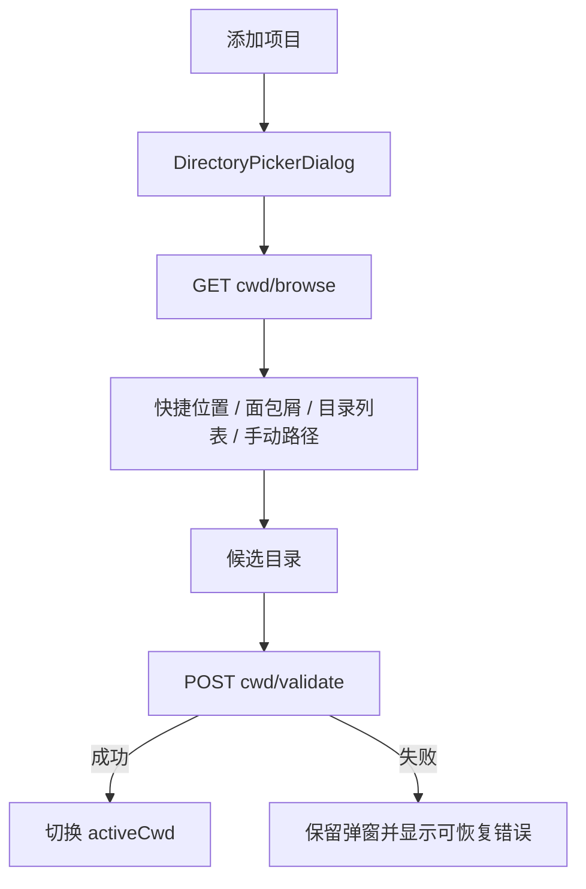
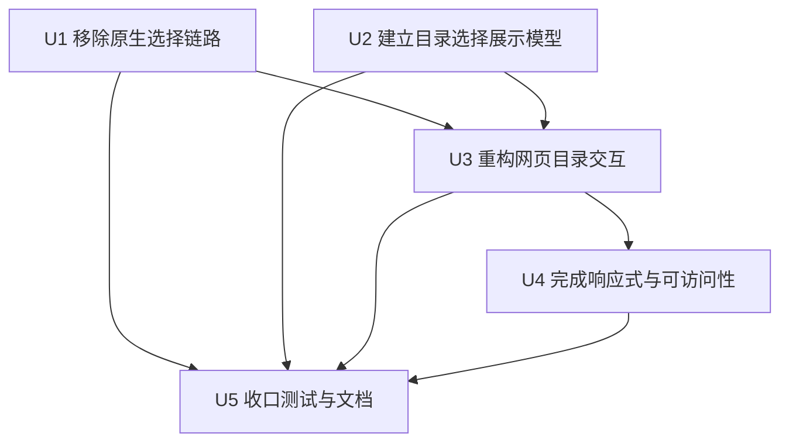
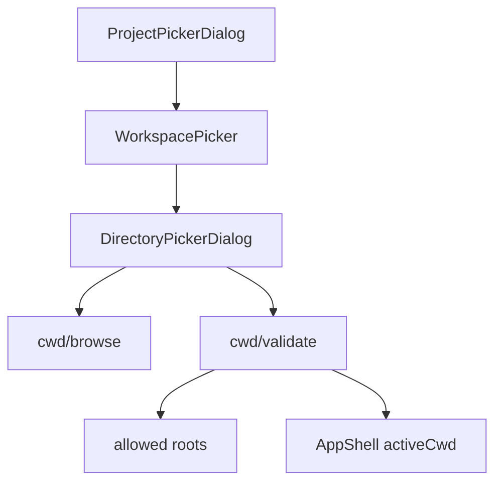

# refactor: 统一添加项目的网页目录选择体验

## Overview

完全移除“添加项目”中的宿主操作系统原生目录选择器，只保留 WebUI 内的服务器目录浏览器。新的单一路径应明确表达“正在选择 WebUI 服务端文件系统中的项目目录”，并通过快捷位置、路径面包屑、目录选中/进入分离、键盘操作、可靠加载状态和响应式布局，补足取消原生选择器后的效率与可用性。

本计划不改变 `/api/cwd/validate` 的最终校验和 allowed-root 注册边界，也不移除工作区菜单中的“在系统文件管理器中打开项目目录”；后者是打开已授权目录，与“添加项目”的目录选择不是同一能力。

---

## Problem Frame

当前添加项目存在原生选择器与网页选择器两条分支。原生分支依赖 loopback socket 上下文、Host/代理判断、PowerShell/osascript/zenity/kdialog、单飞锁和超时状态，导致本机冷启动、远程访问、后台 GUI 会话和后端失败时呈现不一致。与此同时，网页目录浏览器仍偏向基础可用：点击目录只能进入，缺少明确选中态和面包屑，快捷位置没有被完整利用，键盘及窄屏体验也有提升空间。

目标是用更简单、可测试的单一路径获得更稳定的添加项目体验，而不是继续维护两个语义不同的选择器。

---

## Requirements Trace

- R1. 点击“添加项目”后始终直接打开 WebUI 服务器目录浏览器，不再探测或调用原生目录选择能力。
- R2. UI 文案必须明确目录来自 WebUI 服务端文件系统，避免用户误认为正在浏览浏览器客户端磁盘。
- R3. 用户可通过 Home、磁盘/文件系统根、当前项目、上级目录、路径面包屑和手动路径快速定位目录。
- R4. 单击目录表示选中，双击或显式导航操作表示进入；底部主按钮明确选择当前候选目录。
- R5. 支持键盘完成主要流程，并维持弹窗焦点约束、Escape 关闭、焦点恢复和触摸可达性。
- R6. 加载、空目录、目录过多、无权限、路径不存在和最终校验失败必须有稳定且可恢复的界面状态；过期请求不得覆盖更新位置。
- R7. 任何目录最终仍必须经过 `/api/cwd/validate`，成功后才切换 `activeCwd` 并注册 allowed root。
- R8. 删除原生选择器相关路由、共享模块、脚本、文案和现行文档入口，不保留不可达兼容分支。
- R9. 桌面宽屏提供高效目录浏览布局，窄屏和移动端保持无横向溢出、可读路径和足够触控目标。

---

## Scope Boundaries

- 不使用浏览器 File System Access API；它选择浏览器客户端文件，无法提供可靠的服务端绝对路径。
- 不增加创建、重命名、移动或删除服务器目录的能力。
- 不实现递归全文目录搜索；只允许对当前目录进行导航，必要时可在实现中增加轻量的当前列表过滤，但不得引入无界扫描。
- 不改变 `/api/cwd/browse` 只返回目录、不读取文件内容和最多 500 项的边界。
- 不移除 `POST /api/cwd/open` 或工作区菜单中的“打开项目目录”。
- 不修改历史规划文档中对原生选择器的历史记录；仅更新现行架构、模块和运维文档。

### Deferred to Follow-Up Work

- **持久化“已添加但尚无会话”的项目目录**：当前项目列表来自会话索引，`registerAllowedRoot` 也仅在进程内保存。正确持久化需要新增用户级项目存储、合并项目摘要、定义失效目录清理/移除语义，并在服务重启后重新建立授权边界，属于中等规模的独立能力。本期先不引入不完整的浏览器本地项目注册表。

---

## Context & Research

### Relevant Code and Patterns

- `components/sidebar/WorkspacePicker.tsx`：当前添加项目入口、原生能力缓存、fallback 编排和目录选择弹窗挂载点。
- `components/sidebar/DirectoryPickerDialog.tsx`：现有服务器目录浏览、路径输入、最终校验、Portal、焦点陷阱和错误状态。
- `components/sidebar/ProjectPickerDialog.tsx`：项目切换弹窗及“添加项目”入口，提供统一 `.pi-modal-*` 和 Settings 控件用法。
- `lib/cwd-browse.ts`：已在每次响应中提供 `roots`、`home`、`platform`、`parent`、排序后的目录项和 500 项上限；新 UI 应直接消费这些现有能力。
- `app/api/cwd/browse/route.ts`：服务器目录列表 API；保持 Node runtime 和结构化错误边界。
- `app/api/cwd/validate/route.ts`：选择成功前的目录存在性、目录类型、规范化和 allowed-root 注册边界。
- `components/sidebar/sidebar-utils.ts`：现有纯 cwd picker 展示模型；适合承载可在 smoke 中直接验证的跨平台面包屑/选择模型。
- `components/ui/SettingsPrimitives.tsx`、`app/globals.css`：弹窗控件、语义 Token、焦点、触摸和响应式样式模式。
- `scripts/smoke-cwd-browse.ts`：现有目录浏览域和组件连线 smoke，应扩展为单一路径及交互模型的回归入口。

### Institutional Learnings

- 项目没有完整浏览器组件测试框架，目标区域采用“纯模型可执行测试 + API/组件静态契约 + 手工浏览器矩阵”的组合。
- 共享前端弹窗必须保留焦点陷阱、焦点恢复、Escape、Portal 层级和粗指针可达性。
- 静态视觉必须使用语义 Token 和稳定 class，不能通过新增任意颜色或 z-index 解决状态问题。

### External References

- 不需要外部研究：目录浏览、Modal 和服务器路径边界在仓库中已有直接实现模式，本计划不引入新的浏览器或第三方 API。

---

## Key Technical Decisions

| Decision | Rationale |
| --- | --- |
| 删除原生选择器而不是隐藏为次级入口 | 避免继续维护 loopback、安全判断、GUI 后端和两套取消/失败语义。 |
| 继续使用服务器 browse + validate 两阶段流程 | 浏览只负责定位，最终选择仍由现有验证和 allowed-root 注册统一兜底。 |
| 将“选中目录”和“进入目录”拆开 | 解决当前用户必须先进入目录、再保存当前目录的不直观行为。 |
| 复用 `CwdBrowseResult.roots`，不新增快捷位置 API | 现有每次响应已经返回 Home 与磁盘/根目录，新增 API 没有价值。 |
| 跨平台路径展示逻辑提取为纯模型 | Windows 盘符、POSIX 根和 UNC 路径需要可执行回归测试，避免把字符串判断散落在 JSX 中。 |
| 项目持久化单独规划 | 正确实现涉及存储、索引合并、失效清理和授权恢复；浏览器 localStorage 只能制造跨浏览器/重启不一致。 |

---

## Open Questions

### Resolved During Planning

- **是否保留“系统选择器”作为网页弹窗中的次级按钮？** 不保留；完全删除相关入口和后端能力。
- **是否本期持久化无会话项目？** 不纳入。本期先稳定选择流程，持久化作为后续独立能力。
- **是否需要扩展 browse API 返回快捷根？** 不需要；`lib/cwd-browse.ts` 已在所有成功响应中返回 `roots` 和 `home`。
- **主按钮选择哪个路径？** 有高亮候选时选择候选目录；没有候选时选择当前目录，并在按钮附近显示最终路径。

### Deferred to Implementation

- 面包屑在极窄宽度下采用首尾折叠还是横向滚动，可在实现时依据现有 Modal 尺寸和实际视觉验证选择；必须保证当前段和根入口可达。
- 当前目录本地过滤是否有必要，可在 500 项目录的手工体验中决定；若加入，只过滤当前已加载列表，不改变服务器 API。

---

## High-Level Technical Design

> *This illustrates the intended approach and is directional guidance for review, not implementation specification. The implementing agent should treat it as context, not code to reproduce.*

原生能力探测、宿主 GUI 进程、busy/timeout/cancelled 分支均从该流程中消失。

---

## Implementation Units

- [ ] U1. **移除原生目录选择链路**

**Goal:** 将添加项目收敛为直接打开 `DirectoryPickerDialog`，删除不再使用的原生路由、loopback gate、OS 后端和独立 smoke 脚本。

**Requirements:** R1, R8

**Dependencies:** None

**Files:**
- Modify: `components/sidebar/WorkspacePicker.tsx`
- Modify: `components/sidebar/DirectoryPickerDialog.tsx`
- Delete: `app/api/cwd/pick-native/route.ts`
- Delete: `lib/cwd-local-access.ts`
- Delete: `lib/cwd-native-pick.ts`
- Delete: `scripts/smoke-cwd-native-pick.ts`
- Modify: `scripts/smoke-cwd-browse.ts`
- Modify: `package.json`

**Approach:**
- 删除 `nativePicking`、能力探测缓存、AbortController、原生状态提示和 fallback 编排。
- “添加项目”只关闭项目选择弹窗并同步打开网页目录弹窗，不再发生额外能力请求。
- 从 `DirectoryPickerDialog` props 中移除原生可用性、原生忙碌状态和重入回调。
- 删除 `test:cwd-native-pick` 脚本入口，将“仓库中不存在运行时原生选择器引用”纳入 `test:cwd-browse` 静态契约。
- 仅删除 cwd picker 专用的 local-access 模块；保留 `lib/automation-connection-context.ts`，因为 Automation、Server Auth、Desktop 等仍在使用。

**Execution note:** 先把 `scripts/smoke-cwd-browse.ts` 的期望改为“单一网页路径且无 pick-native 引用”，再删除实现，避免遗留不可达代码。

**Patterns to follow:**
- `components/sidebar/ProjectPickerDialog.tsx` 的同步 footer action 与 Portal 切换方式。
- `scripts/smoke-cwd-browse.ts` 现有源码契约检查。

**Test scenarios:**
- Happy path：点击项目选择弹窗中的“添加项目”后，网页目录弹窗打开，未发起 `/api/cwd/pick-native` 请求。
- Integration：本机 loopback、局域网/服务器模式共享同一前端流程，不存在客户端分支判定。
- Regression：仓库运行时代码、package scripts 和现行模块文档不再引用 `cwd/pick-native`、`cwd-native-pick` 或 `cwd-local-access`。
- Regression：`POST /api/cwd/open` 和“打开项目目录”菜单仍保留。

**Verification:**
- 添加项目只剩一条可达调用链；原生相关文件和 npm smoke 入口已删除，其他依赖 connection capture 的模块不受影响。

---

- [ ] U2. **建立可测试的目录选择展示模型**

**Goal:** 为快捷位置、跨平台面包屑、候选选择和最终路径显示提供纯函数模型，避免复杂路径判断散落在组件事件中。

**Requirements:** R3, R4, R6, R9

**Dependencies:** None

**Files:**
- Modify: `components/sidebar/sidebar-utils.ts`
- Modify: `components/sidebar/DirectoryPickerDialog.tsx`
- Test: `scripts/smoke-cwd-browse.ts`

**Approach:**
- 基于 browse 响应中的 `platform`、`path`、`parent`、`home` 和 `roots` 构建稳定展示模型。
- 路径面包屑至少覆盖 Windows 盘符、POSIX 根目录、普通层级和 UNC 风格路径，面包屑节点必须携带可导航的完整目标路径。
- 定义最终候选规则：高亮子目录优先，否则使用当前目录；位置变化时清除旧候选，避免选择旧目录项。
- 快捷位置去重并标识 Home、磁盘/根、当前项目；当前项目仅在存在且不与已有 root 重复时显示。
- 不在浏览器代码中依赖 Node `path` 模块。

**Patterns to follow:**
- `components/sidebar/sidebar-utils.ts` 中现有 cwd row build/filter/group 纯函数。
- `lib/cwd-browse.ts` 的 server-platform 规范化结果。

**Test scenarios:**
- Happy path：`C:\work\repo` 生成盘符到当前目录的可导航面包屑；`/home/user/repo` 生成 `/` 到当前目录的面包屑。
- Edge case：文件系统根、空 roots 视图、尾部分隔符和重复 Home/根快捷项不会生成空节点或重复项。
- Edge case：UNC 风格路径保持根语义和完整导航目标，不错误拆成相对路径。
- State：单击目录产生候选；导航到新位置后候选清空；无候选时最终路径回落当前目录。
- Contract：`browseCwdDirectory()` 在 roots 视图和普通目录视图都返回 `roots`、`home`、`platform` 和规范化目录项。

**Verification:**
- 路径与选择状态的关键规则可脱离 React 执行验证，组件只消费模型而不重复实现跨平台字符串逻辑。

---

- [ ] U3. **重构网页目录浏览与选择交互**

**Goal:** 将现有基础目录列表升级为清晰、高效、失败可恢复的服务器目录选择流程。

**Requirements:** R2, R3, R4, R6, R7

**Dependencies:** U1, U2

**Files:**
- Modify: `components/sidebar/DirectoryPickerDialog.tsx`
- Modify: `lib/i18n/messages/sidebar.ts`
- Test: `scripts/smoke-cwd-browse.ts`

**Approach:**
- 弹窗明确标注“服务器目录”，显示持久快捷位置区、路径面包屑、上级/根/刷新操作和可编辑绝对路径。
- 目录列表采用明确高亮选择态：单击选中，双击进入；进入新目录后清空候选并更新面包屑、路径和列表。
- footer 展示即将选择的完整路径，主按钮改为“选择此文件夹”；没有高亮子目录时选择当前目录。
- 初始位置优先使用 `activeCwd`；没有当前项目时进入 roots 视图，不偷偷使用浏览器客户端目录。
- 给目录加载增加请求序号或等效的 stale-response gate；新的导航结果必须压过旧请求，关闭弹窗时终止进行中的请求。
- 加载时保留现有上下文并禁用冲突操作；错误不清空最后成功位置，提供原地重试或路径修正机会。
- 最终提交继续调用 `/api/cwd/validate`；校验失败保留弹窗和候选，成功才调用 `onSelect`。

**Patterns to follow:**
- `ProjectPickerDialog` 的 listbox/option、focus trap 和 footer action 层级。
- `useSessionBrowser` 的 AbortController、序号隔离和过期响应丢弃模式。
- Settings primitives 的 Button/Input/Notice 状态表达。

**Test scenarios:**
- Happy path：打开弹窗加载当前项目；单击子目录后 footer 显示子目录路径，点击“选择此文件夹”校验并切换 cwd。
- Happy path：双击目录或使用显式进入操作后更新当前位置和列表，不立即选择项目。
- Happy path：未高亮子目录时，主按钮选择当前目录。
- Navigation：Home、Windows 磁盘/POSIX 根、当前项目、上级和面包屑均导航到对应服务端路径。
- Manual path：输入有效绝对路径并转到后刷新浏览上下文；不存在、不是目录或无权限时显示服务端错误且保留最后成功内容。
- Error path：`/api/cwd/validate` 失败时弹窗不关闭，最终候选和错误信息仍可见。
- Race：连续导航产生乱序响应时，只有最后一次请求能更新当前位置和目录项。
- Boundary：空目录显示可选择当前目录的空状态；超过上限时显示 500 项截断提示。

**Verification:**
- 用户无需理解“先进入再保存当前目录”的隐式规则；选择、进入、校验和失败恢复均有明确反馈。

---

- [ ] U4. **完善键盘、触摸和响应式视觉**

**Goal:** 让重构后的目录浏览器在桌面、窄屏和移动端均可完整操作，并符合现有 Modal 与语义视觉契约。

**Requirements:** R5, R9

**Dependencies:** U3

**Files:**
- Modify: `components/sidebar/DirectoryPickerDialog.tsx`
- Modify: `app/globals.css`
- Modify: `lib/i18n/messages/sidebar.ts`
- Test: `scripts/smoke-cwd-browse.ts`
- Test: `scripts/smoke-ui-theme-contract.ts`

**Approach:**
- 桌面可采用快捷位置 + 目录主区的双区布局；窄屏下快捷位置折叠为横向可滚动快捷条或等价单列布局。
- 目录列表使用正确的 listbox/option 或等价可访问语义，并暴露选中状态，不依赖颜色作为唯一提示。
- 支持方向键移动候选、Enter 进入候选、Backspace 返回上级（输入框编辑时除外）、Escape 关闭；Tab 顺序覆盖快捷位置、路径、目录列表和 footer。
- 保留弹窗焦点陷阱、关闭后的焦点恢复、overlay 关闭和 loading/saving 期间的安全禁用。
- 静态样式只使用语义 Token、共享 Modal 层级和稳定 `directory-picker-*` class；移动端满足触摸目标和安全区约束。
- 面包屑和完整路径在窄屏不得撑破弹窗；允许受控滚动/省略，但必须保留 title 或等价完整路径读取方式。

**Patterns to follow:**
- `ProjectPickerDialog` 的 option 语义、焦点陷阱和 Portal。
- `app/globals.css` 中 `.pi-modal-*`、Settings 控件、`max-width: 640px` 及 coarse-pointer 规则。
- `docs/operations/ui-visual-validation.md` 的主题、viewport、键盘和 Portal 验证矩阵。

**Test scenarios:**
- Keyboard：焦点在列表时方向键切换候选，Enter 进入，Backspace 返回上级；焦点在路径输入框时 Backspace 只编辑文本。
- Keyboard：Escape 在非 busy 状态关闭并恢复到“添加项目”触发点，Tab/Shift+Tab 不逃出弹窗。
- Accessibility：高亮目录暴露选中语义，loading/error/截断状态通过适当 live/status 语义可感知。
- Responsive：宽屏双区布局、641–959px 窄桌面和 ≤640px 移动端均无横向页面溢出，主操作始终可达。
- Theme：light、dark 和至少一个 curated skin 下，默认/hover/focus/selected/error 状态保持可区分且使用语义 Token。
- Touch：粗指针环境下快捷位置、目录项、面包屑和 footer 按钮具备足够点击区域，不依赖 hover。

**Verification:**
- 仅使用键盘和仅使用触摸均可从打开弹窗完成目录导航与选择；代表性主题和 viewport 矩阵没有 Portal、溢出或焦点回归。

---

- [ ] U5. **收口回归测试与现行文档**

**Goal:** 将单一路径、目录交互模型和删除范围固化为可维护契约，并同步项目导航文档。

**Requirements:** R1, R2, R6, R8

**Dependencies:** U1, U2, U3, U4

**Files:**
- Modify: `scripts/smoke-cwd-browse.ts`
- Modify: `scripts/smoke-ui-theme-contract.ts`
- Modify: `AGENTS.md`
- Modify: `docs/modules/frontend.md`
- Modify: `docs/modules/api.md`
- Modify: `docs/modules/library.md`
- Modify: `docs/architecture/overview.md`
- Modify: `docs/operations/troubleshooting.md`
- Modify: `docs/plans/README.md`

**Approach:**
- 扩展 `test:cwd-browse`，覆盖 browse 域、跨平台展示模型、单一 WebUI 入口、validate 连线和原生引用清理。
- 仅将稳定可静态验证的 class、Portal/focus 和响应式契约加入 UI theme smoke；主观布局与颜色质量保留给手工矩阵。
- 从现行 API/Frontend/Library/Architecture/Troubleshooting 文档删除 native picker 描述，改为服务器目录单一路径和安全边界。
- 从 `AGENTS.md` 删除 `test:cwd-native-pick` 命令，更新 cwd browse 测试职责，并从 Server Auth 不变量中移除已不存在的 native-picker 例外；Automation 与 Browser Bridge 的 loopback 边界保持不变。
- 保留历史 plan 文件原文作为决策历史，不把历史文字计入运行时残留失败。

**Patterns to follow:**
- `docs/modules/*.md` 的模块表格和 `AGENTS.md` 的命令索引。
- `docs/operations/ui-visual-validation.md` 对手工视觉证据与静态 smoke 的职责划分。

**Test scenarios:**
- Contract：`test:cwd-browse` 同时验证 roots/普通目录响应、跨平台面包屑模型、组件 browse/validate 连线和不存在 native fetch。
- Contract：i18n zh/en key parity 保持一致，删除的原生文案不再被引用。
- Regression：现行源码与文档不存在 `/api/cwd/pick-native`，历史 plan 除外。
- Integration：添加项目从 `ProjectPickerDialog` 到 `DirectoryPickerDialog`、`cwd/browse`、`cwd/validate`、`activeCwd` 的完整链路可手工完成。
- Quality gate：lint、TypeScript 类型检查、cwd browse smoke、i18n smoke 和 UI theme smoke 均通过。

**Verification:**
- 文档、命令索引、测试和实际代码描述同一条服务器目录选择链路；没有失效脚本或模块导航入口。

---

## System-Wide Impact

- **Interaction graph:** 项目弹窗 footer 触发 WorkspacePicker 打开目录弹窗；目录弹窗调用 browse 导航、validate 选择，成功后通过现有 callback 切换 AppShell cwd。
- **Error propagation:** browse 错误属于导航错误，validate 错误属于最终选择错误；两者均在目录弹窗内展示，不应错误关闭弹窗或清空最后成功上下文。
- **State lifecycle risks:** 目录导航需防止过期响应覆盖；位置变化需清除旧候选；弹窗关闭需中止请求；移除原生分支后不再有全局 pick-in-flight 状态。
- **API surface parity:** 删除 `cwd/pick-native`；保留 `cwd/browse`、`cwd/validate`、`cwd/open`。无需为本地和远程模式维护不同接口。
- **Integration coverage:** 纯模型和 route smoke 无法证明真实焦点顺序、双击、触摸和布局，需要执行浏览器手工矩阵。
- **Unchanged invariants:** 目录只来自 WebUI 服务端；browse 不读取文件内容；validate 仍负责规范化和 allowed-root 注册；工作区切换仍由 AppShell 控制；Server Auth、Automation 和 Browser Bridge 的 socket/loopback 安全逻辑不变。

---

## Risks & Dependencies

| Risk | Mitigation |
| --- | --- |
| 删除 native local-access 模块时误伤共享 connection capture | 只删除 cwd picker 专用模块；全仓搜索并确认 `automation-connection-context` 的其他调用保持原样。 |
| 单击选中、双击进入对触摸用户不明确 | 同时提供可见的“进入”动作或清晰提示，触摸端不得以双击作为唯一进入方式。 |
| 路径面包屑跨 Windows/POSIX/UNC 处理错误 | 提取纯模型并覆盖盘符、根、尾分隔符和 UNC smoke。 |
| 多次导航导致响应乱序 | 使用 abort + sequence/stale gate，只接受最后一次导航结果。 |
| 弹窗布局增强造成移动端溢出 | 复用 640px Modal 规则并执行固定 viewport/触摸矩阵。 |
| “添加项目”刷新后仍可能消失 | 在 UI 文案中不承诺持久注册；明确记录为后续独立项目注册能力。 |
| 历史文档仍提到 native picker 导致搜索噪音 | 仅现行文档必须更新；历史 plan 保留，并在清理断言中显式排除。 |

---

## Documentation / Operational Notes

- 更新模块文档后，运维说明不再将 native picker 列为 loopback-only 能力。
- 发布说明应将变化描述为“添加项目统一改为服务器目录浏览器”，并强调远程与本机行为一致。
- 不需要数据迁移、Feature Flag 或兼容期；原生选择器无持久数据，删除后可直接使用网页流程。
- 手工验收至少覆盖 Windows 服务端、本机 loopback 与一个非 loopback/服务器模式访问；三者应呈现同一网页选择器。

---

## Success Metrics

- 添加项目在所有访问模式下只呈现一种目录选择界面。
- 不再出现 native picker 的 cold start、busy、timeout、后台窗口或取消误判路径。
- 用户可通过鼠标、键盘和触摸完成 Home/根/上级/面包屑/手动路径导航与目录选择。
- 无效路径、无权限、空目录和截断目录均有明确可恢复状态。
- 原生 picker 运行时代码和脚本完全移除，现有 cwd browse、i18n、UI contract、lint 和类型检查保持通过。

---

## Sources & References

- Related code: `components/sidebar/WorkspacePicker.tsx`
- Related code: `components/sidebar/DirectoryPickerDialog.tsx`
- Related code: `lib/cwd-browse.ts`
- Related API: `app/api/cwd/browse/route.ts`
- Related API: `app/api/cwd/validate/route.ts`
- Related tests: `scripts/smoke-cwd-browse.ts`
- UI validation: `docs/operations/ui-visual-validation.md`
