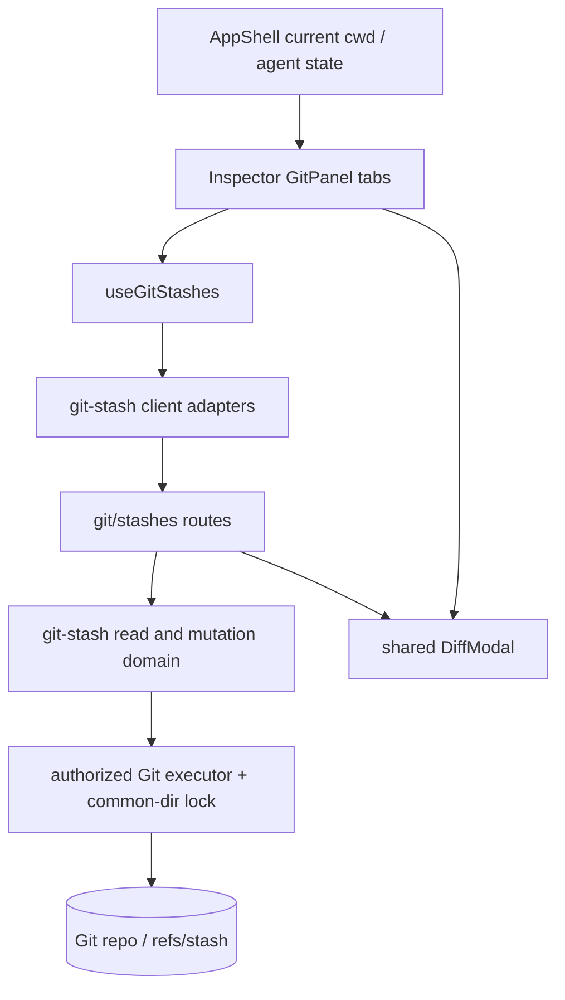

# feat: 增加 Inspector Stash 管理

## Overview

在现有 Inspector Git 面板内增加“工作区 / 贮藏”二级页，使用户不离开当前项目即可完成命名贮藏、查看贮藏记录及文件 Diff，并安全执行 Apply、Pop、Drop。工作区页保留现有分支、提交图、staged/unstaged/untracked 和工作区 Diff；贮藏页承载 IDEA 风格的记录选择、文件检查和操作语义。

首版坚持 Git 原生语义和项目既有安全边界：Apply 保留记录，Pop 仅在成功应用后删除记录，Pop 冲突时记录继续保留；所有写操作复用已授权 Git 执行器和 common-dir 仓库锁。应用或弹出只允许在干净工作树上执行，不建设浏览器冲突编辑器，也不通过破坏性自动回滚掩盖冲突。

---

## Problem Frame

当前 `components/GitPanel.tsx` 能显示“有未提交更改”、staged/unstaged/untracked 文件和工作区 Diff，并通过 `GitStatusInfo.stashCount` 显示贮藏数量，但无法创建、检查或管理 stash。`README.md` / `README.zh-CN.md` 已将“管理 stash”描述为产品能力，实际代码仍只有计数，用户遇到分支切换前的 dirty working tree 时必须转到外部终端或 IDE。

项目已有可复用基础：`lib/git-executor.ts` 提供 cwd 授权、超时、输出上限、稳定错误和 common-dir 写锁；`components/DiffModal.tsx` 提供统一/并排 Diff；`components/GitWorkingTreeDiffModal.tsx` 和 `components/GitCommitDiffModal.tsx` 已形成按来源适配共享 Diff 的模式。本计划补齐 stash 领域、API 和 Inspector 交互，不扩建独立 `/git` 工作台。

---

## Requirements Trace

- **R1. Inspector 双页：** Inspector Git 面板增加“工作区 / 贮藏”二级页；工作区页保留全部现有行为和独立 Git 工作台入口。
- **R2. 命名创建：** 工作区存在可贮藏变更时，用户可填写必填名称并创建 stash；staged 和 unstaged tracked changes 始终包含，未跟踪文件默认包含但可关闭，ignored 文件不包含。
- **R3. 记录浏览：** 贮藏页显示有界、最新优先的 stash 列表，至少包含名称、当前显示序号、创建分支/摘要和创建时间；文件数量随所选详情懒加载，不能为每条未选记录预扫完整文件列表。
- **R4. 文件与 Diff：** 选择 stash 后可查看去重文件列表和文件数量；单击文件打开复用现有外壳的只读统一/并排 Diff，表达“创建时基线 → stash 最终内容”，并正确处理 rename、untracked、binary、过大和不可用结果。
- **R5. Apply / Pop：** Apply 将所选 stash 应用到当前检出状态并保留记录；Pop 在成功应用后删除记录；两者可选择是否恢复原 index 状态，默认关闭。
- **R6. Drop：** 用户可在明确二次确认后永久删除单条 stash；首版不提供 Clear All。
- **R7. 安全与并发：** Git 写操作必须通过 cwd 授权、common-dir 互斥、操作状态重验和有界执行；Apply/Pop 要求干净工作树；stash 选择使用稳定对象 OID 和独立 stash revision，目标 worktree 使用独立 target revision，不能把会重排的 `stash@{n}` 或过期分支状态当作操作依据。
- **R8. 冲突与结果：** Apply/Pop 冲突不得自动 `reset --hard`；UI 必须说明工作树已进入冲突状态、stash 是否保留，并刷新当前 Git 状态。Pop 冲突时记录必须保留。
- **R9. WorkTree 语义：** linked worktree 共用同一仓库 stash 列表；UI 同时显示 stash 创建来源和当前应用目标，避免暗示 stash 仅属于当前 worktree。
- **R10. Web 完整性：** 新交互具备中英文、键盘、焦点恢复、窄 Inspector/移动布局、loading/empty/error/busy 状态，并通过真实临时仓库 smoke、i18n、UI contract、lint 和类型检查验证。

---

## Scope Boundaries

- 不支持按文件、目录或 hunk 选择性创建 stash；首版固定保存当前全部 tracked changes。
- 不包含 ignored 文件，不暴露 `git stash --all`。
- 不提供创建时 Keep Index；创建成功后的目标是清理被贮藏的 tracked 变更，并按选项清理 untracked 变更。
- 不提供 Clear All、stash 重命名、导入/导出或跨仓库复制。
- 不建设网页冲突编辑器，也不提供一键 destructive rollback。
- 不增加“自动贮藏 → 切换分支 → 自动弹出”的 Smart Checkout。
- 不改造独立 `/git` 工作台为 stash 管理器，不改变其 refs/log/commit inspector 定位。
- 不改变现有 `/api/git/status`、`/api/git/diff`、`/api/git/switch` 和 `/api/git/operations` 的兼容契约。

### Deferred to Follow-Up Work

- **从 stash 创建分支：** 后续可基于 `git stash branch` 增加低冲突恢复入口，并单独设计分支命名、占用和 linked worktree 校验。
- **Smart Checkout：** 核心 stash 管理稳定后，再评估把 dirty 分支切换与临时 stash 串成显式、可恢复的复合流程。
- **部分文件/部分 hunk stash：** 需要单独处理 pathspec、同时 staged+unstaged 文件和选择结果预览，不进入本轮。

---

## Context & Research

### Relevant Code and Patterns

- `components/GitPanel.tsx`：当前 Inspector Git 状态编排、dirty 回调、工作区文件单击 Diff、stash count 和独立工作台入口；双页必须保持现有工作区行为兼容。
- `components/GitWorkingTreeDiffModal.tsx`、`components/GitCommitDiffModal.tsx`、`components/DiffModal.tsx`：来源适配器 + 共享只读 Diff 外壳模式。
- `components/git-workbench/GitWorkbenchDialogs.tsx`：带业务字段、busy/error 状态和焦点恢复的 Git 专用 dialog 模式，可用于创建与 Apply/Pop 选项。
- `lib/git-executor.ts`：authorized cwd、仓库身份、NUL-safe status、30/120 秒预算、buffer 限制、稳定错误码和 common-dir mutation lock。
- `lib/git-workbench.ts`：`readRepositoryStatus()` / `readGitStatus()` 当前同时承担共享工作树读取和 `git stash list` 计数；实现时应把无 stash 依赖的 repository-status 读取下沉为共享模块，再让 workbench 与 stash 领域共同复用，避免循环依赖和重复解析。
- `lib/git-workbench-client.ts`、`hooks/useGitWorkbench.ts`：客户端错误投影、AbortController、cwd/sequence 隔离和 mutation 后权威刷新模式。
- `app/api/git/operations/route.ts`、`lib/git-workbench-operations.ts`：严格 action union、精确 body key、服务端状态重验和 mutation response 模式。
- `scripts/smoke-git-workbench.ts`、`scripts/smoke-git-diff.ts`：真实临时仓库、特殊文件名、linked worktree、路由和 Git 写操作验证模式。
- `app/globals.css`、`components/ui/SettingsPrimitives.tsx`：语义 Token、Inspector 状态、共享表单/button/dialog 和窄容器规则。

### Institutional Learnings

- Git 读写必须沿用 allowed-root 授权和 common-dir 锁；浏览器实例认证不能替代 cwd 文件系统授权。
- Git 文件名解析必须 NUL-safe，不能按换行拆分；Windows、空格、引号、Unicode 和 rename 都是现有 smoke 的明确兼容面。
- Git 输出必须有固定条数、buffer 和执行时间预算；截断必须显式投影，不能伪装成完整空结果。
- 新 Dialog/Tab 必须处理键盘、焦点恢复、coarse pointer 和 reduced motion；静态样式使用语义 Token，Diff 增删色可保留领域含义。
- 浏览器没有完整 React 测试框架；领域/API 行为使用临时仓库 smoke，UI 静态契约使用 `scripts/smoke-ui-theme-contract.ts`，视觉和焦点顺序保留人工矩阵。

### External References

- JetBrains IDEA 将 stash 放在独立 Stash tab 中，支持选择记录、查看文件 Diff、Apply、Pop、Drop，以及可选恢复 index 状态。
- Git 官方语义：Apply 应用但保留 stash；Pop 应用并在成功时删除；Pop 冲突时 stash 不删除；`--index` 尝试恢复 index 状态。
- 本地 Git 2.34.1 临时仓库探针确认：Apply 后记录保留，成功 Pop 后记录删除，冲突 Pop 返回失败且记录保留。

---

## Key Technical Decisions

| 决策 | 选择 | 理由 |
| --- | --- | --- |
| UI 承载 | Inspector Git 内“工作区 / 贮藏”二级页 | 与用户已确认方向和 IDEA Stash tab 类比一致，同时避免继续膨胀独立 `/git` 工作台。 |
| 创建范围 | 全部 tracked changes；untracked 默认包含、可关闭；ignored 永不包含 | 符合“保存当前未提交文件”的直觉，又避免 `--all` 意外收集构建产物。 |
| 稳定身份 | wire 以 stash commit OID 为主，`stash@{n}` 仅展示；操作携带独立 stash revision | stash 序号会在 Pop/Drop 后重排，不能安全充当长期选择 ID。 |
| Revision 范围 | stash 使用按有序 reflog/OID 计算的独立 revision；当前 cwd 另有基于 HEAD/branch/clean state 的 target revision；两者都不并入 Git workbench refs revision | stash 变化不应让提交日志分页 stale；Apply/Pop 也不能悄悄落到用户确认后已切换的另一目标分支。 |
| 详情加载 | 列表只返回 bounded metadata，选择后懒加载文件和文件数 | 避免打开面板时对每条 stash 执行文件 Diff 扫描。 |
| Diff 边界 | stash 使用独立 Diff API/适配器，不扩展现有 `scope=staged|unstaged` union | stash 的 base/index/worktree/untracked parent 结构与现有工作树 Diff 语义不同，独立边界更清晰。 |
| Apply/Pop 前置条件 | 当前 worktree 必须干净且无 unmerged/operation state | 与 IDEA 的保守交互一致，减少覆盖已有未提交工作的风险。 |
| 冲突恢复 | 保留 Git 产生的冲突状态并明确引导，不自动 hard reset | stash apply 没有等价的原生 abort；破坏性回滚可能覆盖操作期间的外部编辑。 |
| Pop 实现 | 使用 Git 原生 Pop 语义，失败后重读 stash 列表和 status | 由 Git 保证成功删除/冲突保留，不在应用成功后拼接一个容易竞态的独立 Drop。 |
| Drop 安全 | 允许 dirty worktree 下删除，但仍要求无 Git operation、持有仓库锁并通过 revision/OID 重验 | Drop 不修改工作树；二次确认和稳定身份防止删错记录。 |

### 行为矩阵

| 操作 | 工作树要求 | 成功后的记录 | 冲突/失败后的记录 | 关键 UI 提示 |
| --- | --- | --- | --- | --- |
| 创建 | 有可贮藏内容、无 unmerged/operation | 新增一条 | 不新增或刷新后按权威结果展示 | 名称、变更摘要、包含未跟踪文件 |
| Apply | 干净 | 保留 | 保留 | “应用并保留记录”；可恢复 index |
| Pop | 干净 | 删除 | 冲突时保留 | “仅成功后删除”；冲突后不可盲目重试 |
| Drop | 可 dirty，但无 operation | 删除 | 按刷新结果确认 | 永久删除二次确认 |

---

## Open Questions

### Resolved During Planning

- **管理入口放在哪里？** 放在 Inspector Git 内“工作区 / 贮藏”二级页，不放入独立 Git 工作台。
- **Pop 是否总会删除 stash？** 否；仅成功应用后删除，冲突时保留，UI 文案和测试必须体现。
- **是否默认包含未跟踪文件？** 是；提供默认勾选的“包含未跟踪文件”，ignored 文件排除。
- **Apply/Pop 是否允许 dirty worktree？** 首版不允许，避免把两个未提交状态直接叠加。
- **是否自动回滚冲突？** 不自动 hard reset；保留冲突状态并引导人工解决。
- **是否恢复 staged 状态？** Apply/Pop 对话框提供“恢复原暂存状态”，默认关闭，对应 `--index`。

### Deferred to Implementation

- **精确展示名称：** Git reflog subject 中 `On <branch>:` / `WIP on <branch>:` 的解析展示可在实现时根据真实 fixtures 微调；原始摘要必须保留作为 fallback。
- **最终组件拆分粒度：** `GitStashDialogs.tsx` 可在实现中根据创建/操作 dialog 的共享程度拆分，但必须保持一个拥有业务状态的 stash UI 边界，不能把 fetch/mutation 塞入展示 primitives。
- **列表与文件上限具体数值：** 应复用或对齐 Git workbench 的既有有界常量；最终数值以真实 smoke 和 UI 可用性为准，wire 必须投影 `truncated`。

---

## High-Level Technical Design

> *This illustrates the intended approach and is directional guidance for review, not implementation specification. The implementing agent should treat it as context, not code to reproduce.*

读取流：打开“贮藏”页时只获取列表；选择 OID 后获取详情文件；点击文件后按 tracked/untracked 来源请求单文件 Diff。写入流：对话框提交 action 和 expected stash revision，Apply/Pop 同时提交 expected target revision；服务端在 common-dir 锁内重新读取 repository/operation/status/stash/target revision，执行受限 Git 命令，再返回权威 status + stash projection，客户端统一刷新工作区 dirty 状态和当前选择。

---

## Implementation Units

- [x] U1. **建立 Stash 读取领域与共享契约**

**Goal:** 提供稳定、有界、NUL-safe 的 stash 列表、revision、详情文件和计数读取能力，并让现有 `stashCount` 复用同一事实来源。

**Requirements:** R3, R4, R7, R9

**Dependencies:** None

**Files:**
- Create: `lib/git-stash.ts`
- Create: `lib/git-repository-status.ts`
- Modify: `lib/types.ts`
- Modify: `lib/git-workbench.ts`
- Create/Test: `scripts/smoke-git-stash.ts`

**Approach:**
- 先把 `readRepositoryStatus()` 及其纯 projection 从 `lib/git-workbench.ts` 下沉到无 stash 依赖的共享模块，供 workbench 状态和 stash mutation/target revision 共同使用，避免双向 import。
- 使用 authorized repository identity 读取 `refs/stash` reflog，返回 OID、当前 display ref、原始 subject、可解析来源分支、时间和 bounded metadata。
- 基于有序 stash OID/reflog 状态计算独立 `stashRevision`；显示序号不参与稳定身份。
- 详情读取区分 stash 的 base、index、worktree 和可选 untracked parent，生成去重后的文件投影；tracked rename/copy 与 untracked addition 都要 NUL-safe。
- 单条详情只在选择时读取并计算文件数；列表不为每条记录预扫文件，不返回 patch 内容。
- `readGitStatus()` 只保留兼容 `stashCount` 字段，但改为复用 stash summary/count helper，避免两套解析。

**Execution note:** 先建立真实临时仓库 characterization fixtures，再替换现有 count 读取，确保兼容行为不回退。

**Patterns to follow:**
- `lib/git-workbench.ts` 的 commit/status bounded projection，同时保持下沉共享状态读取前后的 wire 兼容。
- `lib/git-executor.ts` 的 `parseStatusPorcelainV1Z()` NUL-safe 约束。
- `scripts/smoke-git-workbench.ts` 的特殊文件名和 linked worktree fixtures。

**Test scenarios:**
- Happy path：创建两条带 Unicode 名称的 stash，列表最新优先，OID 稳定，display ref 分别为当前 `stash@{0}` / `stash@{1}`，revision 非空。
- Happy path：同一 stash 同时包含 staged、unstaged 和 untracked 文件，详情返回去重文件集合、正确状态和与集合一致的 fileCount。
- Edge case：空格、引号、Unicode、平台允许时换行文件名和 rename 通过 NUL-safe 解析，不被拆行或错配 old/new path。
- Edge case：没有 stash 时返回空列表、稳定空 revision 和 `stashCount=0`，不是错误。
- Edge case：含大量记录或文件时明确返回截断标志，不把截断结果描述成完整列表。
- Integration：linked worktree 从任一 cwd 读取到同一 common repository stash 列表，同时保留当前 cwd 作为后续应用目标。

**Verification:**
- 现有 `/api/git/status` 调用保持 `stashCount` 兼容。
- 读取领域不执行网络或写命令，所有路径经 authorized repository 解析。
- 临时仓库 smoke 能证明特殊文件名、tracked/untracked 和 worktree 共享语义。

---

- [x] U2. **实现受限 Stash 写操作与冲突语义**

**Goal:** 在服务端领域内安全实现 Create、Apply、Pop、Drop，完整表达 Git 成功、冲突、stale 和结果未知状态。

**Requirements:** R2, R5, R6, R7, R8, R9

**Dependencies:** U1

**Files:**
- Modify: `lib/git-stash.ts`
- Modify: `lib/git-executor.ts`
- Modify: `lib/types.ts`
- Test: `scripts/smoke-git-stash.ts`

**Approach:**
- 所有 mutation 先 resolve repository，再进入 common-dir lock；锁内重读 operation state、worktree status 和 stash revision。
- Create 校验 bounded 非空名称、有可贮藏内容、无 unmerged/operation；tracked changes 总是保存，`includeUntracked` 决定是否加入和清理 untracked，ignored 永不加入。
- Apply/Pop 通过 OID + expected stash revision 重验选择，并通过 expected target revision 重验用户确认时看到的当前 cwd/HEAD/branch；要求工作树 clean；可选 reinstate index；目标是当前 cwd 的检出状态，而不是 stash 原分支。
- Pop 使用原生成功删除/冲突保留语义。命令失败后重读 status 和 stash list：若出现 unmerged，返回稳定 stash-conflict 错误和 `stashRetained`；若 timeout/外部竞态导致结果不确定，返回权威刷新投影并禁止客户端盲目重试。
- Drop 在锁内将 OID 映射到当前 reflog entry 后删除；不使用客户端提交的 `stash@{n}` 直接操作；需要无 Git operation，但不要求 clean worktree。
- 增加最少必要的稳定错误码，例如 nothing-to-stash、stash-not-found/stale、stash-conflict；保留 bounded stderr/details 供 UI 展开。

**Patterns to follow:**
- `lib/git-workbench-operations.ts` 的 expected revision、锁内重验和 authoritative refreshed response。
- `lib/git-executor.ts` 的错误映射、write timeout/buffer 和 operation-state 检查。

**Test scenarios:**
- Happy path：tracked staged + unstaged + untracked 创建成功，工作区变干净，ignored 文件保留，列表新增命名记录。
- Happy path：关闭 includeUntracked 后创建 stash，tracked changes 被清理，untracked 文件留在工作区且不出现在 stash 详情。
- Happy path：Apply 成功后变更出现在当前 worktree，stash OID 仍存在；默认不恢复 index，启用选项后原 staged 状态恢复。
- Happy path：Pop 成功后变更出现且所选 OID 从 stash 列表消失；其他 stash 只重排 display ref，不被误删。
- Happy path：dirty worktree 下 Drop 所选 OID 成功，现有工作区文件不改变。
- Error path：无 tracked change 且 includeUntracked 关闭时创建返回 nothing-to-stash，不新增记录。
- Error path：空仓库、unmerged index 或进行中的 merge/rebase 下创建被拒绝，仓库状态不被进一步修改。
- Error path：dirty worktree 下 Apply/Pop 被拒绝，原有修改和 stash 均保持不变。
- Error path：构造与当前分支冲突的 Pop，命令返回冲突、工作区出现 unmerged、stash OID 继续存在，响应明确 `stashRetained`。
- Edge case：在 UI 读取后由外部命令新增/删除 stash，旧 expected revision 的 Pop/Drop 被拒绝，不根据过期序号操作另一条记录。
- Edge case：用户打开 Apply/Pop 确认框后目标 cwd 切换 branch/HEAD，旧 target revision 被拒绝并要求刷新确认，即使 stash 列表没有变化。
- Integration：main worktree 持有 common-dir lock 时 linked worktree mutation 返回 repository busy；锁释放后可以正常执行。

**Verification:**
- 每个成功和失败 mutation 后都能从仓库重建权威 status/stash projection。
- 冲突路径无 `reset --hard`、`clean` 或其他破坏性补偿命令。
- Pop 冲突保留与 Apply 保留/Pop 成功删除语义由真实 Git smoke 证明。

---

- [x] U3. **增加 Stash API 与客户端适配边界**

**Goal:** 通过严格、可缓存隔离的 Web API 暴露 stash 列表、详情、单文件 Diff 和受限 actions，不污染现有 Git Diff/operations union。

**Requirements:** R2, R3, R4, R5, R6, R7, R8

**Dependencies:** U1, U2

**Files:**
- Create: `app/api/git/stashes/route.ts`
- Create: `app/api/git/stashes/[oid]/route.ts`
- Create: `app/api/git/stashes/[oid]/diff/route.ts`
- Create: `app/api/git/stashes/[oid]/actions/route.ts`
- Create: `lib/git-stash-client.ts`
- Modify: `lib/types.ts`
- Test: `scripts/smoke-git-stash.ts`

**Approach:**
- `GET /api/git/stashes` 返回 bounded list、stash revision、truncation，以及当前 target worktree metadata/revision；`POST` 仅创建命名 stash。
- 单 OID detail route 返回 metadata + files；OID 只接受 Git object-id 形态并由领域确认它仍是当前 stash entry。
- stash diff route 依据详情文件的 tracked/untracked 来源选择正确基线：tracked 使用创建时 base 到 stash worktree，untracked 使用 empty tree 到 untracked parent；复用现有 binary/too-large/unavailable 响应语言和 Diff buffer。
- action route 使用严格 union `apply | pop | drop`、精确允许字段、bounded body；Apply/Pop 接受 reinstateIndex、expected stash revision 和 expected target revision，Drop 接受 expected stash revision。
- `lib/git-stash-client.ts` 负责 fetch、错误码/details/stashRetained 投影，不引入 Node/Git 依赖到浏览器 bundle。
- GET 明确 `cache: no-store`；mutation response 带刷新后的 list/status 或足够的 revision，使 Hook 不依赖乐观重排。

**Patterns to follow:**
- `app/api/git/operations/route.ts` 的严格 body parser/action union。
- `app/api/git/diff/route.ts` 的 literal pathspec、buffer 和 fallback reason。
- `lib/git-workbench-client.ts` 的 typed client error 与 no-store fetch。

**Test scenarios:**
- Happy path：经 routes 完成 create → list → detail → tracked/untracked file diff → apply/pop/drop，HTTP 状态与 wire 类型一致。
- Edge case：rename 的 `oldPath` 和包含空格/Unicode 的 literal path 不被解释为 option/pathspec pattern。
- Edge case：binary、超过 Diff buffer 和无文本差异分别返回可显示的 fallback reason，不返回无界 patch。
- Error path：缺失/未授权 cwd、非法 OID、OID 不属于当前 stash、未知 action、额外 body 字段和过大 body 返回稳定 4xx。
- Error path：stale stash/target revision 和 stash conflict 保留领域错误码、details 和 `stashRetained`，不会被 route 抹成通用 500。
- Integration：创建/Pop route 完成后再请求 `/api/git/status`，dirty 与 `stashCount` 和 mutation response 一致。

**Verification:**
- 现有 `/api/git/diff` 和 `/api/git/operations` 无新增 stash 分支。
- 客户端模块可被 client component 导入且不携带 Node-only 依赖。
- route smoke 覆盖授权、输入边界、真实 Git 结果和特殊路径。

---

- [x] U4. **搭建 Inspector 双页与创建流程**

**Goal:** 在不回退现有 Git 面板的前提下增加可访问的“工作区 / 贮藏”切换，并让用户从 dirty 工作区快速创建命名 stash。

**Requirements:** R1, R2, R7, R10

**Dependencies:** U3

**Files:**
- Create: `hooks/useGitStashes.ts`
- Create: `components/GitStashDialogs.tsx`
- Modify: `components/GitPanel.tsx`
- Modify: `components/AppShell.tsx`
- Test: `scripts/smoke-ui-theme-contract.ts`

**Approach:**
- `GitPanel` 顶部工具栏增加二级 tab，工作区页继续挂载现有分支/history/status 内容，避免 tab 切换重置选中分支和提交；stash 数据只在首次打开贮藏页或 mutation 后加载。
- `useGitStashes` 管理 cwd/AbortController/sequence 隔离、list/detail cache、busy/error、selected OID 和 mutation 后刷新；cwd 变化立即清除旧项目内容。
- dirty 工作区提供“创建贮藏”入口；对话框展示 staged/unstaged/untracked 摘要、必填 bounded 名称和默认开启的 includeUntracked。
- 创建成功后刷新现有 status/graph 所需状态、更新 `onDirtyChange`，切换到贮藏页并选中新建 OID；失败保留用户输入和当前工作区展示。
- `AppShell` 将当前 session 的 agent-running 状态投影为工作树相关 stash action 的 disabled reason，避免用户在当前 Agent 正写文件时发起 Create/Apply/Pop；服务端重验仍是硬边界，外部编辑器/其他 session 并发作为已知残余风险。
- Tabs 使用 tablist/tab/tabpanel 语义、箭头/Home/End 键和焦点可见状态；对话框沿用项目 dialog focus trap/restore 约束。

**Patterns to follow:**
- `components/ui/SettingsPrimitives.tsx` 的输入、Notice、Button 和 action row。
- `components/git-workbench/GitWorkbenchDialogs.tsx` 的业务 dialog busy/error/focus 模式。
- `hooks/useGitWorkbench.ts` 的 cwd/sequence/abort 和 mutation refresh。

**Test scenarios:**
- Happy path：dirty 工作区打开创建对话框，摘要与 status 数量一致；输入名称、保持 includeUntracked 后成功创建并进入所选 stash。
- Edge case：空白名称、超出上限名称或工作区已在对话框打开后变干净，主按钮禁用或服务端错误可理解，输入不丢失。
- Edge case：切换 cwd 时旧 stash list/detail/busy/error 不闪现在新项目；迟到响应被丢弃。
- Error path：网络或 create API 失败时对话框保持打开，工作区内容不被 UI 乐观清空。
- Integration：创建成功触发 `onDirtyChange(false)`（若 includeUntracked 后确实 clean）和 `stashCount` 更新；关闭 includeUntracked 时剩余 untracked 继续使 dirty attention 保持。
- Accessibility：Tab 可用箭头/Home/End 切换并关联 panel；Dialog 首焦点、Escape、提交 busy 和关闭后焦点恢复符合共享约定。

**Verification:**
- 工作区页的分支预览/切换、commit detail、工作区 Diff 和独立工作台链接保持原行为。
- 贮藏页未打开时不执行详情扫描。
- 300px Inspector、窄 drawer 和移动布局没有横向页面溢出或 hover-only 操作。

---

- [x] U5. **实现贮藏列表、文件检查和 Apply/Pop/Drop UI**

**Goal:** 完成 IDEA 风格的 stash 记录管理闭环，让用户可选择记录、检查文件 Diff，并明确执行 Apply、Pop 或 Drop。

**Requirements:** R3, R4, R5, R6, R8, R9, R10

**Dependencies:** U3, U4

**Files:**
- Create: `components/GitStashPanel.tsx`
- Create: `components/GitStashDiffModal.tsx`
- Modify: `components/GitStashDialogs.tsx`
- Modify: `hooks/useGitStashes.ts`
- Modify: `components/GitPanel.tsx`
- Test: `scripts/smoke-ui-theme-contract.ts`

**Approach:**
- 窄 Inspector 使用纵向 master/detail：上部 stash rows，选中后显示来源、当前目标、actions 和文件列表；不复制独立工作台三栏布局。
- row 以 OID 为 React/selection identity，显示名称、当前 `stash@{n}`、来源 branch/subject 和相对/绝对时间；所选详情加载后补充文件数。列表刷新后按 OID 保持选择，记录消失时选择相邻或最新项。
- 文件列表复用 Git changed-file status 视觉和 compressed path/tree helper 能力；单击文件直接打开 `GitStashDiffModal`，header 同时展示 stash 名称、OID short form 和路径。
- Apply/Pop 共用确认对话框，明确当前目标 branch/detached state、记录保留/成功删除语义和 reinstateIndex 选项；Drop 使用 danger confirmation 并要求再次确认所选名称。
- action busy 时只锁定 stash writes，不让重复提交；成功后采用服务端权威 list/status 刷新；冲突时关闭 busy、保留选择和记录，显示 stash retained banner，并让现有 Git status 暴露 unmerged/dirty。
- 外部 Pop/Drop 造成 OID 消失、stash revision stale，或目标 branch/HEAD 造成 target revision stale 时自动刷新一次并要求用户重新确认，不把动作自动重放到新序号或新目标。

**Patterns to follow:**
- `components/git-workbench/GitCommitInspector.tsx` 的 changed-file tree/选择/Diff 入口。
- `components/GitWorkingTreeDiffModal.tsx` 的 source-specific Diff adapter。
- `components/GitPanel.tsx` 的 Inspector empty/loading/error/status primitives。

**Test scenarios:**
- Happy path：列表选择记录后懒加载文件，刷新列表时相同 OID 保持选中；单击 tracked/untracked/rename 文件打开正确 header 和 Diff。
- Happy path：Apply 对话框明确“保留记录”，成功后列表仍有 OID且工作区 dirty；Pop 明确“成功后删除”，成功后选择落到合理相邻记录。
- Happy path：Drop 二次确认后删除 OID，但不改变当前 dirty worktree 文件。
- Edge case：空列表、截断列表、详情截断、记录无 displayable text diff、binary 和过大 Diff 都有独立非错误状态。
- Edge case：stash 来源 branch 与当前 target branch 不同或当前为 detached HEAD 时，两者同时展示，动作含义不混淆。
- Error path：Pop 冲突显示 stash retained 和人工解决提示，记录仍可见；不会自动重试、Drop 或 hard reset。
- Error path：stale/not-found 响应触发刷新并要求重新选择，不对重排后的 `stash@{n}` 执行原动作。
- Accessibility：记录和文件可键盘选择/打开；Apply/Pop/Drop 不依赖 hover；Diff/Dialog Escape 后焦点回到触发元素。

**Verification:**
- 用户在无冲突 happy path 中无需 Web Terminal 即可完成 Create、Inspect Diff、Apply/Pop/Drop。
- 所有 action 文案与 Git 官方语义一致，尤其是 Pop 冲突保留。
- UI 不持久化 stash 副本，刷新后仓库始终是唯一事实来源。

---

- [x] U6. **补齐 i18n、样式、文档和交付验证**

**Goal:** 将 stash 管理纳入项目公开模块地图、命令索引和质量门槛，完成中英文与主题/响应式契约。

**Requirements:** R1-R10

**Dependencies:** U1, U2, U3, U4, U5

**Files:**
- Modify: `lib/i18n/messages/git.ts`
- Modify: `app/globals.css`
- Modify: `scripts/smoke-ui-theme-contract.ts`
- Modify: `package.json`
- Modify: `AGENTS.md`
- Modify: `docs/modules/api.md`
- Modify: `docs/modules/frontend.md`
- Modify: `docs/modules/library.md`
- Modify: `docs/plans/README.md`
- Modify after delivery: `docs/plans/2026-08-25-001-feat-inspector-stash-management-plan.md`
- Test: `scripts/smoke-git-stash.ts`
- Test: `scripts/smoke-ui-theme-contract.ts`
- Test: `scripts/check-i18n-keys.ts`

**Approach:**
- 中文沿用项目现有“贮藏”，英文使用 Stash；Apply/Pop/Drop 的描述不得只翻译按钮名，需解释记录保留/删除与冲突语义。
- 新 CSS 使用 `git-stash-*` + Inspector/shared dialog primitives 和语义 Token；只把运行时几何留在 inline style。
- 新增独立 `test:git-stash` 脚本，真实仓库 smoke 覆盖 U1-U3 的领域和 API；UI contract 检查稳定 tab/dialog/class、focus/coarse-pointer/reduced-motion 规则；i18n 保持 zh/en key parity。
- 更新 API/frontend/library 模块地图和 `AGENTS.md` 命令表；README 已声明“管理 stash”，实现后只需核对描述准确，不重复扩写营销文案。
- 交付时逐项更新 U1-U6 checkbox、frontmatter status 和 plans index；未执行的人工视觉矩阵必须明确保留，不能写成已验证。

**Patterns to follow:**
- `docs/modules/api.md`、`docs/modules/frontend.md`、`docs/modules/library.md` 的短入口地图。
- `docs/operations/ui-visual-validation.md` 的代表主题/viewport/keyboard/Portal 矩阵。
- `AGENTS.md` 的 targeted smoke 命令登记方式。

**Test scenarios:**
- Integration：`test:git-stash` 在临时仓库完整覆盖 create/list/detail/diff/apply/pop/drop、冲突保留、stale revision、special paths 和 linked worktree lock。
- Contract：i18n 检查确认新增 zh/en keys 完全同构，无硬编码主要产品文案。
- Contract：UI theme smoke 确认 tabs/dialog/list/action classes 使用语义 Token，并保留 focus、coarse-pointer、mobile 和 reduced-motion 规则。
- Regression：现有 `test:git-diff` 和 `test:git-workbench` 继续通过，证明 stash 独立 API 未破坏原 Git 路径。
- Static：ESLint 和 TypeScript strict 检查无新增错误。
- Manual：在至少一种浅色、深色和 300px Inspector/移动 drawer 下检查创建、列表、长名称、文件树、Diff、键盘焦点、Pop 冲突 banner；结果按 `docs/operations/ui-visual-validation.md` 记录或明确未执行。

**Verification:**
- 新命令、模块入口和行为文档可让新会话直接定位实现与验证范围。
- 自动验证和人工验证状态分别记录，不以静态 smoke 代替视觉/焦点检查。
- Plan 完成记录与实际代码、测试和残余风险一致。

---

## System-Wide Impact

- **Interaction graph:** `AppShell` 当前 cwd/agent state → `GitPanel` tabs → `useGitStashes` → client adapters → stash routes → stash domain → authorized Git executor；mutation 完成后反向刷新 stash list、Git status、dirty attention 和 selected detail。
- **Error propagation:** Git/validation 错误保留稳定 code、bounded details、stash retained/unknown outcome 元数据；route 不吞语义，hook 只对 stale 执行一次权威刷新，不自动重放写动作。
- **State lifecycle risks:** cwd 切换、迟到 list/detail、Pop 删除后序号重排、目标 branch/HEAD 变化、外部 Git 命令和 linked worktree 共享 stash 都可能使选择或应用目标过期；OID + stash revision + target revision + sequence isolation 是主要防线。
- **API surface parity:** `/api/git/status` 的 `stashCount` 保持；stash 拥有独立 routes，不向 commit/working-tree diff 和 workbench operations union 添加模糊 mode。
- **Integration coverage:** 真实 Git 才能证明 stash parent 结构、untracked、`--index`、冲突保留和 reflog 重排，不能只用 mock 单测。
- **Unchanged invariants:** 独立 `/git` 工作台、当前分支安全操作、非 Git session changed-file sidecar、Agent session 生命周期和 Git worktree 创建/归档逻辑均不改变。
- **Concurrent file-writer residual:** common-dir lock 只协调 WebUI 内 Git mutation，不锁外部 IDE/终端或其他 Agent 的普通文件写；UI 禁用当前 agent-running 期间的 stash writes，服务端重验 Git 状态，但仍需把外部并发列为残余风险。

---

## Risks & Dependencies

| Risk | Mitigation |
| --- | --- |
| `stash@{n}` 在 Pop/Drop 后重排导致删错/应用错 | OID 作为稳定身份；独立 stash revision；锁内重新映射当前 reflog entry。 |
| 用户确认后目标 worktree 已切换 branch/HEAD | Apply/Pop 携带并重验 target revision；stale 时刷新并要求重新确认，不自动重放。 |
| Pop 冲突后工作树部分应用且无原生 stash abort | Apply/Pop 仅允许 clean；不自动 hard reset；返回 stash retained + unmerged 状态并引导人工解决。 |
| stash 同时保存 base/index/worktree/untracked，文件列表或 Diff 漏项 | 真实 parent-structure fixtures；tracked/untracked 分源读取后去重；binary/rename/special path smoke。 |
| 大量 stash/文件/patch 阻塞 server 或浏览器 | list/detail 懒加载；固定条数、buffer、timeout；truncated 和 too-large 投影。 |
| linked worktree 误被理解为各自独立 stash | 使用 common-dir 锁和 repo-level list；UI 同时显示来源 branch 与当前 target worktree/branch。 |
| 创建对话框打开期间 Agent/外部工具继续改文件 | 当前 agent-running 时禁用 mutation；服务端执行前重验；文案说明创建保存执行时的全部当前变更；不承诺锁住外部编辑。 |
| `--index` 在冲突时更容易失败 | 默认关闭；确认框解释用途；失败保留 stash 并按冲突路径处理。 |
| Drop 通常无法通过普通机制恢复 | danger confirmation，展示名称/OID short form，禁止 Clear All。 |
| 新双页挤压 300px Inspector | 纵向 master/detail、懒加载、文本截断+title、coarse-pointer target 和移动人工矩阵。 |

---

## Success Metrics

- 在 clean/non-conflict happy path 中，用户可完全通过 Inspector 完成创建、浏览文件 Diff、Apply、Pop 和 Drop，无需终端。
- Pop 成功删除、Pop 冲突保留、Apply 保留三种关键语义都有真实 Git 自动化覆盖和明确 UI 文案。
- 未跟踪文件默认被保存，ignored 文件保持不动；关闭选项时 untracked 明确保留在工作区。
- linked worktree、特殊文件名、rename、binary/large diff、stale revision 和 common-dir 并发均有边界验证。
- 现有 Git status/branch switch/commit graph/working-tree diff/standalone workbench 无回归。

---

## Documentation / Operational Notes

- 新 stash 数据仍完全存放在 Git `refs/stash`，不增加 WebUI sidecar、数据库或迁移。
- 服务重启后无需恢复 UI 状态；重新读取仓库即可重建列表和详情。
- 不引入网络 Git 操作，也不使用远程凭据。
- 实现完成后应运行 targeted Git/i18n/UI smoke、lint 和 type-check；不要直接运行 `next build` 作为日常验证。
- 人工验证重点是 300px Inspector、移动 drawer、长名称、焦点恢复、Apply/Pop 语义提示和冲突 banner；未执行时必须明确记录。

---

## Delivery Record

- U1-U6 已交付：Inspector 工作区/贮藏双页、命名创建、OID 稳定选择、懒加载文件与 Diff、Apply/Pop/Drop、index 恢复、stale revision/target、冲突保留和 linked worktree 共享语义均已落地。
- 自动验证已通过：`npm run test:git-stash`、`npm run test:git-diff`、`npm run test:git-workbench`、`npm run test:i18n`、`npm run test:ui-theme`、`npm run lint`、`node_modules/.bin/tsc --noEmit`、`git diff --check`。
- `test:git-stash` 使用真实临时仓库覆盖 tracked/staged/unstaged/untracked、ignored 排除、index-only 内容、rename/Unicode/换行路径、binary/too-large Diff、Apply 保留、Pop 成功删除/冲突保留、dirty Drop、stale stash/target revision 和 common-dir linked-worktree 锁。
- 人工浏览器视觉矩阵未执行；仍需按 `docs/operations/ui-visual-validation.md` 在浅色、深色、300px Inspector 与移动 drawer 检查长名称、焦点顺序、Diff 和冲突 banner。该人工项不影响本计划的代码交付状态。

## Sources & References

- Related plan: `docs/plans/2026-08-19-001-feat-idea-git-workbench-plan.md`
- Related code: `components/GitPanel.tsx`
- Related code: `lib/git-executor.ts`
- Related code: `lib/git-workbench.ts`
- Related code: `app/api/git/diff/route.ts`
- JetBrains IDEA: [Shelve or stash changes](https://www.jetbrains.com/help/idea/shelving-and-unshelving-changes.html)
- Git reference: [git-stash Documentation](https://git-scm.com/docs/git-stash)
- Pro Git: [Stashing and Cleaning](https://git-scm.com/book/en/v2/Git-Tools-Stashing-and-Cleaning)
