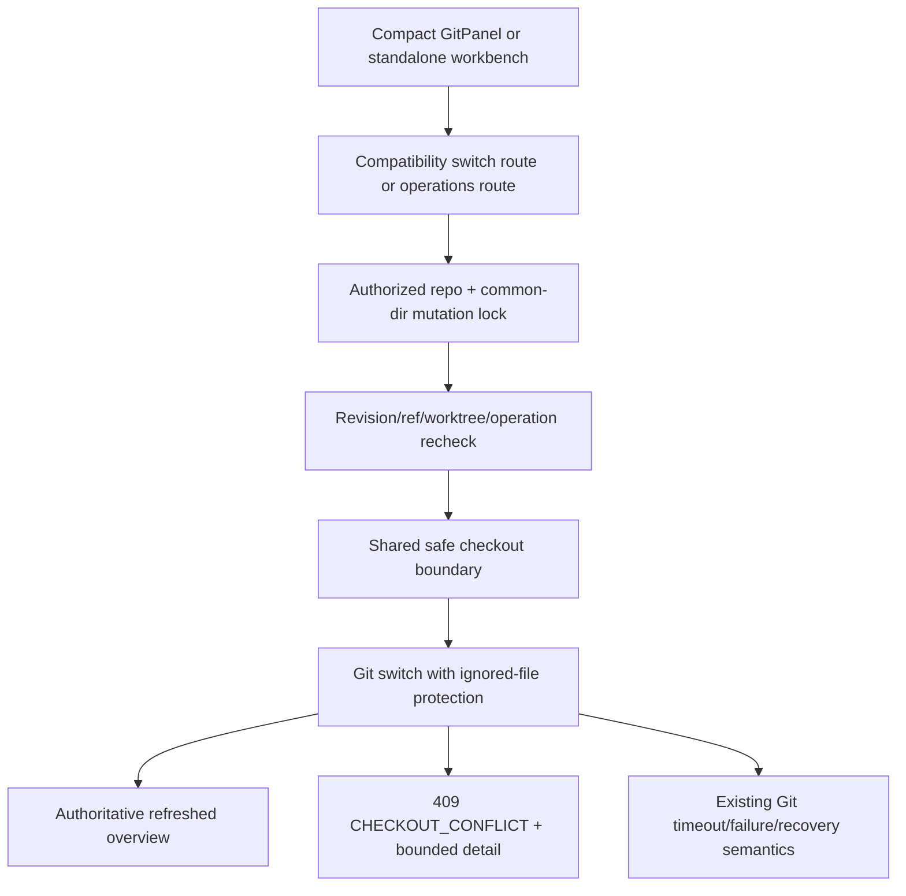
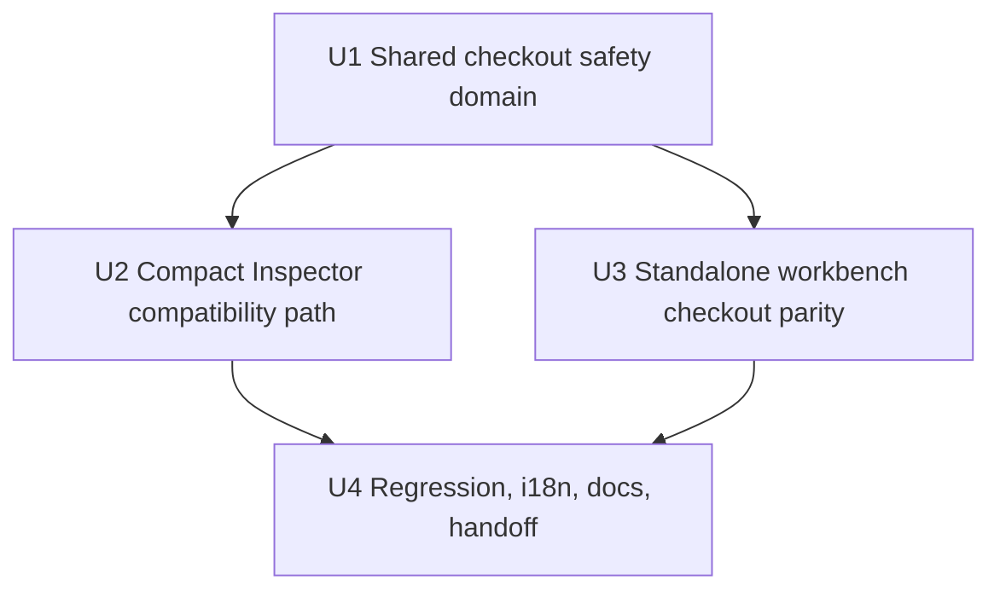

# fix: 允许携带不冲突的本地更改切换 Git 分支

## Overview

将当前“工作区只要 dirty 就禁止切换”的全量前置拦截，改为由 Git 判断目标分支是否真的会覆盖本地内容。用户应能像 IntelliJ IDEA 一样，携带不冲突的 staged、unstaged 和 untracked 更改切换本地分支、远程跟踪分支或新建后签出分支；只有存在真实覆盖风险时才拒绝。

本轮只交付安全的普通切换，不自动 stash、不开放 Force Checkout，也不建设浏览器冲突解决器。发生覆盖冲突时，分支和本地文件必须保持原状，API 返回稳定的冲突错误，UI 提供可理解的提示和有界 Git 诊断。现有 unmerged、Git operation、linked worktree 占用、cwd 授权、common-dir 写锁和 stale revision/ref 安全边界继续保留。

---

## Problem Frame

当前 `lib/git-repository-status.ts` 将 staged、unstaged、untracked 任意一项存在都投影为 `isDirty`。这个粗粒度状态随后被三个切换入口当作绝对禁用条件：

- `components/GitPanel.tsx` 在紧凑 Inspector 中直接禁用切换按钮；
- `app/api/git/switch/route.ts` 对所有 dirty worktree 返回 `DIRTY_WORKING_TREE`；
- `lib/git-workbench-operations.ts` 的 `ensureClean()` 同时阻断独立工作台的 Local、Remote 和“创建后签出”路径。

因此，即使新增文件或本地修改与目标分支完全无关，用户也必须先提交、贮藏或丢弃才能切换。独立 `/git` 工作台的菜单在 dirty 状态下仍可打开，但服务端随后拒绝，和紧凑 Inspector 的前置禁用又形成了交互不一致。

IntelliJ IDEA 和 Git 原生行为都更精确：工作区不要求绝对干净；不冲突的本地更改随切换保留，只有目标分支会覆盖本地内容时才拒绝或进入 Smart/Force 选择。当前主机 Git `2.34.1.windows.1` 的临时仓库探针也确认：不冲突的 tracked、staged 和 untracked 更改均可安全切换并保留；tracked 同路径冲突和 untracked 同路径覆盖会拒绝，且原分支及文件不变。

---

## Requirements Trace

- **R1. 不冲突的本地更改可携带切换：** staged、unstaged 和无关 untracked 文件不得仅因 `isDirty` 被禁止；普通 Git switch 成功后，其内容和适用的 index 状态必须保留。
- **R2. 真实覆盖风险继续拒绝：** 目标分支会覆盖 tracked 本地修改、staged 修改、untracked 文件或受保护的 ignored 文件时，切换必须失败，原分支、HEAD、index 和本地文件不得被破坏。
- **R3. Checkout 路径语义一致：** 紧凑 Inspector 的本地分支切换、兼容 `/api/git/switch`、独立工作台 Local/Remote checkout，以及“创建分支后签出”使用同一安全判定原则。
- **R4. 既有硬安全边界不回退：** unmerged index、merge/rebase/cherry-pick/revert/bisect 等 operation state、linked worktree 分支占用、cwd 授权、common-dir 写锁、expected revision/ref/HEAD 校验继续生效。
- **R5. 错误语义可操作：** 真实覆盖冲突返回稳定的 409 级 checkout conflict code；产品文案说明“目标分支会覆盖本地更改”，有界 Git stderr 仅作为详情，不再误报为“任何未提交更改都不允许”。
- **R6. Ignored 文件不被静默覆盖：** 普通安全切换不得依赖 Git 默认的 ignored overwrite 行为；与目标分支同路径的 ignored 文件应被保护并触发拒绝。
- **R7. 不弱化其他写操作：** cherry-pick、revert、reword/drop 等仍要求 clean 的操作继续复用原 `ensureClean()`；stash Apply/Pop 的 clean-target 契约不变。
- **R8. 可验证与可交接：** 真实临时仓库 smoke 覆盖成功保留、覆盖拒绝、ignored、remote、新建签出、operation/worktree/stale 边界；中英文、API/前端/library 模块文档和计划索引同步更新。

---

## Scope Boundaries

- 不实现 IDEA Smart Checkout 的“临时保存 → 切换 → 恢复”复合流程。
- 不开放 `--discard-changes` / Force Checkout，不增加任何自动丢弃本地文件的路径。
- 不自动创建、Apply 或 Pop stash；现有 Inspector Stash 管理继续作为用户显式操作入口。
- 不建设 Web 冲突编辑器，不让普通 switch 进入主动三方合并或 unmerged 状态。
- 不使用 `git switch --merge` 作为普通 fallback；当前 Git 版本下它可能直接产生冲突标记，且不能解决 untracked 同路径覆盖。
- 不修改 stage/unstage/commit、fetch/pull/merge、远程 refs 刷新或多仓库根同步能力。
- 不改变 `GitStatusInfo.isDirty` 的含义；它继续用于状态展示和那些确实要求 clean 的操作，仅不再作为 checkout 的通用否决条件。

### Deferred to Follow-Up Work

- **Smart Checkout：** 可在本轮稳定后，基于现有 `lib/git-stash.ts` 设计显式、可恢复的 auto-stash 事务；必须单独处理 stash OID、index 恢复、切换失败回滚、Pop 冲突和 `stashRetained`。
- **Force Checkout：** 如未来需要，应作为独立 destructive action，增加危险确认、影响文件说明和 ignored/untracked 数据丢失测试。
- **结构化冲突文件列表：** 首轮可使用稳定产品文案加有界 Git detail；如果后续需要 IDEA 式逐文件列表，应单独设计跨 Git 版本、locale、引号和特殊文件名的 NUL-safe 来源，而不是脆弱拆 stderr。

---

## Context & Research

### Relevant Code and Patterns

- `lib/git-repository-status.ts`：`isDirty` 的 staged/unstaged/untracked 聚合事实源；本计划保留其状态语义。
- `lib/git-executor.ts`：Git cwd 授权、30/120 秒预算、输出上限、稳定错误码、operation marker 和 common-dir mutation lock。
- `lib/git-workbench-operations.ts`：Local/Remote checkout、创建分支后 checkout，以及其他必须保持 clean 的写操作；需要拆分“checkout-ready”和“clean-required”语义。
- `app/api/git/switch/route.ts`：紧凑 Inspector 的兼容本地分支切换入口；目前重复 dirty/unmerged/operation/worktree 校验。
- `components/GitPanel.tsx`：当前以 `status.isDirty` 禁用按钮并短路 handler，需要允许发起安全尝试并显示稳定错误。
- `components/git-workbench/GitWorkbenchDialogs.tsx`、`hooks/useGitWorkbench.ts`：独立工作台 mutation dialog、错误投影和成功后权威 overview 刷新模式。
- `lib/i18n/messages/git.ts`：紧凑 Git 和独立工作台的 zh/en checkout 文案及稳定错误码映射。
- `scripts/smoke-git-workbench.ts`：真实普通仓库、bare remote、linked worktree、路由 strict payload 和写操作回归的既有承载点。
- `docs/plans/2026-08-19-001-feat-idea-git-workbench-plan.md`：原安全首版曾明确要求 checkout clean，本计划是有证据的后续修正，不应顺带放宽历史改写等其他操作。
- `docs/plans/2026-08-25-001-feat-inspector-stash-management-plan.md`：已将 Smart Checkout 延后，并交付可复用的显式 stash/recovery 语义。

### Institutional Learnings

- WebUI 的 common-dir 锁只约束本进程写操作；外部 IDE/终端仍可能并发修改，因此执行前服务端重验与 Git 自身 index/checkout 保护仍是最终边界。
- 稳定产品错误码和本地化文案应与原始 Git stderr 分离；stderr 只能作为有界诊断详情。
- Git 文件名可能包含空格、Unicode、引号和换行，不能通过普通按行解析构造权威文件集合。
- 兼容 API 与独立工作台 operations 必须共享领域语义，避免紧凑面板和 `/git` 页面再次分叉。
- 当前项目没有完整 React 测试框架；Git 行为使用临时仓库 smoke，UI 禁用/提示状态通过静态检查和人工浏览器流程补充。

### External References

- IntelliJ IDEA：工作树干净或本地更改与目标分支不冲突时直接 checkout；只有本地更改会被覆盖时才提供 Force Checkout / Smart Checkout。
- Git `switch`：不要求 clean index/working tree；只有操作会造成本地更改丢失时才默认中止。
- Git 默认会覆盖与目标分支冲突的 ignored 文件；本地探针确认 `--no-overwrite-ignore` 可将其转为安全拒绝。

---

## Key Technical Decisions

| 决策 | 选择 | 理由 |
| --- | --- | --- |
| Checkout 判定权 | 移除通用 `isDirty` preflight，让普通 Git switch 判断真实覆盖风险 | Git 已掌握 index、worktree、rename、目录/文件冲突等完整语义，比 WebUI 自行比较路径更准确。 |
| 共享边界 | 增加 checkout 专用共享领域边界，兼容 route 与 workbench operations 共同复用 | 防止两个入口继续复制错误识别、ignored 保护和命令选项。 |
| 安全命令模式 | 普通 switch 始终保护 ignored 文件，不使用 force/discard/merge fallback | 保持“成功即无数据丢失，失败即原状”的产品承诺。 |
| 前置条件拆分 | Checkout 只要求无 unmerged/operation 并通过 ref/worktree/revision 校验；其他操作继续使用 `ensureClean()` | 精确放宽 checkout，而不是全局弱化 Git 写安全。 |
| 冲突错误 | 新增稳定 `CHECKOUT_CONFLICT`（409）或等价 checkout 专用 code | `DIRTY_WORKING_TREE` 无法区分“工作区有修改”和“目标会覆盖修改”，现有文案会误导。 |
| Git 诊断分类 | Checkout 命令使用可预测的 Git 诊断 locale，映射已知 overwrite refusal；未知失败保持原 `GIT_FAILED`/timeout 语义 | 既提供稳定产品错误，又不把所有 Git 失败误分类为本地冲突。 |
| UI 策略 | dirty badge 保留，切换按钮不再因 dirty 禁用；真实冲突在提交后反馈 | 用户仍能看到风险状态，同时可以执行 Git 原生安全尝试。 |
| 成功/失败刷新 | 成功使用服务端权威 overview；冲突、stale 或 timeout 后客户端刷新当前状态，不自动重试 | 外部 Git 并发和 hook/timeout 可能改变事实，UI 不做乐观猜测。 |

### Checkout 行为矩阵

| 当前状态 | 目标关系 | 期望结果 |
| --- | --- | --- |
| clean | 任意合法且未占用目标 | 正常切换 |
| staged/unstaged tracked | 目标未改变相关基线 | 切换成功，内容及适用 index 状态保留 |
| untracked | 目标不存在同路径 tracked 内容 | 切换成功，文件保留 |
| tracked/staged 修改 | 目标会覆盖同一内容 | 409 checkout conflict，分支和文件保持原状 |
| untracked/ignored | 目标存在同路径 tracked 内容 | 409 checkout conflict，不覆盖本地文件 |
| unmerged 或 operation state | 任意目标 | 保持原稳定错误并拒绝 |
| 目标被其他 linked worktree 使用 | 任意工作区状态 | `BRANCH_IN_USE` 并拒绝 |
| refs/HEAD 已 stale | 任意工作区状态 | stale 错误并刷新，不执行陈旧操作 |

---

## Open Questions

### Resolved During Planning

- **是否直接实现完整 IDEA Smart Checkout？** 否。本轮先对齐 IDEA/Git 的普通安全 checkout；Smart Checkout 保持独立 follow-up。
- **是否在客户端预先计算冲突文件？** 否。Git 是覆盖判定事实源，客户端路径比较容易遗漏 rename、目录/文件和 index 语义。
- **是否保留 dirty badge？** 是。dirty 仍是有价值的状态提示，只是不再等于 checkout 禁用。
- **是否保护 ignored 文件？** 是。普通安全路径显式禁止覆盖 ignored 文件，优于 Git 默认行为和当前实现。
- **Remote checkout 与创建后签出是否同步放宽？** 是。它们本质上同样执行 checkout；保留不同语义会让工作台行为不可预测。
- **是否放宽 cherry-pick/revert/rewrite 和 stash Apply/Pop？** 否，这些操作继续维持现有 clean 契约。

### Deferred to Implementation

- **共享模块和内部 helper 的最终命名：** 以避免循环依赖、同时让 compatibility route 与 operations 复用为准；本计划中的模块名是建议边界，不要求复制固定函数签名。
- **不同 Git 版本的具体 stderr 变体：** 实现时应以当前最低受支持环境和临时仓库 fixtures 校准已知 overwrite 分类；无法确认的输出必须保守保留为普通 Git failure，不能自动重试或 force。
- **冲突失败后的紧凑面板展示粒度：** 可根据现有空间决定是否默认只显示产品文案、将 Git detail 放入 tooltip/details；不得直接把长 stderr 挤入主布局。

---

## High-Level Technical Design

> *This illustrates the intended approach and is directional guidance for review, not implementation specification. The implementing agent should treat it as context, not code to reproduce.*

核心原则是“先保留硬状态校验，再让 Git 判断内容覆盖”。共享 checkout 边界只负责安全命令选项和 checkout-specific failure classification；branch/ref 存在性、remote tracking 关系、linked worktree 占用、expected revision/HEAD 等仍由各自领域入口在锁内验证。

---

## Implementation Units

- [x] U1. **建立共享的安全 Checkout 执行边界**

**Goal:** 将“普通 checkout 可携带不冲突更改”和“真实覆盖才拒绝”封装为兼容 route 与 workbench operations 可复用的服务端边界，同时保护 ignored 文件并提供稳定错误码。

**Requirements:** R1, R2, R4, R5, R6, R7

**Dependencies:** None

**Files:**
- Create: `lib/git-branch-switch.ts`（建议边界；最终名称可按依赖关系调整）
- Modify: `lib/git-executor.ts`
- Modify/Test: `scripts/smoke-git-workbench.ts`

**Approach:**
- 在 Git 错误 union 中增加 checkout-specific conflict code，保持现有 `gitErrorResponse()` 结构兼容。
- 共享边界只接受服务端已验证的 repository identity 和受限 switch 参数，不暴露任意 Git args 给 route/client。
- 普通 checkout 使用 ignored-file protection；不追加 force、discard 或 merge fallback。
- 对 Git 明确报告“tracked/untracked 会被 checkout 覆盖”的失败映射为 409 checkout conflict；保留 bounded stderr/details 供诊断。timeout、branch-in-use、hook/其他 Git failure 不得被误映射。
- 本单元不修改全局 `ensureClean()` 或具体 action preflight；U2/U3 分别在各入口接入共享边界，避免放宽范围混入基础错误分类提交。
- 外部并发无法被进程锁完全阻止，因此命令执行后只信任重新读取的 repository overview；未知或超时结果不自动重放。

**Execution note:** 先添加临时仓库 characterization 场景，证明原生 switch 的成功保留和失败不破坏，再替换 dirty preflight。

**Patterns to follow:**
- `lib/git-stash.ts` 的 domain-specific Git failure 映射、bounded detail 和 unknown outcome 保守策略。
- `lib/git-executor.ts` 的 authorized repo、common-dir lock、timeout/buffer 和稳定错误响应。
- `lib/git-workbench-operations.ts` 的 strict action union、锁内 revision/ref/HEAD 重验。

**Test scenarios:**
- Happy path：unstaged tracked 文件在目标分支基线未变化时 checkout 成功，文件内容保持本地版本。
- Happy path：staged tracked 文件不冲突时 checkout 成功，index 仍保持 staged，而不是被静默转成 unstaged或丢失。
- Happy path：目标不存在同路径内容时，无关 untracked 文件随切换保留。
- Error path：目标分支修改同一 tracked 文件时返回 checkout conflict；当前 branch、HEAD、index 和文件内容与执行前一致。
- Error path：目标会创建与本地 untracked 同路径文件时返回 checkout conflict，本地 untracked 文件保持原内容。
- Safety edge：ignored 文件与目标 tracked 文件同路径时拒绝且不覆盖；证明未沿用 Git 默认 overwrite-ignore 行为。
- Error classification：普通 ref 不存在、Git timeout、hook/未知 failure 不被误报为 checkout conflict。
- Regression：cherry-pick/revert/reword/drop 在 dirty worktree 下仍按原 clean-required 规则拒绝。

**Verification:**
- 共享边界不存在 destructive 或 merge fallback。
- 同一临时仓库测试同时证明“允许安全 dirty”和“阻止真实覆盖”。
- 非 checkout Git 操作的 clean 安全矩阵没有被放宽。

---

- [x] U2. **接入兼容 Switch API 与紧凑 Inspector UI**

**Goal:** 让 Inspector Git 面板在 dirty 状态下仍可尝试本地分支切换，并通过兼容 API 返回准确、可本地化的冲突反馈。

**Requirements:** R1, R2, R3, R4, R5, R6

**Dependencies:** U1

**Files:**
- Modify: `app/api/git/switch/route.ts`
- Modify: `components/GitPanel.tsx`
- Modify: `lib/i18n/messages/git.ts`
- Modify/Test: `scripts/smoke-git-workbench.ts`

**Approach:**
- Route 保留 cwd/branch 校验、common-dir lock、branch existence/current branch、unmerged、operation state 和 linked worktree 占用；移除 blanket `overview.isDirty` 拒绝，调用 U1 的共享安全 checkout。
- 成功响应继续兼容 `{ success, branch, switchedTo }`；失败沿用标准 `{ error, code, details }`，新增 checkout conflict code 不改变已有调用字段。
- `GitPanel` 保留 dirty badge、Stash 入口和 staged/unstaged/untracked 展示，但从 handler guard、`canSwitchBranch` 和 disabled reason 中移除 `status.isDirty`。
- 删除或重定义不再准确的 `git.switchDisabledDirty` 文案前先搜索全部消费者；独立工作台中供其他 clean-required 操作使用的 `dirty-working-tree` reason 必须保留。
- 切换按钮仍因无分支、当前分支、loading 或 switching 禁用；真实覆盖冲突在请求后显示产品文案，Git detail 只作为辅助信息。
- 冲突、stale 或 timeout 后刷新 status/graph，确保外部 Git 并发后的 UI 与仓库一致；不自动重试切换。

**Patterns to follow:**
- `components/GitPanel.tsx` 现有 fetch-id/cwd 隔离和成功后清理旧 commit selection 的刷新模式。
- `lib/i18n/messages/git.ts` 的稳定 API code → zh/en 文案映射。
- `app/api/git/switch/route.ts` 现有 compatibility response，不新增任意参数入口。

**Test scenarios:**
- Integration：兼容 route 在有无关 untracked 文件时成功切换，并保留该文件。
- Integration：兼容 route 在有不冲突 tracked 修改时成功切换，并保留修改。
- Error path：tracked 或 untracked 覆盖冲突返回 HTTP 409 与稳定 checkout conflict code，route 不返回 500。
- Error path：unmerged index、operation state 和其他 worktree 占用继续返回原稳定 code。
- Compatibility：切换当前分支仍幂等成功；不存在分支仍返回 `REF_NOT_FOUND`；请求字段契约不扩展为任意 Git options。
- Manual UI state：dirty 且选择其他本地分支时按钮可用；当前分支、空列表、loading、switching 时仍禁用。
- Manual UI feedback：checkout conflict 显示本地化且不再要求用户处理所有未提交更改；dirty badge 和 Stash 入口仍存在。

**Verification:**
- 紧凑 Inspector 可携带不冲突修改完成切换。
- 真实冲突不会改变仓库，且用户收到明确的覆盖风险提示。
- 兼容 API 的成功 payload 和旧错误字段保持可消费。

---

- [x] U3. **统一独立 Git 工作台的 Checkout 路径**

**Goal:** 让独立 `/git` 工作台的 Local、Remote 和创建后签出行为与紧凑 Inspector 使用同一安全规则，同时保持其他 operations 的严格边界。

**Requirements:** R1, R2, R3, R4, R5, R6, R7

**Dependencies:** U1

**Files:**
- Modify: `lib/git-workbench-operations.ts`
- Modify: `components/git-workbench/GitWorkbenchDialogs.tsx`
- Modify: `hooks/useGitWorkbench.ts`
- Modify: `lib/i18n/messages/git.ts`
- Modify/Test: `scripts/smoke-git-workbench.ts`

**Approach:**
- `checkout-local` 在 expected revision、selected ref、current branch 和 linked worktree 校验通过后调用共享安全 checkout，不再要求 `overview.isDirty === false`。
- `checkout-remote` 保留 remote ref 拆分、local name 校验、tracking 关系和 branch occupancy 规则；复用已有 local tracking branch或新建 tracking branch时都允许不冲突的本地更改。
- `create-branch` 未勾选 checkout 时行为不变；勾选后保留 expected HEAD、name/capability 校验，只把 clean precondition替换为 safe checkout 语义。
- 不修改 reset/cherry-pick/revert/reword/drop 的 capability 和 `ensureClean()`，避免 checkout 修复扩散到历史操作。
- Dialog 文案从“签出前重新核验工作区干净”调整为“签出前重新核验目标是否会覆盖本地更改、分支占用和仓库状态”。
- Hook 延续稳定 code 本地化、stale refresh、recoveryRequired 冻结；checkout conflict 触发 refresh 但不进入 recoveryRequired，因为 Git 已拒绝且仓库应保持原状。

**Patterns to follow:**
- `executeGitWorkbenchOperation()` 的 action-specific revalidation 和 authoritative response。
- `hooks/useGitWorkbench.ts` 的 operation error、stale refresh 和 success overview replacement。
- `components/git-workbench/GitWorkbenchDialogs.tsx` 的 focus trap/restore、busy/error 和确认动作边界。

**Test scenarios:**
- Local checkout：dirty 但不冲突时成功，response overview 指向目标分支且本地变更保留。
- Remote checkout：有无关本地变更时创建 tracking branch并切换成功；tracking/upstream 正确，本地变更保留。
- Existing tracking branch：同名且 tracking 关系安全时携带不冲突更改切换；关系不一致仍返回 `UNSAFE_OPERATION`。
- Create-and-checkout：从选中 commit 创建分支时，不冲突的 staged/unstaged/untracked 更改保留；真实覆盖风险时分支创建/切换保持 Git 的事务性，不留下错误目标状态。
- Conflict：Local、Remote、create-and-checkout 的 tracked/untracked/ignored 覆盖都返回相同 checkout conflict code。
- Safety：目标 local branch 被 linked worktree 使用时仍拒绝；expected revision/HEAD stale 时不执行。
- Regression：dirty worktree 下 cherry-pick、revert、reword/drop 仍被 capability/server revalidation 禁止；Reset 各模式原语义不变。
- Manual client flow：checkout conflict 刷新 overview 且不自动重试、不冻结为 recoveryRequired；真正 recovery error 仍冻结写入口。

**Verification:**
- 两个 UI 表面和三类 checkout action 对同一仓库状态给出一致结果。
- Remote tracking、branch occupancy 和 strict request union 没有因放宽 dirty 检验而变化。
- 其他 Git 写操作的现有安全 smoke 全部保持通过。

---

- [x] U4. **完成回归矩阵、文档与新会话交接**

**Goal:** 固化 checkout 行为边界，更新模块地图和计划索引，使后续维护者不会重新引入 blanket dirty gate 或误以为本轮包含 Smart/Force Checkout。

**Requirements:** R3, R5, R7, R8

**Dependencies:** U2, U3

**Files:**
- Modify/Test: `scripts/smoke-git-workbench.ts`
- Test: `scripts/check-i18n-keys.ts`
- Modify: `docs/modules/api.md`
- Modify: `docs/modules/frontend.md`
- Modify: `docs/modules/library.md`
- Modify: `docs/plans/README.md`
- Modify: `docs/plans/2026-08-28-001-fix-non-conflicting-branch-switch-plan.md`

**Approach:**
- 将 U1–U3 的临时仓库场景整合为可重复、跨平台清理的 Git workbench smoke，复用现有 bare remote、linked worktree、allowed-root 和 route fixture。
- 明确记录 compatibility switch 与 operations 的 safe dirty 语义、checkout conflict code、ignored protection 和不自动 stash/force 的边界。
- 前端文档说明 dirty badge 不再等于 checkout disabled；独立和紧凑表面共享同一安全结果。
- library 文档记录 checkout 专用领域边界与 `ensureClean()` 继续服务其他 operations 的职责分离。
- 计划完成时逐项勾选 U-ID、更新 status/delivery 记录；没有执行的人工浏览器验证必须明确保留为未执行。

**Test scenarios:**
- Cross-platform：空格、Unicode、引号等现有 ref/path fixtures 不受诊断 locale 或新 helper 影响。
- Full regression：现有 refs/log/filter/common-dir lock、remote checkout/push、history operation、stash 和 Git diff smoke 无回归。
- i18n：新增 checkout conflict 与帮助文案 zh/en key 完全对齐，无 raw key 泄漏。
- Manual integration：紧凑 Inspector 和独立工作台各验证一次安全 dirty 成功、真实冲突失败、dirty badge、错误详情和刷新状态。
- Manual accessibility：切换按钮/菜单/dialog 在键盘操作、busy 状态和焦点恢复下保持现有行为。

**Verification:**
- Git workbench targeted smoke、i18n contract、lint 和 TypeScript 检查通过。
- 模块文档与实际 API/UI/library 行为一致。
- 未运行的浏览器人工项被准确报告，不以静态 smoke 冒充视觉验证。

---

## System-Wide Impact

- **Interaction graph:** `GitPanel` → `/api/git/switch` → shared checkout boundary；`GitWorkbenchDialogs` → `useGitWorkbench` → `/api/git/operations` → `lib/git-workbench-operations.ts` → same shared boundary。两条路径最终刷新各自 status/overview。
- **Error propagation:** Git overwrite refusal 在服务端映射为稳定 409 checkout conflict；客户端显示本地化产品文案，并可附带有界 detail。stale、busy、branch-in-use、timeout 和 recovery errors 保持独立 code，不被 checkout conflict 吞并。
- **State lifecycle risks:** 成功切换会改变 HEAD/index/worktree；失败必须不自动 fallback。外部 Git 并发、timeout 或 hook 异常后必须刷新，不做自动 retry。创建分支后 checkout 应依赖 Git 原生事务性，避免失败时留下意外重置。
- **API surface parity:** compatibility `/api/git/switch` 与 strict `/api/git/operations` 必须同时更新；只改其中一个会导致 Inspector 与独立工作台行为再次分叉。
- **Integration coverage:** 单元式 classifier 测试不足以证明文件/index 保留；必须通过真实临时仓库执行完整 checkout 并读取 branch、status 和文件内容。
- **Unchanged invariants:** `GitStatusInfo.isDirty` 继续表示任意 staged/unstaged/untracked；stash Apply/Pop clean-target、历史操作 clean/capability、common-dir lock、cwd 授权、no-force-push 和 remote snapshot 不变。

---

## Risks & Dependencies

| Risk | Mitigation |
| --- | --- |
| Git stderr 在版本或 locale 下变化，冲突被误分类 | Checkout 诊断使用可预测 locale并以真实 fixtures 校准；未知输出保守返回普通 Git failure，不自动 force/retry。 |
| Git 默认覆盖 ignored 文件造成数据丢失 | 安全 checkout 显式关闭 ignored overwrite，并增加目标同路径 fixture。 |
| 放宽共享 `ensureClean()` 意外影响 cherry-pick/rewrite | 不修改全局 clean 契约；建立 checkout-specific readiness，仅替换三类 checkout action。 |
| Remote/create checkout 的 Git 语义与 Local 不完全相同 | 为 Local、existing tracking、new tracking、create-and-checkout 分别建立真实仓库测试，不以 Local 测试代替。 |
| 外部 IDE/终端在 WebUI preflight 后修改仓库 | 保留锁内重验和 Git 自身保护；mutation 后读权威 overview，stale/timeout 后刷新且不自动重试。 |
| 紧凑面板移除 dirty 禁用后用户误以为切换无风险 | dirty badge、Stash 入口和帮助文案保留；冲突产品文案明确“目标会覆盖本地更改”。 |
| 现有计划曾把 clean checkout 作为安全首版规则 | 文档明确本计划是后续证据驱动修正，并限定只放宽 checkout，不扩展其他操作。 |

---

## Documentation / Operational Notes

- 无数据迁移、配置变更、网络依赖或发布开关。
- 实施完成后更新 `docs/modules/api.md`、`docs/modules/frontend.md`、`docs/modules/library.md` 和 `docs/plans/README.md`。
- 不需要修改根 `AGENTS.md`，因为顶层模块入口和验证命令未新增；如果实现新增了重要模块入口，再按导航规则最小更新。
- 浏览器人工验证至少覆盖紧凑 Inspector 与独立工作台；未执行时按项目规则明确说明“已完成静态检查，未执行运行验证”或更具体的未执行项。

---

## Delivery Record

- U1–U4 已交付：共享 `lib/git-branch-switch.ts` 安全 checkout（`--no-overwrite-ignore`、C-locale 诊断、`CHECKOUT_CONFLICT`）、兼容 `/api/git/switch` 与独立工作台 Local/Remote/create-and-checkout 共用该边界；紧凑 Inspector 不再因 dirty 禁用切换；cherry-pick/revert/reword/drop 与 stash Apply/Pop 仍要求 clean。
- 自动验证：`npm run test:git-workbench`、`npm run test:i18n`、`npm run lint`、`node_modules/.bin/tsc --noEmit`。
- 人工浏览器矩阵未执行：紧凑 Inspector 与独立工作台的安全 dirty 成功、真实覆盖失败、dirty badge、错误详情、键盘/busy/焦点恢复仍需按 `docs/operations/ui-visual-validation.md` 目视确认。该人工项不影响代码交付状态。
- 未包含 Smart Checkout、Force Checkout 或结构化冲突文件列表。

## Sources & References

- Related plan: `docs/plans/2026-08-19-001-feat-idea-git-workbench-plan.md`
- Related plan: `docs/plans/2026-08-25-001-feat-inspector-stash-management-plan.md`
- Related code: `lib/git-repository-status.ts`
- Related code: `lib/git-workbench-operations.ts`
- Related code: `app/api/git/switch/route.ts`
- Related code: `components/GitPanel.tsx`
- Related test: `scripts/smoke-git-workbench.ts`
- External docs: [IntelliJ IDEA — Manage Git branches](https://www.jetbrains.com/help/idea/manage-branches.html)
- External docs: [Git — git-switch Documentation](https://git-scm.com/docs/git-switch)
- External docs: [IntelliJ IDEA — Shelve or stash changes](https://www.jetbrains.com/help/idea/shelving-and-unshelving-changes.html)
