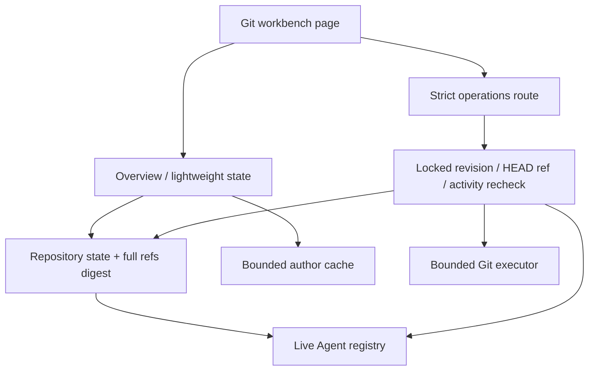
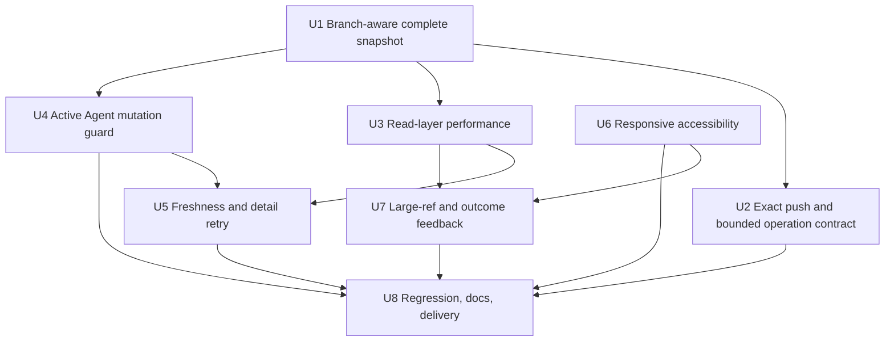

# fix: 加固 Git 工作台安全、一致性与交互

## Overview

本计划承接已完成的 IDEA 风格 Git 工作台首版，集中处理本轮审查确认的 P1 与 P2 问题。实施顺序以安全正确性为先：先修复“同一提交上的分支切换无法触发 stale”与“Push 预览目标和服务端实际目标不一致”两个 P1，再处理 Agent 并发提示、完整 refs 快照、大仓库读取成本、请求体上限、失败重试、外部变更提醒、响应式可访问性和操作反馈等 P2。

本轮不扩展新的 Git 命令能力。既有 cwd 授权、common-dir 进程内写锁、严格 action union、无 force push、冲突自动 abort、linked worktree 保护和有界 Git 子进程继续作为不可回退的基础边界。

### Priority and acceptance summary

| 优先级 | 问题 | 当前风险 | 本轮目标 |
| --- | --- | --- | --- |
| P1 | revision 未包含 symbolic HEAD / 当前分支身份 | 两个分支指向同一 commit 时，外部切换分支后旧页面仍可能通过 stale 校验，并在错误分支上执行 reset/rewrite | revision 和 mutation expectation 同时绑定 HEAD ref；同 tip 分支切换必须在写入前被拒绝 |
| P1 | Push 表单可编辑目标，但有 upstream 时服务端静默改写 | 用户确认的 remote/target 与实际 push 目的地不同 | 请求明确区分 upstream 与 explicit destination；预览、请求、执行三者完全一致 |
| P2 | 独立工作台不知道同 cwd 的 Agent 正在运行 | Agent 写文件时，另一个标签页可 checkout/reset/rewrite | 服务端投影同 cwd 活动风险；危险操作默认拒绝，显式覆盖需二次确认并携带活动 token |
| P2 | refs 截断后 revision 只覆盖前 5,000 个 ref | 被省略 ref 变化时可把不同快照的日志页混合 | 完整 refs digest 与 UI 截断解耦；无法得到完整 digest 时安全降级 |
| P2 | log/detail/operation 重复读取 full overview 和扫描作者 | 大仓库中一次交互重复扫描最多 20,000 个 commit | 拆分轻量仓库快照与作者目录，建立按 common-dir + revision 的有界缓存 |
| P2 | commit/stash detail 失败后同 revision 无法重试 | 短暂网络或 Git 错误会把面板卡在错误态 | 显式 Retry 触发新的 detail request，不依赖 revision 变化 |
| P2 | 只支持手动刷新 | 外部 IDE/终端变更后页面长期陈旧 | 页面可见时执行轻量状态探测，提示“仓库已变化”，由用户决定刷新 |
| P2 | operations 只信任 Content-Length 限制请求体 | 缺失或不可信 Content-Length 时可绕过 64 KiB 预检 | 对实际 UTF-8 body 做上限校验后再 parse JSON |
| P2 | 中宽 refs drawer、移动 tabs、tree/listbox 键盘契约不完整 | 焦点可能落入屏外内容，语义 role 与实际键盘行为不一致 | inert/焦点恢复/Escape/backdrop/roving keyboard 与 ARIA contract 成套交付 |
| P2 | 大量 refs、复制 hash、操作成功反馈较弱 | refs 难定位，成功或复制结果缺少确认 | refs 可搜索；复制和 mutation 结果进入可访问的状态反馈 |

---

## Problem Frame

### P1 evidence

1. `lib/git-workbench.ts` 的 `buildRevision(head, refs)` 只摘要 HEAD commit 与已投影 refs。若 `main` 和 `twin` 指向同一 commit，从 `main` 切换到 `twin` 后 `revision` 与 `expectedHead` 都不变；旧页面发起 reset 时会移动 `twin`，而不是用户最初看到的 `main`。
2. `components/git-workbench/GitWorkbenchDialogs.tsx` 在 Local branch 已有 upstream 时仍允许编辑 remote/target；`lib/git-workbench-operations.ts` 随后又以 upstream 覆盖请求字段。临时双 remote 仓库探针确认，表单请求的显式目标可与实际 push 目标不同。

### P2 evidence

- `components/git-workbench/GitWorkbench.tsx` 的 `writesDisabled` 只观察 operation busy/recovery/Git operation state，没有同 cwd Agent 活动信息。
- `readRefs()` 先以 `GIT_WORKBENCH_MAX_REFS + 1` 截断，再由 `buildRevision()` 摘要截断后的数组；`git log --all` 却仍读取全部 refs。
- `readGitWorkbenchLog()`、`readGitCommitDetail()` 和 mutation preflight 都调用 `readGitWorkbenchOverview()`；overview 每次都会执行最多 20,000 条 commit 的作者扫描。
- `hooks/useGitWorkbench.ts` 的 commit detail effect 依赖 `cwd + selectedHash + overview.revision`；`hooks/useGitStashes.ts` 的 stash detail effect 同样依赖 selection + projection revision。相同 revision 下点击普通 Refresh 不会重试失败请求。
- `/api/git/operations` 只检查声明的 `Content-Length` 后直接 `req.json()`；stash 路由已有读取 `req.text()` 后校验实际 UTF-8 byte length 的更安全模式。
- 641–959px 下 `.git-workbench-refs-shell` 仅用 transform 移出屏幕；关闭时仍缺少 inert/aria-hidden、backdrop、Escape 和触发器焦点恢复。
- changed-file tree 和 stash listbox 声明了 tree/listbox 语义，但未提供与这些 role 对应的完整 Arrow/Home/End 导航和 roving tabindex。

---

## Requirements Trace

- **R1. 分支感知的乐观并发：** repository revision 必须包含完整 symbolic HEAD/current branch 身份；依赖当前 HEAD/branch/worktree 的 mutation 还必须携带并重验 expected HEAD ref。相同 commit 上切换分支或 detached/attached 变化均视为 stale。
- **R2. 完整 refs 快照：** revision 必须覆盖所有 local/remote/tag refs，不能受 UI projection cap 影响；若完整 digest 超出明确预算，分页和写操作必须以可见错误安全降级，不能把部分摘要标记为完整。
- **R3. Push 目标一致：** UI 预览、wire request 和最终 `git push` refspec 必须表达同一个 destination；已有 upstream 采用只读 upstream 模式，无 upstream 才允许显式 remote/target/set-upstream；服务端不得静默改写用户 intent。
- **R4. 活动 Agent 协调：** 对同 canonical cwd 的 queued/running/retrying ordinary Agent，checkout、reset、cherry-pick、revert、reword、drop 和 create-and-checkout 等会改变当前 branch/index/worktree 的操作必须默认拒绝；用户可在明确风险提示后显式覆盖，服务端仍需重验活动 token。
- **R5. 读取成本有界：** overview、log、commit detail、mutation preflight 和轻量探测应共享内部 repository identity/state，避免无关的作者扫描和重复 repo resolution；作者目录采用按 common-dir + revision 隔离的有界进程内缓存。
- **R6. 外部变化可感知：** 工作台在页面可见且在线时进行轻量状态探测；发现 revision、HEAD ref、dirty/unmerged/operation state 或 Agent hazard 变化时提示用户刷新，不强制替换当前选择或自动 fetch remote。
- **R7. Detail 可恢复：** commit detail 与 stash detail 的失败状态都提供显式 Retry；Retry 必须创建新 request sequence，遵守 cwd/selection/AbortController 隔离，且不要求 Git revision 先变化。
- **R8. 请求体真实限流：** operations mutation 在 JSON parse 前对实际 UTF-8 body 执行 64 KiB 上限，保留 exact-key action parser；缺失、伪造或 chunked Content-Length 不得绕过。
- **R9. 响应式与可访问性完整：** 中宽 refs drawer 具有 backdrop、Escape、焦点进入/恢复、关闭时 inert/aria-hidden 和 reduced-motion；移动 tabs 具有 aria-controls、roving focus 与 Arrow/Home/End；tree/listbox 的 role、tab stop 和键盘行为一致。
- **R10. 大 refs 与反馈：** Local/Remote/Tags 可按 literal query 搜索，Branch filter 在大量 refs 下无需滚动整个 native select；复制 hash 和成功 mutation 通过可访问状态区给出成功/失败反馈。
- **R11. 兼容与安全不回退：** compact `GitPanel`、stash API、commit/diff API 和现有 wire additive compatibility 保持；不引入 force push、自动 fetch、任意 Git args、自动 mutation retry 或外部 Agent 文件锁承诺。
- **R12. 可验证与可交接：** disposable repository、linked worktree、双 bare remote、超 cap refs 和伪造 live Agent fixtures 覆盖新增安全边界；i18n、模块文档、计划索引和人工主题/viewport 矩阵同步更新。

---

## Scope Boundaries

- 不新增 fetch、pull、merge、stage、commit、Smart Checkout、Force Checkout、网页冲突解决或 rebase continue/skip UI。
- 不支持 force push、force-with-lease、Tag push/delete 或远程分支删除。
- 不把 Agent 工具执行接入 Git common-dir 锁，也不宣称能阻止外部 IDE/终端/进程写仓库；本轮只提供同进程普通 Agent 的风险探测、默认阻断和显式覆盖。
- 不自动刷新 remote-tracking refs；“Remote”仍是 last-fetched local snapshot。
- 不建立持久 Git 索引或后台 daemon；缓存只存在当前 server process，必须按 common-dir + revision 隔离并有总量上限。
- 不在仓库变化提示出现时自动清空筛选、选择和 Diff；由用户确认 Refresh 后再使用权威 overview 重建状态。
- 不为本轮单独引入完整 React 测试框架；纯 projection/keyboard helper 用现有 smoke 承载，真实焦点与视觉行为由项目浏览器矩阵验收。

### Deferred to Follow-Up Work

- 跨进程/跨工具的统一仓库写协调协议。
- 服务端持续文件系统 watcher；本轮只做 visibility-aware 轻量探测。
- 服务端 Git 日志索引、虚拟化 refs/commit 列表和百万 refs 仓库优化。
- 可搜索 Branch picker 的模糊匹配、高级 ref grouping 和最近使用排序；本轮只做 literal、可清除搜索。

---

## Context & Research

### Relevant code and patterns

- `lib/git-workbench.ts`：overview、refs/author projection、revision、log、commit detail/capability 的当前事实源；本轮需要拆分内部 read layers。
- `lib/git-workbench-operations.ts`：common-dir 锁内 mutation revalidation、push refspec 和 history operations。
- `lib/git-executor.ts`：cwd 授权、repo identity、Git timeout/buffer、稳定错误码与进程内 mutation lock。
- `lib/task-observer-agent-registry.ts`、`lib/task-observer-agent.ts`：不加载 Pi SDK 即可读取 live wrapper 的 cwd 与 bounded execution state；适合提供不含 session title/id 的 Agent hazard projection。
- `app/api/git/operations/route.ts`：exact action body parser 和当前 Content-Length-only cap。
- `app/api/git/stashes/route.ts`、`app/api/git/stashes/[oid]/actions/route.ts`：实际 body byte length 校验模式。
- `hooks/useGitWorkbench.ts`、`lib/git-workbench-client.ts`：cwd/sequence/abort 隔离、log 分页、mutation refresh 与 detail 生命周期。
- `hooks/useGitStashes.ts`、`components/GitStashPanel.tsx`：stash detail cache、selection 和失败 UI。
- `components/git-workbench/GitWorkbench.tsx`、`GitWorkbenchDialogs.tsx`：全页状态、mobile tabs、中宽 drawer、operation dialog 和 push preview。
- `components/git-workbench/GitRefTree.tsx`、`GitLogPane.tsx`、`GitCommitInspector.tsx`：refs、Branch/User filter、copy hash、changed-file tree 与 context menu。
- `components/GitPanel.tsx`：已有 `commitDetailRetryKey`，可作为显式 detail retry 的局部模式参考。
- `scripts/smoke-git-workbench.ts`：普通仓库、linked worktree、bare remote、route strict payload 和写操作回归的主要承载点。
- `scripts/smoke-task-observer.ts`：Agent execution state/registry projection 的测试承载点。
- `docs/operations/ui-visual-validation.md`：Standalone Git workbench 的主题、viewport、键盘、Portal 和 destructive dialog 验收矩阵。

### Preserved institutional constraints

- common-dir 锁只覆盖 WebUI 自身 operations；外部 Git 与 Agent shell tool 仍可能并发，因此锁内重验和 Git 自身保护仍是最终边界。
- `buildSessionContext()` 与聊天展示 transcript 无关；本轮 Agent hazard 只读取现有 live observer 状态，不触碰 session JSONL、消息内容或 SSE listener 生命周期。
- refs/authors/files 的 truncation 必须显式暴露；不能把超限误报为空或完整。
- state-changing Git API 继续依赖全局 same-origin/access policy，同时独立执行 allowed-root cwd 授权。
- 主题、focus、status、drawer 和 dialog 使用语义 Token 与 canonical `--z-*` 层级，不新增皮肤专用色值。

---

## Key Technical Decisions

| 决策 | 选择 | 理由 |
| --- | --- | --- |
| Revision 内容 | 对完整 local/remote/tag `refname + object id` 做稳定 digest，并加入 HEAD commit 与 symbolic HEAD ref | branch identity 和被 UI 截断的 ref 都会影响快照；UI cap 不能削弱 stale contract |
| 不完整 digest | 返回明确 `revisionComplete=false`/稳定错误并禁止 revision-bound load-more 与 mutation | 安全降级优于用部分摘要假装完整；首屏只读仍可显示 truncated projection |
| Mutation expectation | 对当前 branch/index/worktree 相关 action 增加 required nullable expected HEAD ref，并在 common-dir 锁内与 revision/HEAD 一起校验 | 即使未来 revision 组成变化，action intent 仍明确绑定用户看到的 branch/detached 状态 |
| Push wire contract | `destination` 使用 `upstream` 与 `explicit` discriminated union；upstream 模式携带 expected upstream ref，explicit 只在无 upstream 时允许 | exact-key parser 能拒绝歧义字段，服务端无须猜测或覆盖 target |
| Agent hazard 来源 | 扩展 SDK-free live registry，按 canonical cwd 仅返回 active count + opaque activity token | 服务端可权威重验，同时不向 Git API暴露 session id、title、prompt 或文件信息 |
| Agent hazard 策略 | 会改变当前 branch/index/worktree/history 的 action 默认 409；显式 override 必须在 dialog 二次确认并携带 observed token | 防止无提示破坏 Agent 基线，同时保留用户处理紧急仓库恢复的出口 |
| Read layering | `repository state` 不含 authors；full overview 在其上组合 author catalog；log/detail/operation 使用所需最小层 | 消除每次 detail/log 都扫描 20,000 commits 的结构性成本 |
| Author cache | common-dir + complete revision 作为 key，bounded LRU/TTL，cache miss 才扫描；不跨 revision 复用 | 作者列表依赖 refs 可达历史，revision 变化后旧目录不能用于 authorId validation |
| External changes | 页面 visible/focused 时读取轻量 state；只展示 stale banner，不自动替换内容 | 避免后台噪声与选择跳动，也不引入隐式网络同步 |
| Retry | commit/stash detail 各自拥有 retry epoch 和 callback | 失败重试不应依赖 unrelated repository revision 变化 |
| Request body cap | 先读取 text、校验实际 UTF-8 bytes，再 JSON.parse 和 exact action parse | Content-Length 只能作为 fast rejection，不能作为唯一安全边界 |
| Large refs UI | 左树增加 ref search；Branch filter 改为可搜索、键盘可操作的 bounded picker | 避免 5,000 项 native select，同时与 U6 的 listbox 键盘契约统一设计 |

### Agent hazard action matrix

| Action | 默认遇到 active Agent | 原因 |
| --- | --- | --- |
| checkout-local / checkout-remote | 拒绝，可显式覆盖 | 改变 branch、index、worktree |
| reset（所有模式） | 拒绝，可显式覆盖；hard 保留原 hash danger confirmation | soft/mixed 也会改变 branch/index，不能只保护 hard |
| cherry-pick / revert / reword / drop | 拒绝，可显式覆盖 | 改变当前历史并可能触发 conflict/recovery |
| create-branch + checkout | 拒绝，可显式覆盖 | checkout 会改变当前工作树 |
| create-branch（不 checkout）/ create-tag | 不因 Agent activity 阻断 | 只创建新 ref，不改变 Agent 当前 branch/index/worktree；仍受 revision/name 校验 |
| push | 不因 Agent activity 阻断 | 推送已验证 local ref tip，不修改工作树；仍受 exact destination/ref stale 校验 |

显式覆盖不是锁。服务端在执行 Git 前重读 activity token；token 已变化时返回 stale agent activity，要求重新确认。确认后的 Agent 仍可能继续写文件，UI 必须准确说明剩余风险。

---

## High-Level Technical Design

读取层只共享内部事实，不新增持久状态。full overview 返回 refs/authors 与 mutation 所需 hazard token；轻量 state endpoint 不扫描 authors，也不返回全量 refs。Operations route 继续只接受 strict action union，在 common-dir lock 内依次重验 complete revision、HEAD commit、HEAD ref、selected ref tip、Git operation state 和适用的 Agent activity token。

---

## Implementation Units

P1 acceptance gate is U1 + U2. Do not treat broad P2 polish as a substitute for those two units; both P1 regression fixtures must pass before continuing to destructive-operation UI changes.

- [x] U1. **建立分支感知且覆盖完整 refs 的快照契约（P1/P2）**

**Goal:** 修复相同 commit 上 branch/detached 切换不触发 stale 的 P1，并消除 refs projection cap 对 revision 完整性的削弱。

**Requirements:** R1, R2, R11, R12

**Dependencies:** None

**Files:**
- Modify: `lib/git-workbench.ts`
- Modify: `lib/types.ts`
- Modify: `lib/git-workbench-operations.ts`
- Modify: `app/api/git/operations/route.ts`
- Modify: `hooks/useGitWorkbench.ts`
- Modify: `lib/git-workbench-client.ts`
- Modify/Test: `scripts/smoke-git-workbench.ts`

**Approach:**
- 将完整 refs digest 与 `GitWorkbenchRef[]` UI projection 分开：完整摘要至少覆盖所有 `refs/heads`、`refs/remotes`、`refs/tags` 的 refname/object id，数组仍保持 5,000 项 cap 和 `truncation.refs`；截断时必须优先保留当前 HEAD ref 及其 upstream，不能让当前分支因排序落在 cap 外而消失。
- revision 输入加入 HEAD commit 和完整 symbolic HEAD ref；detached HEAD 使用明确 sentinel，不能与指向同 commit 的 local branch 等价。
- 将 All log 的 revision universe 与查询 universe 对齐：使用 heads/remotes/tags 范围，而不是让 `--all` 额外读入 refs/stash 或任意 custom refs；如果实现选择保留更宽 universe，则这些额外 refs 也必须进入 complete digest 和 allowlist。
- 为当前 branch/index/worktree/history 相关 action 增加 required expected HEAD ref（nullable 表达 detached），由 hook 从 overview 填充、route exact-key parser 校验、operations 在 common-dir lock 内重验。
- checkout 同样携带 expected HEAD ref，因为 dirty changes 的安全切换结果依赖当前基线；create-branch 仅在 checkout=true 时要求该字段。
- 保留 selected ref tip、expectedHead commit 与 revision 的现有重验；各字段失败返回可区分的稳定 stale code，客户端统一提示 Refresh，不自动重试 mutation。
- 若完整 refs 输出超过明确 read budget，不回退到 truncated revision；overview 标记 snapshot incomplete，log load-more/mutation 返回稳定错误，UI 解释需缩小仓库 refs 或使用外部 Git。

**Test scenarios:**
- Same-tip branch：`main` 与 `twin` 指向同一 commit，页面读取于 `main` 后外部切换到 `twin`；旧 reset/reword/checkout request 在任何写入前失败，两个 branch tip 均不变化。
- Detached parity：同一 commit 上 branch → detached 或 detached → branch 后 revision 改变，旧 current-branch mutation 被拒绝。
- Ordinary stale：HEAD commit、selected ref tip 或 tag 变化仍触发现有 stale contract。
- Over cap refs：创建超过 projection cap 的 refs，当前 branch/upstream 仍被保留；修改一个未投影 ref 后 revision 改变，旧 log page 不能继续合并。
- All universe：只由 refs/stash/custom ref 可达的 commit 不混入 heads/remotes/tags 定义的 All；若选择保留它们，则对应 ref 变化必须改变 revision。
- Incomplete safety：模拟 full digest 超预算，首屏显示 truncated/incomplete，但 load-more 和 mutation 明确失败，不执行 Git 写入。
- Compatibility：未截断普通仓库的 overview/log/commit response 保持 additive compatibility；compact graph/status 不因 revision 组成变化回归。

**Verification:**
- stale contract 同时绑定 commit 与 branch identity。
- 没有任何 mutation 只依赖 `expectedHead` commit 来推断当前 branch。
- `truncation.refs=true` 不再意味着 revision 只摘要可见 refs。

---

- [x] U2. **统一 Push intent、预览和 bounded operation transport（P1/P2）**

**Goal:** 消除已有 upstream 时 UI 可编辑目标但服务端静默重写的 P1，并补齐 operations 实际请求体上限。

**Requirements:** R3, R8, R11, R12

**Dependencies:** U1

**Files:**
- Modify: `lib/types.ts`
- Modify: `app/api/git/operations/route.ts`
- Modify: `lib/git-workbench-operations.ts`
- Modify: `hooks/useGitWorkbench.ts`
- Modify: `components/git-workbench/GitWorkbench.tsx`
- Modify: `components/git-workbench/GitWorkbenchDialogs.tsx`
- Modify: `lib/i18n/messages/git.ts`
- Modify/Test: `scripts/smoke-git-workbench.ts`

**Approach:**
- 将 push request destination 改为 strict discriminated union：`upstream` 模式携带用户看到的 expected upstream ref；`explicit` 模式携带 remote、target 和 setUpstream。
- Local branch 已有 upstream 时，dialog 只读展示精确 remote/target，不显示可编辑控件；服务端要求 upstream mode，并重验 current upstream 未变化。
- Local branch 无 upstream 时，dialog 允许选择 configured remote、输入 target 并决定 set-upstream；服务端要求 explicit mode，验证后原样构造 refspec。
- 拒绝 upstream + explicit 字段混合、已有 upstream 却提交 explicit、无 upstream 却提交 upstream、空 target、未知 remote 和 expected upstream stale；不得 fallback 或覆盖请求字段。
- 对 operations route 先使用 Content-Length 做快速拒绝，再读取 raw text、按 UTF-8 byte length 执行 64 KiB hard cap，之后才 JSON.parse 和 exact-key parse。
- 成功 response 可 additive 返回实际 destination，供 U7 success feedback 使用；不得包含 credential、remote URL 或原始 hook 输出。

**Test scenarios:**
- Upstream exactness：双 bare remote 下，preview 为 `origin/main` 时 request 只能执行 `origin/main`；尝试混入 `team/alternate` 被 400 拒绝且两个 remote 均不变化。
- Explicit exactness：无 upstream branch 选择 `team/topic` 后实际只更新该 ref，并按 checkbox 决定是否设置 upstream。
- Stale upstream：dialog 打开后外部改变 branch upstream，旧 expected upstream request 被拒绝，不 push 到新旧任一目标。
- No force regression：额外 `force`、任意 refspec、URL remote 或未知字段继续被 exact-key parser 拒绝。
- Body cap：合法小 JSON 正常；声明超限直接 413；缺少/伪造 Content-Length 且实际超过 64 KiB 仍 413；invalid JSON 保持 400。
- Error mapping：hook/auth/non-fast-forward/unknown outcome 保持原稳定 code，不被 destination contract 吞并。

**Verification:**
- 用户确认页显示的 destination 与 response/remote ref 证明的实际 destination 相同。
- 服务端不存在“有 upstream 就覆盖 request.remote/target”的路径。
- 请求体限制基于实际 bytes，而不是只信任 header。

---

- [ ] U3. **拆分轻量仓库状态与作者目录，降低大仓库重复扫描（P2）**

**Goal:** 让 log、commit detail、mutation preflight 和轻量探测只读取必要事实，避免一次交互反复扫描作者和重复解析 repository identity。

**Requirements:** R2, R5, R6, R11, R12

**Dependencies:** U1

**Files:**
- Modify: `lib/git-workbench.ts`
- Modify: `lib/git-executor.ts`（仅在内部 helper 需要传递已授权 identity 时修改）
- Modify: `lib/types.ts`
- Modify: `app/api/git/workbench/route.ts`
- Create: `app/api/git/workbench/state/route.ts`
- Modify: `app/api/git/log/route.ts`
- Modify: `app/api/git/commit/route.ts`
- Modify: `lib/git-workbench-client.ts`
- Modify/Test: `scripts/smoke-git-workbench.ts`

**Approach:**
- 提取内部 `repository state`：authorized identity、status、HEAD ref、complete revision、bounded refs projection、operation state、remotes；不包含 authors。
- full overview 在 repository state 上组合 author catalog；log 使用 state 校验 revision/scope，并通过 author cache 解析 authorId；commit detail/capability 和 mutation preflight 不读取 author catalog。
- 内部 helper 优先接收已解析 `GitRepositoryIdentity`/state，避免同一 request 内多次 `resolveGitRepository()`；不把 identity 暴露为客户端可控参数。
- 作者目录以 common-dir + complete revision 为 key，使用 bounded LRU/TTL；同 key 并发 miss 合并为一个 Promise，失败不缓存为空，revision 变化后不复用旧 authorId mapping。
- 新增 lightweight state endpoint，只返回外部变化比较需要的 bounded fields，不返回全 refs/authors/session metadata，也不执行 network Git command。
- 保留 20,000 commit 作者扫描和 500 author projection 的安全 cap；优化目标是减少重复次数，不是移除上限。

**Test scenarios:**
- Read-count seam：初次 overview 扫描一次 authors；同 revision log 使用缓存；commit detail 和 mutation preflight 不触发 author scan。
- Cache invalidation：ref revision 变化后重新扫描；不同 common-dir 即使 revision hash 相同也不共享 authors。
- Concurrent miss：同仓库同 revision 的并发 overview/log 最多创建一次 author scan，错误后下一请求可恢复重试。
- State endpoint：返回 revision/HEAD ref/dirty/unmerged/operation/truncation 等轻量字段，不返回 authors、全 refs、cwd 之外的敏感 session 信息。
- Large repository：20,000 commit fixture 或 injectable scanner 证明输出/时间预算仍有界，truncated metadata 保持准确。
- Compatibility：overview 的 authors 与 refs 字段继续存在，author filter 的 canonical id 行为不变。

**Verification:**
- detail request 不再为显示一个 commit 扫描全部 authors。
- mutation preflight 只读取执行安全所需事实，成功后的 authoritative full overview 最多触发一次必要的 authors refresh/cache hit。
- 新 endpoint 不 fetch remote，不建立后台 watcher。

---

- [ ] U4. **增加同 cwd 活动 Agent 的危险 mutation guard（P2）**

**Goal:** 当普通 Agent 正在同一项目工作时，避免独立 Git 工作台无提示改变其 branch/index/worktree/history，同时提供明确、可审计的显式覆盖路径。

**Requirements:** R4, R5, R6, R11, R12

**Dependencies:** U1

**Files:**
- Modify: `lib/task-observer-agent-registry.ts`
- Modify: `lib/task-observer-types.ts`（仅在需要内部 hazard 类型时；不得扩大 public observer privacy surface）
- Modify: `lib/git-workbench.ts`
- Modify: `lib/git-workbench-operations.ts`
- Modify: `lib/types.ts`
- Modify: `app/api/git/operations/route.ts`
- Modify: `app/api/git/switch/route.ts`
- Modify: `hooks/useGitWorkbench.ts`
- Modify: `components/git-workbench/GitWorkbench.tsx`
- Modify: `components/git-workbench/GitWorkbenchDialogs.tsx`
- Modify: `components/git-workbench/GitRefTree.tsx`
- Modify: `components/git-workbench/GitLogPane.tsx`
- Modify: `lib/i18n/messages/git.ts`
- Modify/Test: `scripts/smoke-task-observer.ts`
- Modify/Test: `scripts/smoke-git-workbench.ts`

**Approach:**
- 在 SDK-free registry 增加 canonical cwd hazard query；只将 executionState 为 queued/running/retrying 的 live ordinary Agent 计为 active，输出 count 与 opaque token，不输出 session id/title/prompt/tool args。
- overview/lightweight state additive 返回 hazard summary，客户端据此在 header/banner 和适用 action dialog 中提示；不能仅靠客户端 disabled 作为安全边界。
- Operations route 为 hazard actions 接受 exact `agentActivityToken` 与 explicit override boolean；默认或 token 缺失时服务端返回稳定 `ACTIVE_AGENT_SESSION`。
- 用户选择继续时，dialog 必须展示“Agent 可能继续写文件、此操作不持有 Agent 锁”的明确风险并二次确认；hard reset/drop 原 confirmation 继续保留，不能被 Agent checkbox 替代。
- 服务端在 common-dir lock 内、Git 写入前重读 hazard；observed token 改变则返回 `STALE_AGENT_ACTIVITY` 并要求重新确认。无 active Agent 时不要求 override 字段。
- compatibility `/api/git/switch` 复用相同 hazard query 并在 active Agent 时服务端拒绝；紧凑 `GitPanel` 现有 `agentRunning` disabled 仍保留，但不再是唯一边界。该兼容入口不新增 override 参数，紧急覆盖只通过具备风险 dialog 和 token 的 strict workbench operations 完成。
- push、create-tag、create-branch without checkout 不因 Agent activity 阻断，但继续执行自身 revision/ref/name 校验。

**Test scenarios:**
- Registry privacy：两个同 cwd live activities 投影 count/token；settled/dead/different cwd 不计入；返回值不含 session id/title/message/path。
- Default block：active Agent 下 checkout/reset/cherry-pick/rewrite 等返回 409，HEAD/ref/worktree 不变化。
- Explicit override：相同 observed token + explicit confirmation 才允许执行；缺字段、false 或未知字段被 strict parser 拒绝。
- Token race：dialog 后 Agent stateVersion 变化，旧 token request 被拒绝，不执行 Git。
- Matrix：push、create-tag、create-branch without checkout 在 active Agent 下仍按原规则可执行；create-and-checkout 被保护。
- Compatibility switch：直接调用 `/api/git/switch` 时 active Agent 仍被服务端拒绝，不能绕过紧凑 UI 的 `agentRunning` guard。
- Multi-cwd：另一个 cwd 的 Agent 不阻断当前 repo；linked worktree 是否同 cwd 以 canonical worktree cwd 为边界，不错误扩展为整个 common-dir Agent lock。
- Recovery：Git recoveryRequired 优先继续冻结 writes；Agent hazard 消失不会绕过 recovery state。

**Verification:**
- 独立工作台与服务端对 hazard action 分类一致。
- 绕过 UI 直接调用 API 时仍默认阻断。
- 文案不承诺 override 后不存在并发风险。

---

- [ ] U5. **实现外部变化提示与 commit/stash detail 显式重试（P2）**

**Goal:** 让长期打开的工作台能感知外部变化，并让短暂 detail 失败无需改变 selection/revision 即可恢复。

**Requirements:** R6, R7, R11, R12

**Dependencies:** U3, U4

**Files:**
- Modify: `hooks/useGitWorkbench.ts`
- Modify: `lib/git-workbench-client.ts`
- Modify: `components/git-workbench/GitWorkbench.tsx`
- Modify: `components/git-workbench/GitWorkbenchHeader.tsx`
- Modify: `components/git-workbench/GitCommitInspector.tsx`
- Modify: `hooks/useGitStashes.ts`
- Modify: `components/GitStashPanel.tsx`
- Modify: `lib/i18n/messages/git.ts`
- Modify/Test: `scripts/smoke-git-workbench.ts`
- Modify/Test: `scripts/smoke-ui-theme-contract.ts`

**Approach:**
- 页面 visible、focused 且 online 时周期性调用 U3 lightweight state；hidden/offline/unmounted 时停止，单次请求使用 AbortController 和 sequence isolation。
- 比较 complete revision、HEAD ref、HEAD commit、dirty/unmerged/operation state 与 Agent hazard token；变化时显示 non-blocking stale banner，保留当前 commit/filter/diff，停止 load-more 和新 mutation，等待用户 Refresh。
- 不在轻量探测中调用 fetch/pull，不因 remote network failure弹错误；探测失败采用退避/下一周期重试，手动 Refresh 始终可用。
- commit detail 增加独立 retry epoch/callback；retry 清除当前 detailError、创建新 sequence，并保持 selected hash/cwd isolation。
- stash detail 同样增加 retry epoch；若该 OID 已有错误，不把失败写入成功 cache，Retry 必须重新请求同一 OID。
- error panel 提供 Retry button；loading 时禁用重复点击，成功后只替换对应 detail，不刷新无关 overview/list。

**Test scenarios:**
- Poll lifecycle：visible/focused/online 才发请求；visibility/offline/cwd change/unmount 正确 abort，不留下 timer。
- Change detection：同 tip branch switch、ref update、dirty flag、operation state 和 Agent token 变化均显示 stale；相同 snapshot 不重复提示。
- Selection stability：stale banner 出现时 query/scope/selectedHash/detail 保持；用户 Refresh 后才按权威数据重建。
- Commit retry：第一次失败、revision 不变，点击 Retry 后成功；迟到的第一次 response 不能覆盖第二次。
- Stash retry：同 OID 同 revision 可失败后成功；切换 OID/cwd 时旧 retry response 被丢弃。
- Accessibility：stale 与 retry error 使用合适 status/alert，button 有明确 label，busy 状态可见。

**Verification:**
- 外部变化不是自动刷新或自动 mutation retry。
- 两类 detail 都能在相同 revision 下显式恢复。
- 长期开页不会在 hidden tab 持续轮询。

---

- [ ] U6. **补齐 drawer、tabs、tree/listbox 的响应式可访问性（P2）**

**Goal:** 让中宽 drawer、移动 tabs、changed-file tree 和 stash listbox 的语义、焦点与键盘操作一致，不让关闭内容保留可聚焦节点。

**Requirements:** R9, R11, R12

**Dependencies:** None（可与 U1–U5 并行，合并时以 U5 最终 banner/state 为准）

**Files:**
- Modify: `components/git-workbench/GitWorkbench.tsx`
- Modify: `components/git-workbench/GitRefTree.tsx`
- Modify: `components/git-workbench/GitCommitInspector.tsx`
- Modify: `components/GitStashPanel.tsx`
- Modify: `app/globals.css`
- Modify: `lib/i18n/messages/git.ts`
- Modify/Test: `scripts/smoke-git-workbench.ts`
- Modify/Test: `scripts/smoke-ui-theme-contract.ts`
- Modify: `docs/operations/ui-visual-validation.md`

**Approach:**
- 641–959px refs drawer 打开时渲染 canonical drawer backdrop，移动焦点到 drawer 首个可操作项，支持 Escape/点击 backdrop 关闭并恢复 Branches trigger；关闭时 refs 容器 inert + aria-hidden，不能通过 Tab 到达屏外内容。
- drawer trigger 增加 aria-controls；打开期间管理背景交互和滚动，z-index 使用现有 drawer/backdrop tokens；reduced-motion 下不依赖 transition 才完成状态切换。
- mobile tabs 为每个 tab/panel 建立稳定 id、aria-controls/aria-labelledby；ArrowLeft/Right、Home/End 只移动 tab focus/selection，Tab 进入活动 panel，非活动 panel hidden/inert。
- changed-file tree 实现单一 roving tab stop：Up/Down 遍历可见 treeitems，Right 展开/进入、Left 收起/返回父级，Home/End 首尾，Enter 打开 file Diff；folder/file wrapper 与 button 不产生重复语义。
- stash listbox 实现 roving option focus、Up/Down/Home/End 和 selection；若只保留普通 button list，则移除不完整 listbox role，二者择一保持一致。本轮优先完成 listbox contract。
- 维持 context menu 的 Shift+F10/Escape/focus restore 和 resize separator 键盘行为，不因新 roving state 回归。

**Test scenarios:**
- Medium drawer：open/close/backdrop/Escape/focus restore；关闭时 Tab 不进入 refs；reduced motion 行为一致。
- Mobile tabs：Arrow/Home/End、aria-selected、aria-controls、active panel visibility 和 focus 顺序正确。
- Tree：嵌套 folder 展开/收起、可见节点 Up/Down、父子 Left/Right、Home/End、Enter Diff；切换 commit 后 roving state 重置到有效节点。
- Stash listbox：键盘选择后 detail 同步；列表刷新/删除选中项后焦点落到相邻有效 option。
- Pointer parity：mouse、touch/coarse pointer 不依赖 hover，drawer/menu/dialog 均可关闭。
- Visual：desktop/medium/mobile/200% zoom 无 page-level horizontal overflow；Light/Dark/Paper/Twilight/Dracula 与 reduced-motion 通过项目矩阵。

**Verification:**
- 不存在“声明 tree/listbox/tab role 但缺少对应键盘模型”的控件。
- 关闭 drawer 和非活动 mobile panel 不含可聚焦内容。
- destructive dialog、Diff、context menu 与 drawer 的 Portal 层级保持正确。

---

- [ ] U7. **改进大量 refs 的定位与操作结果反馈（P2）**

**Goal:** 在不建立 Git 索引的前提下提升 5,000 refs 场景的可用性，并让复制和成功 mutation 有明确反馈。

**Requirements:** R10, R11, R12

**Dependencies:** U3, U6

**Files:**
- Modify: `components/git-workbench/GitRefTree.tsx`
- Modify: `components/git-workbench/GitLogPane.tsx`
- Modify: `components/git-workbench/GitContextMenu.tsx`（仅在 copy outcome 需要统一 menu close/focus 时）
- Modify: `components/git-workbench/GitWorkbench.tsx`
- Modify: `hooks/useGitWorkbench.ts`
- Modify: `lib/git-workbench-client.ts`
- Modify: `lib/i18n/messages/git.ts`
- Modify: `app/globals.css`
- Modify/Test: `scripts/smoke-git-workbench.ts`
- Modify/Test: `scripts/smoke-ui-theme-contract.ts`

**Approach:**
- 增加 ref-specific literal search，按 short name 和 full ref 做不区分大小写过滤；保留 Local/Remote/Tags 分组、current/tracking 标识和真实 truncated 提示。
- Branch filter 从超大 native select 调整为可搜索 bounded picker；使用共享纯 projection 对 visible options 排序/限制，并明确提示继续输入以缩小结果。选择值始终是 overview allowlist 内的 full ref。
- search 只过滤已投影 refs；`truncation.refs=true` 时明确说明结果不包含被 server cap 省略的 refs，不伪装为全仓库搜索。
- copy hash 使用可靠 clipboard success/failure handling；成功显示短暂 `role=status` 文案，失败提供可选择的完整 hash fallback，不静默失败。
- mutation success 在全页 status 区展示 action、selected ref/hash、outcome 和 U2 返回的 push destination（如适用）；新操作或用户关闭时清理，不与 error/recovery banner 混用。
- success/error status 都保持 bounded text，不显示 raw command、remote URL、credential 或未裁剪 stderr。

**Test scenarios:**
- Ref search：local/remote/tag 同名、层级名、Unicode、大小写和清空 query；selected ref 被过滤时 scope 仍保持且有可见提示。
- Bounded picker：5,000 refs 下初始 option 有上限，键盘搜索/选择 full ref 正确；不允许手工构造不存在 ref。
- Truncation honesty：server refs truncated 时 search/badge 明确是 visible refs 范围。
- Copy：clipboard success、API unavailable/rejection 都有反馈，menu close 后焦点恢复。
- Mutation success：checkout/push/reset/create ref 的成功文案与 response outcome 一致；失败/recovery 不显示 success。
- i18n/theme：zh/en 文案齐全，status/fallback/picker 使用语义 Token，200% zoom 可达。

**Verification:**
- 大 refs 场景无需滚动完整 native select 才能选择 branch。
- copy 和 mutation 不再“无消息即视为成功”。
- 新反馈不泄露敏感 Git 诊断或破坏现有 alert 优先级。

---

- [ ] U8. **固化回归矩阵、模块文档和新会话交付记录**

**Goal:** 将 P1/P2 安全边界和人工交互验收固化为可重复检查，并让后续维护者理解 snapshot、push、Agent hazard 和缓存职责。

**Requirements:** R1–R12

**Dependencies:** U2, U4, U5, U6, U7

**Files:**
- Modify/Test: `scripts/smoke-git-workbench.ts`
- Modify/Test: `scripts/smoke-task-observer.ts`
- Modify/Test: `scripts/smoke-ui-theme-contract.ts`
- Test: `scripts/check-i18n-keys.ts`
- Modify: `docs/modules/api.md`
- Modify: `docs/modules/frontend.md`
- Modify: `docs/modules/library.md`
- Modify: `docs/architecture/overview.md`（仅记录 Agent hazard 与 Git mutation 的进程内边界，不扩大 session lifecycle）
- Modify: `docs/operations/ui-visual-validation.md`
- Create: `docs/operations/ui-visual-validation-results-2026-08-30-git-workbench.md`
- Modify: `docs/plans/README.md`
- Modify: `docs/plans/2026-08-30-001-fix-git-workbench-safety-polish-plan.md`

**Approach:**
- 将 U1–U7 的 disposable fixtures 合并到现有 Git workbench/task observer smoke，保证跨平台 cleanup，不操作开发者真实仓库。
- API 文档记录 complete revision、expected HEAD ref、push destination union、actual body cap、lightweight state 与 stable error codes。
- frontend 文档记录 stale banner、detail retry、Agent override、drawer/tabs/tree/listbox 和 ref picker contract。
- library/architecture 文档记录 repository state/author cache、full digest 与 live Agent registry 的隐私和进程内限制。
- 按 `docs/operations/ui-visual-validation.md` 执行 standalone Git workbench matrix并写结果；未执行项必须标记未执行，自动 smoke 不能替代真实 browser/focus/visual evidence。
- 完成后逐项勾选 U-ID、将 status 改为 completed、添加 Delivery Record，并在计划索引准确记录任何残留人工项或 deferred scope。

**Test scenarios:**
- P1 gate：same-tip branch stale、detached stale、双 remote exact push 与 oversized body 全部使用真实 disposable repo/route。
- P2 domain：超过 visible cap 的 ref 变化、author scan count/cache isolation、active Agent token/default block/override race、lightweight state contract。
- P2 client projection：retry epoch、ref search/bounded picker、operation outcome projection 与 stale comparison 的 pure helper fixtures。
- Full Git regression：现有 checkout dirty safety、linked worktree、push errors、history rewrite、conflict abort、stash 与 diff smoke 无回归。
- Static quality：i18n zh/en parity、theme/focus/motion contract、lint 与 TypeScript 检查。
- Manual browser：desktop ≥960、641–959、≤640、200% zoom；五个代表主题；keyboard/coarse pointer/reduced-motion；active Agent/stale/success/error/recovery/destructive dialog states。

**Verification:**
- 自动化结果与未执行人工项分别记录，不做过度声明。
- 计划、模块文档和实际 wire/error behavior 一致。
- 新会话可按 U1→U2 的 P1 gate 开始，再按依赖并行推进 P2。

---

## System-Wide Impact

- **Read path:** `/api/git/workbench` 组合 repository state + author cache；`/api/git/log` 读取 state + cached author identity；`/api/git/commit` 读取 state/capabilities，不扫描 authors；轻量 state endpoint只返回变化比较字段。
- **Mutation path:** `GitWorkbenchDialogs` → `useGitWorkbench` → strict operations route → common-dir lock → complete revision/HEAD ref/ref tip/operation/Agent token recheck → bounded Git executor → authoritative overview。
- **Agent lifecycle:** hazard query只观察既有 `globalThis.__piSessions` wrapper 的 bounded task observation，不注册 SSE listener、不延长 idle lifetime、不修改 prompt/session 状态。
- **Error propagation:** 新增或明确 `STALE_HEAD_REF`、`SNAPSHOT_INCOMPLETE`、`STALE_UPSTREAM`、`ACTIVE_AGENT_SESSION`、`STALE_AGENT_ACTIVITY` 等稳定 code；客户端将它们分为 Refresh、重新确认或只读降级，不自动 replay Git mutation。
- **State lifecycle:** polling state 只产生 stale banner；Refresh 才更新 overview/log/detail。mutation success 清理旧 detail/diff/context menu并展示 bounded success；recoveryRequired 仍具有最高写冻结优先级。
- **Cache lifecycle:** author cache 是可重建的进程内优化，不是事实源。server restart、cache miss 或 eviction 只影响性能，不改变 API 结果；revision/common-dir 隔离防止跨仓库污染。
- **Security boundary:** actual body cap、exact action/destination union 和 cwd authorization互补；全局 access auth/same-origin 不替代 Git route 的 payload/cwd 校验。

---

## Risks & Mitigations

| 风险 | Mitigation |
| --- | --- |
| full refs digest 在极端仓库超过 8 MiB/30s read budget | 使用最小 refname/object projection和明确完整性标记；失败时禁用分页/mutation，不回退到部分摘要 |
| expected HEAD ref 与 revision 双重字段增加 client/API 迁移复杂度 | 保持 additive overview，集中在 hook 构造 request、route exact parser 与 operations recheck；真实 route fixture覆盖每个 action |
| Push union 改动旧工作台草稿类型 | 只影响独立 workbench operations 的内部 client；compact API保持不变，并由 TypeScript exhaustive union 驱动全部 caller 更新 |
| Agent activity 可能在确认后继续写文件 | 明示 override 不是锁；执行前重验 token；保留 Git 自身 safety/recovery；不承诺跨工具互斥 |
| live registry privacy 泄漏 session 信息 | Git projection 仅 count + opaque token；测试 forbidden fields，不返回 title/id/prompt/tool args |
| author cache 返回陈旧 identity | key 同时包含 canonical common-dir 与 complete revision；失败不缓存；bounded eviction；authorId 不跨 revision 接受 |
| lightweight polling 造成大仓库持续开销 | endpoint 不扫描 authors/commit details，不 fetch；仅 visible/focused/online 运行，单请求隔离并采用保守周期/退避 |
| custom searchable Branch picker 引入新的键盘缺陷 | 与 U6 同步定义 listbox/combobox contract，纯 projection smoke + 人工 keyboard matrix；不保留语义不完整的 role |
| active Agent warning过度阻断恢复操作 | 提供显式二次确认 override；push/create ref 等不影响当前 worktree 的 action 不阻断 |
| UI 改动范围大掩盖 P1 | U1/U2 设独立 acceptance gate；P2 units 不与 P1 安全修复混在同一验证结论中 |

---

## Documentation / Operational Notes

- 无数据迁移、配置格式变更、remote network background job 或发布开关。
- 实施不得在真实开发仓库执行 destructive smoke；必须使用 disposable fixture repository、linked worktree 和 bare remotes。
- 新增 lightweight polling 不能隐式 fetch，也不能把 Remote 描述为远端实时状态。
- 若实施日期不是 2026-08-30，可将视觉结果文件日期调整为真实执行日期，并同步本计划和索引中的路径。
- 最低自动检查范围：Git workbench、Git stash、Git diff、task observer、i18n、UI theme、lint、TypeScript。
- 人工检查范围：standalone Git workbench desktop/medium/mobile/200% zoom、五个代表主题、keyboard/coarse pointer/reduced-motion、Agent/stale/push/destructive/recovery 状态。

---

## Delivery Record

P1 acceptance gate（U1 + U2）已完成，计划保持 `active`，后续从 U3/U4 依赖继续推进 P2。

- **U1:** revision 现同时绑定 HEAD commit、完整 symbolic HEAD ref 与不受 5,000 项 UI cap 影响的 heads/remotes/tags digest；current branch/upstream 在截断投影中优先保留。完整 digest 超出读取预算时返回 `revisionComplete=false`，首屏保持只读，load-more 与 mutation 以 `SNAPSHOT_INCOMPLETE` 失败。current-worktree/history mutation 新增 nullable `expectedHeadRef` 锁内重验，同 tip branch 与 attached/detached 切换返回 `STALE_HEAD_REF`，写入前终止。All log/author universe 已收窄到 heads/remotes/tags，不混入 custom refs 或 `refs/stash`。
- **U2:** Push wire contract 改为 strict `destination` discriminated union。已有 upstream 的分支只读显示并提交 `upstream + expectedUpstreamRef`；无 upstream 才提交 exact `explicit remote/target/setUpstream`。服务端不再覆盖 intent，重验 upstream 后按同一 refspec 执行，并 additive 返回实际 destination。Operations route 在 JSON parse 前同时执行 Content-Length fast reject 与实际 UTF-8 64 KiB hard cap。
- **自动验收:** `npm run test:git-workbench`（same-tip branch、detached parity、超 projection cap、隐藏 ref revision、incomplete fail-closed、双 bare remote exact push、stale upstream、strict union、伪造/缺失 Content-Length oversized body、既有 checkout/history/push error 回归）、`npm run test:git-stash`、`npm run test:git-diff`、`npm run test:i18n`、`npm run test:ui-theme`、`npm run lint`、`node_modules/.bin/tsc --noEmit`、`git diff --check` 均通过。
- **剩余范围:** U3–U8 未实施；活动 Agent guard、read-layer/author cache、lightweight stale probe、detail retry、响应式键盘契约、大 refs 搜索/结果反馈和人工浏览器矩阵仍按本计划推进。

---

## Sources & References

- Related completed plan: `docs/plans/2026-08-19-001-feat-idea-git-workbench-plan.md`
- Related completed plan: `docs/plans/2026-08-28-001-fix-non-conflicting-branch-switch-plan.md`
- Related code: `lib/git-workbench.ts`
- Related code: `lib/git-workbench-operations.ts`
- Related code: `app/api/git/operations/route.ts`
- Related code: `hooks/useGitWorkbench.ts`
- Related code: `components/git-workbench/GitWorkbenchDialogs.tsx`
- Related code: `components/git-workbench/GitCommitInspector.tsx`
- Related code: `hooks/useGitStashes.ts`
- Related code: `lib/task-observer-agent-registry.ts`
- Related tests: `scripts/smoke-git-workbench.ts`
- Related tests: `scripts/smoke-task-observer.ts`
- Manual validation: `docs/operations/ui-visual-validation.md`
