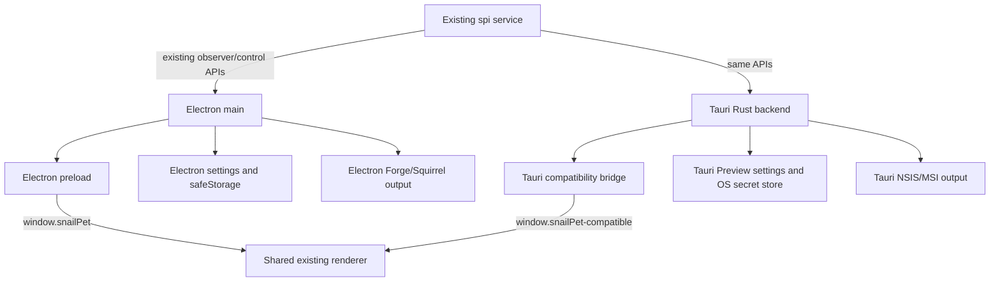
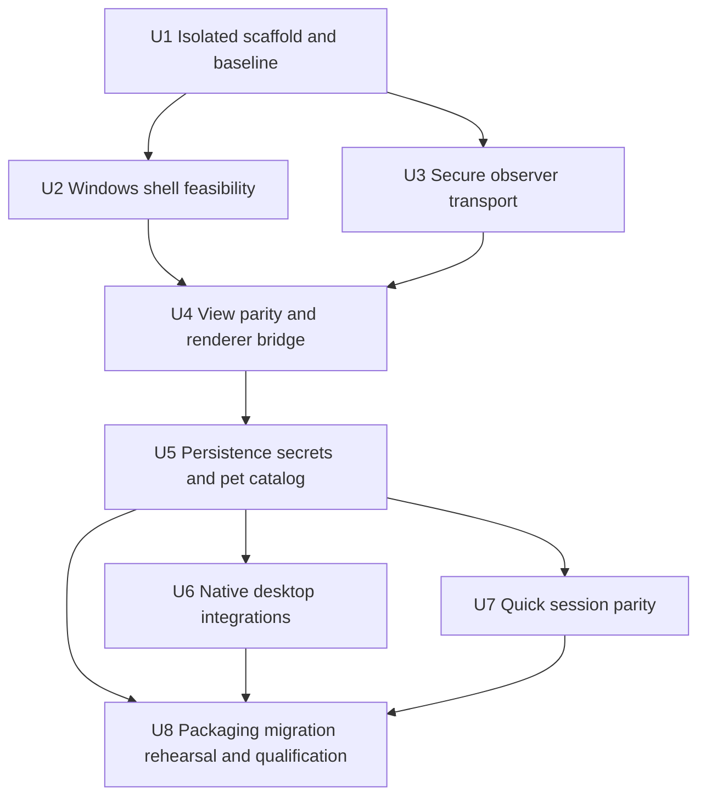
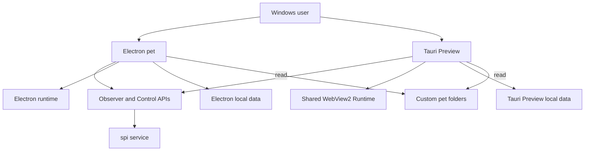

# refactor: Build an isolated Tauri desktop pet alongside Electron

## Overview

在不删除、不替换、不破坏现有 Electron 桌宠的前提下，新建一个完全隔离的 Tauri 2 Windows 桌宠实现，并按“技术可行性 → 安全观察链路 → UI/行为兼容 → 功能补齐 → 打包与实机验收”的顺序逐步迁移。

并行期内，Tauri 使用独立应用标识、可执行文件名、安装目录、单实例域、开机启动项和设置目录；只共享只读的服务端协议、内置资源源文件以及用户自定义宠物根目录。Tauri 不直接写 Electron 的设置和密钥文件。达到完整验收门槛后，本计划仅产出可供切换评审的 Tauri release candidate；切换默认发行物和删除 Electron 属于后续独立决策。

当前工程产物说明迁移收益主要来自替换桌面运行时：Electron Setup 约 140.4 MB、解包目录约 365.1 MB，而 `app.asar` 与内置桌宠资源合计不足 1 MB。Tauri PoC 必须用同机基准验证安装体积、应用专属磁盘、进程树内存、启动耗时和窗口行为，不能只依据框架宣传数据作结论。

---

## Problem Frame

现有桌宠已经具备完整的任务观察、Activity tray、通知、声音、DND、快速会话、自定义宠物、安全 IPC 和 Windows 打包能力，但 Electron 为一个小型常驻窗口携带了完整 Chromium/Node 运行时，导致安装包和解包目录远大于业务代码。

直接原地替换风险过高：当前 `desktop/main/main.ts` 承担 Observer SSE、Token、密钥、窗口、Tray、通知、设置和自定义资源等高权限职责；`desktop/renderer/` 又积累了大量动画、拖动、多 DPI 和交互状态。迁移必须保持 attach-only、pet-only、loopback、隐私投影和退出隔离等既有产品边界，同时避免两个实现并发写同一设置、争用相同单实例锁或互相覆盖安装。

因此采用旁路替换策略：Electron 始终作为可运行基线；Tauri 以独立 Preview 产品逐个建立等价能力；每个阶段都有停止门槛，任何阻塞问题都不影响 Electron 的发布和使用。

---

## Requirements Trace

- R1. 迁移期间现有 Electron 源码、命令、安装包、设置和发布能力保持可用，不因 Tauri 未完成而退化。
- R2. Tauri Preview 与 Electron 完全隔离应用 ID、可执行文件、安装目录、设置目录、密钥存储、单实例域和开机启动项，可同时安装和运行。
- R3. Tauri 保持 attach-only：只连接已运行的 `spi`，绝不启动、停止、重启、监督或跟踪服务进程。
- R4. 复用现有 `/api/desktop-observer/**`、`/api/desktop-control/**`、Snapshot、Capability 和 Deep Link 协议，不建立第二套服务端产品协议。
- R5. Observer Token、Control Token、Access Key、raw cwd、任意文件路径和未经清洗的网络数据只存在于 Rust 后端；WebView 只接收既有安全投影。
- R6. 尽量复用现有 `desktop/renderer/` 及纯 TypeScript 行为，不长期维护一份 Tauri 专属 UI 分叉；通过兼容桥适配宿主差异。
- R7. Windows 透明窗口、Tray、点击穿透、拖动、多显示器/DPI、被动不抢焦点、通知、声音、DND、开机启动和单实例行为达到既有桌宠验收语义。
- R8. 快速会话、自定义 Snail/Codex 宠物、设置持久化、密钥加密和安全 Deep Link 达到 Electron 功能与隐私等价。
- R9. Tauri 使用系统 Evergreen WebView2；候选安装包使用在线或内嵌 Bootstrapper，不捆绑 Offline/Fixed Runtime 破坏体积目标。
- R10. 建立 Electron/Tauri 双实现契约夹具、自动化 smoke 和 Windows 手工矩阵，迁移结论以同机实测为准。
- R11. Tauri release candidate 的目标：安装包不超过 20 MB、应用专属安装目录不超过 30 MB，且同场景空闲进程树私有工作集相对 Electron 至少下降 30%。
- R12. 本计划不删除 Electron、不切换默认发行入口；未达到门槛时可停止 Tauri 工作且无需回滚 Electron。

---

## Scope Boundaries

- 不在本计划中删除 `desktop/`、`forge.config.ts`、Electron/Forge 依赖或现有 `desktop:*` 命令。
- 不在本计划中把 Tauri 改为默认桌宠安装包，也不复用 Electron 的最终 AppUserModelID。
- 不改变 `spi` 的独立安装和启动方式，不把 Next.js、pi SDK、Node sidecar 或服务端运行时打进 Tauri。
- 不重新设计桌宠 UI、活动模型、快速会话产品形态、通知优先级或自定义宠物格式。
- 不新增远程服务连接、多实例聚合、桌宠内连续聊天、服务生命周期管理或自动更新。
- 首轮只支持 Windows 10/11 x64；macOS、Linux、ARM64 和移动端不作为迁移门槛。
- 不选择 WebView2 Offline Installer 或 Fixed Version 作为默认发行方式；离线企业分发另立需求。
- Tauri 不与 Electron 共享可写设置或密钥文件；自定义宠物目录仅作为既有用户资源只读扫描源。

### Deferred to Follow-Up Work

- 将 Tauri 切换为正式 `SnailPiPet` 产品标识、默认下载和发布入口：待本计划 release candidate 通过后单独评审。
- Electron 设置的一次性导入和正式产品升级路径：本计划只定义并验证只读迁移器，不启用最终切换。
- 删除 Electron、Forge/Squirrel 依赖与历史脚本：必须在 Tauri 正式发行且保留一个稳定回退窗口后另立计划。
- 离线 WebView2、自动更新、跨平台发行和签名 CI：不阻塞首个 Tauri Windows release candidate。

---

## Context & Research

### Relevant Code and Patterns

- `docs/architecture/decisions/desktop-pet-task-observer.md`：attach-only、main 持有 Token/通知/读取状态、renderer 只负责展示、pet-only 打包与隐私边界。
- `docs/architecture/decisions/desktop-pet-quick-session.md`：Observer/Control Token 分离、首条消息的窄写入面和 renderer 禁止 cwd/Prompt/密钥。
- `desktop/main/main.ts`：Electron 宿主编排入口；迁移职责清单的主要事实源。
- `desktop/main/observer-client.ts`、`desktop/main/quick-session-client.ts`：健康探测、Capability、Token mint、SSE、重连和快速会话 transport 语义。
- `desktop/main/activity-store.ts`、`desktop/main/connection-state.ts`、`desktop/main/settings-store.ts`：安全视图、连接状态和本地设置的纯行为基线。
- `desktop/main/window-manager.ts`、`desktop/main/tray-controller.ts`：窗口几何、显示器恢复、Tray 菜单和被动/主动 reveal 语义。
- `desktop/main/access-key-store.ts`、`desktop/main/pet-catalog.ts`：Electron `safeStorage`、自定义 Snail/Codex 资源校验与按需读取边界。
- `desktop/preload/pet-preload.ts`：现有 `window.snailPet` 窄桥契约；Tauri 前端适配层应保持这一调用形状，避免 UI 分叉。
- `desktop/renderer/`：宿主无关的 HTML/CSS/TypeScript 展示、Web Audio、精灵图、Quick Session reducer 和交互状态。
- `scripts/smoke-desktop-contract.ts`、`scripts/smoke-desktop-connection.ts`、`scripts/smoke-desktop-quick-session.ts`：可继续作为 Electron 基线，并为跨实现夹具提供来源。
- `scripts/smoke-desktop-package.mjs`、`docs/operations/desktop-pet-validation.md`：pet-only artifact 扫描和 Windows 手工验收矩阵。
- `forge.config.ts`、`scripts/build-desktop-pet.mjs`：当前 Electron 构建必须原样保留；Tauri 使用新的命令与输出目录。

### Institutional Learnings

- 仓库没有 `docs/solutions/` 目录；本计划以已接受的桌宠 ADR、现有 smoke 和人工验证矩阵作为机构知识来源。
- 既有桌宠多次将“main 持有能力、renderer 只见安全投影”“退出桌宠不影响服务任务”“被动更新不抢焦点”作为硬约束；Tauri 不得为了少写 Rust 而把 Token、SSE 或文件路径移入 WebView。
- 当前 Windows clean-profile、DPI、IME、通知、签名仍有人工验证项；Tauri 不能以新增自动化测试替代这些实机门槛。

### External References

- Tauri 2 使用系统 WebView，不随应用捆绑浏览器引擎，适合验证小体积桌面壳：<https://v2.tauri.app/start/>。
- Windows 安装器默认可下载 WebView2 Bootstrapper；内嵌 Bootstrapper 约增加 1.8 MB，Offline Installer 约增加 127 MB，Fixed Runtime 约增加 180 MB：<https://v2.tauri.app/distribute/windows-installer/>。
- Tauri 官方提供 Tray、Notification、Autostart、Clipboard、Opener、Single Instance、Store、Stronghold 和 Window State 等能力，但权限默认应按 capability 最小开放：<https://v2.tauri.app/plugin/>。
- Tauri 支持透明、无装饰窗口与忽略鼠标事件，但 Windows 白闪、焦点和穿透转发仍需实机验证：<https://v2.tauri.app/learn/window-customization/>。
- WebView2 仍使用多进程 browser/renderer/GPU 架构，内存收益必须测量实际内容和完整进程树：<https://learn.microsoft.com/en-us/microsoft-edge/webview2/concepts/performance>。
- Evergreen Runtime 可在 WebView2 应用间共享，并在符合条件的系统与 Edge 共享磁盘/内存资源：<https://learn.microsoft.com/en-us/microsoft-edge/webview2/concepts/evergreen-vs-fixed-version>。

---

## Key Technical Decisions

| Decision | Chosen approach | Rationale |
| --- | --- | --- |
| 并行身份 | 使用 Preview 专用标识，例如 `com.twofive.snail-pi-pet.tauri-preview`、独立 product/exe 名 | 防止安装覆盖、单实例互斥、通知身份、开机启动和卸载互相影响。正式标识留给后续切换决策。 |
| 数据隔离 | Tauri 使用独立 app-data/config；不写 Electron 设置和密钥 | 可同时运行、独立卸载、无并发写入；失败时无需设置回滚。 |
| UI 复用 | Tauri 构建复制/引用现有 `desktop/renderer/` 产物，并提供 `window.snailPet` 兼容适配器 | 复用 10k+ 行展示逻辑，避免在 PoC 期先重构 Electron；后续只有出现真实共享障碍时才抽取目录。 |
| 权限边界 | Rust 后端拥有网络 Token、Access Key、文件系统、通知、Tray、窗口和外部打开能力 | 延续 Electron main/preload 的安全模型，不把高权限移入 WebView。 |
| 协议策略 | 复用现有 Observer/Control API 和 capability negotiation | 迁移桌面宿主，不重新发明服务协议；新旧桌宠可同时连接同一 `spi`。 |
| 行为等价 | 建立共享 JSON 契约夹具，分别由 TS 基线和 Rust 实现消费 | 避免逐行翻译造成状态、隐私、通知和重连语义漂移。 |
| WebView2 分发 | Preview/release candidate 使用 Evergreen + `embedBootstrapper` 或默认在线 Bootstrapper | 保留小安装包，同时覆盖 Runtime 缺失边缘场景；离线模式单独处理。 |
| 密钥存储 | Windows 首选 DPAPI/Credential Manager 等 OS 绑定方案；不得用普通 Store 保存明文 | 对齐 Electron `safeStorage` 的安全等级；Stronghold 仅在密码/密钥生命周期设计完整时使用。 |
| 推进方式 | 每阶段形成可独立停止的纵向切片，Gate 未通过不进入下一阶段 | Tauri 是优化项目而非现有功能阻塞项，收益不成立时应低成本终止。 |
| 最终退场 | 本计划只交付隔离的 release candidate 和切换建议，不删除 Electron | 删除旧实现属于成本高、难回退的第二个决策边界。 |

---

## Open Questions

### Resolved During Planning

- **并行期是否共享应用 ID/设置：** 不共享；用户已确认完全隔离。
- **是否先重构 Electron 再开始 Tauri：** 否；先用最小 Tauri 壳验证 Windows 行为，避免为未证明的迁移提前扰动稳定实现。
- **是否在 WebView 直接连接 SSE：** 否；Rust 后端消费网络和持有 Token，只发安全视图/事件。
- **是否复制一套完整 UI：** 否；通过兼容桥复用当前 renderer 源和产物，避免长期双 UI。
- **是否打包 WebView2 Fixed Runtime：** 否；它会抵消安装包体积收益。
- **本计划是否删除 Electron：** 否；仅产出 Tauri release candidate、对比数据和后续切换建议。

### Deferred to Implementation

- Tauri 在当前 Windows 10/11 目标机器上能否等价实现 Electron `showInactive` 和 `setIgnoreMouseEvents(..., { forward: true })`，必须由 U2 实机 spike 决定；不在计划中假定完全等价。
- Tauri/WRY 对混合 DPI、负坐标、多虚拟桌面和透明窗口白闪的实际表现依赖运行时与显卡驱动，按矩阵记录，不通过未经验证的私有 API提前固化方案。
- Access Key 最终采用 DPAPI、Credential Manager 还是经审查的 Stronghold 适配，U5 先以“OS 绑定、无明文、可清除、失败不落盘”为验收条件做小型技术选择。
- WebView2 用户数据缓存的长期磁盘增长和隐藏窗口内存回收策略，需要 U8 在真实运行时观测后决定是否增加清理/挂起策略。
- 是否需要把 `desktop/renderer/` 和纯 domain 模块迁到新共享目录，只有当兼容构建出现循环依赖或维护障碍时再决定；默认保持最小文件移动。

---

## Output Structure

```text
desktop-tauri/
  package.json
  README.md
  src/
    index.html
    tauri-bridge.ts
  src-tauri/
    Cargo.toml
    build.rs
    tauri.conf.json
    capabilities/
      default.json
    src/
      main.rs
      lib.rs
      app_state.rs
      observer_client.rs
      quick_session_client.rs
      activity_view.rs
      settings.rs
      access_key.rs
      custom_pets.rs
      window_controller.rs
      tray_controller.rs
      notifications.rs
      deep_links.rs
    tests/
      isolation.rs
      observer_connection.rs
      activity_view_parity.rs
      persistence_security.rs
      native_contract.rs
      quick_session.rs
scripts/
  build-desktop-tauri.mjs
  smoke-desktop-tauri-contract.ts
  smoke-desktop-tauri-view-parity.ts
  smoke-desktop-tauri-package.mjs
  benchmark-desktop-runtimes.ps1
  fixtures/desktop-pet-host/
    connection-cases.json
    activity-view-cases.json
    transition-cases.json
docs/
  architecture/decisions/desktop-pet-tauri-migration.md
  operations/desktop-pet-tauri-validation.md
```

该结构是职责和隔离边界的预期形状，不是要求实施者逐文件照抄。生成目录（例如 Tauri `target/`、前端 `dist/` 和安装输出）必须保持 gitignored，并与 `desktop/out/` 分离。

---

## High-Level Technical Design

> *This illustrates the intended approach and is directional guidance for review, not implementation specification. The implementing agent should treat it as context, not code to reproduce.*



Rust 后端和 Electron main 可以同时连接一个 `spi`，但两者不共享本地可写状态。现有 renderer 接口是兼容目标，不代表 Tauri 暴露 Electron API；Tauri bridge 只能将 allowlisted command/event 映射到既有 `window.snailPet` 方法。

---

## Phased Delivery

| Phase | Scope | Exit gate |
| --- | --- | --- |
| Phase A — 可行性 | U1–U2：隔离壳、窗口、Tray、拖动、穿透、焦点、多屏 | 关键 Windows 窗口语义可接受；否则停止，不影响 Electron。 |
| Phase B — 安全纵向切片 | U3–U4：Rust Observer、安全视图、兼容 bridge、现有 UI | 连上真实 `spi` 并展示状态，Token/路径不进 WebView，契约夹具通过。 |
| Phase C — 功能等价 | U5–U7：设置/密钥/宠物、原生集成、快速会话 | 现有自动化语义和主要人工场景达到等价。 |
| Phase D — 候选验证 | U8：安装、迁移预演、基准、clean profile、签名准备 | 达到体积/内存/功能门槛，输出是否切换的独立评审材料。 |

---

## Implementation Units



- [x] U1. **Create the isolated Tauri Preview scaffold and baseline contracts**

**Goal:** 建立不触碰 Electron 运行路径的 Tauri 2 Preview 工程、独立标识、构建命令、输出目录和可重复资源基线。

**Requirements:** R1, R2, R6, R9, R10, R12

**Dependencies:** Windows Rust/MSVC/WebView2 开发前置环境可用。

**Files:**
- Create: `desktop-tauri/package.json`
- Create: `desktop-tauri/README.md`
- Create: `desktop-tauri/src/index.html`
- Create: `desktop-tauri/src/tauri-bridge.ts`
- Create: `desktop-tauri/src-tauri/Cargo.toml`
- Create: `desktop-tauri/src-tauri/build.rs`
- Create: `desktop-tauri/src-tauri/tauri.conf.json`
- Create: `desktop-tauri/src-tauri/capabilities/default.json`
- Create: `desktop-tauri/src-tauri/src/main.rs`
- Create: `desktop-tauri/src-tauri/src/lib.rs`
- Create: `scripts/build-desktop-tauri.mjs`
- Create: `scripts/smoke-desktop-tauri-contract.ts`
- Modify: `package.json`
- Modify: `.gitignore`
- Test: `scripts/smoke-desktop-tauri-contract.ts`
- Test: `desktop-tauri/src-tauri/tests/isolation.rs`

**Approach:**
- 使用 Tauri Preview 专用 productName、identifier、可执行文件名和 app-data/config 位置；不得与 `com.twofive.snail-pi-pet` 相同。
- 新增显式的 `desktop:tauri:*` 命令；保留所有现有 `desktop:*` Electron 命令及其语义。
- 初始前端只加载最小静态页面和兼容桥占位，不复制完整 renderer；后续由统一构建脚本带入现有 renderer 产物。
- capability 采用 deny-by-default，仅为当前 unit 的窗口能力开放最小权限；不为了开发方便启用通配 shell/fs/http。
- 记录当前 Electron artifact 体积和基准采样方法，区分安装包、应用专属目录、WebView2 共享运行时和用户数据缓存。

**Execution note:** 先写隔离契约 smoke，再加入 Tauri 配置，确保任何错误配置都会因 App ID、输出目录、设置文件或命令冲突而失败。

**Patterns to follow:**
- `desktop/package.json` 的私有包和 npm `spi` 发布隔离。
- `forge.config.ts` 的 pet-only、独立可执行文件和禁止服务运行时打包规则。
- `scripts/smoke-desktop-package.mjs` 的静态配置与 artifact 双层检查方式。

**Test scenarios:**
- Happy path：Electron 与 Tauri 命令、输出目录、应用 ID 和设置目录均不同，两个包可同时存在。
- Error path：Tauri identifier、executableName 或配置文件名误用 Electron 值时，隔离 smoke 明确失败。
- Security：默认 capability 不包含通配 shell、process、fs、http 或任意外部 URL 权限。
- Regression：现有 Electron `desktop:build` 和 package contract 不读取 `desktop-tauri/target` 或 Tauri 产物。

**Verification:**
- Tauri Preview 能显示最小窗口并生成独立开发产物。
- Electron 构建和测试入口无行为变化。
- 仓库不会跟踪 Tauri target/dist/installer 输出。

---

- [x] U2. **Prove the Windows pet shell before migrating business behavior**

**Goal:** 用最小 UI 验证透明无边框窗口、Tray、拖动、点击穿透、置顶、动态尺寸、被动不抢焦点和多显示器/DPI 的 Tauri 可行性。

**Requirements:** R2, R7, R10, R12

**Dependencies:** U1

**Files:**
- Create: `desktop-tauri/src-tauri/src/window_controller.rs`
- Create: `desktop-tauri/src-tauri/src/tray_controller.rs`
- Modify: `desktop-tauri/src-tauri/src/main.rs`
- Modify: `desktop-tauri/src/tauri-bridge.ts`
- Modify: `desktop-tauri/src/index.html`
- Create: `docs/operations/desktop-pet-tauri-validation.md`
- Test: `desktop-tauri/src-tauri/tests/native_contract.rs`
- Test: `scripts/smoke-desktop-tauri-contract.ts`

**Approach:**
- 只实现 pet window 与最小 Tray，不接 Observer，不导入完整 UI，把框架可行性与业务迁移解耦。
- 对齐 `desktop/main/window-manager.ts` 的几何和 reveal 语义：启动可见但不抢焦点、被动更新不 show/focus、用户 Tray/第二实例动作才激活。
- 验证 Tauri 忽略鼠标事件能否覆盖 Electron `{ forward: true }` 的恢复语义；如果不等价，优先保留 Tray 恢复而不是引入全局输入 hook。
- 在 Windows 10/11、100%/150%/200%、正负显示器坐标和虚拟桌面上记录行为；对必须调用 Windows API 的补丁保持窄、Windows-only 和可测试。
- Gate A 将透明白闪、跨屏卡死、无法恢复点击穿透或持续抢焦点视为阻塞项，不通过则暂停迁移。

**Patterns to follow:**
- `desktop/main/window-manager.ts` 的纯几何函数、用户/被动 reveal 区分和虚拟桌面拖动边界。
- `desktop/main/tray-controller.ts` 的安全菜单模型和始终可恢复点击穿透入口。
- `docs/operations/desktop-pet-validation.md` 的 DPI、virtual desktop、focus 和 tray acceptance 行。

**Test scenarios:**
- Happy path：透明无边框窗口在首次启动可见，Tray 可显示/隐藏/退出 Preview，退出不影响 Electron 或 `spi`。
- Edge case：窗口从 100% DPI 主屏拖到 150%/200% 副屏及负坐标屏，位置和尺寸不跳离可见区。
- Edge case：Activity 区域模拟展开/收起时，宠物视觉锚点保持稳定。
- Failure path：开启点击穿透后，可从系统 Tray 关闭穿透并重新聚焦窗口。
- Focus：隐藏窗口收到模拟被动事件时保持隐藏，其他应用和虚拟桌面不被切换；用户 Tray 显示时才激活。
- Startup：第二实例不创建第二个 Preview，且只唤醒 Tauri Preview，不影响 Electron 单实例域。

**Verification:**
- Gate A 记录为 Pass，或以明确阻塞项停止后续 units。
- 手工矩阵保留截图/版本/DPI/显示器信息，不以纯 Rust 几何测试冒充真实 WebView 窗口验证。

---

- [x] U3. **Implement the secure Rust observer and control transport boundary**

**Goal:** 在 Rust 后端复刻健康探测、协议协商、Token mint、SSE、重连和 stale/reset 语义，保持所有凭据与 raw transport 数据不进入 WebView。

**Requirements:** R3, R4, R5, R10, R12

**Dependencies:** U1；可与 U2 并行。

**Files:**
- Create: `desktop-tauri/src-tauri/src/app_state.rs`
- Create: `desktop-tauri/src-tauri/src/observer_client.rs`
- Create: `scripts/fixtures/desktop-pet-host/connection-cases.json`
- Modify: `desktop-tauri/src-tauri/src/main.rs`
- Modify: `desktop-tauri/src-tauri/capabilities/default.json`
- Test: `desktop-tauri/src-tauri/tests/observer_connection.rs`
- Test: `scripts/smoke-desktop-connection.ts`
- Test: `scripts/smoke-desktop-observer-api.ts`

**Approach:**
- 以 `desktop/main/observer-client.ts` 和 `connection-state.ts` 为行为基线，不改变 server protocol/version/capability。
- Rust 使用受控 HTTP/SSE client，只允许 `http://127.0.0.1:<validated-port>`；不授予 WebView 通用 HTTP 权限。
- Observer Token、Control Token 和 PoC 阶段的 Access Key 仅保存在 Rust 内存；U5 再加入 OS 绑定安全持久化。事件发往前端前必须转换为已定义的安全 payload。
- 处理 token 到期、instanceId 变化、stream 断开、连接拒绝、未知端口、协议不兼容、旧服务 capability 缺失和 server-mode 鉴权。
- 不启动任何服务进程，不导入 shell/process 插件，不存 PID。
- 连接夹具覆盖 TS 和 Rust 同一组输入/预期状态，防止迁移中 reasonCode、baseline 和重连策略漂移。

**Execution note:** 以 characterization-first 方式固定 Electron 连接状态机，再实现 Rust；涉及 Token/Origin/Host 的测试必须包含失败路径。

**Patterns to follow:**
- `desktop/main/observer-client.ts` 的 Probe/SSE/reconnect 生命周期。
- `lib/desktop-observer-access.ts`、`lib/desktop-control-access.ts` 的 loopback、token 和 instance 约束。
- `scripts/smoke-desktop-connection.ts` 的可注入 transport 与状态序列。

**Test scenarios:**
- Happy path：local mode 依次通过 health、protocol、observer session 并持续消费 Snapshot SSE。
- Server mode：无 key/错误 key 显示对应诊断；正确 key 仅用于 main-side mint，随后连接成功。
- Compatibility：旧服务没有 `quick_session` capability 时 observer 正常，快速会话标记不可用。
- Failure path：连接拒绝、未知 HTTP 服务、协议版本不匹配、token 过期和 SSE 半途断开分别得到既有状态与 Retry/reconnect 行为。
- Reset：instanceId 改变后建立新 baseline，不把旧 terminal transitions 重放成通知。
- Security：任何发给 WebView 的连接事件都不包含 token、access key、raw headers、cwd 或绝对文件路径。
- Isolation：关闭 Tauri Preview 只终止自己的 HTTP/SSE，不影响 Electron 连接和服务任务。

**Verification:**
- Rust 与 TypeScript 连接夹具结果一致。
- 真实 `spi` 启停/重启演练符合 existing diagnostics，且 WebView DevTools 中不可见凭据。

---

- [x] U4. **Reach activity-view parity through a compatible renderer bridge**

**Goal:** 让 Tauri 使用现有桌宠 renderer 展示真实活动，同时用跨实现夹具验证安全视图、优先级、未读、通知候选和 transition dedupe 等关键行为。

**Requirements:** R4, R5, R6, R7, R10

**Dependencies:** U2, U3

**Files:**
- Create: `desktop-tauri/src-tauri/src/activity_view.rs`
- Modify: `desktop-tauri/src/tauri-bridge.ts`
- Modify: `scripts/build-desktop-tauri.mjs`
- Create: `scripts/fixtures/desktop-pet-host/activity-view-cases.json`
- Create: `scripts/fixtures/desktop-pet-host/transition-cases.json`
- Create: `scripts/smoke-desktop-tauri-view-parity.ts`
- Modify: `desktop/renderer/index.html` only if a host-neutral bootstrap hook is unavoidable
- Modify: `desktop/renderer/pet-app.tsx` only if the existing `window.snailPet` contract cannot remain unchanged
- Test: `desktop-tauri/src-tauri/tests/activity_view_parity.rs`
- Test: `scripts/smoke-desktop-tauri-view-parity.ts`
- Test: `scripts/smoke-desktop-contract.ts`

**Approach:**
- Tauri 构建复用 `desktop/renderer/` 的 HTML/CSS/bundled JS 与内置 assets，不复制一份长期维护的 UI 源码。
- Tauri bridge 将 allowlisted invoke/listen 映射为现有 `window.snailPet` 方法；不暴露通用 invoke、event、window 或 filesystem 对象。
- Rust 侧输出与 `DesktopActivityView` 语义等价的安全视图；夹具覆盖 connection、presentation、projects、read LRUs、DND、sound 和 quick-session availability。
- 夹具数据不得包含真实 Prompt、cwd、Token 或用户目录；Electron TS 基线和 Rust 各自读取同一 fixture 并断言相同规范化结果。
- 如果直接 Rust 复刻纯 reducer 成本或漂移过高，可以保留安全、无凭据的展示 reducer 在前端兼容层，但网络、文件、密钥、通知和原生动作仍必须在 Rust；该调整需在 ADR 记录边界变化。

**Execution note:** 先为现有 TS 行为补稳定 fixture，再实现 Rust/bridge；禁止一边迁移一边无测试地“顺便清理”现有状态模型。

**Patterns to follow:**
- `desktop/preload/pet-preload.ts` 的一动作一方法、有限事件词汇和无 raw IPC surface。
- `desktop/main/activity-store.ts` 的 renderer 安全断言和 view 构建规则。
- `desktop/main/notification-controller.ts`、`sound-policy.ts` 的 baseline/dedupe/LRU 语义。

**Test scenarios:**
- Happy path：同一 Snapshot 在 Electron 与 Tauri 中产生相同主状态、项目排序、活动行、未读数量和 context ring。
- Priority：Needs input > Blocked > Ready > Retrying > Running > Idle 在两个宿主一致。
- Dedupe：首次/reset/instance change 建 baseline，SSE replay 和资源数值刷新不重复通知或声音。
- Edge case：无 Snapshot、stale Snapshot、被截断项目、缺失资源字段、自定义宠物失效时保持可渲染。
- Security：bridge payload 中出现 cwd、Prompt、token、access key、绝对 URL 或任意路径时测试失败。
- Regression：Electron renderer build、preview matrix 和既有 contract smoke 继续通过。

**Verification:**
- Tauri 连接真实 `spi` 后能展示与 Electron 可比的 Idle/Running/Needs input/Ready/Blocked 状态和 Activity tray。
- renderer 只维护一套业务 UI 源码，两个宿主各自只有窄适配层。

---

- [x] U5. **Migrate isolated settings, OS-bound secrets, and custom pet catalog**

**Goal:** 在 Tauri Preview 独立数据目录中实现设置、LRU、Access Key 和 Snail/Codex 自定义宠物能力，不读写 Electron 的可写状态。

**Requirements:** R2, R5, R7, R8, R10, R12

**Dependencies:** U4

**Files:**
- Create: `desktop-tauri/src-tauri/src/settings.rs`
- Create: `desktop-tauri/src-tauri/src/access_key.rs`
- Create: `desktop-tauri/src-tauri/src/custom_pets.rs`
- Modify: `desktop-tauri/src-tauri/src/app_state.rs`
- Modify: `desktop-tauri/src/tauri-bridge.ts`
- Test: `desktop-tauri/src-tauri/tests/persistence_security.rs`
- Test: `scripts/smoke-desktop-contract.ts`

**Approach:**
- 复刻现有设置默认值、版本容错、LRU 上限、窗口位置、petScale、bubble theme、DND、通知、声音和选中宠物 key 语义，但使用 Tauri Preview 专用文件。
- Access Key 使用 Windows OS 绑定加密；加密不可用时只保存在内存，不降级写明文。清除动作删除密文并重连。
- 只读扫描现有 `SNAIL_PET_CUSTOM_PETS_DIR` / `PI_CODING_AGENT_DIR/desktop-pets` / `~/.pi/agent/desktop-pets` 与 Codex pets 根；不修改、移动或接管这些共享用户资源。
- Rust 复用现有大小、路径规范化、manifest、MIME、图片尺寸和 symlink 边界；renderer 只获得安全 catalog 和选中资源 bytes。
- 为未来只读 Electron 设置导入定义版本化 mapper，但本 unit 不自动执行、不写 Electron 文件。

**Patterns to follow:**
- `desktop/main/settings-store.ts`、`settings-persistence.ts` 的默认值和容错加载。
- `desktop/main/access-key-store.ts` 的“不可加密则不落盘”原则。
- `desktop/main/pet-catalog.ts`、`custom-pets.ts` 与 `desktop/README.md` 的双格式安全边界。

**Test scenarios:**
- Happy path：Preview 设置重启后恢复，Electron 设置文件内容与时间戳不变。
- Migration compatibility：缺字段、旧版本、非法枚举和超长 LRU 按 Electron 既有规则归一化或回退。
- Secret：密钥落盘文件不含明文；OS 加密不可用、解密失败或文件损坏时不泄漏且要求重新输入。
- Isolation：Electron 和 Tauri 分别修改设置后互不覆盖，卸载 Preview 不删除 Electron 设置或 `~/.pi/agent`。
- Custom pets：合法 Snail/Codex 包可列出并按需读取；越界路径、symlink escape、超限文件、坏 manifest、删除文件安全失败。
- Privacy：catalog 和 asset 响应不包含用户根目录绝对路径或 Access Key。

**Verification:**
- 设置、密钥和自定义宠物在 Tauri Preview 可用，且 Electron 数据无写入变化。
- 安全存储方案和失败语义记录在 Tauri migration ADR。

---

- [x] U6. **Complete native desktop integration parity**

**Goal:** 补齐动态 Tray、通知点击、声音、DND、剪贴板、外部 Deep Link、开机启动、单实例和窗口持久化等宿主能力。

**Requirements:** R2, R5, R7, R8, R10

**Dependencies:** U4, U5

**Files:**
- Create: `desktop-tauri/src-tauri/src/notifications.rs`
- Create: `desktop-tauri/src-tauri/src/deep_links.rs`
- Modify: `desktop-tauri/src-tauri/src/tray_controller.rs`
- Modify: `desktop-tauri/src-tauri/src/window_controller.rs`
- Modify: `desktop-tauri/src-tauri/src/main.rs`
- Modify: `desktop-tauri/src/tauri-bridge.ts`
- Test: `desktop-tauri/src-tauri/tests/native_contract.rs`
- Test: `scripts/smoke-desktop-deep-links.ts`
- Test: `scripts/smoke-desktop-contract.ts`

**Approach:**
- Tray 菜单继续由安全状态模型生成，提供显示、关闭穿透、DND、声音、Retry、打开 WebUI、复制启动命令和退出 Preview。
- Deep Link 仅接受服务生成且本地二次校验的相对 allowlist；禁止 WebView 传任意绝对 URL 给 opener。
- 通知保持 baseline、transition dedupe、background policy、DND 和点击打开行为；不因插件便利性把 raw activity 或 URL 注册为通用命令。
- 声音仍由 renderer Web Audio 播放有限 cue vocabulary；Rust 只执行 policy 并推送 `attention | completion`。
- 开机启动项使用 Preview 专用名称；启用 Preview 不改变 Electron 的登录启动设置，也不启动 `spi`。
- 单实例仅约束 Preview，第二实例触发用户激活路径；不争用 Electron lock。

**Patterns to follow:**
- `desktop/main/tray-controller.ts`、`notification-controller.ts`、`sound-policy.ts`。
- `desktop/main/deep-link-opener.ts` 与 `lib/desktop-deep-link.ts` 的二次 allowlist。
- `desktop/main/autostart.ts` 和 `main.ts` 的退出隔离、用户/被动 reveal 区分。

**Test scenarios:**
- Tray：各 connection/presentation 状态生成正确 label、checked、enabled 和 action；Quit 只退出 Preview。
- Notification：Ready/Needs input/Blocked 按设置只通知一次；权限拒绝或插件失败不影响 Activity tray。
- DND/sound：DND 消费但不重放通知/声音 transition，连接诊断仍可见。
- Deep link：合法 session/snflow/automation/quick-command 相对链接打开已验证 origin；绝对 URL、未知 path/query 被拒绝。
- Autostart：Preview 登录启动切换不修改 Electron 项；重启后 Preview 不自动启动 `spi`。
- Focus：通知和被动状态不显示/聚焦隐藏窗口；Tray/第二实例用户动作才激活。
- Clipboard：只复制固定 `spi --no-open` 文本，不执行 shell。

**Verification:**
- 自动契约通过，Windows 通知/Tray/登录启动/虚拟桌面手工矩阵有真实证据。
- capability 中没有不必要的 shell/process 通配权限。

---

- [x] U7. **Migrate quick-session behavior without widening renderer privileges**

**Goal:** 在 Tauri Rust 后端实现 path-free 项目/模型 catalog、独立 Control Token 和幂等首条消息创建，复用现有 Activity tray composer。

**Requirements:** R4, R5, R6, R8, R10

**Dependencies:** U3, U4, U5

**Files:**
- Create: `desktop-tauri/src-tauri/src/quick_session_client.rs`
- Modify: `desktop-tauri/src-tauri/src/app_state.rs`
- Modify: `desktop-tauri/src/tauri-bridge.ts`
- Test: `desktop-tauri/src-tauri/tests/quick_session.rs`
- Test: `scripts/smoke-desktop-quick-session.ts`
- Test: `scripts/smoke-desktop-tauri-view-parity.ts`

**Approach:**
- 保持 `quick_session` capability 协商；旧服务继续观察但隐藏 composer。
- Control Token 与 Observer Token 分离，只在 Rust 中 mint/缓存；renderer 仍只发送 projectRef、message、requestId 和可选模型标识。
- 复用现有 renderer quick-session reducer，不持久化草稿，不将 first message 放入日志、设置、通知或 observer。
- 保持 requestId 重试和 instance change 不自动重放语义；网络结果不确定时保留草稿并提示检查活动。
- 成功后由现有 observer 接管 Running/terminal 展示，退出 Preview 不终止新会话。

**Patterns to follow:**
- `desktop/main/quick-session-client.ts` 的 session mint、transport 和错误分类。
- `desktop/renderer/quick-session-state.ts` 的输入、IME、提交和恢复行为。
- `docs/architecture/decisions/desktop-pet-quick-session.md` 的隐私和幂等边界。

**Test scenarios:**
- Happy path：连接兼容服务后列出安全项目/模型，提交一次创建一个真实 session，并由 Observer 显示 Running。
- Idempotency：双击、超时后同 requestId 重试和相同 body 共享一个结果；相同 requestId 不同 body 返回冲突。
- Compatibility：旧服务无 capability 时 composer 隐藏，observer 不受影响。
- Error path：auth、项目删除、模型不可用、初始化失败、timeout 和 instance change 显示既有分类并保留草稿。
- IME：中文输入法 composition Enter 不提交，明确快捷键才提交。
- Privacy：WebView 返回/事件、Rust 日志和 Preview 设置中无 cwd、Token、Access Key 或 first message。
- Isolation：创建会话后退出 Tauri Preview，session 和 Electron observer 继续运行。

**Verification:**
- 既有 quick-session smoke 与新增 Rust integration tests 都通过。
- local mode 和 loopback server mode 实机各完成一次端到端启动。

---

- [x] U8. **Package, rehearse migration, benchmark, and qualify the release candidate**

**Goal:** 生成隔离的 Windows 安装包，执行 pet-only artifact 扫描、只读设置迁移预演、Electron/Tauri 同机基准与完整验收，输出是否进入正式切换计划的证据。

**Requirements:** R1, R2, R3, R5, R7, R8, R9, R10, R11, R12

**Dependencies:** U5, U6, U7

**Files:**
- Create: `scripts/smoke-desktop-tauri-package.mjs`
- Create: `scripts/benchmark-desktop-runtimes.ps1`
- Modify: `desktop-tauri/src-tauri/tauri.conf.json`
- Modify: `desktop-tauri/README.md`
- Modify: `docs/operations/desktop-pet-tauri-validation.md`
- Create: `docs/architecture/decisions/desktop-pet-tauri-migration.md`
- Modify: `docs/deployment/README.md`
- Modify: `docs/operations/troubleshooting.md`
- Modify: `docs/modules/frontend.md`
- Modify: `docs/modules/library.md`
- Modify: `AGENTS.md`
- Modify: `docs/plans/README.md`
- Test: `scripts/smoke-desktop-tauri-package.mjs`
- Test: `desktop-tauri/src-tauri/tests/isolation.rs`

**Approach:**
- 使用独立 Preview 名称生成 NSIS 或 MSI；默认 Evergreen WebView2，记录 `downloadBootstrapper` 与 `embedBootstrapper` 两种候选，拒绝把 Offline/Fixed Runtime 作为体积达标结果。
- artifact scan 证明没有 `.next`、Next/pi SDK、Node、Electron、Forge、node-pty、Automation workers、server runtime、Prompt、设置或测试夹具进入包。
- 只读设置迁移预演解析 Electron settings 并输出匿名化 diff，不写 Tauri/ Electron 正式文件；正式导入留给后续切换计划。
- 在同一 Windows 机器、同一服务和同一桌宠状态下比较 Electron/Tauri；至少覆盖 disconnected idle、connected idle、tray open、Running animation、hidden/reconnecting 五类状态。
- 内存统计使用完整进程树的 private working set/commit，不只看 Rust host；冷/暖启动各多次采样，记录中位数和异常值；磁盘区分 installer、app install dir、user data/cache、共享 WebView2。
- 执行 `docs/operations/desktop-pet-validation.md` 中 AE1–AE13、QS1–QS5 以及 Tauri 专属隔离、WebView2、卸载矩阵。
- 形成 Gate D 结论：Proceed（进入正式切换计划）、Extend（明确残余项继续 Preview）或 Stop（保留 Electron、关闭迁移）。

**Execution note:** 先完成 unsigned engineering QA；只有自动与本机矩阵稳定后才投入 clean-profile/签名验证。不得用开发模式内存或未压缩 target 目录代表发行结果。

**Patterns to follow:**
- `scripts/smoke-desktop-package.mjs` 的 expanded artifact/forbidden path 扫描。
- `docs/operations/desktop-pet-validation.md` 的自动/人工证据分离和未执行标记。
- `forge.config.ts` 的 pet-only、uninstall 不触碰 `~/.pi/agent` 和签名占位原则。

**Test scenarios:**
- Package：Preview installer 安装、启动、覆盖升级和卸载只影响 Preview；Electron、`spi`、`~/.pi/agent` 和 Electron settings 保持完整。
- Runtime dependency：已有 WebView2 时直接安装；缺失 Runtime 时 Bootstrapper 路径给出可理解结果；离线失败不伪装成功。
- Artifact privacy：包内没有服务端运行时、Electron、Node、敏感配置、测试 fixture 或用户数据。
- Coexistence：Electron 与 Tauri 同时安装、分别启动、分别开机启动、分别卸载，不争用 App ID、通知身份、单实例或设置。
- Feature parity：AE1–AE13、QS1–QS5 在 Tauri 列标记真实 Automated/Manual/未执行，不把 Electron 证据继承为 Tauri Pass。
- Performance：在固定状态和采样窗口下，安装包 ≤20 MB、应用专属目录 ≤30 MB、idle 私有工作集至少降低 30%；未达标时记录原因而不是调整口径。
- Regression：Electron lint/typecheck/desktop observer/package smokes 和真实 Forge artifact scan 仍通过。

**Verification:**
- 发布一份带版本、机器、WebView2、Windows、DPI、artifact hash 和测量口径的对比报告。
- Gate D 有明确 Proceed/Extend/Stop 结论；即使 Stop，Electron 无需恢复操作。
- 若 Proceed，后续计划仍需单独批准正式 App ID、设置导入、默认下载切换和 Electron 退场。

---

## System-Wide Impact



- **Interaction graph:** 同一个 `spi` 可同时服务 Electron 与 Tauri 两个 observer/control client；服务端 API 保持权威，两个客户端的本地未读、DND、通知和设置互不共享。
- **Error propagation:** 网络和协议错误在各自客户端独立降级；Tauri 崩溃、卸载或 WebView2 缺失不得影响 Electron、服务和任务。
- **State lifecycle risks:** 双客户端会各自生成本地通知和未读状态，测试期可能双重提醒；通过 Preview 默认关闭通知/声音或明确测试配置降低干扰，不尝试跨客户端共享 LRU。
- **API surface parity:** Observer、Control、Deep Link 和 Quick Session 服务协议不因宿主改变；如果实施发现必须新增字段，只允许 additive capability，并同时更新 Electron 兼容测试与文档。
- **Integration coverage:** Rust unit tests不能证明真实 Tray、通知、焦点、DPI、WebView2 安装和卸载隔离；这些必须进入 Windows 手工矩阵。
- **Unchanged invariants:** `spi` 独立运行、loopback gate、Token 分区、renderer 无敏感信息、退出宠物不影响任务、npm 包不包含桌宠，全部保持不变。

---

## Success Metrics

| Area | Target | Measurement boundary |
| --- | --- | --- |
| Installer size | ≤20 MB | Evergreen download/embedded Bootstrapper；不含 Offline/Fixed Runtime。 |
| App-specific installed size | ≤30 MB | Preview 安装目录；WebView2 共享 Runtime 和用户 cache 单列。 |
| Idle memory | 至少比 Electron 低 30% | 同机 connected-idle，完整进程树 private working set，中位数。 |
| Startup | Tauri warm start p50 不显著差于 Electron；cold start p95 ≤1.2× Electron 或有可接受说明 | 同机器、同服务、同 UI 状态多次测量。 |
| Functional parity | 既有 AE1–AE13、QS1–QS5 无 P0/P1 回归 | Tauri 独立证据，不继承 Electron Pass。 |
| Security | WebView 无 Token/Access Key/raw cwd/任意路径；包内无服务端运行时 | DevTools/IPC inspection + artifact smoke + Rust tests。 |
| Isolation | 两个实现可同时安装、运行、开机启动配置和卸载 | 独立 App ID/数据/单实例/通知身份验证。 |
| Electron stability | 现有 Electron 自动化与构建继续通过 | 每个阶段持续回归，不等到 U8 才发现漂移。 |

若体积达标但内存未达到 30%，Gate D 可给出 Extend 而非自动判定失败，但必须解释 WebView2 进程树、页面内容和缓存的实际数据；不得只展示 Rust host 进程制造改善假象。

---

## Dependencies / Prerequisites

- Windows 10/11 x64 测试机，至少一台具有多显示器和 100%/150%/200% DPI 条件。
- Rust stable、Windows MSVC C++ Build Tools、WebView2 Runtime 和 Tauri 2 构建前置。
- 当前 `spi` 开发服务与 local/server-mode access-key 测试方式。
- 可用的 NSIS/MSI 构建环境；broad distribution 前仍需 Authenticode 证书。
- 允许在并行期保留 Electron 与 Tauri 两套开发依赖和 CI 时间；Tauri 不进入 npm `spi` 发布 files。

---

## Risk Analysis & Mitigation

| Risk | Likelihood | Impact | Mitigation |
| --- | --- | --- | --- |
| Tauri 无法等价实现穿透转发、showInactive 或混合 DPI 行为 | Medium | High | U2 最先做真实 Windows spike；未通过即停止，不先迁业务。 |
| WebView2 仍多进程，内存收益低于预期 | Medium | Medium | U8 测完整进程树和多个状态；将内存目标作为决策门槛而非宣传结论。 |
| Rust 复刻 TS reducer 产生状态/隐私漂移 | Medium | High | U3/U4 共享 fixture、characterization-first、双实现归一化结果对比。 |
| 为复用 UI 把 Token/SSE/路径移入 WebView | Medium | High | Rust 持有 privileged state；capability 最小化；renderer payload forbidden-field tests。 |
| 两个实现共享设置导致损坏或卸载误删 | Low | High | 已决策完全隔离；迁移器只读；artifact/uninstall matrix 验证时间戳与内容不变。 |
| 密钥存储安全等级低于 Electron safeStorage | Medium | High | OS 绑定加密、不可用则不落盘、单独安全测试与 ADR；禁止普通 Store 明文。 |
| 双实现造成 UI/行为长期分叉 | Medium | Medium | 复用现有 renderer 和协议；只维护窄 host adapter；Electron 删除另立时间盒计划。 |
| WebView2 Runtime 缺失或企业策略阻止下载 | Low/Medium | Medium | embedBootstrapper 覆盖常见缺失；明确在线依赖；离线场景不纳入首轮发行。 |
| 通知 App ID、安装升级或签名与 Electron 冲突 | Medium | High | Preview 专用 identity；独立 installer/updater code；clean-profile 和双安装矩阵。 |
| Tauri 依赖/插件扩大包体或 capability 面 | Medium | Medium | 插件逐项引入、锁定版本、移除未使用 command、artifact/ACL smoke。 |
| Electron 在长迁移期发生新功能变更 | High | Medium | 每个新桌宠变更同步更新 fixture/parity backlog；U8 以当时 Electron HEAD 为基线。 |

---

## Alternative Approaches Considered

| Approach | Decision | Reason |
| --- | --- | --- |
| 原地把 `desktop/` 改成 Tauri | Rejected | 破坏可用基线，无法并行验证和快速回退。 |
| Tauri 与 Electron 共用 App ID/设置 | Rejected by user decision | 安装、单实例、开机启动、通知、升级和并发写入风险不可接受。 |
| 先大规模抽取共享模块再做 Tauri | Deferred | 在框架可行性未证明前增加 Electron 回归面；先通过 bridge/fixture 复用。 |
| 复制一套完整 Tauri renderer | Rejected | 会快速形成双 UI 和双状态机，迁移期间维护成本高。 |
| 在 WebView 直接 fetch/SSE 并使用 Tauri JS 插件 | Rejected | Token、Access Key 和 raw transport 将进入 renderer，违反现有安全架构。 |
| Tauri + Node sidecar 复用 Electron main TS | Rejected | 重新引入 Node 分发、进程管理和体积，违背迁移目标。 |
| 继续只优化 Electron locales/压缩 | Insufficient as primary path | 可降低部分体积，但无法移除 225 MB 级 Electron 主运行时；可作为独立小优化。 |
| 直接改用 WinUI/WPF/纯原生 UI | Rejected for this migration | 不能复用现有 10k+ 行 Web renderer，功能重写风险显著高于 Tauri。 |

---

## Documentation / Operational Notes

- 新增 `docs/architecture/decisions/desktop-pet-tauri-migration.md`，记录隔离身份、Rust/WebView 权限边界、WebView2 模式和 Gate 结论。
- 新增 `docs/operations/desktop-pet-tauri-validation.md`，不得覆盖 Electron 的 `docs/operations/desktop-pet-validation.md`；两个矩阵分别维护证据。
- `desktop-tauri/README.md` 说明开发前置、独立启动、数据位置、命令、WebView2 和不管理 `spi`。
- `docs/deployment/README.md` 与 `docs/operations/troubleshooting.md` 在 U8 才加入 Preview 安装/诊断，避免 PoC 未稳定时误导普通用户。
- `AGENTS.md` 和 `docs/plans/README.md` 更新新的命令、目录和 active plan；Electron 命令仍标记为当前稳定实现。
- 任何 benchmark 报告必须包含测量日期、Windows/WebView2/Electron/Tauri 版本、机器配置、进程口径、场景和 artifact hash。

---

## Rollout and Stop Conditions

### Gate A — Shell viability

继续条件：透明、Tray、拖动、穿透恢复、被动焦点和多 DPI 无阻塞问题。若需要大量不稳定私有 API 或无法保持可恢复交互，则 Stop。

### Gate B — Security and renderer viability

继续条件：Rust 可安全消费真实 Observer SSE，现有 renderer 通过窄 bridge 工作，Token/路径不进入 WebView，fixture parity 稳定。若必须把 privileged networking 移入 renderer 才能工作，则 Stop。

### Gate C — Feature parity

继续条件：设置/密钥/宠物/通知/快速会话主要自动和人工场景无 P0/P1 缺口。残余只允许明确记录的签名、clean-profile 或低优先级外观问题。

### Gate D — Release candidate decision

- **Proceed：** 功能/安全门槛通过，体积目标通过，内存目标通过或有用户接受的实测偏差；创建正式切换计划。
- **Extend：** 架构成立但有有界的 Windows/性能/迁移问题；继续 Preview，不影响 Electron。
- **Stop：** 核心窗口、安全或资源收益不成立；停止 Tauri，保留文档和 spike 结论，Electron 无需回滚。

---

## Sources & References

- Existing architecture: `docs/architecture/decisions/desktop-pet-task-observer.md`
- Existing quick-session architecture: `docs/architecture/decisions/desktop-pet-quick-session.md`
- Existing Electron validation: `docs/operations/desktop-pet-validation.md`
- Existing Electron package contract: `forge.config.ts`, `scripts/smoke-desktop-package.mjs`
- Existing desktop entry and bridge: `desktop/main/main.ts`, `desktop/preload/pet-preload.ts`, `desktop/renderer/pet-app.tsx`
- Tauri overview: <https://v2.tauri.app/start/>
- Tauri Windows installer and WebView2 modes: <https://v2.tauri.app/distribute/windows-installer/>
- Tauri official plugins: <https://v2.tauri.app/plugin/>
- Tauri window customization: <https://v2.tauri.app/learn/window-customization/>
- Microsoft WebView2 performance guidance: <https://learn.microsoft.com/en-us/microsoft-edge/webview2/concepts/performance>
- Microsoft Evergreen vs. Fixed Runtime: <https://learn.microsoft.com/en-us/microsoft-edge/webview2/concepts/evergreen-vs-fixed-version>
